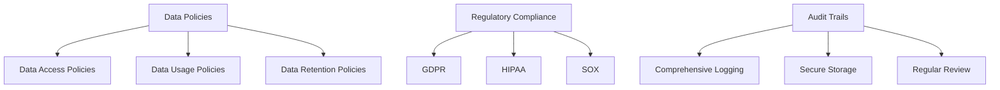

## 17.9 Governance and Compliance

In the realm of SQL design patterns, governance and compliance play a pivotal role in ensuring that database systems are not only efficient and scalable but also secure and accountable. As expert software engineers and architects, it is crucial to understand how to implement governance frameworks and compliance measures that align with organizational policies and regulatory requirements. This section will delve into the core aspects of governance and compliance, including data policies, regulatory compliance, and audit trails, providing you with the knowledge and tools to manage databases responsibly.

### Understanding Governance and Compliance

**Governance** in the context of SQL databases refers to the framework of policies, procedures, and controls that ensure data is managed effectively and securely. It encompasses data quality, data management, and data security, ensuring that data is accurate, accessible, and protected.

**Compliance**, on the other hand, involves adhering to laws, regulations, and standards that govern data management. This includes international, national, and industry-specific regulations such as the General Data Protection Regulation (GDPR), Health Insurance Portability and Accountability Act (HIPAA), and the Sarbanes-Oxley Act (SOX).

### Data Policies: Defining Rules for Data Access, Usage, and Retention

Data policies are the backbone of governance frameworks. They define the rules and guidelines for data access, usage, and retention, ensuring that data is handled consistently and securely across the organization.

#### Key Components of Data Policies

1. **Data Access Policies**: Define who can access data and under what conditions. This includes role-based access control (RBAC) and least privilege principles to minimize unauthorized access.

2. **Data Usage Policies**: Outline how data can be used within the organization. This includes guidelines on data sharing, data processing, and data analysis to ensure ethical and legal use of data.

3. **Data Retention Policies**: Specify how long data should be retained and when it should be deleted. This is crucial for compliance with regulations that mandate data retention periods.

#### Implementing Data Policies in SQL

To implement data policies in SQL, consider the following strategies:

- **Role-Based Access Control (RBAC)**: Use SQL's built-in security features to define roles and permissions. For example:

  ```sql
  CREATE ROLE data_analyst;
  GRANT SELECT ON employees TO data_analyst;
  ```

- **Data Masking**: Implement data masking techniques to protect sensitive data. For example:

  ```sql
  CREATE FUNCTION mask_ssn(ssn CHAR(11))
  RETURNS CHAR(11)
  BEGIN
    RETURN CONCAT('XXX-XX-', SUBSTRING(ssn, 8, 4));
  END;
  ```

- **Data Retention Procedures**: Use SQL scripts to automate data deletion based on retention policies. For example:

  ```sql
  DELETE FROM logs WHERE log_date < NOW() - INTERVAL '1 year';
  ```

### Regulatory Compliance: Ensuring Adherence to Laws

Regulatory compliance is a critical aspect of database management, requiring organizations to adhere to laws and standards that govern data protection and privacy.

#### Key Regulations and Their Implications

1. **GDPR (General Data Protection Regulation)**: A European Union regulation that mandates data protection and privacy for individuals. It requires organizations to implement data protection measures and report data breaches within 72 hours.

2. **HIPAA (Health Insurance Portability and Accountability Act)**: A U.S. regulation that protects sensitive patient health information. It requires healthcare organizations to implement safeguards to protect patient data.

3. **SOX (Sarbanes-Oxley Act)**: A U.S. regulation that mandates financial transparency and accountability. It requires organizations to maintain accurate financial records and implement internal controls.

#### Implementing Compliance Measures in SQL

To ensure compliance with these regulations, consider the following SQL strategies:

- **Data Encryption**: Use encryption techniques to protect sensitive data. For example:

  ```sql
  CREATE TABLE patients (
    id INT PRIMARY KEY,
    name VARCHAR(100),
    ssn VARBINARY(256) ENCRYPTED FOR (ENCRYPTION_TYPE = 'DETERMINISTIC')
  );
  ```

- **Audit Trails**: Implement logging mechanisms to record database activities. For example:

  ```sql
  CREATE TABLE audit_log (
    log_id INT AUTO_INCREMENT PRIMARY KEY,
    user VARCHAR(50),
    action VARCHAR(50),
    timestamp TIMESTAMP DEFAULT CURRENT_TIMESTAMP
  );

  CREATE TRIGGER log_insert
  AFTER INSERT ON employees
  FOR EACH ROW
  BEGIN
    INSERT INTO audit_log (user, action) VALUES (USER(), 'INSERT');
  END;
  ```

- **Data Breach Response Plans**: Develop and test response plans to address data breaches promptly.

### Audit Trails: Implementing Logging Mechanisms

Audit trails are essential for accountability and transparency in database management. They provide a record of database activities, helping organizations detect and respond to unauthorized access or data breaches.

#### Designing Effective Audit Trails

1. **Comprehensive Logging**: Ensure that all critical database activities are logged, including data access, modifications, and deletions.

2. **Secure Storage**: Store audit logs securely to prevent tampering or unauthorized access.

3. **Regular Review**: Regularly review audit logs to detect anomalies or suspicious activities.

#### Implementing Audit Trails in SQL

To implement audit trails in SQL, consider the following strategies:

- **Triggers for Logging**: Use SQL triggers to automatically log database activities. For example:

  ```sql
  CREATE TRIGGER log_update
  AFTER UPDATE ON employees
  FOR EACH ROW
  BEGIN
    INSERT INTO audit_log (user, action, timestamp) VALUES (USER(), 'UPDATE', NOW());
  END;
  ```

- **Centralized Logging Systems**: Integrate SQL logs with centralized logging systems for comprehensive monitoring and analysis.

- **Automated Alerts**: Set up automated alerts to notify administrators of suspicious activities.

### Visualizing Governance and Compliance

To better understand the relationships and processes involved in governance and compliance, let's visualize these concepts using a Mermaid.js diagram.



**Diagram Description**: This flowchart illustrates the key components of governance and compliance in SQL design patterns. It shows how data policies, regulatory compliance, and audit trails are interconnected and contribute to secure and accountable database management.

### References and Further Reading

- [GDPR Compliance](https://gdpr-info.eu/)
- [HIPAA Compliance](https://www.hhs.gov/hipaa/index.html)
- [SOX Compliance](https://www.sec.gov/spotlight/sarbanes-oxley.htm)

### Knowledge Check

To reinforce your understanding of governance and compliance in SQL design patterns, consider the following questions and exercises:

1. **Question**: What are the key components of data policies, and how do they contribute to governance?
2. **Exercise**: Implement a SQL trigger to log DELETE operations on a table of your choice.
3. **Question**: How does GDPR impact data management practices in SQL databases?
4. **Exercise**: Develop a SQL script to automate data deletion based on a retention policy.

### Embrace the Journey

Remember, mastering governance and compliance in SQL design patterns is an ongoing journey. As regulations evolve and new challenges arise, continue to learn and adapt your strategies to ensure secure and compliant database management. Keep experimenting, stay curious, and enjoy the journey!

## Quiz Time!



### What is the primary purpose of data policies in SQL governance?

- [x] To define rules for data access, usage, and retention
- [ ] To encrypt all database data
- [ ] To automate data backups
- [ ] To optimize query performance

> **Explanation:** Data policies define the rules and guidelines for data access, usage, and retention, ensuring consistent and secure data handling.

### Which regulation mandates data protection and privacy for individuals in the European Union?

- [x] GDPR
- [ ] HIPAA
- [ ] SOX
- [ ] CCPA

> **Explanation:** GDPR is a European Union regulation that mandates data protection and privacy for individuals.

### What is a key component of audit trails in SQL databases?

- [x] Comprehensive Logging
- [ ] Data Encryption
- [ ] Query Optimization
- [ ] Data Masking

> **Explanation:** Comprehensive logging is essential for audit trails, providing a record of database activities for accountability.

### How can SQL triggers be used in governance and compliance?

- [x] To automatically log database activities
- [ ] To encrypt sensitive data
- [ ] To optimize query performance
- [ ] To automate data backups

> **Explanation:** SQL triggers can be used to automatically log database activities, contributing to audit trails.

### What is the role of data retention policies in governance?

- [x] To specify how long data should be retained and when it should be deleted
- [ ] To define who can access data
- [ ] To outline how data can be used
- [ ] To encrypt sensitive data

> **Explanation:** Data retention policies specify how long data should be retained and when it should be deleted, ensuring compliance with regulations.

### Which SQL feature can be used to implement role-based access control?

- [x] GRANT and REVOKE statements
- [ ] SELECT and INSERT statements
- [ ] JOIN and UNION operators
- [ ] CREATE and DROP commands

> **Explanation:** GRANT and REVOKE statements are used to implement role-based access control by defining roles and permissions.

### What is the significance of secure storage in audit trails?

- [x] To prevent tampering or unauthorized access to logs
- [ ] To optimize query performance
- [ ] To automate data backups
- [ ] To encrypt sensitive data

> **Explanation:** Secure storage is crucial in audit trails to prevent tampering or unauthorized access to logs, ensuring their integrity.

### How does HIPAA impact SQL database management?

- [x] It requires safeguards to protect patient health information
- [ ] It mandates data encryption for all databases
- [ ] It enforces query optimization standards
- [ ] It requires data retention for 10 years

> **Explanation:** HIPAA requires healthcare organizations to implement safeguards to protect patient health information.

### What is a common method for protecting sensitive data in SQL databases?

- [x] Data Encryption
- [ ] Query Optimization
- [ ] Data Masking
- [ ] Data Retention

> **Explanation:** Data encryption is a common method for protecting sensitive data in SQL databases.

### True or False: Audit trails are only necessary for financial databases.

- [ ] True
- [x] False

> **Explanation:** Audit trails are necessary for any database where accountability and transparency are required, not just financial databases.


