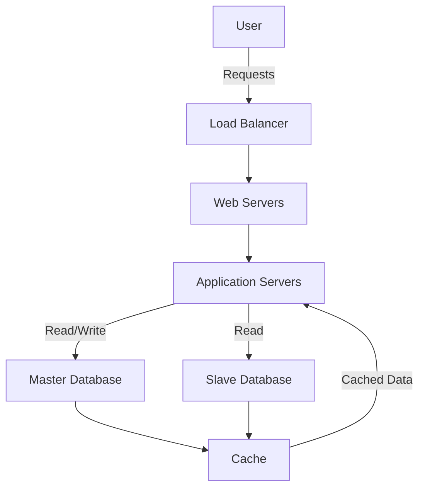

## 18.1 Designing a Scalable E-Commerce Database

In the fast-paced world of e-commerce, the ability to handle high traffic and maintain performance during peak shopping seasons is crucial. This section delves into the design and implementation of a scalable e-commerce database, focusing on strategies for horizontal scaling, index optimization, and caching mechanisms. By the end of this guide, you will have a comprehensive understanding of how to achieve high availability and maintain performance under heavy load.

### Understanding the Challenges

E-commerce platforms face unique challenges, particularly during peak shopping seasons such as Black Friday or Cyber Monday. These challenges include:

- **High Traffic Volumes**: Sudden spikes in user activity can overwhelm databases, leading to slow response times or even downtime.
- **Data Consistency**: Ensuring data integrity across distributed systems is vital for accurate inventory management and transaction processing.
- **Scalability**: The ability to scale resources up or down based on demand is essential for cost efficiency and performance.
- **High Availability**: Minimizing downtime and ensuring continuous access to the platform is critical for maintaining customer trust and satisfaction.

### Key Design Patterns for Scalability

To address these challenges, we employ several design patterns and strategies:

#### 1. Horizontal Scaling

Horizontal scaling involves adding more database servers to distribute the load. This approach is often more cost-effective than vertical scaling, which involves upgrading existing hardware.

- **Sharding**: Divide the database into smaller, more manageable pieces called shards. Each shard can be hosted on a separate server, allowing for parallel processing of queries.
  
  ```sql
  -- Example of creating a shard key for user data
  CREATE TABLE users_shard_1 (
      user_id INT PRIMARY KEY,
      user_name VARCHAR(255),
      email VARCHAR(255)
  );

  CREATE TABLE users_shard_2 (
      user_id INT PRIMARY KEY,
      user_name VARCHAR(255),
      email VARCHAR(255)
  );
  ```

- **Load Balancing**: Distribute incoming requests across multiple servers to prevent any single server from becoming a bottleneck.

#### 2. Index Optimization

Indexes are crucial for improving query performance. However, they must be used judiciously to avoid unnecessary overhead.

- **Composite Indexes**: Create indexes on multiple columns to optimize queries that filter on more than one column.

  ```sql
  -- Creating a composite index on product category and price
  CREATE INDEX idx_category_price ON products (category, price);
  ```

- **Covering Indexes**: Ensure that the index contains all the columns needed for a query, reducing the need to access the table data.

  ```sql
  -- Example of a covering index
  CREATE INDEX idx_order_details ON orders (order_id, product_id, quantity);
  ```

#### 3. Caching Mechanisms

Caching reduces the load on the database by storing frequently accessed data in memory.

- **In-Memory Caching**: Use tools like Redis or Memcached to cache query results or session data.

  ```sql
  -- Example of caching a frequently accessed query result
  SELECT * FROM products WHERE category = 'electronics';
  -- Cache this result in Redis for quick access
  ```

- **Query Result Caching**: Cache the results of expensive queries to improve response times for subsequent requests.

### Implementing High Availability

High availability ensures that the e-commerce platform remains accessible even in the event of hardware failures or other disruptions.

#### 1. Database Replication

Replication involves copying data from one database server to another, ensuring that a backup is available in case of failure.

- **Master-Slave Replication**: The master database handles write operations, while one or more slave databases handle read operations.

  ```sql
  -- Example configuration for master-slave replication
  -- Master server
  CHANGE MASTER TO MASTER_HOST='master_host', MASTER_USER='replication_user', MASTER_PASSWORD='password';

  -- Slave server
  START SLAVE;
  ```

- **Multi-Master Replication**: Allows multiple servers to handle write operations, providing redundancy and load balancing.

#### 2. Failover Strategies

Failover mechanisms automatically redirect traffic to a backup server in the event of a failure.

- **Automatic Failover**: Use tools like HAProxy or Keepalived to monitor server health and switch to a backup server if the primary server fails.

  ```shell
  # Example HAProxy configuration for automatic failover
  frontend http_front
      bind *:80
      default_backend servers

  backend servers
      server server1 192.168.1.1:80 check
      server server2 192.168.1.2:80 check backup
  ```

### Designing for Performance

Performance optimization is a continuous process that involves monitoring, analyzing, and refining database operations.

#### 1. Query Optimization

Optimize SQL queries to reduce execution time and resource consumption.

- **Use EXPLAIN**: Analyze query execution plans to identify bottlenecks and optimize query performance.

  ```sql
  EXPLAIN SELECT * FROM orders WHERE customer_id = 123;
  ```

- **Avoid SELECT * **: Specify only the columns you need to reduce data transfer and processing time.

  ```sql
  SELECT order_id, order_date FROM orders WHERE customer_id = 123;
  ```

#### 2. Partitioning

Partition large tables into smaller, more manageable pieces to improve query performance and maintenance.

- **Range Partitioning**: Divide a table into partitions based on a range of values.

  ```sql
  -- Example of range partitioning by order date
  CREATE TABLE orders (
      order_id INT,
      order_date DATE,
      customer_id INT
  ) PARTITION BY RANGE (YEAR(order_date)) (
      PARTITION p2022 VALUES LESS THAN (2023),
      PARTITION p2023 VALUES LESS THAN (2024)
  );
  ```

#### 3. Monitoring and Tuning

Regularly monitor database performance and make adjustments as needed.

- **Use Monitoring Tools**: Tools like New Relic or Datadog provide insights into database performance and help identify areas for improvement.

- **Regular Maintenance**: Perform regular maintenance tasks such as index rebuilding and statistics updates to ensure optimal performance.

### Visualizing the Architecture

To better understand the architecture of a scalable e-commerce database, let's visualize the components and their interactions.



**Diagram Description**: This diagram illustrates the flow of user requests through a load balancer to web and application servers, which interact with a master database for write operations and a slave database for read operations. Cached data is stored in a caching layer to improve response times.

### Try It Yourself

Now that we've covered the key concepts, it's time to put them into practice. Try modifying the code examples to suit your specific use case. For instance, experiment with different partitioning strategies or caching mechanisms to see how they impact performance.

### Knowledge Check

Before moving on, let's review some key takeaways:

- Horizontal scaling and sharding are effective strategies for handling high traffic volumes.
- Index optimization and caching can significantly improve query performance.
- High availability is achieved through replication and failover strategies.
- Regular monitoring and tuning are essential for maintaining optimal performance.

### Embrace the Journey

Remember, designing a scalable e-commerce database is an ongoing process. As you gain experience, you'll discover new techniques and strategies to enhance performance and scalability. Stay curious, keep experimenting, and enjoy the journey!

### References and Links

For further reading, consider exploring the following resources:

- [MySQL Documentation](https://dev.mysql.com/doc/)
- [PostgreSQL Documentation](https://www.postgresql.org/docs/)
- [Redis Documentation](https://redis.io/documentation)
- [HAProxy Documentation](http://www.haproxy.org/)

## Quiz Time!



### What is the primary benefit of horizontal scaling in database design?

- [x] Distributes the load across multiple servers
- [ ] Increases the speed of a single server
- [ ] Reduces the need for database indexing
- [ ] Eliminates the need for caching

> **Explanation:** Horizontal scaling distributes the load across multiple servers, allowing for parallel processing and improved performance.

### Which of the following is a benefit of using composite indexes?

- [x] Optimizes queries filtering on multiple columns
- [ ] Reduces the need for database replication
- [ ] Eliminates the need for caching
- [ ] Increases the speed of a single server

> **Explanation:** Composite indexes optimize queries that filter on multiple columns, improving performance.

### What is the purpose of database replication?

- [x] Ensures data availability in case of server failure
- [ ] Increases the speed of a single server
- [ ] Reduces the need for database indexing
- [ ] Eliminates the need for caching

> **Explanation:** Database replication ensures data availability by copying data to backup servers.

### Which caching mechanism is suitable for storing frequently accessed data in memory?

- [x] In-Memory Caching
- [ ] Disk-Based Caching
- [ ] Network-Based Caching
- [ ] File-Based Caching

> **Explanation:** In-memory caching stores frequently accessed data in memory for quick access.

### What is the role of a load balancer in a scalable e-commerce database architecture?

- [x] Distributes incoming requests across multiple servers
- [ ] Increases the speed of a single server
- [ ] Reduces the need for database indexing
- [ ] Eliminates the need for caching

> **Explanation:** A load balancer distributes incoming requests across multiple servers to prevent any single server from becoming a bottleneck.

### Which partitioning strategy divides a table based on a range of values?

- [x] Range Partitioning
- [ ] Hash Partitioning
- [ ] List Partitioning
- [ ] Composite Partitioning

> **Explanation:** Range partitioning divides a table into partitions based on a range of values.

### What is the purpose of using EXPLAIN in SQL?

- [x] Analyzes query execution plans
- [ ] Increases the speed of a single server
- [ ] Reduces the need for database indexing
- [ ] Eliminates the need for caching

> **Explanation:** EXPLAIN is used to analyze query execution plans and identify bottlenecks.

### Which replication strategy allows multiple servers to handle write operations?

- [x] Multi-Master Replication
- [ ] Master-Slave Replication
- [ ] Single-Master Replication
- [ ] Asynchronous Replication

> **Explanation:** Multi-master replication allows multiple servers to handle write operations, providing redundancy and load balancing.

### What is the benefit of using covering indexes?

- [x] Reduces the need to access table data
- [ ] Increases the speed of a single server
- [ ] Eliminates the need for caching
- [ ] Reduces the need for database replication

> **Explanation:** Covering indexes contain all the columns needed for a query, reducing the need to access table data.

### True or False: Regular monitoring and tuning are essential for maintaining optimal database performance.

- [x] True
- [ ] False

> **Explanation:** Regular monitoring and tuning are essential for maintaining optimal database performance by identifying and addressing potential issues.




