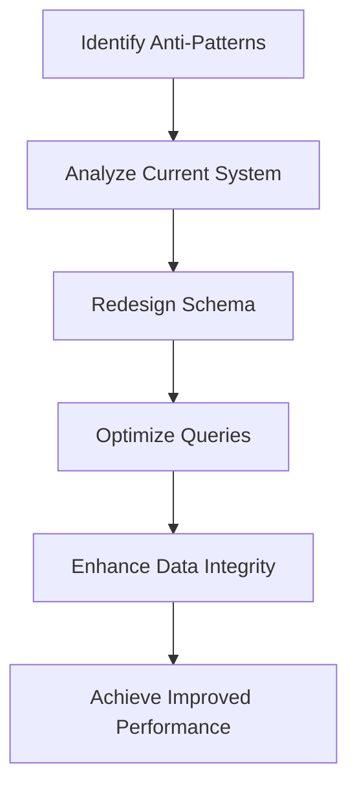

## 18.10 Refactoring an Application to Eliminate SQL Anti-Patterns

In the realm of software engineering, SQL anti-patterns can significantly hinder the performance, maintainability, and reliability of an application. This section delves into the process of identifying and refactoring these anti-patterns to optimize database systems. By understanding and eliminating these pitfalls, we can transform a sluggish, error-prone application into a robust, efficient system.

### Understanding SQL Anti-Patterns

**SQL Anti-Patterns** are common practices that, while they may seem convenient or necessary at first, lead to suboptimal performance, increased complexity, and maintenance challenges. Recognizing these patterns is the first step towards effective refactoring.

#### Common SQL Anti-Patterns

1. **The God Table**: A single table that attempts to store all data, leading to excessive nulls and complex queries.
2. **Implicit Columns (SELECT *)**: Using `SELECT *` retrieves all columns, which can be inefficient and error-prone.
3. **Neglecting Indexes**: Failing to use indexes appropriately can result in slow query performance.
4. **Overusing NULLs**: Excessive use of NULL values can complicate logic and degrade performance.
5. **One True Lookup Table**: A single table used for multiple purposes, leading to complex joins and maintenance issues.

### Initial Situation: Identifying the Problem

Imagine an e-commerce application experiencing performance bottlenecks and maintenance headaches. The database schema is cluttered with anti-patterns, causing slow queries and frequent errors. Our goal is to refactor the application to eliminate these anti-patterns, thereby enhancing performance and maintainability.

#### Step 1: Analyze the Current System

- **Performance Profiling**: Use tools like SQL Profiler or EXPLAIN plans to identify slow queries and bottlenecks.
- **Schema Review**: Examine the database schema for signs of anti-patterns, such as overly complex tables or missing indexes.
- **Code Audit**: Review SQL code for inefficient practices, such as `SELECT *` or complex subqueries.

### Process: Refactoring to Eliminate Anti-Patterns

#### Step 2: Redesign the Schema

**Objective**: Simplify the schema by addressing the identified anti-patterns.

- **Normalize the God Table**: Break down large tables into smaller, more focused tables. This reduces nulls and improves query performance.
  
  ```sql
  -- Before: God Table
  CREATE TABLE Products (
      ProductID INT PRIMARY KEY,
      Name VARCHAR(255),
      Description TEXT,
      Price DECIMAL(10, 2),
      CategoryID INT,
      SupplierID INT,
      -- Many more columns...
  );

  -- After: Normalized Tables
  CREATE TABLE Products (
      ProductID INT PRIMARY KEY,
      Name VARCHAR(255),
      Description TEXT,
      Price DECIMAL(10, 2)
  );

  CREATE TABLE Categories (
      CategoryID INT PRIMARY KEY,
      CategoryName VARCHAR(255)
  );

  CREATE TABLE Suppliers (
      SupplierID INT PRIMARY KEY,
      SupplierName VARCHAR(255)
  );
  ```

- **Eliminate One True Lookup Table**: Create specific lookup tables for different entities to simplify joins and improve clarity.

  ```sql
  -- Before: One True Lookup Table
  CREATE TABLE Lookup (
      LookupID INT PRIMARY KEY,
      Type VARCHAR(50),
      Value VARCHAR(255)
  );

  -- After: Specific Lookup Tables
  CREATE TABLE ProductCategories (
      CategoryID INT PRIMARY KEY,
      CategoryName VARCHAR(255)
  );

  CREATE TABLE SupplierTypes (
      SupplierTypeID INT PRIMARY KEY,
      TypeName VARCHAR(255)
  );
  ```

#### Step 3: Optimize Queries

**Objective**: Refactor queries to improve performance and readability.

- **Avoid SELECT ***: Specify only the necessary columns to reduce data transfer and improve performance.

  ```sql
  -- Before: Using SELECT *
  SELECT * FROM Products WHERE Price > 100;

  -- After: Specifying Columns
  SELECT ProductID, Name, Price FROM Products WHERE Price > 100;
  ```

- **Implement Indexes**: Add appropriate indexes to speed up query execution.

  ```sql
  -- Adding an index to improve query performance
  CREATE INDEX idx_price ON Products(Price);
  ```

- **Refactor Complex Joins**: Simplify complex joins by breaking them into smaller, more manageable queries.

  ```sql
  -- Before: Complex Join
  SELECT p.Name, c.CategoryName, s.SupplierName
  FROM Products p
  JOIN Categories c ON p.CategoryID = c.CategoryID
  JOIN Suppliers s ON p.SupplierID = s.SupplierID
  WHERE p.Price > 100;

  -- After: Simplified Join with CTE
  WITH ProductDetails AS (
      SELECT p.ProductID, p.Name, c.CategoryName
      FROM Products p
      JOIN Categories c ON p.CategoryID = c.CategoryID
  )
  SELECT pd.Name, pd.CategoryName, s.SupplierName
  FROM ProductDetails pd
  JOIN Suppliers s ON pd.ProductID = s.SupplierID
  WHERE pd.Price > 100;
  ```

#### Step 4: Enhance Data Integrity

**Objective**: Strengthen data integrity through constraints and validation.

- **Use Constraints**: Implement primary key, foreign key, and unique constraints to enforce data integrity.

  ```sql
  -- Adding constraints to ensure data integrity
  ALTER TABLE Products
  ADD CONSTRAINT fk_category FOREIGN KEY (CategoryID) REFERENCES Categories(CategoryID);

  ALTER TABLE Products
  ADD CONSTRAINT fk_supplier FOREIGN KEY (SupplierID) REFERENCES Suppliers(SupplierID);
  ```

- **Validate Data**: Use check constraints to enforce business rules.

  ```sql
  -- Adding a check constraint to validate data
  ALTER TABLE Products
  ADD CONSTRAINT chk_price CHECK (Price > 0);
  ```

### Results: Achieving Improved Performance and Maintainability

By refactoring the application to eliminate SQL anti-patterns, we achieve several key benefits:

- **Improved Performance**: Optimized queries and a streamlined schema lead to faster data retrieval and processing.
- **Easier Maintenance**: A well-structured schema and clear queries simplify maintenance and reduce the likelihood of errors.
- **Increased Reliability**: Enhanced data integrity and validation ensure consistent and accurate data.

### Visualizing the Refactoring Process

Below is a flowchart illustrating the refactoring process from identifying anti-patterns to implementing solutions:



### Try It Yourself

To solidify your understanding, try modifying the code examples provided:

- **Experiment with Indexes**: Add different types of indexes and observe their impact on query performance.
- **Refactor Queries**: Take a complex query from your own projects and apply the refactoring techniques discussed.
- **Enhance Data Integrity**: Implement additional constraints and validation rules in your database schema.

### References and Further Reading

- [SQL Performance Explained](https://sql-performance-explained.com)
- [Database Refactoring: Evolutionary Database Design](https://martinfowler.com/books/refactoring.html)
- [SQL Anti-Patterns: Avoiding the Pitfalls of Database Programming](https://pragprog.com/titles/bksqla/sql-anti-patterns/)

### Knowledge Check

To reinforce your learning, consider the following questions:

- What are the common SQL anti-patterns, and how can they impact performance?
- How can you redesign a schema to eliminate the God Table anti-pattern?
- What are the benefits of specifying columns in a SELECT statement instead of using SELECT *?
- How do indexes improve query performance, and what are the potential downsides of over-indexing?
- Why is it important to use constraints and validation in a database schema?

### Embrace the Journey

Remember, refactoring is an ongoing process. As you continue to develop and maintain applications, keep an eye out for anti-patterns and strive to eliminate them. By doing so, you'll create more efficient, maintainable, and reliable systems. Keep experimenting, stay curious, and enjoy the journey!

## Quiz Time!



### What is a common consequence of using the "God Table" anti-pattern?

- [x] Performance bottlenecks due to complex queries
- [ ] Simplified database design
- [ ] Improved data integrity
- [ ] Enhanced scalability

> **Explanation:** The "God Table" anti-pattern leads to performance bottlenecks because it involves complex queries with many nulls and excessive columns.

### Why should you avoid using SELECT * in queries?

- [x] It retrieves unnecessary data, impacting performance
- [ ] It simplifies query writing
- [ ] It enhances data security
- [ ] It automatically optimizes queries

> **Explanation:** Using SELECT * retrieves all columns, which can lead to unnecessary data transfer and impact performance negatively.

### What is the benefit of normalizing a database schema?

- [x] Reduces data redundancy and improves data integrity
- [ ] Increases query complexity
- [ ] Decreases database performance
- [ ] Simplifies data retrieval

> **Explanation:** Normalizing a database schema reduces data redundancy and improves data integrity by organizing data into related tables.

### How do indexes improve query performance?

- [x] By allowing faster data retrieval through efficient data access paths
- [ ] By increasing the size of the database
- [ ] By simplifying query syntax
- [ ] By automatically updating data

> **Explanation:** Indexes improve query performance by providing efficient data access paths, allowing faster data retrieval.

### What is a potential downside of over-indexing a database?

- [x] Increased storage requirements and slower write operations
- [ ] Improved query performance
- [ ] Simplified database maintenance
- [ ] Enhanced data integrity

> **Explanation:** Over-indexing can lead to increased storage requirements and slower write operations due to the overhead of maintaining multiple indexes.

### Why is it important to use constraints in a database schema?

- [x] To enforce data integrity and business rules
- [ ] To simplify query writing
- [ ] To increase database size
- [ ] To enhance query performance

> **Explanation:** Constraints enforce data integrity and business rules, ensuring that data adheres to specified conditions.

### What is the purpose of a foreign key constraint?

- [x] To establish a relationship between two tables
- [ ] To increase query performance
- [ ] To simplify data retrieval
- [ ] To enhance data security

> **Explanation:** A foreign key constraint establishes a relationship between two tables, ensuring referential integrity.

### How can you identify slow queries in a database?

- [x] By using performance profiling tools like SQL Profiler or EXPLAIN plans
- [ ] By simplifying query syntax
- [ ] By increasing database size
- [ ] By adding more indexes

> **Explanation:** Performance profiling tools like SQL Profiler or EXPLAIN plans help identify slow queries by analyzing query execution.

### What is the role of a check constraint in a database?

- [x] To enforce specific conditions on data values
- [ ] To simplify query writing
- [ ] To increase database size
- [ ] To enhance query performance

> **Explanation:** A check constraint enforces specific conditions on data values, ensuring that data adheres to specified rules.

### True or False: Refactoring an application to eliminate anti-patterns can lead to improved performance and maintainability.

- [x] True
- [ ] False

> **Explanation:** Refactoring an application to eliminate anti-patterns can lead to improved performance and maintainability by optimizing the database schema and queries.


