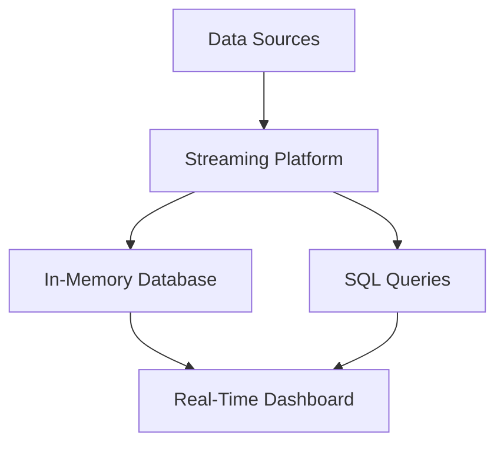

## 18.2 Implementing Real-Time Analytics with SQL

In today's fast-paced digital world, businesses need to make informed decisions quickly. Real-time analytics provides the ability to analyze data as it is generated, offering immediate insights into customer behaviors and sales trends. This capability is crucial for improving decision-making and enhancing customer engagement. In this section, we will explore how SQL, a powerful and versatile language, can be leveraged to implement real-time analytics effectively.

### Understanding Real-Time Analytics

Real-time analytics involves processing and analyzing data as it is created or received. Unlike traditional batch processing, which analyzes data in large chunks at scheduled intervals, real-time analytics provides continuous insights. This approach is essential for applications that require immediate feedback, such as fraud detection, recommendation systems, and dynamic pricing.

#### Key Concepts

- **Latency**: The time delay between data generation and its analysis. Real-time analytics aims to minimize latency to provide near-instantaneous insights.
- **Throughput**: The volume of data processed in a given time frame. High throughput is essential for handling large-scale data streams.
- **Scalability**: The ability to handle increasing volumes of data without compromising performance. Scalability is crucial for growing businesses.

### SQL in Real-Time Analytics

SQL, traditionally associated with relational databases, has evolved to support real-time analytics through various extensions and integrations. Modern SQL databases offer features like in-memory processing, streaming data ingestion, and advanced indexing, making them suitable for real-time applications.

#### Advantages of Using SQL

- **Familiarity**: SQL is widely used and understood by data professionals, reducing the learning curve for implementing real-time analytics.
- **Declarative Nature**: SQL's declarative syntax allows users to specify what they want to achieve without detailing how to do it, simplifying complex queries.
- **Integration**: SQL can easily integrate with various data sources and analytics tools, providing a unified platform for data processing.

### Techniques for Real-Time Analytics with SQL

To implement real-time analytics using SQL, we need to leverage specific techniques and technologies. Let's explore some of the most effective methods.

#### In-Memory Processing

In-memory processing involves storing data in the main memory (RAM) rather than on disk, significantly reducing access times and improving query performance.

##### Benefits

- **Speed**: Accessing data in memory is much faster than reading from disk, enabling real-time processing.
- **Concurrency**: In-memory databases can handle multiple queries simultaneously, supporting high concurrency.

##### Implementation

Many modern SQL databases, such as SAP HANA, Microsoft SQL Server, and Oracle, offer in-memory processing capabilities. Here's a simple example using SQL Server:

```sql
-- Create an in-memory table
CREATE TABLE SalesData (
    SaleID INT PRIMARY KEY NONCLUSTERED,
    CustomerID INT,
    ProductID INT,
    SaleAmount DECIMAL(10, 2),
    SaleDate DATETIME
) WITH (MEMORY_OPTIMIZED = ON, DURABILITY = SCHEMA_ONLY);

-- Insert data into the in-memory table
INSERT INTO SalesData (SaleID, CustomerID, ProductID, SaleAmount, SaleDate)
VALUES (1, 101, 202, 150.00, GETDATE());
```

In this example, we create an in-memory table for sales data, enabling fast access and processing.

#### Streaming Data Ingestion

Streaming data ingestion involves continuously importing and processing data from various sources, such as IoT devices, social media, and transaction systems.

##### Benefits

- **Continuous Insights**: Streaming allows for the continuous analysis of data, providing up-to-date insights.
- **Scalability**: Streaming platforms can handle large volumes of data, supporting scalability.

##### Implementation

Apache Kafka and Apache Flink are popular platforms for streaming data ingestion. SQL can be used to query streaming data in real-time. Here's an example using Apache Kafka with SQL:

```sql
-- Create a Kafka source table
CREATE TABLE SalesStream (
    SaleID INT,
    CustomerID INT,
    ProductID INT,
    SaleAmount DECIMAL(10, 2),
    SaleDate TIMESTAMP
) WITH (
    'connector' = 'kafka',
    'topic' = 'sales_topic',
    'properties.bootstrap.servers' = 'localhost:9092',
    'format' = 'json'
);

-- Query the streaming data
SELECT CustomerID, SUM(SaleAmount) AS TotalSales
FROM SalesStream
GROUP BY CustomerID
HAVING SUM(SaleAmount) > 1000;
```

In this example, we create a Kafka source table and query the streaming data to find customers with total sales exceeding $1000.

#### Real-Time Dashboards

Real-time dashboards provide a visual representation of data, allowing users to monitor key metrics and trends instantly.

##### Implementation

Tools like Tableau, Power BI, and Grafana can be integrated with SQL databases to create real-time dashboards. These tools support live data connections, enabling the visualization of real-time analytics.

### Design Considerations

When implementing real-time analytics with SQL, consider the following design considerations:

- **Data Volume**: Ensure your system can handle the expected data volume without performance degradation.
- **Latency Requirements**: Define acceptable latency levels for your application and choose technologies that meet these requirements.
- **Scalability**: Design your system to scale as data volume and user demand increase.
- **Security**: Implement security measures to protect sensitive data, especially when dealing with real-time streams.

### Differences and Similarities

Real-time analytics shares similarities with traditional analytics but differs in key aspects:

- **Data Processing**: Real-time analytics processes data continuously, while traditional analytics often relies on batch processing.
- **Latency**: Real-time analytics aims for minimal latency, whereas traditional analytics may tolerate higher latency.
- **Use Cases**: Real-time analytics is suited for applications requiring immediate insights, such as fraud detection and dynamic pricing.

### Try It Yourself

Experiment with the code examples provided in this section. Try modifying the in-memory table schema or the Kafka streaming query to suit your specific use case. Explore different SQL databases and streaming platforms to find the best fit for your real-time analytics needs.

### Visualizing Real-Time Analytics Architecture

To better understand the architecture of a real-time analytics system, let's visualize it using a flowchart.



**Figure 1: Real-Time Analytics Architecture**

This diagram illustrates the flow of data from various sources into a streaming platform, which feeds an in-memory database. SQL queries are used to analyze the data, and the results are displayed on a real-time dashboard.

### References and Links

For further reading on real-time analytics and SQL, consider the following resources:

- [Apache Kafka Documentation](https://kafka.apache.org/documentation/)
- [Apache Flink Documentation](https://flink.apache.org/documentation.html)
- [Microsoft SQL Server In-Memory OLTP](https://docs.microsoft.com/en-us/sql/relational-databases/in-memory-oltp/in-memory-oltp-in-sql-server)
- [Tableau Real-Time Analytics](https://www.tableau.com/solutions/real-time-analytics)

### Knowledge Check

To reinforce your understanding of real-time analytics with SQL, consider the following questions:

- What are the key differences between real-time and traditional analytics?
- How does in-memory processing improve query performance?
- What are the benefits of using streaming data ingestion?

### Embrace the Journey

Implementing real-time analytics with SQL is a journey that requires continuous learning and adaptation. As you explore different techniques and technologies, remember that the goal is to provide timely insights that drive better decision-making and customer engagement. Keep experimenting, stay curious, and enjoy the journey!

## Quiz Time!



### What is the primary goal of real-time analytics?

- [x] To provide immediate insights into data as it is generated
- [ ] To analyze data in large batches at scheduled intervals
- [ ] To store data in a data warehouse for long-term analysis
- [ ] To archive data for compliance purposes

> **Explanation:** Real-time analytics aims to provide immediate insights into data as it is generated, allowing for timely decision-making.

### Which SQL feature is crucial for reducing query latency in real-time analytics?

- [x] In-memory processing
- [ ] Batch processing
- [ ] Disk-based storage
- [ ] Data archiving

> **Explanation:** In-memory processing reduces query latency by storing data in RAM, allowing for faster access and processing.

### What is a key benefit of streaming data ingestion?

- [x] Continuous analysis of data
- [ ] Scheduled batch processing
- [ ] Data archiving
- [ ] Long-term storage

> **Explanation:** Streaming data ingestion allows for the continuous analysis of data, providing up-to-date insights.

### Which tool can be used to create real-time dashboards with SQL?

- [x] Tableau
- [ ] Hadoop
- [ ] MongoDB
- [ ] Redis

> **Explanation:** Tableau is a tool that can be integrated with SQL databases to create real-time dashboards.

### What is a common use case for real-time analytics?

- [x] Fraud detection
- [ ] Historical data analysis
- [ ] Data archiving
- [ ] Long-term trend analysis

> **Explanation:** Real-time analytics is commonly used for applications like fraud detection, which require immediate insights.

### Which technology is often used for streaming data ingestion?

- [x] Apache Kafka
- [ ] MySQL
- [ ] Oracle
- [ ] PostgreSQL

> **Explanation:** Apache Kafka is a popular platform for streaming data ingestion, enabling real-time analytics.

### What is the advantage of using SQL for real-time analytics?

- [x] Familiarity and ease of integration
- [ ] Complexity and steep learning curve
- [ ] Limited scalability
- [ ] High latency

> **Explanation:** SQL is familiar to many data professionals and integrates easily with various data sources and tools.

### What is a design consideration for real-time analytics systems?

- [x] Scalability to handle increasing data volumes
- [ ] High latency tolerance
- [ ] Limited data sources
- [ ] Infrequent data updates

> **Explanation:** Scalability is crucial for real-time analytics systems to handle increasing data volumes and user demand.

### Which SQL database feature supports high concurrency in real-time analytics?

- [x] In-memory processing
- [ ] Disk-based storage
- [ ] Batch processing
- [ ] Data archiving

> **Explanation:** In-memory processing supports high concurrency by allowing multiple queries to be processed simultaneously.

### True or False: Real-time analytics is only suitable for small data volumes.

- [ ] True
- [x] False

> **Explanation:** Real-time analytics can handle large data volumes, especially when using scalable technologies like streaming platforms.


