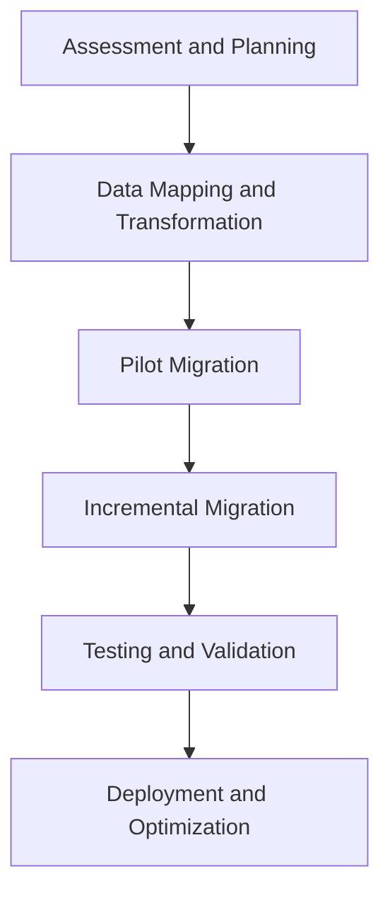

## 18.3 Migrating Legacy Systems to Modern SQL Platforms

Migrating legacy systems to modern SQL platforms is a critical task for organizations aiming to leverage the latest technological advancements, improve performance, and reduce technical debt. This process involves addressing compatibility issues, minimizing data loss risks, and strategically planning the transition to ensure a seamless migration. In this section, we will explore the challenges, strategies, and benefits of migrating legacy systems to modern SQL platforms.

### Understanding Legacy Systems

Legacy systems are outdated computing software or hardware that are still in use, despite having been superseded by newer technologies. These systems often pose several challenges, including:

- **Compatibility Problems**: Legacy systems may not be compatible with modern software and hardware, leading to integration issues.
- **Data Loss Risks**: The risk of data loss increases during migration due to differences in data formats and structures.
- **Technical Debt Accumulation**: Over time, maintaining legacy systems can lead to technical debt, making it difficult to implement new features or improvements.

### The Need for Migration

Migrating to modern SQL platforms offers numerous benefits, such as:

- **Enhanced Features**: Modern SQL platforms provide advanced features that improve data management and analytics capabilities.
- **Better Support**: Newer platforms offer better support and updates, ensuring security and compliance.
- **Improved Performance**: Modern systems are optimized for performance, leading to faster query execution and data processing.

### Migration Approach

A successful migration requires careful planning and execution. The following approach outlines the key steps involved in migrating legacy systems to modern SQL platforms:

#### 1. Assessment and Planning

- **Evaluate the Current System**: Conduct a thorough assessment of the existing legacy system to understand its architecture, data structures, and dependencies.
- **Define Objectives**: Clearly define the objectives of the migration, such as improving performance, enhancing features, or reducing maintenance costs.
- **Develop a Migration Plan**: Create a detailed migration plan that outlines the steps, timeline, and resources required for the migration.

#### 2. Data Mapping and Transformation

- **Data Mapping**: Map the data from the legacy system to the new SQL platform, ensuring compatibility and consistency.
- **Data Transformation**: Transform the data to fit the new platform's schema and data types, using ETL (Extract, Transform, Load) processes.

#### 3. Phased Migration Strategy

- **Pilot Migration**: Start with a pilot migration to test the process and identify potential issues.
- **Incremental Migration**: Migrate the data and applications incrementally, reducing the risk of data loss and downtime.
- **Parallel Operation**: Run the legacy and modern systems in parallel during the migration to ensure continuity and allow for validation.

#### 4. Testing and Validation

- **Functional Testing**: Test the functionality of the migrated system to ensure it meets the defined objectives.
- **Data Validation**: Validate the data to ensure accuracy and consistency after migration.
- **Performance Testing**: Conduct performance testing to ensure the new system meets performance expectations.

#### 5. Deployment and Optimization

- **Deploy the New System**: Deploy the modern SQL platform in the production environment.
- **Optimize Performance**: Fine-tune the system for optimal performance, leveraging indexing, caching, and other optimization techniques.
- **Monitor and Support**: Continuously monitor the system and provide support to address any issues that arise post-migration.

### Code Example: Data Transformation with SQL

Let's explore a simple example of data transformation using SQL. Suppose we have a legacy system with a table `legacy_users` and we want to migrate the data to a modern SQL platform with a new table `modern_users`.

```sql
-- Legacy table structure
CREATE TABLE legacy_users (
    user_id INT,
    full_name VARCHAR(255),
    birth_date DATE
);

-- Modern table structure
CREATE TABLE modern_users (
    id INT PRIMARY KEY,
    first_name VARCHAR(100),
    last_name VARCHAR(100),
    date_of_birth DATE
);

-- Data transformation and migration
INSERT INTO modern_users (id, first_name, last_name, date_of_birth)
SELECT 
    user_id,
    SUBSTRING_INDEX(full_name, ' ', 1) AS first_name,
    SUBSTRING_INDEX(full_name, ' ', -1) AS last_name,
    birth_date
FROM legacy_users;
```

In this example, we transform the `full_name` field from the `legacy_users` table into `first_name` and `last_name` fields in the `modern_users` table using SQL string functions.

### Visualizing the Migration Process

To better understand the migration process, let's visualize it using a flowchart.



**Figure 1: Migration Process Flowchart**

This flowchart illustrates the sequential steps involved in migrating legacy systems to modern SQL platforms, from assessment and planning to deployment and optimization.

### Key Considerations

When migrating legacy systems, consider the following:

- **Data Integrity**: Ensure data integrity throughout the migration process by implementing robust validation and testing procedures.
- **Downtime Minimization**: Plan the migration to minimize downtime and disruption to business operations.
- **Stakeholder Communication**: Keep stakeholders informed and involved throughout the migration process to manage expectations and address concerns.

### Differences and Similarities with Other Patterns

Migrating legacy systems shares similarities with other data migration patterns, such as:

- **ETL Processes**: Both involve extracting, transforming, and loading data, but legacy system migration often requires additional steps to address compatibility issues.
- **Data Integration**: Like data integration patterns, legacy system migration involves combining data from different sources, but with a focus on transitioning to a new platform.

### Conclusion

Migrating legacy systems to modern SQL platforms is a complex but rewarding process that requires careful planning and execution. By following a structured approach and leveraging modern SQL features, organizations can overcome compatibility issues, reduce data loss risks, and achieve significant performance improvements. Remember, this is just the beginning. As you progress, you'll build more complex and efficient systems. Keep experimenting, stay curious, and enjoy the journey!

## Quiz Time!



### What is a key challenge of migrating legacy systems?

- [x] Compatibility problems
- [ ] Increased data redundancy
- [ ] Simplified architecture
- [ ] Reduced technical debt

> **Explanation:** Compatibility problems are a key challenge when migrating legacy systems to modern platforms.

### What is the first step in the migration approach?

- [x] Assessment and Planning
- [ ] Data Mapping and Transformation
- [ ] Phased Migration Strategy
- [ ] Testing and Validation

> **Explanation:** Assessment and Planning is the first step in the migration approach to understand the current system and define objectives.

### What is the purpose of data mapping in migration?

- [x] To ensure compatibility and consistency
- [ ] To increase data redundancy
- [ ] To simplify the database schema
- [ ] To reduce data size

> **Explanation:** Data mapping ensures compatibility and consistency between the legacy and modern systems.

### What is a benefit of migrating to modern SQL platforms?

- [x] Enhanced features
- [ ] Increased technical debt
- [ ] Reduced data integrity
- [ ] Simplified legacy systems

> **Explanation:** Migrating to modern SQL platforms provides enhanced features and improved performance.

### What is a key consideration during migration?

- [x] Data Integrity
- [ ] Data Redundancy
- [ ] Simplified Architecture
- [ ] Reduced Performance

> **Explanation:** Ensuring data integrity is crucial during the migration process to maintain accuracy and consistency.

### What is the role of a pilot migration?

- [x] To test the process and identify potential issues
- [ ] To increase data redundancy
- [ ] To simplify the database schema
- [ ] To reduce data size

> **Explanation:** A pilot migration tests the process and helps identify potential issues before full-scale migration.

### What is the purpose of running systems in parallel during migration?

- [x] To ensure continuity and allow for validation
- [ ] To increase data redundancy
- [ ] To simplify the database schema
- [ ] To reduce data size

> **Explanation:** Running systems in parallel ensures continuity and allows for validation during the migration process.

### What is a common similarity between legacy system migration and ETL processes?

- [x] Both involve extracting, transforming, and loading data
- [ ] Both simplify the database schema
- [ ] Both reduce data size
- [ ] Both increase data redundancy

> **Explanation:** Both legacy system migration and ETL processes involve extracting, transforming, and loading data.

### What is a key benefit of modern SQL platforms?

- [x] Improved performance
- [ ] Increased technical debt
- [ ] Reduced data integrity
- [ ] Simplified legacy systems

> **Explanation:** Modern SQL platforms offer improved performance and advanced features.

### True or False: Migrating legacy systems always reduces technical debt.

- [ ] True
- [x] False

> **Explanation:** While migrating can reduce technical debt, it requires careful planning and execution to achieve this outcome.


