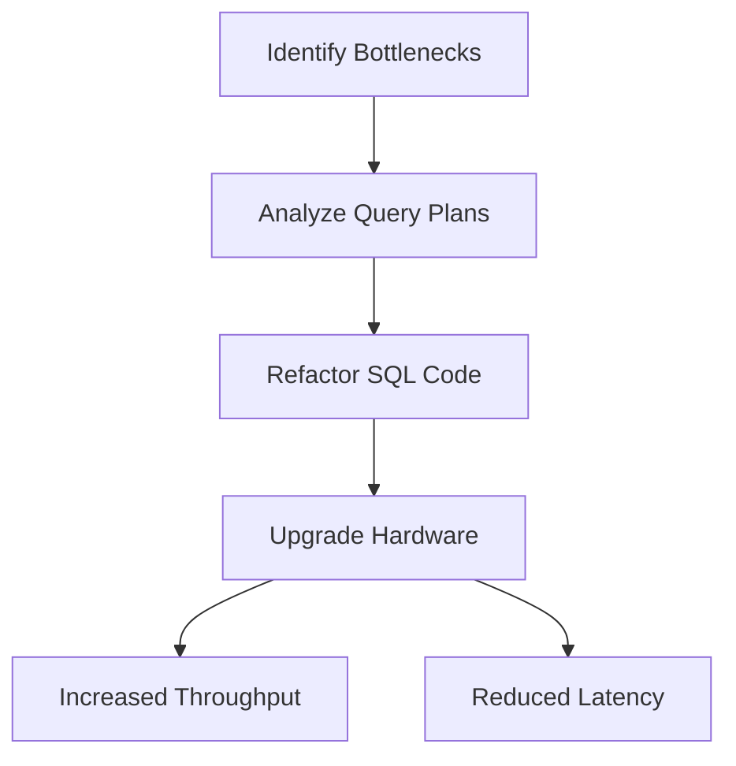

## 18.4 Optimizing a High-Volume Transactional System

In the world of high-volume transactional systems, performance optimization is not just a luxury—it's a necessity. As businesses grow and the volume of transactions increases, systems can become bogged down by bottlenecks, leading to delays and errors. This section explores comprehensive strategies for optimizing high-volume transactional systems, focusing on SQL query optimization, hardware enhancements, and system architecture improvements to increase throughput and reduce latency.

### Understanding the Problem: Transaction Bottlenecks

Transaction bottlenecks occur when the system cannot process transactions as quickly as they are received. This can lead to increased wait times, errors, and a decrease in overall system performance. Common causes of transaction bottlenecks include inefficient SQL queries, inadequate hardware resources, and suboptimal database design.

#### Key Concepts

- **Throughput**: The number of transactions a system can process in a given time period.
- **Latency**: The time it takes for a transaction to be processed from start to finish.
- **Bottleneck**: A point in the system where the flow of transactions is restricted, causing delays.

### Analyzing Query Plans

One of the first steps in optimizing a high-volume transactional system is to analyze the query plans. Query plans provide insights into how SQL queries are executed by the database engine, highlighting areas where performance can be improved.

#### Steps to Analyze Query Plans

1. **Identify Slow Queries**: Use database monitoring tools to identify queries that are taking longer than expected to execute.
2. **Examine Execution Plans**: Use the `EXPLAIN` command (or its equivalent) to view the execution plan for a query. This will show how the database engine is executing the query, including the order of operations and the use of indexes.
3. **Look for Inefficiencies**: Identify operations that are consuming excessive resources, such as full table scans or unnecessary joins.

#### Code Example: Analyzing a Query Plan

```sql
-- Example of using EXPLAIN to analyze a query plan
EXPLAIN SELECT customer_id, order_date
FROM orders
WHERE order_status = 'shipped'
AND order_date > '2024-01-01';
```

> **Explanation**: This query retrieves customer IDs and order dates for shipped orders after January 1, 2024. The `EXPLAIN` command will show whether an index is used on `order_status` or `order_date`.

### Refactoring Inefficient Code

Once inefficiencies are identified, the next step is to refactor the SQL code to improve performance. This can involve rewriting queries, adding indexes, or restructuring database tables.

#### Techniques for Refactoring SQL Code

- **Use Indexes Wisely**: Ensure that indexes are used on columns that are frequently queried or used in join conditions.
- **Optimize Joins**: Use the most efficient join type for your query. For example, use `INNER JOIN` instead of `LEFT JOIN` if you only need matching rows.
- **Avoid SELECT * **: Specify only the columns you need to reduce the amount of data processed.

#### Code Example: Refactoring a Query

```sql
-- Original query with potential inefficiencies
SELECT * FROM orders
JOIN customers ON orders.customer_id = customers.id
WHERE orders.order_status = 'shipped';

-- Refactored query with specific columns and index usage
SELECT orders.order_id, orders.order_date, customers.name
FROM orders
INNER JOIN customers ON orders.customer_id = customers.id
WHERE orders.order_status = 'shipped';
```

> **Explanation**: The refactored query specifies only the necessary columns and uses an `INNER JOIN` to improve performance.

### Hardware Upgrades

In some cases, software optimizations alone may not be sufficient to handle high transaction volumes. Upgrading hardware resources can provide the necessary boost in performance.

#### Considerations for Hardware Upgrades

- **CPU and Memory**: Ensure that the database server has sufficient CPU and memory resources to handle peak loads.
- **Disk I/O**: Use high-performance storage solutions, such as SSDs, to reduce disk I/O bottlenecks.
- **Network Bandwidth**: Ensure that network infrastructure can support the data transfer rates required by the system.

### Impact of Optimizations

Implementing these optimizations can significantly increase transaction throughput and reduce latency. By addressing both software and hardware aspects, systems can handle higher volumes of transactions more efficiently.

### Visualizing the Optimization Process

To better understand the optimization process, let's visualize the flow of transactions and the impact of various optimizations.



> **Diagram Explanation**: This flowchart illustrates the optimization process, starting with identifying bottlenecks, analyzing query plans, refactoring SQL code, and upgrading hardware, leading to increased throughput and reduced latency.

### Try It Yourself

To gain hands-on experience with these optimization techniques, try modifying the code examples provided. Experiment with different indexing strategies, join types, and query structures to see how they impact performance.

### References and Further Reading

- [SQL Performance Tuning](https://www.sqlshack.com/sql-server-performance-tuning/)
- [Database Indexing Best Practices](https://www.geeksforgeeks.org/database-indexing/)
- [Understanding Query Execution Plans](https://www.sqlservertutorial.net/sql-server-basics/sql-server-execution-plan/)

### Knowledge Check

To reinforce your understanding of optimizing high-volume transactional systems, consider the following questions and exercises:

1. What are the common causes of transaction bottlenecks in high-volume systems?
2. How can query plans be used to identify inefficiencies in SQL queries?
3. What are some techniques for refactoring SQL code to improve performance?
4. When might hardware upgrades be necessary to optimize a transactional system?
5. How can visualizing the optimization process help in understanding its impact?

### Embrace the Journey

Remember, optimizing a high-volume transactional system is an ongoing process. As transaction volumes continue to grow, new challenges will arise. Stay curious, keep experimenting, and enjoy the journey of continuous improvement!

## Quiz Time!



### What is a common cause of transaction bottlenecks?

- [x] Inefficient SQL queries
- [ ] Excessive network bandwidth
- [ ] Overuse of SELECT *
- [ ] Lack of user authentication

> **Explanation:** Inefficient SQL queries can lead to transaction bottlenecks by consuming excessive resources and slowing down the system.

### How can query plans help in optimization?

- [x] By showing how SQL queries are executed
- [ ] By providing hardware upgrade suggestions
- [ ] By identifying user errors
- [ ] By displaying network latency

> **Explanation:** Query plans show how SQL queries are executed, helping to identify inefficiencies and areas for improvement.

### Which join type is generally more efficient for matching rows?

- [x] INNER JOIN
- [ ] LEFT JOIN
- [ ] RIGHT JOIN
- [ ] FULL JOIN

> **Explanation:** INNER JOIN is generally more efficient for matching rows because it only returns rows with matching values in both tables.

### What is a benefit of using indexes?

- [x] Faster query execution
- [ ] Reduced disk space usage
- [ ] Increased network bandwidth
- [ ] Simplified query syntax

> **Explanation:** Indexes can significantly speed up query execution by allowing the database engine to quickly locate rows.

### When might hardware upgrades be necessary?

- [x] When software optimizations are insufficient
- [ ] When network latency is low
- [ ] When query plans are optimized
- [ ] When user authentication is enabled

> **Explanation:** Hardware upgrades may be necessary when software optimizations alone cannot handle high transaction volumes.

### What is the impact of optimizing a high-volume transactional system?

- [x] Increased throughput and reduced latency
- [ ] Decreased network bandwidth
- [ ] Increased disk space usage
- [ ] Reduced user authentication time

> **Explanation:** Optimizing a high-volume transactional system increases throughput and reduces latency, improving overall performance.

### What is the purpose of refactoring SQL code?

- [x] To improve query performance
- [ ] To increase disk space usage
- [ ] To simplify user authentication
- [ ] To reduce network bandwidth

> **Explanation:** Refactoring SQL code aims to improve query performance by eliminating inefficiencies.

### What role does hardware play in optimization?

- [x] Provides necessary resources for peak loads
- [ ] Simplifies query syntax
- [ ] Reduces user errors
- [ ] Increases network latency

> **Explanation:** Hardware provides the necessary resources, such as CPU and memory, to handle peak loads and improve performance.

### What is the benefit of visualizing the optimization process?

- [x] Helps understand the impact of optimizations
- [ ] Increases network bandwidth
- [ ] Simplifies query syntax
- [ ] Reduces disk space usage

> **Explanation:** Visualizing the optimization process helps understand the impact of optimizations and guides decision-making.

### True or False: SELECT * is recommended for optimizing queries.

- [ ] True
- [x] False

> **Explanation:** SELECT * is not recommended for optimizing queries because it retrieves all columns, which can lead to unnecessary data processing.




