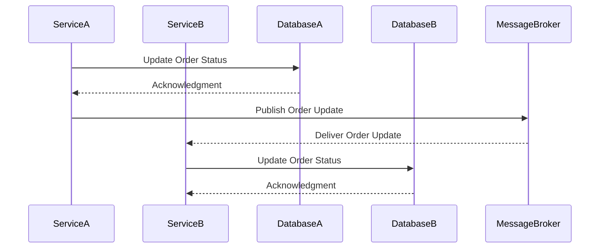

## 18.5 Integrating SQL Databases with Microservices

In the evolving landscape of software architecture, transitioning from a monolithic architecture to microservices is a significant step that many organizations are undertaking. This transition involves not only restructuring the application logic but also rethinking how databases are integrated and managed. In this section, we will delve into the strategies for integrating SQL databases with microservices, focusing on the database-per-service pattern, eventual consistency, and messaging patterns. We will also address the challenges of data synchronization and ensuring data integrity across services.

### Understanding the Transition: From Monolith to Microservices

Before we dive into the integration strategies, let's briefly understand why organizations are moving from monolithic architectures to microservices. A monolithic architecture is characterized by a single, unified codebase where all components are tightly coupled. While this approach can be simpler to develop initially, it often leads to scalability and maintainability issues as the application grows.

Microservices architecture, on the other hand, breaks down the application into smaller, independent services that can be developed, deployed, and scaled independently. This modular approach offers several benefits, including improved scalability, flexibility, and resilience. However, it also introduces new challenges, particularly in the realm of database management.

### Key Concepts in Microservices and Database Integration

#### 1. Database-Per-Service Pattern

**Intent**: The database-per-service pattern advocates for each microservice to have its own database. This approach ensures that services are loosely coupled and can evolve independently without affecting others.

**Applicability**: Use this pattern when you need to ensure service autonomy and when different services have distinct data storage requirements.

**Design Considerations**:
- **Data Duplication**: Accept that some data duplication may occur across services.
- **Data Consistency**: Implement strategies to handle eventual consistency across services.
- **Data Ownership**: Clearly define which service owns which data to avoid conflicts.

#### 2. Eventual Consistency

**Intent**: Eventual consistency is a consistency model used in distributed systems to achieve high availability. It allows for temporary inconsistencies, with the guarantee that all nodes will eventually converge to the same state.

**Applicability**: Use eventual consistency when immediate consistency is not critical, and the system can tolerate temporary inconsistencies.

**Design Considerations**:
- **Conflict Resolution**: Implement mechanisms to resolve data conflicts when they arise.
- **Latency**: Be aware of the latency introduced by eventual consistency and design your system to handle it gracefully.

#### 3. Messaging Patterns

**Intent**: Messaging patterns facilitate communication between microservices, enabling them to exchange data and events asynchronously.

**Applicability**: Use messaging patterns when you need to decouple services and enable asynchronous communication.

**Design Considerations**:
- **Message Brokers**: Choose an appropriate message broker (e.g., RabbitMQ, Kafka) based on your system's requirements.
- **Message Formats**: Define standard message formats to ensure compatibility between services.

### Strategies for Integrating SQL Databases with Microservices

#### Strategy 1: Database-Per-Service

The database-per-service pattern is a cornerstone of microservices architecture. By giving each service its own database, you ensure that services are independent and can be developed, deployed, and scaled independently. This approach also allows each service to choose the database technology that best suits its needs, whether it's a relational database like SQL or a NoSQL database.

**Implementation Steps**:
1. **Identify Service Boundaries**: Clearly define the boundaries of each microservice and the data it needs to manage.
2. **Choose Database Technology**: Select the appropriate database technology for each service based on its requirements.
3. **Implement Data Access Layer**: Develop a data access layer for each service to interact with its database.
4. **Ensure Data Isolation**: Ensure that each service can only access its own database to maintain isolation.

**Code Example**:
```sql
-- Service A's Database
CREATE TABLE orders (
    order_id INT PRIMARY KEY,
    customer_id INT,
    order_date DATE
);

-- Service B's Database
CREATE TABLE customers (
    customer_id INT PRIMARY KEY,
    name VARCHAR(255),
    email VARCHAR(255)
);
```

**Try It Yourself**: Experiment by adding new tables to each service's database and observe how changes in one service do not affect the others.

#### Strategy 2: Eventual Consistency

In a distributed system, achieving strong consistency can be challenging and may impact system availability. Eventual consistency offers a solution by allowing temporary inconsistencies, with the guarantee that all nodes will eventually converge to the same state.

**Implementation Steps**:
1. **Design for Asynchrony**: Design your system to handle asynchronous updates and eventual consistency.
2. **Implement Conflict Resolution**: Develop mechanisms to resolve data conflicts when they arise.
3. **Monitor Consistency**: Continuously monitor the system to ensure that eventual consistency is achieved.

**Code Example**:
```sql
-- Example of an eventual consistency mechanism
-- Service A updates an order status
UPDATE orders SET status = 'shipped' WHERE order_id = 1;

-- Service B eventually receives the update and processes it
-- This could be done via a message queue or event bus
```

**Try It Yourself**: Simulate a scenario where two services update the same data and implement a conflict resolution mechanism to handle inconsistencies.

#### Strategy 3: Messaging Patterns

Messaging patterns enable microservices to communicate asynchronously, decoupling them and allowing them to operate independently. This approach is particularly useful for integrating SQL databases with microservices, as it allows services to exchange data and events without direct dependencies.

**Implementation Steps**:
1. **Select a Message Broker**: Choose a message broker that fits your system's needs (e.g., RabbitMQ, Kafka).
2. **Define Message Formats**: Establish standard message formats to ensure compatibility between services.
3. **Implement Message Handlers**: Develop message handlers for each service to process incoming messages.

**Code Example**:
```python
import pika

def on_message(ch, method, properties, body):
    print(f"Received message: {body}")
    # Process the message and update the database accordingly

connection = pika.BlockingConnection(pika.ConnectionParameters('localhost'))
channel = connection.channel()

channel.queue_declare(queue='order_updates')
channel.basic_consume(queue='order_updates', on_message_callback=on_message, auto_ack=True)

print('Waiting for messages...')
channel.start_consuming()
```

**Try It Yourself**: Modify the message handler to process different types of messages and update the database accordingly.

### Challenges in Integrating SQL Databases with Microservices

#### Challenge 1: Data Synchronization

Synchronizing data across multiple services can be challenging, especially when each service has its own database. To address this challenge, consider using messaging patterns and eventual consistency to ensure that data is synchronized across services.

#### Challenge 2: Ensuring Data Integrity

Maintaining data integrity across distributed services requires careful planning and implementation. Use techniques such as distributed transactions, compensating transactions, and idempotent operations to ensure data integrity.

#### Challenge 3: Handling Data Duplication

Data duplication is a common issue in microservices architecture. While some duplication is inevitable, it can be managed by clearly defining data ownership and using messaging patterns to synchronize data.

### Visualizing Microservices and Database Integration

To better understand the integration of SQL databases with microservices, let's visualize the architecture using a sequence diagram.



**Diagram Description**: This sequence diagram illustrates how Service A updates its database and publishes an order update to a message broker. The message broker then delivers the update to Service B, which updates its own database accordingly.

### References and Further Reading

- [Microservices Architecture on AWS](https://aws.amazon.com/microservices/)
- [Event-Driven Architecture](https://martinfowler.com/articles/201701-event-driven.html)
- [CAP Theorem and Its Implications](https://en.wikipedia.org/wiki/CAP_theorem)

### Knowledge Check

1. Explain the database-per-service pattern and its benefits.
2. Describe eventual consistency and how it differs from strong consistency.
3. Provide an example of a messaging pattern used in microservices.
4. Discuss the challenges of data synchronization in microservices architecture.
5. How can data integrity be maintained across distributed services?

### Embrace the Journey

Remember, integrating SQL databases with microservices is a journey that requires careful planning and execution. As you progress, you'll encounter new challenges and opportunities to optimize your architecture. Keep experimenting, stay curious, and enjoy the journey!

## Quiz Time!



### What is the primary benefit of the database-per-service pattern?

- [x] Service autonomy and independent scaling
- [ ] Reduced data duplication
- [ ] Simplified data synchronization
- [ ] Enhanced security

> **Explanation:** The database-per-service pattern ensures that each service is autonomous and can be scaled independently, which is a primary benefit in microservices architecture.

### How does eventual consistency differ from strong consistency?

- [x] Allows temporary inconsistencies
- [ ] Guarantees immediate consistency
- [ ] Requires distributed transactions
- [ ] Eliminates data conflicts

> **Explanation:** Eventual consistency allows for temporary inconsistencies with the guarantee that all nodes will eventually converge to the same state, unlike strong consistency which requires immediate consistency.

### Which of the following is a common messaging pattern in microservices?

- [x] Publish-subscribe
- [ ] Direct communication
- [ ] Synchronous RPC
- [ ] Shared database

> **Explanation:** The publish-subscribe pattern is a common messaging pattern in microservices, enabling asynchronous communication between services.

### What is a key challenge in integrating SQL databases with microservices?

- [x] Data synchronization
- [ ] Increased latency
- [ ] Reduced scalability
- [ ] Simplified deployment

> **Explanation:** Data synchronization is a key challenge when integrating SQL databases with microservices, as each service may have its own database.

### How can data integrity be maintained across distributed services?

- [x] Using distributed transactions
- [ ] By avoiding data duplication
- [x] Implementing compensating transactions
- [ ] Through direct database access

> **Explanation:** Data integrity can be maintained by using distributed transactions and implementing compensating transactions to handle failures.

### What role does a message broker play in microservices?

- [x] Facilitates asynchronous communication
- [ ] Stores service data
- [ ] Manages service deployment
- [ ] Ensures strong consistency

> **Explanation:** A message broker facilitates asynchronous communication between microservices, allowing them to exchange data and events without direct dependencies.

### Why is data duplication often accepted in microservices architecture?

- [x] To ensure service autonomy
- [ ] To reduce storage costs
- [x] To improve performance
- [ ] To simplify data access

> **Explanation:** Data duplication is often accepted to ensure service autonomy and improve performance, as each service can manage its own data independently.

### What is a common method for resolving data conflicts in eventual consistency?

- [x] Conflict resolution mechanisms
- [ ] Immediate consistency enforcement
- [ ] Data rollback
- [ ] Synchronous updates

> **Explanation:** Conflict resolution mechanisms are commonly used to resolve data conflicts in eventual consistency models.

### Which strategy involves each microservice having its own database?

- [x] Database-per-service
- [ ] Shared database
- [ ] Centralized database
- [ ] Federated database

> **Explanation:** The database-per-service strategy involves each microservice having its own database, ensuring service independence.

### True or False: Messaging patterns in microservices eliminate the need for data synchronization.

- [ ] True
- [x] False

> **Explanation:** Messaging patterns facilitate communication between services but do not eliminate the need for data synchronization, which is still a challenge in microservices architecture.


