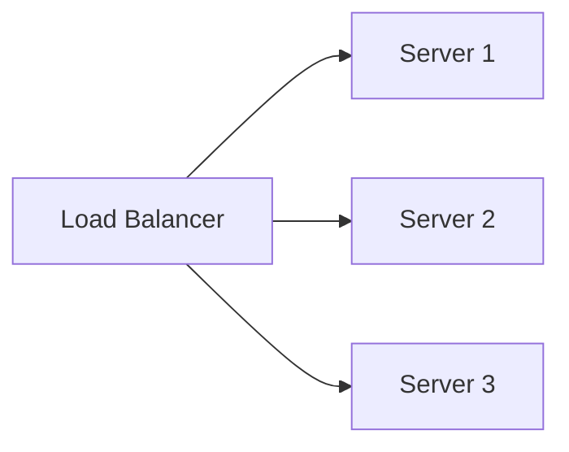
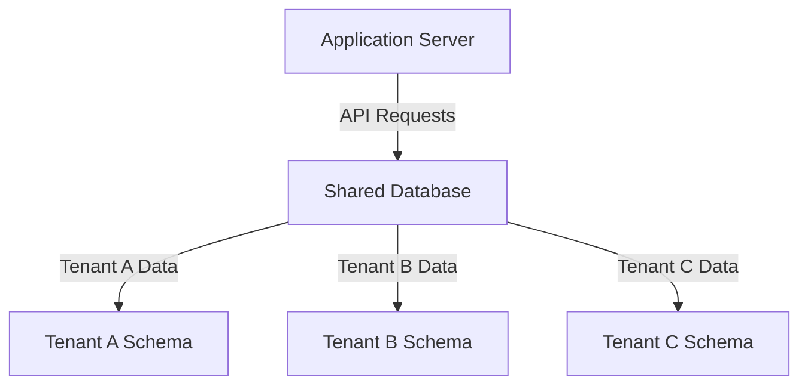

## 18.6 Building a Multi-Tenant SaaS Application

In the rapidly evolving landscape of software as a service (SaaS), building a multi-tenant application is a common challenge faced by software engineers and architects. This comprehensive guide will delve into the essential aspects of creating a multi-tenant SaaS application, focusing on isolating tenant data, scaling with demand, and providing customization options. By the end of this guide, you will have a deep understanding of the design patterns and best practices necessary to build a secure, scalable, and customizable multi-tenant platform.

### Understanding Multi-Tenancy

**Multi-tenancy** refers to a software architecture where a single instance of a software application serves multiple customers, known as tenants. Each tenant's data is isolated and remains invisible to other tenants. This architecture is crucial for SaaS applications as it allows for efficient resource utilization and cost-effective scaling.

#### Key Concepts

- **Tenant**: A customer or client using the SaaS application.
- **Isolation**: Ensuring that each tenant's data is separate and secure.
- **Scalability**: The ability to handle increased load by adding resources.
- **Customization**: Allowing tenants to tailor the application to their needs.

### Multi-Tenancy Models

Choosing the right multi-tenancy model is critical for the success of your SaaS application. The model you select will impact how you manage tenant data, scale your application, and provide customization options.

#### 1. Shared Database, Shared Schema

In this model, all tenants share the same database and schema. Tenant data is distinguished by a tenant identifier in each table.

**Advantages**:
- Simplified management and maintenance.
- Efficient use of resources.

**Disadvantages**:
- Complexity in ensuring data isolation.
- Potential performance bottlenecks.

**Example**:

```sql
CREATE TABLE Orders (
    OrderID INT PRIMARY KEY,
    TenantID INT,
    ProductName VARCHAR(255),
    Quantity INT,
    Price DECIMAL(10, 2),
    FOREIGN KEY (TenantID) REFERENCES Tenants(TenantID)
);
```

#### 2. Shared Database, Separate Schema

Each tenant has its own schema within a shared database. This model provides better data isolation compared to the shared schema model.

**Advantages**:
- Improved data isolation.
- Easier to implement tenant-specific customizations.

**Disadvantages**:
- Increased complexity in managing multiple schemas.
- Potential for increased resource usage.

**Example**:

```sql
-- Schema for Tenant A
CREATE SCHEMA TenantA;
CREATE TABLE TenantA.Orders (
    OrderID INT PRIMARY KEY,
    ProductName VARCHAR(255),
    Quantity INT,
    Price DECIMAL(10, 2)
);

-- Schema for Tenant B
CREATE SCHEMA TenantB;
CREATE TABLE TenantB.Orders (
    OrderID INT PRIMARY KEY,
    ProductName VARCHAR(255),
    Quantity INT,
    Price DECIMAL(10, 2)
);
```

#### 3. Separate Database per Tenant

Each tenant has its own database. This model offers the highest level of data isolation and customization.

**Advantages**:
- Maximum data isolation.
- Simplified backup and restore processes.

**Disadvantages**:
- Higher resource usage.
- Increased complexity in managing multiple databases.

**Example**:

```sql
-- Database for Tenant A
CREATE DATABASE TenantA;
USE TenantA;
CREATE TABLE Orders (
    OrderID INT PRIMARY KEY,
    ProductName VARCHAR(255),
    Quantity INT,
    Price DECIMAL(10, 2)
);

-- Database for Tenant B
CREATE DATABASE TenantB;
USE TenantB;
CREATE TABLE Orders (
    OrderID INT PRIMARY KEY,
    ProductName VARCHAR(255),
    Quantity INT,
    Price DECIMAL(10, 2)
);
```

### Implementing Robust Access Controls

Ensuring that each tenant can only access their own data is crucial for maintaining security and trust in a multi-tenant environment. Implement robust access controls to enforce data isolation.

#### Role-Based Access Control (RBAC)

RBAC is a method of restricting system access to authorized users. It is an effective way to manage permissions in a multi-tenant application.

**Implementation Steps**:

1. **Define Roles**: Identify the roles required for your application (e.g., admin, user, guest).
2. **Assign Permissions**: Assign specific permissions to each role.
3. **Assign Roles to Users**: Assign roles to users based on their responsibilities.

**Example**:

```sql
CREATE TABLE Roles (
    RoleID INT PRIMARY KEY,
    RoleName VARCHAR(50)
);

CREATE TABLE Permissions (
    PermissionID INT PRIMARY KEY,
    PermissionName VARCHAR(50)
);

CREATE TABLE RolePermissions (
    RoleID INT,
    PermissionID INT,
    FOREIGN KEY (RoleID) REFERENCES Roles(RoleID),
    FOREIGN KEY (PermissionID) REFERENCES Permissions(PermissionID)
);

CREATE TABLE UserRoles (
    UserID INT,
    RoleID INT,
    FOREIGN KEY (UserID) REFERENCES Users(UserID),
    FOREIGN KEY (RoleID) REFERENCES Roles(RoleID)
);
```

#### Row-Level Security (RLS)

RLS is a feature that allows you to control access to rows in a table based on the characteristics of the user executing a query.

**Example**:

```sql
-- Enable Row-Level Security
ALTER TABLE Orders ENABLE ROW LEVEL SECURITY;

-- Create a Security Policy
CREATE POLICY TenantIsolationPolicy
ON Orders
USING (TenantID = current_setting('app.current_tenant')::INT);
```

### Scaling with Demand

Scalability is a critical aspect of any SaaS application. As your customer base grows, your application must be able to handle increased demand without compromising performance.

#### Horizontal Scaling

Horizontal scaling involves adding more servers to handle increased load. This approach is often more cost-effective than vertical scaling (adding more power to existing servers).

**Implementation Steps**:

1. **Load Balancing**: Distribute incoming traffic across multiple servers to ensure no single server is overwhelmed.
2. **Database Sharding**: Split your database into smaller, more manageable pieces (shards) to improve performance.

**Example**:



#### Caching

Implement caching to reduce the load on your database and improve response times. Use in-memory data stores like Redis or Memcached to cache frequently accessed data.

**Example**:

```python
import redis

cache = redis.StrictRedis(host='localhost', port=6379, db=0)

cache.set('order_123', 'Order details for order 123')

order_details = cache.get('order_123')
```

### Customization for Tenants

Providing customization options allows tenants to tailor the application to their specific needs, enhancing user satisfaction and retention.

#### Feature Toggles

Feature toggles allow you to enable or disable features for specific tenants without deploying new code.

**Implementation Steps**:

1. **Define Feature Flags**: Identify the features that can be toggled.
2. **Store Feature Flags**: Use a database or configuration file to store the state of each feature flag.
3. **Check Feature Flags**: Implement logic in your application to check the state of feature flags before executing code.

**Example**:

```sql
CREATE TABLE FeatureFlags (
    FeatureID INT PRIMARY KEY,
    FeatureName VARCHAR(50),
    IsEnabled BOOLEAN
);

-- Check if a feature is enabled
SELECT IsEnabled FROM FeatureFlags WHERE FeatureName = 'NewDashboard';
```

#### Customizable User Interfaces

Allow tenants to customize the user interface to match their branding and preferences. This can be achieved through themes, custom CSS, and configurable layouts.

**Example**:

```html
<!-- HTML example with customizable CSS -->
<!DOCTYPE html>
<html>
<head>
    <link rel="stylesheet" type="text/css" href="default-theme.css">
    <link rel="stylesheet" type="text/css" href="custom-theme.css">
</head>
<body>
    <h1>Welcome to Your Dashboard</h1>
    <p>Customize your experience with our flexible UI options.</p>
</body>
</html>
```

### Achievements: Secure, Scalable, and Customizable Platform

By implementing the strategies outlined in this guide, you can build a multi-tenant SaaS application that is secure, scalable, and customizable. This will enable you to meet the diverse needs of your tenants while maintaining high levels of performance and security.

### Try It Yourself

Experiment with the code examples provided in this guide. Try modifying the SQL queries to add new features or improve performance. Consider implementing additional security measures or scaling strategies to enhance your application's capabilities.

### Visualizing Multi-Tenant Architecture



This diagram illustrates a shared database with separate schemas for each tenant, highlighting the data isolation achieved through this multi-tenancy model.

### References and Further Reading

- [AWS Multi-Tenant SaaS Architecture](https://aws.amazon.com/architecture/saas/)
- [Microsoft Azure Multi-Tenant Applications](https://docs.microsoft.com/en-us/azure/architecture/guide/multitenant/)
- [Google Cloud Multi-Tenant SaaS Solutions](https://cloud.google.com/solutions/multi-tenant-saas)

### Knowledge Check

- What are the key advantages and disadvantages of each multi-tenancy model?
- How can you implement role-based access control in a multi-tenant application?
- What are the benefits of using row-level security for tenant data isolation?
- How can horizontal scaling improve the performance of a SaaS application?
- What are feature toggles, and how can they enhance customization for tenants?

### Embrace the Journey

Building a multi-tenant SaaS application is a complex but rewarding endeavor. Remember, this is just the beginning. As you progress, you'll learn more about optimizing performance, enhancing security, and providing even more customization options. Keep experimenting, stay curious, and enjoy the journey!

## Quiz Time!



### What is a key advantage of the shared database, shared schema model?

- [x] Simplified management and maintenance
- [ ] Maximum data isolation
- [ ] Simplified backup and restore processes
- [ ] Easier to implement tenant-specific customizations

> **Explanation:** The shared database, shared schema model simplifies management and maintenance by using a single schema for all tenants.

### Which multi-tenancy model offers the highest level of data isolation?

- [ ] Shared Database, Shared Schema
- [ ] Shared Database, Separate Schema
- [x] Separate Database per Tenant
- [ ] None of the above

> **Explanation:** The separate database per tenant model offers the highest level of data isolation by providing each tenant with their own database.

### What is the primary purpose of role-based access control (RBAC)?

- [x] To restrict system access to authorized users
- [ ] To improve database performance
- [ ] To enable feature toggles
- [ ] To manage database schemas

> **Explanation:** RBAC is used to restrict system access to authorized users by assigning roles and permissions.

### How does row-level security (RLS) enhance data isolation?

- [x] By controlling access to rows in a table based on user characteristics
- [ ] By creating separate databases for each tenant
- [ ] By enabling feature toggles
- [ ] By using load balancing

> **Explanation:** RLS enhances data isolation by controlling access to rows in a table based on the characteristics of the user executing a query.

### What is a benefit of horizontal scaling?

- [x] Cost-effective handling of increased load
- [ ] Maximum data isolation
- [ ] Simplified management of schemas
- [ ] Improved data security

> **Explanation:** Horizontal scaling is cost-effective because it involves adding more servers to handle increased load, rather than adding more power to existing servers.

### What is the purpose of caching in a SaaS application?

- [x] To reduce the load on the database and improve response times
- [ ] To enable feature toggles
- [ ] To manage database schemas
- [ ] To restrict system access to authorized users

> **Explanation:** Caching reduces the load on the database and improves response times by storing frequently accessed data in memory.

### How can feature toggles enhance customization for tenants?

- [x] By allowing features to be enabled or disabled for specific tenants
- [ ] By creating separate databases for each tenant
- [ ] By controlling access to rows in a table
- [ ] By using load balancing

> **Explanation:** Feature toggles enhance customization by allowing features to be enabled or disabled for specific tenants without deploying new code.

### What is a key disadvantage of the shared database, separate schema model?

- [ ] Simplified management and maintenance
- [x] Increased complexity in managing multiple schemas
- [ ] Maximum data isolation
- [ ] Simplified backup and restore processes

> **Explanation:** The shared database, separate schema model increases complexity in managing multiple schemas, which can be challenging.

### Which of the following is a method of horizontal scaling?

- [x] Load balancing
- [ ] Creating separate databases for each tenant
- [ ] Enabling feature toggles
- [ ] Using row-level security

> **Explanation:** Load balancing is a method of horizontal scaling that distributes incoming traffic across multiple servers.

### True or False: Feature toggles require deploying new code to enable or disable features.

- [ ] True
- [x] False

> **Explanation:** Feature toggles allow features to be enabled or disabled without deploying new code, providing flexibility and customization options.


