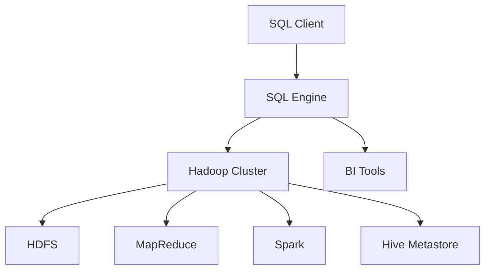

## 18.7 Leveraging SQL for Big Data Solutions

In the ever-evolving landscape of data management, the integration of SQL with big data solutions has become a pivotal strategy for organizations aiming to harness the power of large-scale data processing while leveraging existing SQL expertise. This section explores the methods and advantages of combining traditional SQL databases with big data technologies like Hadoop, providing a comprehensive guide for expert software engineers and architects.

### Introduction to SQL and Big Data Integration

As data volumes grow exponentially, traditional SQL databases often struggle to handle the scale and complexity of big data. However, SQL remains a powerful and familiar tool for data querying and manipulation. By integrating SQL with big data technologies, organizations can achieve the best of both worlds: the scalability and flexibility of big data platforms and the ease of use and familiarity of SQL.

#### Key Concepts

- **SQL on Hadoop**: Utilizing SQL interfaces over distributed file systems like Hadoop Distributed File System (HDFS) to perform big data analysis.
- **Data Processing Frameworks**: Integrating SQL with frameworks such as Apache Hive, Apache Impala, and Apache Spark SQL to process and analyze large datasets.
- **SQL Engines**: Leveraging SQL engines like Presto and Apache Drill that are designed to query large datasets across various data sources.

### SQL on Hadoop: A Deep Dive

Hadoop, an open-source framework for distributed storage and processing of large datasets, has become a cornerstone of big data solutions. Integrating SQL with Hadoop allows users to perform complex queries on massive datasets using familiar SQL syntax.

#### Apache Hive

Apache Hive is a data warehouse infrastructure built on top of Hadoop, providing a SQL-like interface for querying and managing large datasets.

- **Architecture**: Hive translates SQL queries into MapReduce jobs, enabling SQL-like querying on data stored in HDFS.
- **Features**: Supports complex queries, including joins and aggregations, and provides a rich set of data types.
- **Use Case**: Ideal for batch processing and data warehousing tasks.

```sql
-- Sample HiveQL query to calculate average sales per region
SELECT region, AVG(sales) AS avg_sales
FROM sales_data
GROUP BY region;
```

#### Apache Impala

Apache Impala is an open-source SQL query engine for data stored in Hadoop. It provides low-latency and high-performance querying capabilities.

- **Architecture**: Unlike Hive, Impala executes queries directly on HDFS data without translating them into MapReduce jobs.
- **Features**: Real-time querying, support for complex data types, and integration with Hadoop ecosystem tools.
- **Use Case**: Suitable for interactive and real-time analytics.

```sql
-- Sample Impala query to find top-selling products
SELECT product_id, SUM(quantity) AS total_quantity
FROM sales_data
GROUP BY product_id
ORDER BY total_quantity DESC
LIMIT 10;
```

#### Apache Spark SQL

Apache Spark SQL is a component of Apache Spark that provides a SQL interface for Spark's distributed data processing engine.

- **Architecture**: Spark SQL allows users to run SQL queries on data stored in various formats, including JSON, Parquet, and ORC.
- **Features**: Supports complex analytics, machine learning, and graph processing.
- **Use Case**: Ideal for iterative and interactive data processing.

```sql
-- Sample Spark SQL query to join customer and order data
SELECT c.customer_id, c.name, o.order_id, o.amount
FROM customers c
JOIN orders o ON c.customer_id = o.customer_id
WHERE o.amount > 1000;
```

### Integrating SQL with Big Data Processing Frameworks

Beyond Hadoop, SQL can be integrated with various big data processing frameworks to enhance data analysis capabilities.

#### Apache Drill

Apache Drill is a schema-free SQL query engine for big data exploration. It supports querying data from multiple sources, including HDFS, NoSQL databases, and cloud storage.

- **Architecture**: Drill's schema-free model allows querying of semi-structured data without predefined schemas.
- **Features**: Supports ANSI SQL, JSON, and Parquet formats, and provides a flexible data exploration environment.
- **Use Case**: Suitable for ad-hoc queries and data exploration across diverse data sources.

```sql
-- Sample Drill query to analyze JSON data
SELECT employee_id, name, department
FROM dfs.`/data/employees.json`
WHERE department = 'Engineering';
```

#### Presto

Presto is a distributed SQL query engine designed for fast analytics on large datasets. It supports querying data from various sources, including HDFS, S3, and relational databases.

- **Architecture**: Presto's architecture allows it to query data in place, without requiring data movement.
- **Features**: Supports ANSI SQL, complex queries, and integration with BI tools.
- **Use Case**: Ideal for interactive analytics and data exploration.

```sql
-- Sample Presto query to calculate total sales by category
SELECT category, SUM(sales) AS total_sales
FROM retail_data
GROUP BY category;
```

### Advantages of SQL for Big Data Solutions

Integrating SQL with big data technologies offers several advantages:

- **Familiarity**: SQL is a widely used and well-understood language, allowing organizations to leverage existing skill sets.
- **Interoperability**: SQL interfaces can query data across various platforms, providing a unified view of disparate data sources.
- **Scalability**: Big data technologies like Hadoop and Spark provide the scalability needed to process large datasets efficiently.
- **Flexibility**: SQL engines and frameworks support a wide range of data formats and sources, enabling flexible data analysis.

### Design Considerations and Best Practices

When leveraging SQL for big data solutions, consider the following design considerations and best practices:

- **Data Modeling**: Ensure that data is modeled appropriately for the chosen SQL engine or framework to optimize query performance.
- **Indexing and Partitioning**: Use indexing and partitioning strategies to improve query efficiency and reduce data processing time.
- **Resource Management**: Monitor and manage resources effectively to prevent bottlenecks and ensure optimal performance.
- **Security and Compliance**: Implement security measures and ensure compliance with data protection regulations when handling sensitive data.

### Visualizing SQL and Big Data Integration

To better understand the integration of SQL with big data technologies, let's visualize the architecture of a typical SQL on Hadoop setup.



**Diagram Description**: This diagram illustrates the flow of data and queries in a SQL on Hadoop architecture. The SQL client sends queries to the SQL engine, which interacts with the Hadoop cluster. The cluster processes data stored in HDFS using various processing frameworks like MapReduce and Spark. The Hive Metastore manages metadata, and BI tools can be used for data visualization and analysis.

### Try It Yourself

To deepen your understanding of SQL and big data integration, try modifying the sample queries provided in this section. Experiment with different datasets and SQL engines to explore their capabilities and performance characteristics.

### References and Further Reading

- [Apache Hive Documentation](https://cwiki.apache.org/confluence/display/Hive/Home)
- [Apache Impala Documentation](https://impala.apache.org/)
- [Apache Spark SQL Guide](https://spark.apache.org/sql/)
- [Apache Drill Documentation](https://drill.apache.org/)
- [Presto Documentation](https://prestodb.io/)

### Knowledge Check

- Explain the advantages of using SQL for big data solutions.
- Describe the architecture of Apache Hive and its role in SQL on Hadoop.
- Discuss the differences between Apache Impala and Apache Hive.
- Provide an example of a SQL query using Apache Spark SQL.

### Embrace the Journey

Remember, integrating SQL with big data technologies is just the beginning. As you progress, you'll discover new ways to harness the power of big data while leveraging the familiarity of SQL. Keep experimenting, stay curious, and enjoy the journey!

## Quiz Time!



### What is the primary advantage of integrating SQL with big data technologies?

- [x] Familiarity with SQL syntax
- [ ] Increased data storage capacity
- [ ] Reduced data processing time
- [ ] Enhanced data security

> **Explanation:** Integrating SQL with big data technologies allows users to leverage their existing SQL knowledge and skills to query and analyze large datasets.

### Which SQL engine is known for low-latency and high-performance querying on Hadoop?

- [ ] Apache Hive
- [x] Apache Impala
- [ ] Apache Drill
- [ ] Presto

> **Explanation:** Apache Impala is designed for low-latency and high-performance querying on data stored in Hadoop.

### What is a key feature of Apache Drill?

- [ ] Schema-based querying
- [x] Schema-free querying
- [ ] Real-time analytics
- [ ] Machine learning integration

> **Explanation:** Apache Drill supports schema-free querying, allowing users to query semi-structured data without predefined schemas.

### Which SQL engine is part of the Apache Spark ecosystem?

- [ ] Apache Hive
- [ ] Apache Impala
- [x] Apache Spark SQL
- [ ] Presto

> **Explanation:** Apache Spark SQL is a component of Apache Spark, providing a SQL interface for Spark's distributed data processing engine.

### What is the role of the Hive Metastore in a SQL on Hadoop architecture?

- [ ] Data storage
- [ ] Query execution
- [x] Metadata management
- [ ] Data visualization

> **Explanation:** The Hive Metastore manages metadata for data stored in Hadoop, facilitating SQL querying and data management.

### Which SQL engine is designed for fast analytics on large datasets across various data sources?

- [ ] Apache Hive
- [ ] Apache Impala
- [ ] Apache Drill
- [x] Presto

> **Explanation:** Presto is a distributed SQL query engine designed for fast analytics on large datasets across various data sources.

### What is a common use case for Apache Hive?

- [x] Batch processing and data warehousing
- [ ] Real-time analytics
- [ ] Ad-hoc queries
- [ ] Machine learning

> **Explanation:** Apache Hive is commonly used for batch processing and data warehousing tasks, translating SQL queries into MapReduce jobs.

### Which SQL engine allows querying of data stored in JSON format?

- [ ] Apache Hive
- [ ] Apache Impala
- [x] Apache Drill
- [ ] Presto

> **Explanation:** Apache Drill supports querying data stored in JSON format, among other data types.

### What is a key consideration when leveraging SQL for big data solutions?

- [ ] Data encryption
- [x] Data modeling
- [ ] Data replication
- [ ] Data compression

> **Explanation:** Data modeling is crucial for optimizing query performance and ensuring efficient data processing in big data solutions.

### True or False: SQL engines like Presto require data movement to query data in place.

- [ ] True
- [x] False

> **Explanation:** Presto's architecture allows it to query data in place without requiring data movement, enhancing performance and efficiency.


