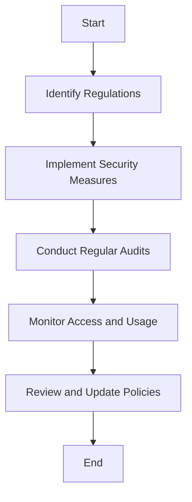

## 18.8 Ensuring Data Compliance in Healthcare Applications

In the realm of healthcare, data compliance is not just a regulatory requirement but a fundamental aspect of maintaining trust and ensuring the safety of sensitive patient information. This section delves into the intricacies of data compliance within healthcare applications, focusing on the regulations that govern data protection, the best practices for achieving compliance, and the tangible results of implementing these practices.

### Understanding Healthcare Data Compliance

Healthcare data compliance involves adhering to a set of regulations and standards designed to protect patient information. These regulations ensure that healthcare organizations handle data responsibly, maintaining confidentiality, integrity, and availability. Let's explore some of the key regulations and standards:

#### Key Regulations and Standards

1. **Health Insurance Portability and Accountability Act (HIPAA)**: In the United States, HIPAA sets the standard for protecting sensitive patient data. It mandates secure handling of Protected Health Information (PHI) and includes provisions for data privacy and security.

2. **General Data Protection Regulation (GDPR)**: Although primarily a European regulation, GDPR's influence extends globally. It emphasizes data protection and privacy for individuals, requiring explicit consent for data processing and granting individuals rights over their data.

3. **Health Information Technology for Economic and Clinical Health Act (HITECH)**: This act promotes the adoption of health information technology and strengthens the enforcement of HIPAA regulations.

4. **ISO/IEC 27001**: An international standard for information security management systems, ISO/IEC 27001 provides a framework for managing sensitive company information, including healthcare data.

5. **National Institute of Standards and Technology (NIST) Guidelines**: NIST provides a comprehensive set of guidelines for managing cybersecurity risks, including those related to healthcare data.

### Best Practices for Data Compliance

Ensuring data compliance in healthcare applications requires a multifaceted approach. Here are some best practices to consider:

#### 1. Data Encryption

Encrypting data is a fundamental practice for protecting sensitive information. It involves converting data into a coded format that can only be accessed by authorized users with the decryption key.

- **At Rest Encryption**: Protects data stored in databases and file systems. Use SQL features like Transparent Data Encryption (TDE) to encrypt data at rest.
- **In Transit Encryption**: Secures data being transmitted over networks. Implement protocols like TLS (Transport Layer Security) to encrypt data in transit.

#### 2. Access Controls

Implementing strict access controls ensures that only authorized personnel can access sensitive data. This involves:

- **Role-Based Access Control (RBAC)**: Assign roles to users based on their job functions, granting them access only to the data necessary for their role.
- **Multi-Factor Authentication (MFA)**: Enhance security by requiring multiple forms of verification before granting access.

#### 3. Regular Compliance Audits

Conducting regular audits helps identify potential vulnerabilities and ensures ongoing compliance with regulations. Audits should include:

- **Security Assessments**: Evaluate the effectiveness of security measures and identify areas for improvement.
- **Data Access Reviews**: Monitor who has access to sensitive data and ensure access is justified.

#### 4. Data Anonymization

Anonymizing data involves removing personally identifiable information (PII) to protect patient privacy while allowing data to be used for research and analysis.

- **Techniques**: Use techniques like data masking, pseudonymization, and aggregation to anonymize data.

#### 5. Secure Data Storage

Ensure that data is stored securely, both physically and digitally. This includes:

- **Database Security**: Implement security measures like firewalls, intrusion detection systems, and regular patching to protect databases.
- **Backup and Recovery**: Regularly back up data and have a robust recovery plan in place to prevent data loss.

### Implementing Compliance in SQL Databases

SQL databases play a crucial role in healthcare applications, storing vast amounts of sensitive patient data. Implementing compliance in SQL databases involves several key strategies:

#### 1. Using SQL Security Features

Leverage built-in SQL security features to enhance data protection:

- **Transparent Data Encryption (TDE)**: Encrypts the database files, protecting data at rest.
- **Row-Level Security (RLS)**: Restricts access to specific rows in a table based on user roles.
- **Dynamic Data Masking**: Obscures sensitive data in query results, allowing users to access data without exposing sensitive information.

#### 2. Implementing Audit Trails

Audit trails track data access and modifications, providing a record of who accessed or changed data and when. This is crucial for compliance and forensic investigations.

```sql
-- Example of creating an audit table
CREATE TABLE AuditTrail (
    AuditID INT PRIMARY KEY,
    UserID INT,
    Action VARCHAR(50),
    TableName VARCHAR(50),
    Timestamp DATETIME DEFAULT CURRENT_TIMESTAMP,
    Details TEXT
);

-- Example of inserting an audit record
INSERT INTO AuditTrail (UserID, Action, TableName, Details)
VALUES (123, 'UPDATE', 'PatientRecords', 'Updated patient address');
```

#### 3. Enforcing Data Integrity

Data integrity ensures that data is accurate and consistent. Use SQL constraints to enforce data integrity:

- **Primary Key Constraints**: Ensure each record is unique.
- **Foreign Key Constraints**: Maintain referential integrity between tables.
- **Check Constraints**: Validate data against specific conditions.

### Visualizing Data Compliance Workflow

To better understand the workflow of ensuring data compliance in healthcare applications, let's visualize the process using a flowchart.



**Figure 1: Data Compliance Workflow in Healthcare Applications**

### Results of Ensuring Data Compliance

Implementing robust data compliance measures yields significant benefits:

- **Avoidance of Legal Penalties**: Compliance with regulations helps avoid costly fines and legal actions.
- **Enhanced Patient Trust**: Patients are more likely to trust healthcare providers who prioritize data protection.
- **Improved Data Security**: Strong security measures reduce the risk of data breaches and unauthorized access.

### Try It Yourself

To deepen your understanding of data compliance in healthcare applications, try modifying the SQL code examples provided. Experiment with different security features, such as implementing row-level security or dynamic data masking, and observe how they affect data access and protection.

### Knowledge Check

To reinforce your understanding, consider the following questions:

- What are the key regulations governing healthcare data compliance?
- How does data encryption contribute to data protection?
- Why are regular compliance audits important?
- What role do SQL security features play in ensuring data compliance?

### Embrace the Journey

Remember, ensuring data compliance is an ongoing process. As regulations evolve and new security threats emerge, it's crucial to stay informed and adapt your strategies accordingly. Keep experimenting, stay curious, and enjoy the journey of mastering data compliance in healthcare applications.

## Quiz Time!



### What is the primary purpose of HIPAA in healthcare?

- [x] To protect sensitive patient data
- [ ] To standardize medical billing codes
- [ ] To regulate healthcare insurance premiums
- [ ] To manage hospital staffing levels

> **Explanation:** HIPAA is designed to protect sensitive patient data by setting standards for data privacy and security.

### Which SQL feature is used to encrypt database files?

- [x] Transparent Data Encryption (TDE)
- [ ] Row-Level Security (RLS)
- [ ] Dynamic Data Masking
- [ ] Common Table Expressions (CTEs)

> **Explanation:** Transparent Data Encryption (TDE) is used to encrypt database files, protecting data at rest.

### What is the role of audit trails in data compliance?

- [x] To track data access and modifications
- [ ] To encrypt sensitive data
- [ ] To anonymize patient information
- [ ] To optimize database queries

> **Explanation:** Audit trails track data access and modifications, providing a record of who accessed or changed data and when.

### Which technique is used to anonymize data?

- [x] Data masking
- [ ] Data encryption
- [ ] Data compression
- [ ] Data replication

> **Explanation:** Data masking is a technique used to anonymize data by obscuring personally identifiable information.

### What is the benefit of implementing role-based access control (RBAC)?

- [x] It restricts data access based on user roles
- [ ] It encrypts data in transit
- [ ] It anonymizes patient information
- [ ] It optimizes database performance

> **Explanation:** Role-based access control (RBAC) restricts data access based on user roles, ensuring that only authorized personnel can access sensitive data.

### Why are regular compliance audits important?

- [x] To identify potential vulnerabilities
- [ ] To encrypt sensitive data
- [ ] To anonymize patient information
- [ ] To optimize database queries

> **Explanation:** Regular compliance audits help identify potential vulnerabilities and ensure ongoing compliance with regulations.

### What is the purpose of dynamic data masking?

- [x] To obscure sensitive data in query results
- [ ] To encrypt database files
- [ ] To track data access and modifications
- [ ] To optimize database performance

> **Explanation:** Dynamic data masking obscures sensitive data in query results, allowing users to access data without exposing sensitive information.

### Which regulation emphasizes data protection and privacy for individuals?

- [x] General Data Protection Regulation (GDPR)
- [ ] Health Insurance Portability and Accountability Act (HIPAA)
- [ ] Health Information Technology for Economic and Clinical Health Act (HITECH)
- [ ] National Institute of Standards and Technology (NIST) Guidelines

> **Explanation:** The General Data Protection Regulation (GDPR) emphasizes data protection and privacy for individuals, requiring explicit consent for data processing.

### What is the benefit of encrypting data in transit?

- [x] It secures data being transmitted over networks
- [ ] It anonymizes patient information
- [ ] It optimizes database performance
- [ ] It tracks data access and modifications

> **Explanation:** Encrypting data in transit secures data being transmitted over networks, protecting it from interception and unauthorized access.

### True or False: Data compliance in healthcare is only about avoiding legal penalties.

- [ ] True
- [x] False

> **Explanation:** Data compliance in healthcare is not only about avoiding legal penalties but also about protecting patient privacy, building trust, and ensuring data security.


