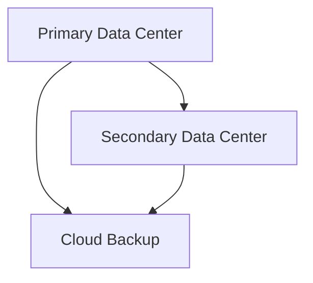
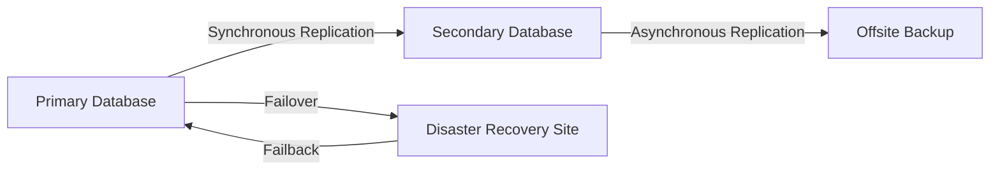

## 18.9 Disaster Recovery Implementation for Financial Systems

In the fast-paced world of financial systems, where transactions occur in milliseconds and data integrity is paramount, implementing a robust disaster recovery (DR) strategy is not just a best practice—it's a necessity. Financial institutions face unique challenges when it comes to disaster recovery due to the critical nature of their operations and the stringent regulatory requirements they must adhere to. In this section, we will delve into the intricacies of disaster recovery implementation for financial systems, focusing on the risks, solutions, and outcomes associated with these strategies.

### Understanding the Risks

Financial systems are susceptible to a myriad of risks that can lead to data loss or system downtime. These risks include:

- **Natural Disasters**: Events such as earthquakes, floods, and hurricanes can physically damage data centers.
- **Cyber Attacks**: Financial systems are prime targets for hackers, who may attempt to steal data or disrupt services.
- **Hardware Failures**: Equipment malfunctions can lead to data loss or system outages.
- **Human Error**: Mistakes by employees can inadvertently delete or corrupt data.
- **Regulatory Compliance**: Failing to recover data promptly can lead to non-compliance with financial regulations, resulting in hefty fines.

### Key Concepts in Disaster Recovery

Before diving into specific strategies, it's essential to understand some key concepts in disaster recovery:

- **Recovery Point Objective (RPO)**: The maximum acceptable amount of data loss measured in time. It defines how far back in time you need to recover data.
- **Recovery Time Objective (RTO)**: The maximum acceptable length of time that a system can be down after a failure.
- **Business Continuity**: Ensuring that critical business functions continue during and after a disaster.
- **Failover**: The process of switching to a backup system when the primary system fails.
- **Replication**: The process of copying data from one location to another to ensure data availability.

### Solutions for Disaster Recovery

Implementing a disaster recovery plan involves several strategies that work together to ensure data integrity and system availability. Here are some of the most effective solutions:

#### 1. Data Replication Strategies

Data replication is the cornerstone of any disaster recovery plan. It involves creating copies of data and storing them in different locations. There are several types of replication strategies:

- **Synchronous Replication**: Data is copied to the backup site in real-time. This ensures zero data loss but can impact performance due to latency.
- **Asynchronous Replication**: Data is copied to the backup site with a slight delay. This reduces the impact on performance but may result in minimal data loss.
- **Near-Synchronous Replication**: A hybrid approach that aims to balance performance and data loss.

```sql
-- Example of setting up asynchronous replication in SQL Server
ALTER DATABASE FinancialDB
SET PARTNER = 'TCP://BackupServer:5022';
GO
```

#### 2. Failover and Failback Mechanisms

Failover is the process of switching to a backup system when the primary system fails. Failback is the process of returning to the primary system once it is restored. These mechanisms are crucial for minimizing downtime.

- **Automatic Failover**: Systems automatically switch to the backup without human intervention.
- **Manual Failover**: Requires human intervention to switch to the backup system.

```sql
-- Example of configuring automatic failover in SQL Server
ALTER DATABASE FinancialDB
SET PARTNER FAILOVER;
GO
```

#### 3. Backup and Restore Procedures

Regular backups are essential for disaster recovery. Backups should be stored offsite and tested regularly to ensure they can be restored when needed.

- **Full Backups**: A complete copy of the database.
- **Incremental Backups**: Only the changes since the last backup are copied.
- **Differential Backups**: Copies all changes since the last full backup.

```sql
-- Example of creating a full backup in SQL Server
BACKUP DATABASE FinancialDB
TO DISK = 'D:\Backups\FinancialDB.bak'
WITH FORMAT;
GO
```

#### 4. Geographic Redundancy

Storing data in multiple geographic locations ensures that a disaster in one area does not affect data availability. This can be achieved through cloud services or multiple data centers.



#### 5. Regular Testing and Drills

Testing the disaster recovery plan regularly ensures that all components work as expected and that staff are familiar with the procedures.

- **Simulation Drills**: Conducting mock disaster scenarios to test the plan.
- **Regular Audits**: Reviewing the plan to ensure it meets current business and regulatory requirements.

### Outcome: Ensuring Business Continuity

By implementing these strategies, financial institutions can ensure business continuity and minimize downtime during incidents. The key outcomes of a successful disaster recovery plan include:

- **Reduced Downtime**: Quick recovery times ensure that services remain available to customers.
- **Data Integrity**: Ensures that data is accurate and complete, even after a disaster.
- **Regulatory Compliance**: Meets the requirements set by financial regulators, avoiding fines and penalties.
- **Customer Trust**: Maintaining service availability and data integrity builds trust with customers.

### Visualizing Disaster Recovery Architecture

To better understand how these components fit together, let's visualize a typical disaster recovery architecture for a financial system:



### Try It Yourself

To gain hands-on experience with disaster recovery, try setting up a simple replication and failover scenario using a test database. Experiment with different replication strategies and observe how they impact performance and data availability. Modify the code examples provided to suit your environment and test the failover and failback processes.

### Knowledge Check

- **What is the difference between RPO and RTO?**
- **How does synchronous replication differ from asynchronous replication?**
- **Why is geographic redundancy important in disaster recovery?**
- **What are the benefits of regular testing and drills in a disaster recovery plan?**

### Embrace the Journey

Implementing a disaster recovery plan is a complex but rewarding process. Remember, this is just the beginning. As you progress, you'll build more resilient and robust systems. Keep experimenting, stay curious, and enjoy the journey!

## Quiz Time!



### What is the primary goal of disaster recovery in financial systems?

- [x] Ensure business continuity and minimize downtime
- [ ] Increase transaction speed
- [ ] Reduce operational costs
- [ ] Enhance user interface design

> **Explanation:** The primary goal of disaster recovery is to ensure business continuity and minimize downtime during incidents.

### Which replication strategy ensures zero data loss?

- [x] Synchronous Replication
- [ ] Asynchronous Replication
- [ ] Near-Synchronous Replication
- [ ] Incremental Replication

> **Explanation:** Synchronous replication ensures zero data loss by copying data in real-time.

### What is the purpose of failover mechanisms?

- [x] Switch to a backup system when the primary system fails
- [ ] Increase data storage capacity
- [ ] Enhance data encryption
- [ ] Improve user authentication

> **Explanation:** Failover mechanisms switch to a backup system when the primary system fails to ensure continuity.

### Why is geographic redundancy important?

- [x] It ensures data availability even if one location is affected by a disaster
- [ ] It reduces the cost of data storage
- [ ] It simplifies data management
- [ ] It enhances data encryption

> **Explanation:** Geographic redundancy ensures data availability even if one location is affected by a disaster.

### What is a key benefit of regular testing and drills?

- [x] Ensures all components work as expected and staff are familiar with procedures
- [ ] Reduces the need for data encryption
- [ ] Increases data storage capacity
- [ ] Enhances user interface design

> **Explanation:** Regular testing and drills ensure all components work as expected and staff are familiar with procedures.

### What is the difference between full and incremental backups?

- [x] Full backups copy the entire database, while incremental backups copy only changes since the last backup
- [ ] Full backups copy only changes since the last backup, while incremental backups copy the entire database
- [ ] Full backups are faster than incremental backups
- [ ] Incremental backups are more secure than full backups

> **Explanation:** Full backups copy the entire database, while incremental backups copy only changes since the last backup.

### What is the role of failback mechanisms?

- [x] Return to the primary system once it is restored
- [ ] Increase data encryption
- [ ] Enhance user authentication
- [ ] Improve transaction speed

> **Explanation:** Failback mechanisms return to the primary system once it is restored.

### What is the Recovery Point Objective (RPO)?

- [x] The maximum acceptable amount of data loss measured in time
- [ ] The maximum acceptable length of time that a system can be down
- [ ] The minimum acceptable transaction speed
- [ ] The minimum acceptable data encryption level

> **Explanation:** RPO is the maximum acceptable amount of data loss measured in time.

### What is the Recovery Time Objective (RTO)?

- [x] The maximum acceptable length of time that a system can be down
- [ ] The maximum acceptable amount of data loss measured in time
- [ ] The minimum acceptable transaction speed
- [ ] The minimum acceptable data encryption level

> **Explanation:** RTO is the maximum acceptable length of time that a system can be down.

### True or False: Asynchronous replication can result in minimal data loss.

- [x] True
- [ ] False

> **Explanation:** Asynchronous replication can result in minimal data loss due to the slight delay in data copying.


