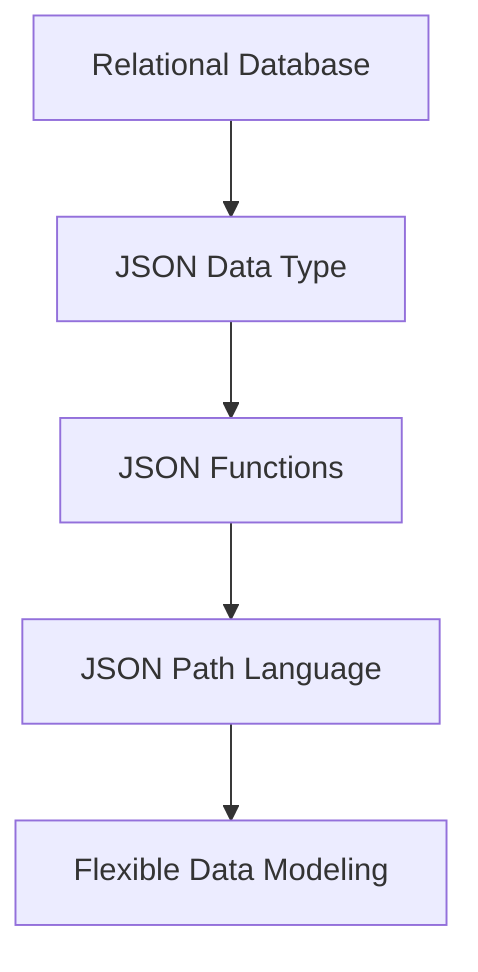
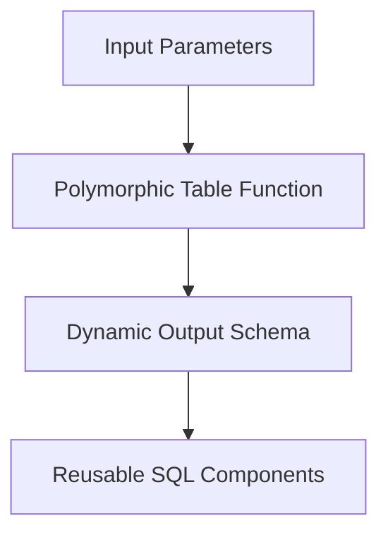

## 19.1 Advances in SQL Standards

As the backbone of relational database management systems (RDBMS), SQL (Structured Query Language) has undergone significant evolution since its inception. The SQL:2016 standard, a pivotal milestone in this journey, introduced several groundbreaking features that have reshaped how developers interact with databases. In this section, we will delve into these advancements, focusing on JSON support and polymorphic table functions, and explore their impact on modern database systems. We will also examine how major RDBMS vendors have adopted these standards, providing insights into the future trajectory of SQL.

### Understanding SQL:2016 and Its Significance

SQL:2016, formally known as ISO/IEC 9075:2016, represents a major revision to the SQL standard. It builds upon previous iterations by introducing new capabilities that address the evolving needs of data management in contemporary applications. Key features of SQL:2016 include:

- **JSON Support**: Facilitates the integration of semi-structured data within relational databases, enabling more flexible data modeling and querying.
- **Polymorphic Table Functions**: Allow functions to return tables with varying structures, enhancing the flexibility and reusability of SQL code.
- **Row Pattern Recognition**: Provides advanced pattern matching capabilities within SQL queries, useful for complex data analysis tasks.
- **Enhanced Temporal Data Handling**: Improves support for time-based data, crucial for applications requiring historical data tracking and auditing.

These features collectively enhance SQL's ability to handle complex data types and perform sophisticated queries, making it a more versatile tool for developers.

### JSON Support in SQL:2016

The inclusion of JSON (JavaScript Object Notation) support in SQL:2016 marks a significant shift towards accommodating semi-structured data within relational databases. JSON, a lightweight data interchange format, has become ubiquitous in modern web applications due to its simplicity and flexibility. By integrating JSON support, SQL:2016 enables developers to store, query, and manipulate JSON data directly within SQL databases.

#### Key Features of JSON Support

1. **JSON Data Type**: SQL:2016 introduces a native JSON data type, allowing databases to store JSON documents efficiently. This eliminates the need for workarounds such as storing JSON as text, which can lead to performance and validation issues.

2. **JSON Functions and Operators**: A suite of functions and operators is provided to facilitate JSON data manipulation. These include functions for extracting JSON values, modifying JSON documents, and validating JSON structure.

3. **JSON Path Language**: SQL:2016 incorporates a JSON path language, enabling developers to navigate and query JSON documents using path expressions. This is akin to XPath for XML, providing a powerful mechanism for accessing nested JSON data.

#### Example: Querying JSON Data

Consider a table `orders` with a column `order_details` of type JSON. We can use SQL:2016 features to extract and query specific information from the JSON data:

```sql
-- Extract the customer name from the JSON document
SELECT JSON_VALUE(order_details, '$.customer.name') AS customer_name
FROM orders;

-- Filter orders where the total amount exceeds $100
SELECT *
FROM orders
WHERE JSON_VALUE(order_details, '$.total_amount') > 100;
```

In these examples, `JSON_VALUE` is used to extract specific values from the JSON document, demonstrating the ease with which JSON data can be queried using SQL:2016.

### Polymorphic Table Functions

Polymorphic table functions (PTFs) are another significant addition in SQL:2016, providing a mechanism for functions to return tables with dynamic structures. This feature enhances the flexibility and reusability of SQL code, allowing developers to create more generic and adaptable solutions.

#### Benefits of Polymorphic Table Functions

- **Dynamic Output**: PTFs can return tables with varying column structures based on input parameters, making them ideal for scenarios where the output schema is not fixed.
- **Code Reusability**: By abstracting common logic into PTFs, developers can reduce code duplication and improve maintainability.
- **Enhanced Modularity**: PTFs promote a modular approach to SQL development, enabling the creation of reusable components that can be easily integrated into larger systems.

#### Example: Using Polymorphic Table Functions

Suppose we have a function `generate_report` that returns a report table based on input parameters such as report type and date range. With PTFs, the function can dynamically adjust the output schema:

```sql
CREATE FUNCTION generate_report(report_type VARCHAR, start_date DATE, end_date DATE)
RETURNS TABLE
AS
BEGIN
  CASE report_type
    WHEN 'sales' THEN
      RETURN SELECT date, total_sales FROM sales_data WHERE date BETWEEN start_date AND end_date;
    WHEN 'inventory' THEN
      RETURN SELECT date, item_count FROM inventory_data WHERE date BETWEEN start_date AND end_date;
    ELSE
      RETURN SELECT date, event_count FROM event_data WHERE date BETWEEN start_date AND end_date;
  END CASE;
END;
```

In this example, the `generate_report` function adapts its output schema based on the `report_type` parameter, showcasing the power of PTFs in SQL:2016.

### Adoption of SQL:2016 by Major RDBMS Vendors

The adoption of SQL:2016 features by major RDBMS vendors has been a gradual process, with each vendor incorporating these advancements at their own pace. Let's explore how some of the leading database systems have integrated SQL:2016 features:

#### Oracle Database

Oracle has been at the forefront of adopting SQL:2016 features, particularly in the realm of JSON support. Oracle Database provides comprehensive JSON functionality, including a native JSON data type, JSON functions, and support for JSON path expressions. Additionally, Oracle has embraced PTFs, allowing developers to create flexible and reusable SQL components.

#### Microsoft SQL Server

Microsoft SQL Server has also embraced SQL:2016 features, with robust support for JSON data. SQL Server allows JSON data to be stored and queried using built-in functions, making it a powerful tool for applications that require seamless integration of relational and JSON data. While PTFs are not yet fully supported, SQL Server continues to evolve, with ongoing enhancements to its SQL capabilities.

#### PostgreSQL

PostgreSQL, known for its extensibility and adherence to SQL standards, has integrated many SQL:2016 features, including JSON support. PostgreSQL's JSONB data type provides efficient storage and querying of JSON data, and its rich set of JSON functions makes it a popular choice for developers working with semi-structured data. While PTFs are not natively supported, PostgreSQL's flexibility allows for similar functionality through custom extensions.

#### MySQL

MySQL has incorporated JSON support as part of its ongoing commitment to SQL standards. With a native JSON data type and a suite of JSON functions, MySQL enables developers to work with JSON data seamlessly. However, like PostgreSQL, MySQL does not yet fully support PTFs, though its open-source nature allows for community-driven enhancements.

### Impact of SQL:2016 on Modern Database Applications

The advancements introduced in SQL:2016 have had a profound impact on modern database applications, enabling developers to build more flexible, efficient, and scalable solutions. Key impacts include:

- **Enhanced Data Modeling**: The ability to store and query JSON data within relational databases allows for more complex and flexible data models, accommodating a wider range of application requirements.
- **Improved Query Flexibility**: With features like PTFs and JSON path expressions, developers can create more dynamic and adaptable queries, reducing the need for complex workarounds.
- **Increased Developer Productivity**: By providing powerful new tools and abstractions, SQL:2016 enables developers to write cleaner, more maintainable code, improving overall productivity.

### Visualizing SQL:2016 Features

To better understand the integration of JSON support and PTFs in SQL:2016, let's visualize these concepts using Mermaid.js diagrams.

#### Diagram: JSON Data Integration in SQL:2016



**Caption**: This diagram illustrates how JSON support in SQL:2016 enhances data modeling by integrating JSON data types, functions, and path language into relational databases.

#### Diagram: Polymorphic Table Functions Workflow



**Caption**: This diagram depicts the workflow of polymorphic table functions, highlighting how input parameters influence the dynamic output schema, leading to reusable SQL components.

### Future Directions and Emerging Trends

As SQL continues to evolve, future standards are likely to build upon the foundation laid by SQL:2016. Emerging trends include:

- **Integration with Big Data Technologies**: SQL is increasingly being integrated with big data platforms, enabling seamless querying of large-scale datasets.
- **Enhanced Support for Machine Learning**: Future SQL standards may incorporate features that facilitate machine learning workflows, such as built-in algorithms and data preprocessing functions.
- **Improved Cloud Integration**: As cloud-based databases become more prevalent, SQL standards will likely evolve to address the unique challenges and opportunities of cloud environments.

### Try It Yourself

To fully grasp the power of SQL:2016 features, we encourage you to experiment with the code examples provided. Try modifying the JSON queries to extract different data points or create your own polymorphic table functions to see how they can adapt to various scenarios. By engaging with these features hands-on, you'll gain a deeper understanding of their capabilities and potential applications.

### References and Further Reading

- [ISO/IEC 9075:2016 - SQL:2016 Standard](https://www.iso.org/standard/63555.html)
- [Oracle JSON Support Documentation](https://docs.oracle.com/en/database/oracle/oracle-database/19/adjsn/index.html)
- [Microsoft SQL Server JSON Functions](https://docs.microsoft.com/en-us/sql/relational-databases/json/json-data-sql-server)
- [PostgreSQL JSON Functions and Operators](https://www.postgresql.org/docs/current/functions-json.html)
- [MySQL JSON Data Type and Functions](https://dev.mysql.com/doc/refman/8.0/en/json.html)

### Knowledge Check

Before moving on, consider the following questions to reinforce your understanding of SQL:2016 advancements:

- How does JSON support in SQL:2016 enhance data modeling capabilities?
- What are the benefits of using polymorphic table functions in SQL?
- How have major RDBMS vendors adopted SQL:2016 features?

### Embrace the Journey

Remember, mastering SQL is a journey, not a destination. As you explore the capabilities of SQL:2016 and beyond, keep experimenting, stay curious, and enjoy the process of discovery. The skills you develop today will empower you to tackle the challenges of tomorrow's data-driven world.

## Quiz Time!



### What is a key feature introduced in SQL:2016?

- [x] JSON support
- [ ] XML support
- [ ] GraphQL support
- [ ] YAML support

> **Explanation:** SQL:2016 introduced JSON support, allowing for the integration of semi-structured data within relational databases.

### What is the purpose of polymorphic table functions in SQL:2016?

- [x] To allow functions to return tables with varying structures
- [ ] To enforce strict data types in tables
- [ ] To simplify the creation of indexes
- [ ] To enhance security features

> **Explanation:** Polymorphic table functions allow functions to return tables with varying structures, enhancing flexibility and reusability.

### Which SQL:2016 feature enables advanced pattern matching in queries?

- [x] Row pattern recognition
- [ ] JSON path language
- [ ] Polymorphic table functions
- [ ] Temporal data handling

> **Explanation:** Row pattern recognition provides advanced pattern matching capabilities within SQL queries.

### How does JSON support in SQL:2016 impact data modeling?

- [x] It allows for more flexible data models by integrating semi-structured data.
- [ ] It restricts data models to only structured data.
- [ ] It eliminates the need for primary keys.
- [ ] It simplifies the creation of foreign keys.

> **Explanation:** JSON support allows for more flexible data models by integrating semi-structured data within relational databases.

### Which RDBMS vendor is known for comprehensive JSON functionality?

- [x] Oracle
- [ ] MySQL
- [ ] SQLite
- [ ] MongoDB

> **Explanation:** Oracle is known for its comprehensive JSON functionality, including a native JSON data type and JSON functions.

### What is the JSON path language used for in SQL:2016?

- [x] Navigating and querying JSON documents
- [ ] Creating indexes on JSON data
- [ ] Encrypting JSON data
- [ ] Compressing JSON data

> **Explanation:** The JSON path language is used for navigating and querying JSON documents using path expressions.

### What is a benefit of using polymorphic table functions?

- [x] They promote code reusability and modularity.
- [ ] They enforce strict data types.
- [ ] They simplify transaction management.
- [ ] They enhance security features.

> **Explanation:** Polymorphic table functions promote code reusability and modularity by allowing functions to return tables with dynamic structures.

### Which SQL:2016 feature improves support for time-based data?

- [x] Enhanced temporal data handling
- [ ] JSON support
- [ ] Polymorphic table functions
- [ ] Row pattern recognition

> **Explanation:** Enhanced temporal data handling improves support for time-based data, crucial for applications requiring historical data tracking.

### How does SQL:2016 impact developer productivity?

- [x] By providing powerful new tools and abstractions for cleaner code
- [ ] By enforcing stricter coding standards
- [ ] By limiting the use of JSON data
- [ ] By simplifying transaction management

> **Explanation:** SQL:2016 impacts developer productivity by providing powerful new tools and abstractions, enabling cleaner and more maintainable code.

### True or False: SQL:2016 introduced support for YAML data.

- [ ] True
- [x] False

> **Explanation:** SQL:2016 did not introduce support for YAML data; it introduced support for JSON data.




