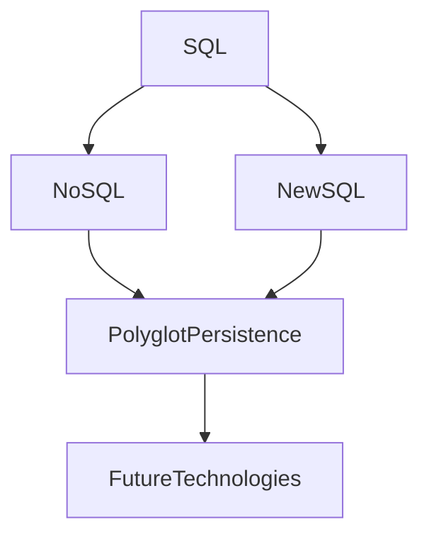

## 19.10 Preparing for the Future: Skills and Knowledge

As we stand on the cusp of a new era in database technology, the role of SQL and its design patterns continues to evolve. To remain at the forefront of this dynamic field, expert software engineers and architects must cultivate a diverse set of skills and knowledge. This section will guide you through the essential areas of development, emphasizing cross-platform and multi-paradigm database skills, adaptability to emerging technologies, and strategies for professional growth.

### Skill Development: Cross-Platform and Multi-Paradigm Database Skills

In today's interconnected world, the ability to work across different database platforms and paradigms is invaluable. Let's delve into the key areas where you can expand your expertise:

#### 1. Mastering SQL Variants

SQL has several dialects, each with unique features and capabilities. Understanding these differences is crucial for cross-platform proficiency.

- **ANSI SQL**: The standard SQL language that forms the basis for most SQL dialects. Mastering ANSI SQL ensures a strong foundation.
- **T-SQL (Microsoft SQL Server)**: Known for its procedural extensions, T-SQL is essential for those working with Microsoft SQL Server.
- **PL/SQL (Oracle)**: Oracle's procedural language extension to SQL, PL/SQL is vital for Oracle database environments.
- **PL/pgSQL (PostgreSQL)**: This procedural language is used in PostgreSQL, offering advanced features for complex operations.
- **MySQL SQL Dialect**: Understanding MySQL's specific syntax and functions is important for web-based applications.

#### 2. Embracing NoSQL and NewSQL

While SQL remains dominant, NoSQL and NewSQL databases are gaining traction. Understanding these paradigms will broaden your skill set.

- **NoSQL**: Learn about key-value stores, document databases, column-family stores, and graph databases. Each offers unique advantages for specific use cases.
- **NewSQL**: Combines the scalability of NoSQL with the ACID guarantees of traditional SQL databases. Familiarize yourself with databases like Google Spanner and CockroachDB.

#### 3. Understanding Polyglot Persistence

Polyglot persistence involves using multiple data storage technologies within a single application. This approach allows you to leverage the strengths of different databases.

- **Integration Strategies**: Learn how to integrate SQL with NoSQL databases, ensuring seamless data flow and consistency.
- **Data Modeling**: Develop skills in modeling data across different storage systems, optimizing for performance and scalability.

### Adaptability: Staying Current with Emerging Technologies and Methodologies

The technology landscape is ever-changing, and adaptability is key to staying relevant. Here are some strategies to enhance your adaptability:

#### 1. Continuous Learning

Commit to lifelong learning by staying informed about the latest trends and technologies.

- **Online Courses and Certifications**: Platforms like Coursera, edX, and Udacity offer courses on emerging database technologies.
- **Books and Publications**: Regularly read books and articles from reputable sources to deepen your understanding.

#### 2. Experimentation and Innovation

Encourage a mindset of experimentation and innovation.

- **Side Projects**: Work on personal projects that allow you to explore new technologies and methodologies.
- **Hackathons and Competitions**: Participate in events that challenge you to solve problems using cutting-edge tools.

#### 3. Networking and Community Engagement

Engage with professional communities to exchange knowledge and ideas.

- **Conferences and Meetups**: Attend industry events to learn from experts and network with peers.
- **Online Forums and Groups**: Join forums like Stack Overflow and LinkedIn groups to discuss challenges and solutions.

### Professional Growth: Engaging in Lifelong Learning and Participating in Professional Communities

Professional growth is a continuous journey that involves expanding your skills, knowledge, and network. Here are some ways to foster your growth:

#### 1. Setting Career Goals

Define clear career goals to guide your professional development.

- **Short-Term Goals**: Focus on immediate skills and certifications that align with your current role.
- **Long-Term Goals**: Plan for future roles and responsibilities, identifying the skills and experiences needed to achieve them.

#### 2. Mentorship and Coaching

Seek mentorship and coaching to gain insights and guidance from experienced professionals.

- **Finding a Mentor**: Look for mentors within your organization or industry who can provide valuable advice and support.
- **Becoming a Mentor**: Share your knowledge and experience with others, enhancing your leadership and communication skills.

#### 3. Building a Personal Brand

Develop a personal brand that highlights your expertise and achievements.

- **Online Presence**: Create a professional online presence through platforms like LinkedIn and GitHub.
- **Public Speaking and Writing**: Share your knowledge through public speaking engagements and writing articles or blog posts.

### Code Examples and Practice

To solidify your understanding, let's explore some code examples that demonstrate cross-platform SQL skills and adaptability.

#### Example 1: Cross-Platform SQL Query

Here's a simple SQL query that retrieves customer data, compatible with multiple SQL dialects:

```sql
-- Retrieve customer data
SELECT customer_id, first_name, last_name, email
FROM customers
WHERE active = 1
ORDER BY last_name, first_name;
```

**Try It Yourself**: Modify the query to include additional fields or filter criteria. Test it on different SQL platforms to observe any syntax differences.

#### Example 2: Integrating SQL with NoSQL

Consider a scenario where you need to integrate SQL with a NoSQL database. Here's a conceptual example using a document database:

```sql
-- SQL query to retrieve product data
SELECT product_id, name, price
FROM products
WHERE category = 'Electronics';

-- NoSQL query to retrieve related reviews
// MongoDB query example
db.reviews.find({ product_id: "12345" });
```

**Try It Yourself**: Experiment with integrating SQL and NoSQL queries in a sample application. Explore tools like Apache Kafka for data streaming between databases.

### Visualizing the Future of SQL

To better understand the future landscape of SQL and database technologies, let's visualize some key concepts using Mermaid.js diagrams.

#### Diagram: Evolution of Database Technologies



**Description**: This diagram illustrates the evolution of database technologies, highlighting the transition from SQL to NoSQL and NewSQL, and the emergence of polyglot persistence.

### References and Links

For further reading and exploration, consider the following resources:

- [Coursera: Database Courses](https://www.coursera.org/browse/computer-science/databases)
- [edX: SQL and Database Courses](https://www.edx.org/learn/sql)
- [Stack Overflow: Database Discussions](https://stackoverflow.com/questions/tagged/database)
- [LinkedIn Learning: Database Training](https://www.linkedin.com/learning/topics/databases)

### Knowledge Check

To reinforce your learning, let's pose some questions and challenges:

- **Question**: What are the key differences between SQL and NoSQL databases?
- **Challenge**: Create a simple application that uses both SQL and NoSQL databases for different data storage needs.

### Embrace the Journey

Remember, this is just the beginning. As you progress, you'll build more complex and innovative database solutions. Keep experimenting, stay curious, and enjoy the journey!

### Formatting and Structure

Organize your learning with clear goals and milestones. Use bullet points to break down complex information and highlight important terms or concepts.

### Writing Style

Use first-person plural (we, let's) to create a collaborative feel. Avoid gender-specific pronouns and define acronyms and abbreviations upon first use.

## Quiz Time!



### What is the primary benefit of mastering multiple SQL dialects?

- [x] Cross-platform proficiency
- [ ] Increased salary
- [ ] Reduced code complexity
- [ ] Faster query execution

> **Explanation:** Mastering multiple SQL dialects enhances cross-platform proficiency, allowing you to work with different database systems effectively.

### Which of the following is a key feature of NewSQL databases?

- [x] Scalability with ACID guarantees
- [ ] Only supports SQL queries
- [ ] Limited to key-value storage
- [ ] Incompatible with cloud environments

> **Explanation:** NewSQL databases combine the scalability of NoSQL with the ACID guarantees of traditional SQL databases.

### What is polyglot persistence?

- [x] Using multiple data storage technologies within a single application
- [ ] A programming language for databases
- [ ] A type of NoSQL database
- [ ] A SQL dialect

> **Explanation:** Polyglot persistence involves using multiple data storage technologies within a single application to leverage their strengths.

### How can you stay current with emerging database technologies?

- [x] Continuous learning and experimentation
- [ ] Avoiding new technologies
- [ ] Focusing only on SQL
- [ ] Ignoring industry trends

> **Explanation:** Staying current with emerging technologies requires continuous learning, experimentation, and staying informed about industry trends.

### What is a benefit of participating in professional communities?

- [x] Networking and knowledge exchange
- [ ] Guaranteed job offers
- [ ] Immediate skill mastery
- [ ] Avoiding competition

> **Explanation:** Engaging with professional communities allows for networking, knowledge exchange, and staying updated with industry developments.

### Which of the following is an example of a NoSQL database?

- [x] MongoDB
- [ ] Oracle
- [ ] MySQL
- [ ] PostgreSQL

> **Explanation:** MongoDB is a popular NoSQL database known for its document-oriented storage.

### What is the role of a mentor in professional growth?

- [x] Providing guidance and insights
- [ ] Completing tasks for you
- [ ] Guaranteeing promotions
- [ ] Limiting your responsibilities

> **Explanation:** A mentor provides guidance and insights, helping you navigate your career path and develop professionally.

### What is the purpose of setting career goals?

- [x] Guiding professional development
- [ ] Limiting career options
- [ ] Ensuring immediate success
- [ ] Avoiding challenges

> **Explanation:** Setting career goals helps guide your professional development, providing direction and focus for your growth.

### How can you build a personal brand?

- [x] Creating an online presence and sharing knowledge
- [ ] Avoiding public speaking
- [ ] Limiting online activity
- [ ] Focusing only on technical skills

> **Explanation:** Building a personal brand involves creating an online presence and sharing your knowledge through writing and speaking.

### True or False: Polyglot persistence is only applicable to SQL databases.

- [ ] True
- [x] False

> **Explanation:** Polyglot persistence involves using multiple data storage technologies, not limited to SQL databases, to leverage their strengths.


