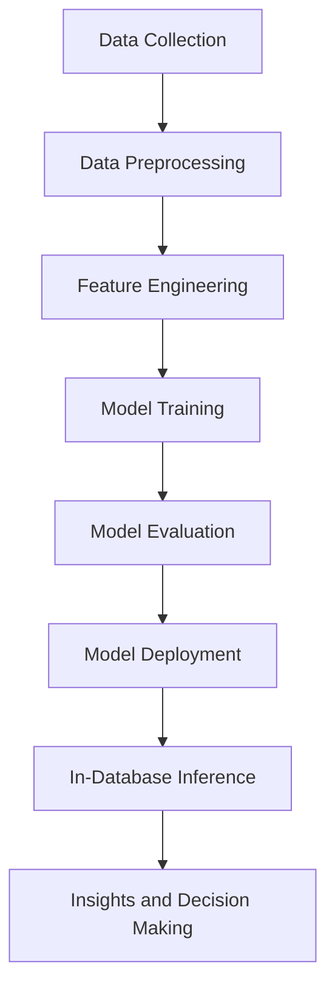

## 19.2 AI and Machine Learning Integration

As we delve into the future of SQL and emerging trends, the integration of Artificial Intelligence (AI) and Machine Learning (ML) with SQL databases stands out as a transformative development. This integration is reshaping how we approach data analytics, enabling more efficient and insightful data-driven decision-making processes. In this section, we will explore the concept of in-database analytics, its benefits, applications, and practical implementations, providing expert software engineers and architects with the knowledge needed to harness the power of AI and ML within SQL environments.

### Understanding In-Database Analytics

**In-Database Analytics** refers to the process of running machine learning algorithms directly within the database environment. This approach leverages the computational power of modern database systems to perform complex data analysis tasks without the need to move data to external processing platforms. By integrating AI and ML capabilities into SQL databases, organizations can achieve faster insights, reduced data movement, and improved data security.

#### Benefits of In-Database Analytics

1. **Reduced Data Movement**: By processing data within the database, the need to transfer large datasets to external systems is minimized, reducing latency and potential security risks.

2. **Leverage Existing Infrastructure**: Organizations can utilize their existing database infrastructure, avoiding the need for additional hardware or software investments.

3. **Improved Performance**: In-database analytics can take advantage of database optimizations, such as indexing and partitioning, to enhance the performance of ML algorithms.

4. **Enhanced Security**: Keeping data within the database environment reduces exposure to security vulnerabilities associated with data transfer.

5. **Scalability**: Modern databases are designed to handle large volumes of data, making them well-suited for scaling AI and ML workloads.

#### Applications of In-Database Analytics

In-database analytics can be applied across various domains, providing valuable insights and driving business outcomes. Some common applications include:

- **Fraud Detection**: By analyzing transaction patterns in real-time, in-database ML models can identify fraudulent activities swiftly and accurately.

- **Predictive Maintenance**: In industries such as manufacturing and utilities, in-database analytics can predict equipment failures, allowing for proactive maintenance and reducing downtime.

- **Customer Segmentation**: Retail and marketing sectors can leverage in-database ML to segment customers based on purchasing behavior, enabling targeted marketing strategies.

- **Recommendation Systems**: E-commerce platforms can use in-database analytics to provide personalized product recommendations, enhancing customer experience and increasing sales.

### Implementing AI and ML in SQL Databases

To effectively integrate AI and ML capabilities into SQL databases, several approaches and tools can be utilized. Let's explore some of the key methods and technologies that facilitate this integration.

#### SQL-Based Machine Learning Libraries

Many modern SQL databases offer built-in machine learning libraries that allow users to perform ML tasks using SQL queries. These libraries provide a range of algorithms for classification, regression, clustering, and more. Some popular SQL-based ML libraries include:

- **Apache MADlib**: An open-source library for PostgreSQL and Greenplum databases, offering a wide range of machine learning algorithms and data processing functions.

- **Microsoft SQL Server Machine Learning Services**: Provides integration with R and Python, allowing users to run ML models directly within SQL Server.

- **Oracle Machine Learning**: Offers a suite of machine learning algorithms that can be executed within Oracle Database, supporting SQL, R, and Python interfaces.

#### Using SQL for Data Preprocessing

Data preprocessing is a critical step in the machine learning pipeline, involving tasks such as data cleaning, normalization, and transformation. SQL's powerful querying capabilities make it an ideal tool for preprocessing large datasets. Here are some common data preprocessing tasks that can be performed using SQL:

- **Data Cleaning**: Use SQL queries to identify and remove duplicate records, handle missing values, and correct data inconsistencies.

- **Data Transformation**: Apply SQL functions to transform data, such as scaling numerical features or encoding categorical variables.

- **Feature Engineering**: Create new features from existing data using SQL expressions, such as calculating ratios or aggregating data over time windows.

#### Building and Deploying ML Models

Once the data is preprocessed, the next step is to build and deploy machine learning models. SQL databases can facilitate this process through various methods:

- **Stored Procedures**: Implement machine learning algorithms as stored procedures within the database, allowing for efficient execution and easy integration with existing SQL workflows.

- **User-Defined Functions (UDFs)**: Create custom UDFs to encapsulate ML logic, enabling reusable and modular code.

- **Integration with External ML Frameworks**: Use SQL to extract and preprocess data, then pass it to external ML frameworks (e.g., TensorFlow, PyTorch) for model training and evaluation. The trained models can be imported back into the database for inference.

### Code Example: Implementing a Simple ML Model in SQL

Let's walk through a practical example of implementing a simple linear regression model using SQL. We'll use a hypothetical dataset containing information about house prices, including features such as square footage, number of bedrooms, and location.

```sql
-- Step 1: Create a table to store the dataset
CREATE TABLE house_prices (
    id SERIAL PRIMARY KEY,
    square_footage INT,
    num_bedrooms INT,
    location VARCHAR(50),
    price DECIMAL(10, 2)
);

-- Step 2: Insert sample data into the table
INSERT INTO house_prices (square_footage, num_bedrooms, location, price)
VALUES
    (1500, 3, 'Suburban', 300000),
    (2000, 4, 'Urban', 450000),
    (1200, 2, 'Rural', 200000),
    (1800, 3, 'Urban', 400000);

-- Step 3: Implement a simple linear regression model using SQL
-- For simplicity, we'll calculate the average price per square footage
WITH price_per_sqft AS (
    SELECT
        square_footage,
        price / square_footage AS price_per_sqft
    FROM
        house_prices
)
SELECT
    AVG(price_per_sqft) AS avg_price_per_sqft
FROM
    price_per_sqft;
```

In this example, we calculate the average price per square footage using SQL queries. While this is a basic illustration, more complex models can be implemented using SQL-based ML libraries or by integrating with external ML frameworks.

### Visualizing the Integration of AI and ML with SQL

To better understand the integration of AI and ML with SQL databases, let's visualize the process using a flowchart.



**Figure 1: AI and ML Integration Workflow in SQL Databases**

This flowchart illustrates the typical workflow for integrating AI and ML with SQL databases, from data collection and preprocessing to model deployment and inference.

### Challenges and Considerations

While the integration of AI and ML with SQL databases offers numerous benefits, it also presents certain challenges and considerations:

- **Complexity**: Implementing ML models within SQL databases can be complex, requiring expertise in both SQL and machine learning.

- **Performance**: Running ML algorithms within the database may impact performance, especially for resource-intensive models.

- **Scalability**: While SQL databases can handle large datasets, scaling ML workloads may require additional resources or distributed computing solutions.

- **Model Management**: Managing and updating ML models within the database environment can be challenging, necessitating robust version control and monitoring practices.

### Try It Yourself

To gain hands-on experience with AI and ML integration in SQL, try modifying the code example provided earlier. Experiment with different features, such as adding new columns to the dataset or implementing more complex ML algorithms using SQL-based ML libraries.

### References and Further Reading

- [Apache MADlib Documentation](https://madlib.apache.org/)
- [Microsoft SQL Server Machine Learning Services](https://docs.microsoft.com/en-us/sql/machine-learning/)
- [Oracle Machine Learning](https://www.oracle.com/machine-learning/)

### Knowledge Check

To reinforce your understanding of AI and ML integration in SQL, consider the following questions and challenges:

- What are the key benefits of in-database analytics?
- How can SQL be used for data preprocessing in the ML pipeline?
- What are some common applications of in-database analytics?
- Try implementing a different ML algorithm using SQL-based ML libraries.

### Embrace the Journey

Remember, integrating AI and ML with SQL is just the beginning of your journey into the future of data analytics. As you progress, you'll discover new ways to leverage these technologies to drive innovation and deliver value to your organization. Keep experimenting, stay curious, and enjoy the journey!

## Quiz Time!



### What is the primary advantage of in-database analytics?

- [x] Reduced data movement
- [ ] Increased data redundancy
- [ ] Higher hardware costs
- [ ] Limited scalability

> **Explanation:** In-database analytics reduces the need to move data to external systems, minimizing latency and security risks.

### Which SQL-based ML library is open-source and works with PostgreSQL?

- [x] Apache MADlib
- [ ] Microsoft SQL Server Machine Learning Services
- [ ] Oracle Machine Learning
- [ ] TensorFlow

> **Explanation:** Apache MADlib is an open-source library that provides machine learning capabilities for PostgreSQL and Greenplum databases.

### What is a common application of in-database analytics in the retail sector?

- [ ] Predictive maintenance
- [x] Customer segmentation
- [ ] Fraud detection
- [ ] Equipment failure prediction

> **Explanation:** In the retail sector, in-database analytics is commonly used for customer segmentation based on purchasing behavior.

### Which SQL feature is ideal for data preprocessing in ML pipelines?

- [ ] Stored Procedures
- [ ] User-Defined Functions
- [x] SQL Queries
- [ ] Indexes

> **Explanation:** SQL queries are powerful tools for data preprocessing tasks such as cleaning, transformation, and feature engineering.

### What is a challenge of integrating AI and ML with SQL databases?

- [ ] Improved performance
- [x] Complexity
- [ ] Enhanced security
- [ ] Reduced data movement

> **Explanation:** Integrating AI and ML with SQL databases can be complex, requiring expertise in both SQL and machine learning.

### Which step in the ML workflow involves creating new features from existing data?

- [ ] Model Training
- [ ] Data Collection
- [x] Feature Engineering
- [ ] Model Evaluation

> **Explanation:** Feature engineering involves creating new features from existing data to improve model performance.

### What is the role of stored procedures in implementing ML models in SQL?

- [x] Efficient execution and integration
- [ ] Data redundancy
- [ ] Increased latency
- [ ] Limited scalability

> **Explanation:** Stored procedures allow for efficient execution and easy integration of ML models within SQL workflows.

### What is a potential drawback of running ML algorithms within the database?

- [ ] Improved security
- [ ] Reduced data movement
- [x] Impact on performance
- [ ] Enhanced scalability

> **Explanation:** Running ML algorithms within the database may impact performance, especially for resource-intensive models.

### Which of the following is NOT a benefit of in-database analytics?

- [ ] Reduced data movement
- [ ] Enhanced security
- [ ] Leverage existing infrastructure
- [x] Increased hardware costs

> **Explanation:** In-database analytics leverages existing infrastructure, reducing the need for additional hardware investments.

### True or False: In-database analytics can be used for real-time fraud detection.

- [x] True
- [ ] False

> **Explanation:** In-database analytics can analyze transaction patterns in real-time, making it suitable for fraud detection.


