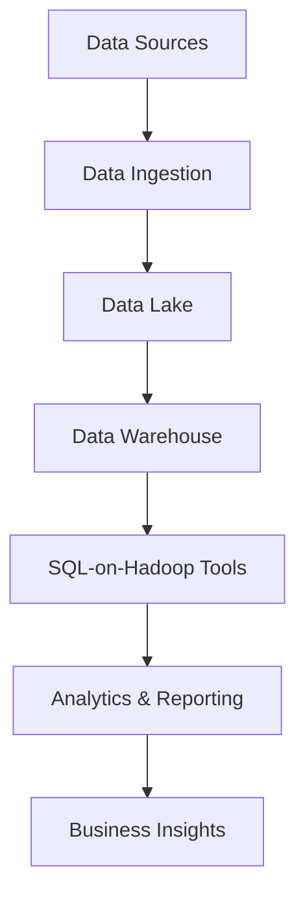

## 19.3 SQL in Big Data and Analytics

In the rapidly evolving landscape of data management, SQL continues to play a pivotal role, especially in the realm of big data and analytics. As organizations strive to harness the power of vast datasets, the integration of SQL with big data technologies has become increasingly essential. This section delves into the convergence of SQL with big data platforms, the blending of OLTP and OLAP systems for real-time analytics, and the emerging trends that highlight the growing demand for SQL proficiency in big data contexts.

### SQL-on-Hadoop: Bridging the Gap

The advent of big data technologies, particularly Hadoop, has revolutionized how data is stored and processed. However, the need for a familiar and powerful query language like SQL has led to the development of SQL-on-Hadoop tools. These tools enable users to execute SQL queries over data stored in Hadoop, thus bridging the gap between traditional relational databases and modern big data platforms.

#### Key SQL-on-Hadoop Tools

1. **Apache Hive**: Hive is a data warehouse infrastructure built on top of Hadoop. It provides a SQL-like interface called HiveQL for querying and managing large datasets residing in distributed storage.

   ```sql
   -- Example of a HiveQL query
   SELECT product_id, SUM(sales) AS total_sales
   FROM sales_data
   WHERE sales_date BETWEEN '2024-01-01' AND '2024-12-31'
   GROUP BY product_id
   ORDER BY total_sales DESC;
   ```

2. **Apache Impala**: Impala is an open-source SQL query engine for processing data stored in Hadoop. It offers low-latency and high-performance querying capabilities.

   ```sql
   -- Example of an Impala query
   SELECT customer_id, COUNT(*) AS purchase_count
   FROM transactions
   WHERE purchase_date > '2024-01-01'
   GROUP BY customer_id
   HAVING purchase_count > 10;
   ```

3. **Presto**: Originally developed by Facebook, Presto is a distributed SQL query engine designed for running interactive analytic queries against data sources of all sizes.

   ```sql
   -- Example of a Presto query
   SELECT region, AVG(revenue) AS avg_revenue
   FROM sales
   WHERE year = 2024
   GROUP BY region;
   ```

These tools exemplify how SQL-on-Hadoop solutions enable organizations to leverage their existing SQL skills while taking advantage of Hadoop's scalability and flexibility.

### Convergence of OLTP and OLAP Systems

Traditionally, Online Transaction Processing (OLTP) and Online Analytical Processing (OLAP) systems have been distinct, serving different purposes. OLTP systems are optimized for handling a large number of short online transactions, while OLAP systems are designed for complex queries and data analysis. However, the convergence of these systems is becoming increasingly important for real-time analytics.

#### Real-Time Analytics

Real-time analytics involves processing and analyzing data as it is generated, allowing organizations to make immediate decisions based on current information. The convergence of OLTP and OLAP systems facilitates real-time analytics by enabling:

- **Stream Processing**: Processing data streams in real-time to derive insights and trigger actions.
- **Hybrid Transactional/Analytical Processing (HTAP)**: Combining transactional and analytical workloads on a single platform to reduce latency and improve efficiency.

#### Example: Real-Time Fraud Detection

Consider a financial institution that needs to detect fraudulent transactions in real-time. By integrating OLTP and OLAP systems, the institution can:

- Capture transaction data as it occurs (OLTP).
- Analyze patterns and anomalies in real-time (OLAP).
- Trigger alerts or actions based on the analysis.

```sql
-- Example of a real-time fraud detection query
SELECT transaction_id, amount, location
FROM transactions
WHERE amount > 10000
AND location NOT IN (SELECT location FROM customer_locations WHERE customer_id = transactions.customer_id);
```

### Trends in SQL Proficiency for Big Data

As big data technologies continue to evolve, the demand for SQL proficiency in big data contexts is on the rise. Several trends highlight this growing demand:

1. **Data Democratization**: Organizations are empowering more employees to access and analyze data, increasing the need for SQL skills across various roles.

2. **Integration with Machine Learning**: SQL is being integrated with machine learning frameworks to enable data scientists and analysts to build and deploy models using familiar SQL syntax.

3. **Cloud-Based Solutions**: The proliferation of cloud-based data platforms, such as Google BigQuery and Amazon Redshift, emphasizes SQL's role in managing and analyzing large datasets.

4. **Data Lakes and Warehouses**: SQL is increasingly used to query data lakes and warehouses, providing a unified interface for accessing structured and unstructured data.

### Visualizing SQL's Role in Big Data

To better understand SQL's role in big data and analytics, let's visualize the architecture of a modern data platform that integrates SQL with big data technologies.



**Diagram Description**: This diagram illustrates a modern data platform architecture. Data from various sources is ingested into a data lake, processed and stored in a data warehouse, and queried using SQL-on-Hadoop tools to generate analytics and business insights.

### Code Examples and Exercises

Let's explore some practical code examples and exercises to reinforce the concepts discussed.

#### Exercise 1: Querying a Data Lake with SQL

Imagine you have a data lake containing customer transaction data. Write a SQL query to find the top 10 customers by total transaction amount in 2024.

```sql
-- SQL query to find top 10 customers by transaction amount
SELECT customer_id, SUM(amount) AS total_amount
FROM transactions
WHERE transaction_date BETWEEN '2024-01-01' AND '2024-12-31'
GROUP BY customer_id
ORDER BY total_amount DESC
LIMIT 10;
```

**Try It Yourself**: Modify the query to filter transactions by a specific region or product category.

#### Exercise 2: Real-Time Data Processing

Using a SQL-on-Hadoop tool, write a query to monitor real-time sales data and alert if sales in any region exceed $1 million in a single day.

```sql
-- SQL query to monitor real-time sales data
SELECT region, SUM(sales) AS daily_sales
FROM sales_data
WHERE sales_date = CURRENT_DATE
GROUP BY region
HAVING daily_sales > 1000000;
```

**Try It Yourself**: Adjust the threshold or add additional conditions to refine the alert criteria.

### Emerging Trends and Future Directions

As we look to the future, several emerging trends and directions will shape the role of SQL in big data and analytics:

- **AI and Machine Learning Integration**: SQL will continue to integrate with AI and machine learning frameworks, enabling more advanced analytics and predictive modeling.

- **Serverless Architectures**: The rise of serverless architectures will further simplify the deployment and scaling of SQL-based analytics solutions.

- **Edge Computing**: SQL will play a role in edge computing environments, where data is processed closer to the source for faster insights.

- **Quantum Computing**: While still in its infancy, quantum computing may eventually influence SQL's role in processing and analyzing massive datasets.

### Conclusion

SQL remains a cornerstone of data management and analytics, even in the era of big data. By integrating with modern big data technologies and embracing emerging trends, SQL continues to empower organizations to derive valuable insights from their data. As we move forward, the demand for SQL proficiency in big data contexts will only grow, making it an essential skill for data professionals.

Remember, this is just the beginning. As you progress, you'll build more complex and interactive data solutions. Keep experimenting, stay curious, and enjoy the journey!

## Quiz Time!



### What is SQL-on-Hadoop?

- [x] A set of tools that allow SQL queries over Hadoop data stores.
- [ ] A new SQL dialect specifically for big data.
- [ ] A programming language for Hadoop.
- [ ] A database management system for Hadoop.

> **Explanation:** SQL-on-Hadoop refers to tools that enable SQL queries over data stored in Hadoop, bridging the gap between traditional SQL and big data platforms.

### Which tool is NOT an SQL-on-Hadoop solution?

- [ ] Apache Hive
- [ ] Apache Impala
- [x] MongoDB
- [ ] Presto

> **Explanation:** MongoDB is a NoSQL database, not an SQL-on-Hadoop solution.

### What does HTAP stand for?

- [x] Hybrid Transactional/Analytical Processing
- [ ] High Throughput Analytical Processing
- [ ] Hadoop Transactional Analytical Processing
- [ ] Hybrid Transactional Application Processing

> **Explanation:** HTAP stands for Hybrid Transactional/Analytical Processing, which combines transactional and analytical workloads on a single platform.

### What is the main benefit of real-time analytics?

- [x] Immediate decision-making based on current information.
- [ ] Reduced data storage costs.
- [ ] Simplified data modeling.
- [ ] Increased data redundancy.

> **Explanation:** Real-time analytics allows organizations to make immediate decisions based on current information, enhancing responsiveness and agility.

### Which of the following is a trend in SQL proficiency for big data?

- [x] Data democratization
- [ ] Decreased demand for SQL skills
- [ ] Elimination of SQL in big data contexts
- [ ] Reduced integration with machine learning

> **Explanation:** Data democratization is a trend that increases the need for SQL skills across various roles, as more employees are empowered to access and analyze data.

### What is the role of SQL in data lakes?

- [x] Providing a unified interface for accessing structured and unstructured data.
- [ ] Replacing all other query languages.
- [ ] Eliminating the need for data warehouses.
- [ ] Storing only structured data.

> **Explanation:** SQL provides a unified interface for accessing both structured and unstructured data in data lakes, facilitating data analysis and management.

### Which architecture is rising in popularity for SQL-based analytics solutions?

- [x] Serverless architectures
- [ ] Monolithic architectures
- [ ] Client-server architectures
- [ ] Peer-to-peer architectures

> **Explanation:** Serverless architectures are rising in popularity for SQL-based analytics solutions due to their simplicity in deployment and scaling.

### What is the significance of SQL in edge computing?

- [x] Processing data closer to the source for faster insights.
- [ ] Replacing traditional computing methods.
- [ ] Eliminating the need for cloud computing.
- [ ] Storing data at the edge.

> **Explanation:** SQL plays a role in edge computing by processing data closer to the source, enabling faster insights and decision-making.

### Which of the following is NOT a future direction for SQL in big data?

- [ ] AI and Machine Learning Integration
- [ ] Serverless Architectures
- [ ] Edge Computing
- [x] Decreased use in analytics

> **Explanation:** SQL's use in analytics is not decreasing; rather, it is integrating with new technologies like AI, serverless architectures, and edge computing.

### True or False: SQL is becoming less relevant in big data contexts.

- [ ] True
- [x] False

> **Explanation:** False. SQL remains highly relevant in big data contexts, with increasing integration into modern big data technologies and analytics solutions.


