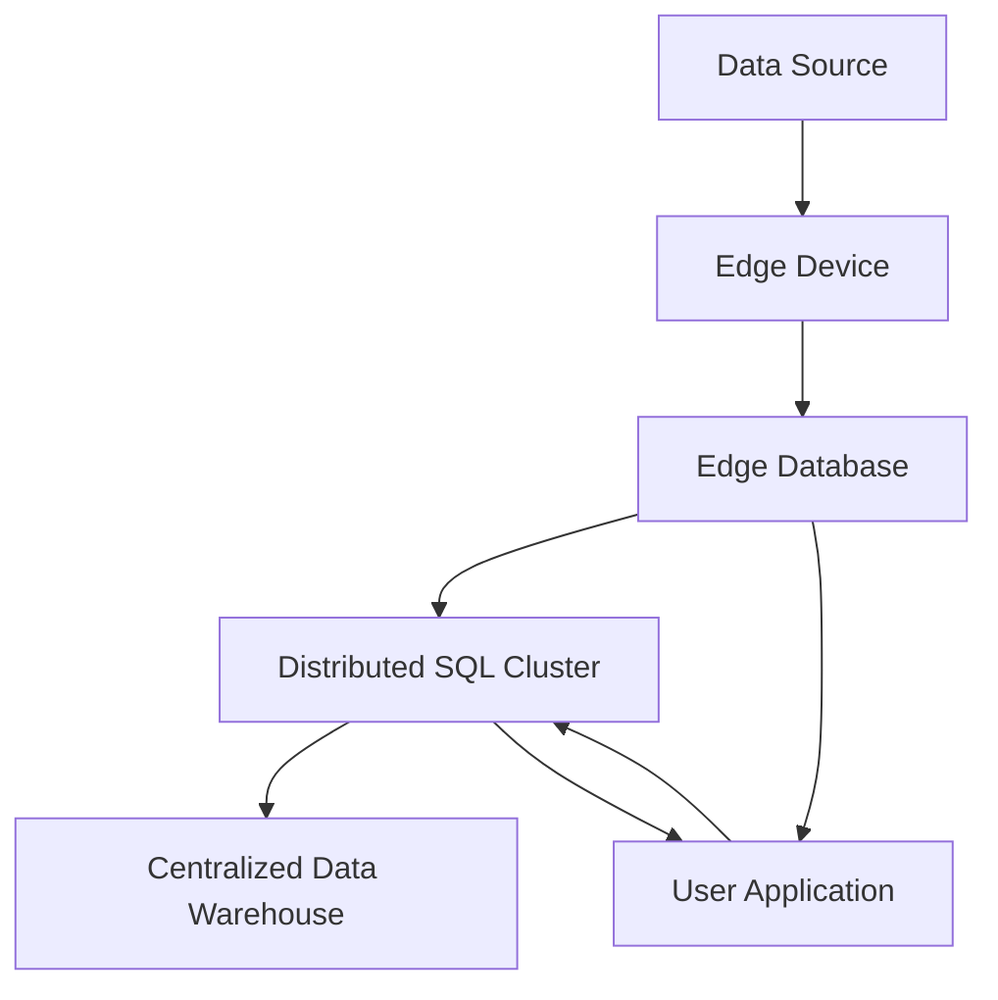

## 19.4 Edge Computing and Distributed SQL

In the rapidly evolving landscape of data processing, edge computing and distributed SQL databases are emerging as pivotal technologies. They are transforming how data is processed, stored, and accessed, offering significant advantages in terms of latency, availability, and resilience. In this section, we will delve into the concepts of edge computing and distributed SQL, explore their benefits, and provide practical insights into their implementation.

### Understanding Edge Computing

**Edge Computing** refers to the practice of processing data near the source of data generation, rather than relying on a centralized data-processing warehouse. This approach reduces latency, minimizes bandwidth usage, and enhances the responsiveness of applications.

#### Key Concepts of Edge Computing

- **Proximity to Data Source**: By processing data closer to where it is generated, edge computing reduces the time it takes for data to travel to a centralized server and back, thus lowering latency.
- **Decentralization**: Edge computing distributes data processing across multiple nodes, reducing the load on central servers and enhancing system resilience.
- **Real-Time Processing**: With edge computing, data can be processed in real-time, enabling faster decision-making and improved user experiences.

### Edge Databases

**Edge Databases** are databases deployed at the edge of the network to process and store data locally. They are designed to handle the unique challenges of edge environments, such as intermittent connectivity and limited resources.

#### Benefits of Edge Databases

- **Low Latency**: By processing data locally, edge databases significantly reduce the time it takes to access and manipulate data.
- **High Availability**: Edge databases can continue to operate even when disconnected from the central server, ensuring continuous availability.
- **Resilience**: Edge databases are resilient to network partitioning, allowing them to function independently during network outages.

### Distributed SQL Databases

**Distributed SQL Databases** are designed to provide the scalability and resilience of NoSQL databases while maintaining the ACID properties of traditional SQL databases. They distribute data across multiple nodes, enabling horizontal scaling and geo-distribution.

#### Key Features of Distributed SQL Databases

- **Scalability**: Distributed SQL databases can scale horizontally by adding more nodes to the cluster, accommodating growing data volumes and user loads.
- **Geo-Distribution**: These databases can distribute data across multiple geographic locations, reducing latency for global users and ensuring data locality.
- **Consistency and Availability**: Distributed SQL databases maintain strong consistency and high availability, even in the face of network partitions.

#### Examples of Distributed SQL Databases

- **CockroachDB**: A distributed SQL database designed for cloud-native applications, offering strong consistency, horizontal scalability, and geo-distribution.
- **YugabyteDB**: An open-source distributed SQL database that provides high performance, resilience, and compatibility with PostgreSQL.

### Benefits of Edge Computing and Distributed SQL

Combining edge computing with distributed SQL databases offers several compelling benefits:

- **Reduced Latency**: By processing data at the edge and distributing it across multiple nodes, applications can achieve near-instantaneous response times.
- **Improved Resilience**: The decentralized nature of edge computing and distributed SQL enhances system resilience, allowing applications to continue functioning during network disruptions.
- **Enhanced Scalability**: Distributed SQL databases can scale horizontally, accommodating increased data volumes and user demands without compromising performance.
- **Data Locality**: By distributing data across geographic locations, distributed SQL databases ensure that data is stored close to users, reducing access times and improving user experiences.

### Implementing Edge Computing and Distributed SQL

To effectively implement edge computing and distributed SQL, consider the following steps:

1. **Assess Your Needs**: Determine the specific requirements of your application, such as latency, availability, and scalability, to decide whether edge computing and distributed SQL are suitable.
2. **Choose the Right Tools**: Select appropriate edge computing platforms and distributed SQL databases that align with your needs. Consider factors such as compatibility, ease of integration, and support for your existing infrastructure.
3. **Design for Resilience**: Implement strategies to ensure resilience, such as data replication, fault tolerance, and automated failover mechanisms.
4. **Optimize Data Distribution**: Use geo-distribution features of distributed SQL databases to store data close to users, reducing latency and improving performance.
5. **Monitor and Manage**: Continuously monitor the performance and health of your edge computing and distributed SQL infrastructure to identify and address potential issues.

### Code Example: Implementing a Distributed SQL Database with CockroachDB

Let's explore a simple example of setting up a distributed SQL database using CockroachDB. This example demonstrates how to create a multi-node CockroachDB cluster and perform basic operations.

```bash
cockroach start --insecure --store=node1 --listen-addr=localhost:26257 --http-addr=localhost:8080 --join=localhost:26257

cockroach start --insecure --store=node2 --listen-addr=localhost:26258 --http-addr=localhost:8081 --join=localhost:26257
cockroach start --insecure --store=node3 --listen-addr=localhost:26259 --http-addr=localhost:8082 --join=localhost:26257

cockroach init --insecure --host=localhost:26257

cockroach sql --insecure --host=localhost:26257

CREATE DATABASE edge_db;
USE edge_db;
CREATE TABLE users (id INT PRIMARY KEY, name STRING, email STRING);

INSERT INTO users (id, name, email) VALUES (1, 'Alice', 'alice@example.com');
INSERT INTO users (id, name, email) VALUES (2, 'Bob', 'bob@example.com');

SELECT * FROM users;
```

### Visualizing Edge Computing and Distributed SQL

To better understand the architecture of edge computing and distributed SQL, let's visualize the data flow and interactions between components.



**Diagram Description**: This diagram illustrates the flow of data from the source to the edge device, where it is processed by the edge database. The processed data is then synchronized with a distributed SQL cluster, which interacts with both a centralized data warehouse and user applications.

### Try It Yourself

Experiment with the CockroachDB setup by modifying the code example. Try adding more nodes to the cluster, creating additional tables, and performing complex queries. Observe how the distributed nature of CockroachDB affects performance and availability.

### Knowledge Check

- Explain the benefits of edge computing in terms of latency and availability.
- Describe how distributed SQL databases maintain consistency and availability.
- Discuss the role of geo-distribution in reducing latency for global users.

### Embrace the Journey

Remember, this is just the beginning. As you explore edge computing and distributed SQL, you'll discover new ways to optimize data processing and enhance application performance. Keep experimenting, stay curious, and enjoy the journey!

### References and Links

- [CockroachDB Documentation](https://www.cockroachlabs.com/docs/)
- [YugabyteDB Documentation](https://docs.yugabyte.com/)
- [Edge Computing Overview](https://www.ibm.com/cloud/learn/edge-computing)

## Quiz Time!



### What is the primary advantage of edge computing?

- [x] Reduced latency
- [ ] Increased bandwidth
- [ ] Centralized data processing
- [ ] Higher storage capacity

> **Explanation:** Edge computing reduces latency by processing data closer to the source.

### Which of the following is a feature of distributed SQL databases?

- [x] Geo-distribution
- [ ] Single-node architecture
- [ ] Weak consistency
- [ ] Manual scaling

> **Explanation:** Distributed SQL databases support geo-distribution, allowing data to be stored across multiple locations.

### What is the role of edge databases?

- [x] Process data locally at the edge
- [ ] Centralize data storage
- [ ] Increase network traffic
- [ ] Reduce data redundancy

> **Explanation:** Edge databases process data locally, reducing latency and enhancing availability.

### How do distributed SQL databases ensure high availability?

- [x] Data replication across nodes
- [ ] Single point of failure
- [ ] Manual failover
- [ ] Limited scalability

> **Explanation:** Distributed SQL databases replicate data across nodes to ensure high availability.

### What is a benefit of geo-distribution in distributed SQL databases?

- [x] Reduced latency for global users
- [ ] Increased data redundancy
- [ ] Centralized data processing
- [ ] Higher storage costs

> **Explanation:** Geo-distribution reduces latency by storing data closer to users.

### Which database is an example of a distributed SQL database?

- [x] CockroachDB
- [ ] MySQL
- [ ] SQLite
- [ ] MongoDB

> **Explanation:** CockroachDB is a distributed SQL database designed for scalability and resilience.

### What is a key characteristic of edge computing?

- [x] Proximity to data source
- [ ] Centralized processing
- [ ] High bandwidth usage
- [ ] Increased latency

> **Explanation:** Edge computing processes data near the source, reducing latency.

### How does edge computing enhance resilience?

- [x] Decentralization of data processing
- [ ] Centralized data storage
- [ ] Increased network dependency
- [ ] Higher storage capacity

> **Explanation:** Edge computing decentralizes data processing, enhancing resilience to network disruptions.

### What is the purpose of data replication in distributed SQL databases?

- [x] Ensure data availability and consistency
- [ ] Increase storage costs
- [ ] Centralize data processing
- [ ] Reduce data redundancy

> **Explanation:** Data replication ensures availability and consistency across distributed nodes.

### True or False: Edge computing increases latency by processing data centrally.

- [ ] True
- [x] False

> **Explanation:** Edge computing reduces latency by processing data near the source, not centrally.


