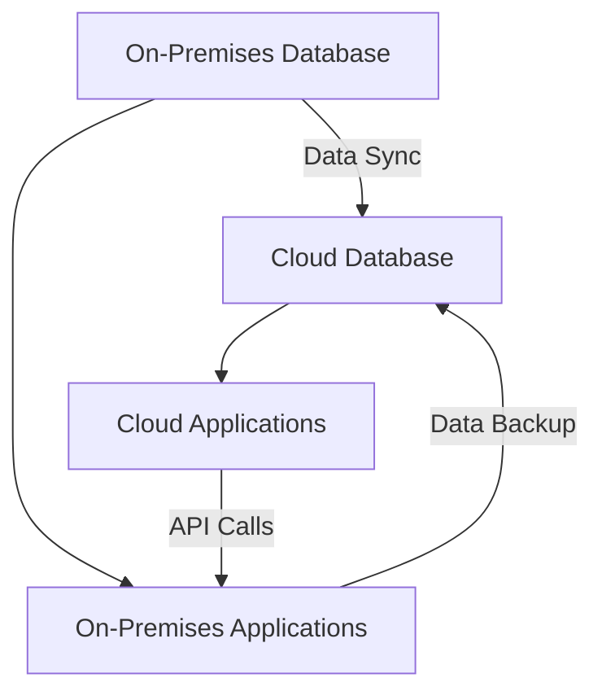
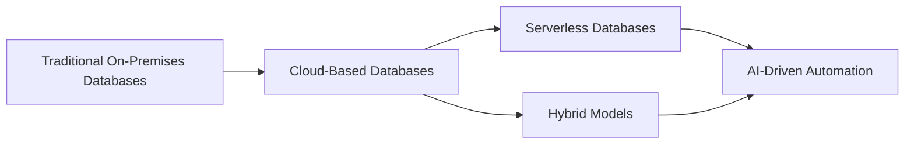

## 19.5 Evolution of Cloud-Based Databases

The landscape of database management has undergone a significant transformation with the advent of cloud computing. Cloud-based databases have emerged as a cornerstone of modern data architecture, offering unparalleled scalability, flexibility, and efficiency. In this section, we will explore the evolution of cloud-based databases, focusing on serverless architectures, hybrid models, and AI-driven automation. These advancements are reshaping SQL database management, enabling organizations to harness the full potential of their data in innovative ways.

### Introduction to Cloud-Based Databases

Cloud-based databases are databases that run on cloud computing platforms, providing a range of services such as storage, processing, and management over the internet. They offer several advantages over traditional on-premises databases, including:

- **Scalability**: Easily scale up or down based on demand without the need for physical hardware changes.
- **Cost Efficiency**: Pay-as-you-go pricing models reduce upfront costs and optimize resource utilization.
- **Accessibility**: Access data from anywhere with an internet connection, facilitating remote work and collaboration.
- **Maintenance**: Offload maintenance tasks such as backups, updates, and security to cloud providers.

### Serverless Databases

Serverless databases represent a paradigm shift in database management, where the infrastructure is fully managed by the cloud provider, and resources are automatically scaled based on demand. This model allows developers to focus on application logic without worrying about server management.

#### Key Features of Serverless Databases

1. **Automatic Scaling**: Resources are dynamically allocated based on workload, ensuring optimal performance without manual intervention.
2. **Cost Efficiency**: Billing is based on actual usage, eliminating the need to pay for idle resources.
3. **Simplified Management**: No need to provision, configure, or manage servers, reducing operational complexity.
4. **High Availability**: Built-in redundancy and failover mechanisms ensure data availability and reliability.

#### Example: AWS Aurora Serverless

AWS Aurora Serverless is a prime example of a serverless database offering. It automatically adjusts capacity based on application needs, providing a seamless experience for developers. Here's a simple example of how to connect to an Aurora Serverless database using Python:

```python
import pymysql

connection = pymysql.connect(
    host='your-database-endpoint',
    user='your-username',
    password='your-password',
    database='your-database-name'
)

try:
    with connection.cursor() as cursor:
        # Execute a simple SQL query
        sql = "SELECT * FROM your_table"
        cursor.execute(sql)
        result = cursor.fetchall()
        for row in result:
            print(row)
finally:
    connection.close()
```

### Hybrid Models

Hybrid cloud models combine on-premises infrastructure with cloud services, offering a flexible approach to database management. This model allows organizations to leverage the benefits of both environments, optimizing performance, security, and cost.

#### Benefits of Hybrid Models

1. **Flexibility**: Choose the optimal environment for each workload, balancing performance and cost.
2. **Data Sovereignty**: Keep sensitive data on-premises while leveraging cloud resources for less sensitive workloads.
3. **Disaster Recovery**: Use cloud services for backup and recovery, ensuring business continuity.
4. **Seamless Integration**: Connect on-premises systems with cloud applications, enabling smooth data flow.

#### Example: Azure Hybrid Cloud

Azure provides a comprehensive suite of tools for building hybrid cloud solutions. Azure Arc, for instance, allows organizations to manage on-premises and cloud resources through a unified interface. Here's a diagram illustrating a typical hybrid cloud architecture:



### Automation: AI-Driven Performance Tuning and Predictive Scaling

Automation in cloud-based databases is increasingly driven by artificial intelligence (AI), which enhances performance tuning and predictive scaling. AI algorithms analyze database workloads and automatically adjust configurations to optimize performance and resource utilization.

#### AI-Driven Performance Tuning

AI-driven performance tuning involves using machine learning algorithms to analyze query patterns, index usage, and resource consumption. This analysis helps identify bottlenecks and recommend optimizations.

- **Query Optimization**: AI can suggest query rewrites or index creation to improve performance.
- **Resource Allocation**: Automatically adjust CPU, memory, and storage based on workload patterns.

#### Predictive Scaling

Predictive scaling uses AI to forecast future resource needs based on historical data and trends. This proactive approach ensures that databases are always prepared to handle peak loads without manual intervention.

- **Load Forecasting**: Analyze past usage patterns to predict future demand.
- **Automated Scaling**: Adjust resources in advance to meet anticipated workload spikes.

### Try It Yourself

Experiment with serverless databases by setting up a simple AWS Aurora Serverless instance. Modify the Python code example to connect to your instance and execute different SQL queries. Observe how the database scales based on your workload.

### Visualizing Cloud-Based Database Evolution

To better understand the evolution of cloud-based databases, let's visualize the transition from traditional on-premises databases to modern cloud-based solutions:



### References and Links

- [AWS Aurora Serverless Documentation](https://docs.aws.amazon.com/AmazonRDS/latest/AuroraUserGuide/aurora-serverless.html)
- [Azure Hybrid Cloud Solutions](https://azure.microsoft.com/en-us/solutions/hybrid-cloud-app/)
- [Google Cloud SQL](https://cloud.google.com/sql)

### Knowledge Check

- Explain the benefits of serverless databases.
- Describe how hybrid models integrate on-premises and cloud resources.
- Discuss the role of AI in automating database performance tuning.

### Embrace the Journey

As we continue to explore the evolution of cloud-based databases, remember that this is just the beginning. The integration of AI and cloud technologies will continue to drive innovation, offering new opportunities to optimize and enhance database management. Keep experimenting, stay curious, and enjoy the journey!

### Summary

In this section, we've explored the evolution of cloud-based databases, focusing on serverless architectures, hybrid models, and AI-driven automation. These advancements are transforming SQL database management, enabling organizations to achieve greater scalability, efficiency, and innovation.

## Quiz Time!



### What is a key feature of serverless databases?

- [x] Automatic scaling
- [ ] Manual server management
- [ ] Fixed resource allocation
- [ ] High upfront costs

> **Explanation:** Serverless databases automatically scale resources based on demand, eliminating the need for manual server management.

### How do hybrid models benefit organizations?

- [x] Flexibility in choosing environments
- [ ] Only use cloud resources
- [ ] Require complete data migration
- [ ] Limited to on-premises systems

> **Explanation:** Hybrid models allow organizations to choose the optimal environment for each workload, balancing performance and cost.

### What role does AI play in cloud-based databases?

- [x] Performance tuning and predictive scaling
- [ ] Manual query optimization
- [ ] Fixed resource allocation
- [ ] Only for security purposes

> **Explanation:** AI enhances performance tuning and predictive scaling by analyzing workloads and adjusting configurations automatically.

### What is predictive scaling?

- [x] Forecasting future resource needs
- [ ] Manual resource allocation
- [ ] Fixed scaling based on current load
- [ ] Only for serverless databases

> **Explanation:** Predictive scaling uses AI to forecast future resource needs based on historical data and trends.

### Which cloud provider offers Aurora Serverless?

- [x] AWS
- [ ] Azure
- [ ] Google Cloud
- [ ] IBM Cloud

> **Explanation:** AWS offers Aurora Serverless, a serverless database solution that automatically scales based on demand.

### What is a benefit of serverless databases?

- [x] Cost efficiency
- [ ] High upfront costs
- [ ] Manual server management
- [ ] Fixed resource allocation

> **Explanation:** Serverless databases offer cost efficiency by billing based on actual usage, eliminating the need to pay for idle resources.

### How do hybrid models handle data sovereignty?

- [x] Keep sensitive data on-premises
- [ ] Migrate all data to the cloud
- [ ] Only use cloud resources
- [ ] Require complete data migration

> **Explanation:** Hybrid models allow organizations to keep sensitive data on-premises while leveraging cloud resources for less sensitive workloads.

### What is AI-driven performance tuning?

- [x] Using AI to analyze and optimize database performance
- [ ] Manual query optimization
- [ ] Fixed resource allocation
- [ ] Only for security purposes

> **Explanation:** AI-driven performance tuning involves using machine learning algorithms to analyze query patterns and recommend optimizations.

### What is a characteristic of cloud-based databases?

- [x] Accessibility from anywhere
- [ ] Limited to on-premises access
- [ ] High upfront costs
- [ ] Fixed resource allocation

> **Explanation:** Cloud-based databases offer accessibility from anywhere with an internet connection, facilitating remote work and collaboration.

### True or False: Serverless databases require manual server management.

- [ ] True
- [x] False

> **Explanation:** Serverless databases are fully managed by the cloud provider, eliminating the need for manual server management.


