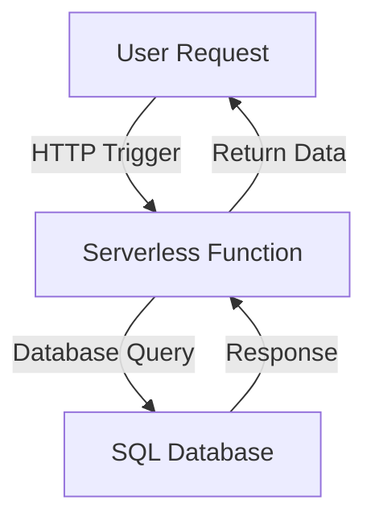

## 19.6 Serverless Architecture Implications

Serverless architecture is revolutionizing the way we think about application development and deployment. By abstracting away the underlying infrastructure, serverless computing allows developers to focus on writing code without worrying about server management. This paradigm shift has significant implications for SQL design patterns, particularly in how databases are accessed and managed in a serverless environment.

### Understanding Serverless Architecture

Before diving into the implications for SQL, let's clarify what serverless architecture entails. Serverless computing is a cloud-computing execution model where the cloud provider dynamically manages the allocation of machine resources. Pricing is based on the actual amount of resources consumed by an application, rather than pre-purchased units of capacity.

#### Key Characteristics of Serverless Architecture

- **Event-Driven Execution**: Functions are triggered by events, such as HTTP requests, database changes, or message queue updates.
- **Statelessness**: Each function execution is independent, with no persistent state between invocations.
- **Automatic Scaling**: Functions scale automatically in response to the number of incoming requests.
- **Pay-as-You-Go Pricing**: Costs are incurred only when functions are executed, leading to potential cost savings.

### Benefits of Serverless Architecture

1. **Reduced Operational Overhead**: Developers are relieved from server management tasks, such as provisioning, scaling, and maintaining servers.
2. **Cost-Effective Scaling**: Serverless platforms automatically scale resources up or down based on demand, optimizing cost efficiency.
3. **Faster Time-to-Market**: With infrastructure concerns abstracted away, developers can focus on rapid application development and deployment.

### Challenges of Serverless Architecture

1. **Cold Starts**: Initial function invocations can experience latency due to the time taken to initialize the execution environment.
2. **Limited Control**: Developers have less control over the execution environment, which can impact performance tuning and debugging.
3. **Complexity in State Management**: Statelessness requires external solutions for maintaining state across function invocations.

### Implications for SQL Design Patterns

Serverless architecture necessitates a rethinking of traditional SQL design patterns. The stateless, event-driven nature of serverless computing impacts how databases are accessed and managed. Let's explore these implications in detail.

#### Adapting Database Interactions

In a serverless environment, database interactions must be adapted to align with the stateless and event-driven nature of serverless functions. This involves designing efficient, scalable, and resilient database access patterns.

##### Stateless Database Connections

Serverless functions are inherently stateless, meaning they do not maintain persistent connections to databases. Instead, connections are established and terminated with each function invocation. This can lead to increased latency and resource consumption if not managed properly.

**Code Example: Establishing a Database Connection in a Serverless Function**

```sql
-- Example of a serverless function connecting to a SQL database
CREATE FUNCTION fetch_user_data(user_id INT)
RETURNS TABLE
AS
BEGIN
    DECLARE @connection NVARCHAR(255);
    DECLARE @query NVARCHAR(255);
    
    -- Establish a connection to the database
    SET @connection = 'Server=myServerAddress;Database=myDataBase;User Id=myUsername;Password=myPassword;';
    
    -- Define the query to fetch user data
    SET @query = 'SELECT * FROM Users WHERE UserId = ' + CAST(user_id AS NVARCHAR(10));
    
    -- Execute the query and return the result
    RETURN EXEC(@query);
END;
```

**Design Consideration**: Use connection pooling to minimize the overhead of establishing new connections for each function invocation.

##### Event-Driven Database Triggers

Serverless functions can be triggered by database events, such as inserts, updates, or deletes. This enables real-time processing and integration with other services.

**Code Example: Triggering a Serverless Function on Database Insert**

```sql
-- Example of a trigger that invokes a serverless function on data insertion
CREATE TRIGGER new_order_trigger
AFTER INSERT ON Orders
FOR EACH ROW
BEGIN
    -- Call the serverless function to process the new order
    CALL process_new_order(NEW.order_id);
END;
```

**Design Consideration**: Ensure that triggers are idempotent to handle potential retries and avoid duplicate processing.

##### Handling Transactions in a Stateless Environment

Managing transactions in a stateless environment can be challenging. Serverless functions must be designed to handle transactions efficiently, ensuring data consistency and integrity.

**Code Example: Implementing a Transaction in a Serverless Function**

```sql
-- Example of a serverless function handling a transaction
CREATE FUNCTION process_payment(order_id INT, amount DECIMAL)
RETURNS BOOLEAN
AS
BEGIN
    DECLARE @success BIT;
    
    -- Begin transaction
    BEGIN TRANSACTION;
    
    -- Update order status
    UPDATE Orders SET Status = 'Processing' WHERE OrderId = order_id;
    
    -- Deduct amount from user's account
    UPDATE Accounts SET Balance = Balance - amount WHERE UserId = (SELECT UserId FROM Orders WHERE OrderId = order_id);
    
    -- Commit transaction
    COMMIT TRANSACTION;
    
    -- Return success
    SET @success = 1;
    RETURN @success;
    
    -- Error handling
    BEGIN CATCH
        -- Rollback transaction in case of error
        ROLLBACK TRANSACTION;
        SET @success = 0;
        RETURN @success;
    END CATCH;
END;
```

**Design Consideration**: Use distributed transaction management techniques to ensure consistency across multiple services.

### Visualizing Serverless Architecture with SQL

To better understand the flow of data and interactions in a serverless architecture, let's visualize a typical serverless application using Mermaid.js.



**Diagram Description**: This flowchart illustrates a serverless function triggered by an HTTP request, querying a SQL database, and returning the response to the user.

### Best Practices for SQL in Serverless Architectures

1. **Optimize Connection Management**: Use connection pooling and caching to reduce latency and resource consumption.
2. **Design for Idempotency**: Ensure functions can handle retries without causing duplicate processing.
3. **Leverage Event-Driven Patterns**: Utilize database triggers and event streams to enable real-time processing.
4. **Implement Robust Error Handling**: Design functions to gracefully handle errors and rollback transactions if necessary.
5. **Monitor and Optimize Performance**: Use monitoring tools to track function performance and optimize queries for efficiency.

### References and Further Reading

- [AWS Lambda and Serverless Computing](https://aws.amazon.com/lambda/)
- [Azure Functions Documentation](https://docs.microsoft.com/en-us/azure/azure-functions/)
- [Google Cloud Functions Overview](https://cloud.google.com/functions/docs)
- [Serverless Framework Documentation](https://www.serverless.com/framework/docs/)

### Knowledge Check

- Explain the key characteristics of serverless architecture.
- Describe how serverless architecture impacts SQL design patterns.
- Demonstrate how to establish a database connection in a serverless function.
- Provide an example of an event-driven database trigger in a serverless environment.
- Discuss the challenges of handling transactions in a stateless environment.

### Embrace the Journey

As we explore the implications of serverless architecture on SQL design patterns, remember that this is just the beginning. The serverless paradigm offers exciting opportunities for innovation and efficiency in database management. Keep experimenting, stay curious, and enjoy the journey!

## Quiz Time!



### What is a key characteristic of serverless architecture?

- [x] Event-driven execution
- [ ] Persistent state management
- [ ] Manual scaling
- [ ] Fixed pricing

> **Explanation:** Serverless architecture is characterized by event-driven execution, where functions are triggered by events such as HTTP requests or database changes.

### What is a benefit of serverless architecture?

- [x] Reduced operational overhead
- [ ] Increased server management tasks
- [ ] Fixed resource allocation
- [ ] Higher costs

> **Explanation:** Serverless architecture reduces operational overhead by abstracting away server management tasks, allowing developers to focus on writing code.

### What is a challenge of serverless architecture?

- [x] Cold starts
- [ ] Persistent state management
- [ ] Manual scaling
- [ ] Fixed pricing

> **Explanation:** Cold starts are a challenge in serverless architecture, as initial function invocations can experience latency due to the time taken to initialize the execution environment.

### How can database interactions be adapted in a serverless environment?

- [x] By designing stateless database connections
- [ ] By maintaining persistent connections
- [ ] By using manual scaling
- [ ] By implementing fixed pricing

> **Explanation:** In a serverless environment, database interactions must be adapted to align with the stateless nature of serverless functions, often involving stateless database connections.

### What is an example of an event-driven database trigger?

- [x] A trigger that invokes a serverless function on data insertion
- [ ] A trigger that maintains persistent connections
- [ ] A trigger that scales resources manually
- [ ] A trigger that implements fixed pricing

> **Explanation:** An event-driven database trigger can invoke a serverless function in response to events such as data insertion, enabling real-time processing.

### How can transactions be managed in a stateless environment?

- [x] By using distributed transaction management techniques
- [ ] By maintaining persistent state
- [ ] By using manual scaling
- [ ] By implementing fixed pricing

> **Explanation:** In a stateless environment, transactions can be managed using distributed transaction management techniques to ensure consistency across multiple services.

### What is a best practice for SQL in serverless architectures?

- [x] Optimize connection management
- [ ] Maintain persistent connections
- [ ] Use manual scaling
- [ ] Implement fixed pricing

> **Explanation:** Optimizing connection management is a best practice in serverless architectures to reduce latency and resource consumption.

### What tool can be used to monitor and optimize performance in serverless architectures?

- [x] Monitoring tools
- [ ] Manual scaling
- [ ] Fixed pricing
- [ ] Persistent state management

> **Explanation:** Monitoring tools can be used to track function performance and optimize queries for efficiency in serverless architectures.

### What is a design consideration for event-driven database triggers?

- [x] Ensure triggers are idempotent
- [ ] Maintain persistent connections
- [ ] Use manual scaling
- [ ] Implement fixed pricing

> **Explanation:** Ensuring triggers are idempotent is a design consideration to handle potential retries and avoid duplicate processing in event-driven database triggers.

### True or False: Serverless architecture requires developers to manage server infrastructure.

- [ ] True
- [x] False

> **Explanation:** False. Serverless architecture abstracts away server management tasks, allowing developers to focus on writing code without worrying about server infrastructure.


