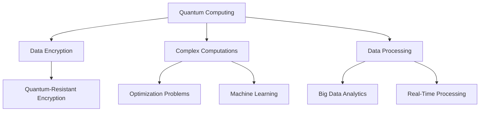

## 19.7 Quantum Computing and Databases

As we stand on the brink of a new era in computing, quantum computing emerges as a transformative force with the potential to revolutionize how we process and secure data. This section explores the intersection of quantum computing and databases, focusing on the potential applications, challenges, and future directions in this rapidly evolving field.

### Understanding Quantum Computing

**Quantum Computing** is a type of computation that harnesses the principles of quantum mechanics, the fundamental theory in physics that describes nature at the smallest scales. Unlike classical computers, which use bits as the smallest unit of data (either 0 or 1), quantum computers use **quantum bits** or **qubits**. Qubits can exist in multiple states simultaneously, thanks to the principles of **superposition** and **entanglement**.

#### Key Concepts in Quantum Computing

- **Superposition**: A qubit can be in a state of 0, 1, or any quantum superposition of these states. This allows quantum computers to process a vast amount of possibilities simultaneously.
  
- **Entanglement**: A phenomenon where qubits become interconnected such that the state of one qubit can depend on the state of another, no matter the distance between them. This property is crucial for quantum computing's potential to solve complex problems.

- **Quantum Gates**: Analogous to classical logic gates, quantum gates manipulate qubits through operations that change their states. These gates are the building blocks of quantum circuits.

### Quantum Computing's Potential in Databases

Quantum computing holds the promise of transforming databases in several key areas:

#### 1. **Data Encryption and Security**

Quantum algorithms, such as **Shor's algorithm**, have the potential to break widely used encryption methods like RSA, which rely on the difficulty of factoring large numbers. This poses a significant threat to current data security practices. However, quantum computing also offers the potential for **quantum-resistant encryption** methods, which could safeguard data against quantum attacks.

#### 2. **Complex Computations**

Quantum computers can solve certain complex problems exponentially faster than classical computers. This capability could revolutionize areas such as:

- **Optimization Problems**: Quantum computing can tackle complex optimization problems more efficiently, which is beneficial for database query optimization and resource allocation.

- **Machine Learning**: Quantum algorithms can enhance machine learning models by accelerating training processes and improving pattern recognition.

#### 3. **Data Processing and Analysis**

Quantum computing can potentially handle large datasets more efficiently, enabling faster data processing and analysis. This could lead to breakthroughs in fields like big data analytics and real-time data processing.

### Challenges in Integrating Quantum Computing with Databases

While the potential is immense, several challenges must be addressed before quantum computing can be fully integrated into database systems:

#### 1. **Immature Technology**

Quantum computing is still in its infancy, with many technical hurdles to overcome. Current quantum computers are prone to errors and require extremely low temperatures to operate, making them impractical for widespread use at this time.

#### 2. **Lack of Standards**

The field of quantum computing lacks standardized protocols and frameworks, which complicates the development of quantum algorithms and their integration with existing database technologies.

#### 3. **Resource Requirements**

Quantum computers require significant resources, including specialized hardware and cooling systems, which can be prohibitively expensive.

### Future Directions in Quantum Computing and Databases

Despite these challenges, research and development in quantum computing continue to advance rapidly. Here are some future directions that hold promise:

#### 1. **Quantum-Resistant Encryption**

Research is underway to develop encryption methods that are resistant to quantum attacks. These methods aim to secure data against the capabilities of future quantum computers.

#### 2. **Hybrid Quantum-Classical Systems**

Hybrid systems that combine quantum and classical computing could offer practical solutions in the near term. These systems leverage the strengths of both technologies to solve complex problems more efficiently.

#### 3. **Quantum Algorithms for Databases**

Developing quantum algorithms specifically designed for database operations could unlock new possibilities in data processing and analysis. These algorithms could optimize query execution, enhance data retrieval, and improve overall system performance.

#### 4. **Quantum Machine Learning**

Integrating quantum computing with machine learning could lead to more powerful models and faster training times. This integration could revolutionize data-driven decision-making processes across various industries.

### Visualizing Quantum Computing's Impact on Databases

To better understand the potential impact of quantum computing on databases, let's visualize the interaction between quantum algorithms and database operations.



**Figure 1: Visualizing Quantum Computing's Impact on Databases**

### Sample Code Snippet: Quantum-Resistant Encryption

While quantum computing is still developing, it's crucial to start considering quantum-resistant encryption methods. Here's a simple example using a lattice-based encryption scheme, which is considered quantum-resistant.

```python
from lattice import Lattice

lattice = Lattice(dimension=512)

public_key, private_key = lattice.generate_keypair()

message = "Secure data with quantum-resistant encryption"
ciphertext = lattice.encrypt(message, public_key)

decrypted_message = lattice.decrypt(ciphertext, private_key)

assert decrypted_message == message
print("Decryption successful, message:", decrypted_message)
```

**Note:** This is a simplified example for illustrative purposes. Implementing a secure lattice-based encryption scheme requires a deep understanding of cryptography and should be done with caution.

### Try It Yourself

Experiment with the code example by modifying the lattice dimension or the message content. Observe how changes affect the encryption and decryption process. This exercise will help you understand the principles of quantum-resistant encryption better.

### Knowledge Check

To reinforce your understanding of quantum computing and its potential impact on databases, consider the following questions:

- How does quantum superposition differ from classical binary states?
- What are the potential applications of quantum computing in database optimization?
- Why is quantum-resistant encryption important for future data security?

### Embrace the Journey

As we explore the intersection of quantum computing and databases, it's essential to stay curious and open to new possibilities. This field is rapidly evolving, and the potential for innovation is immense. Remember, this is just the beginning. As you progress, you'll gain a deeper understanding of how quantum computing can transform data processing and security. Keep experimenting, stay curious, and enjoy the journey!

### References and Links

For further reading on quantum computing and its applications in databases, consider the following resources:

- [Quantum Computing for Computer Scientists](https://www.cambridge.org/core/books/quantum-computing-for-computer-scientists/0D2B9C0D9D9D9D9D9D9D9D9D9D9D9D9D)
- [Quantum Algorithms for Database Search](https://arxiv.org/abs/quant-ph/9605043)
- [Lattice-Based Cryptography](https://en.wikipedia.org/wiki/Lattice-based_cryptography)

### Quiz Time!



### What is a qubit?

- [x] A quantum bit that can exist in multiple states simultaneously
- [ ] A classical bit that can be either 0 or 1
- [ ] A unit of classical memory
- [ ] A type of quantum gate

> **Explanation:** A qubit is the fundamental unit of quantum information, capable of existing in a superposition of states.

### What is the principle of superposition?

- [x] The ability of a qubit to exist in multiple states simultaneously
- [ ] The entanglement of two qubits
- [ ] The process of measuring a quantum state
- [ ] The interaction between quantum gates

> **Explanation:** Superposition allows qubits to represent multiple possibilities at once, a key feature of quantum computing.

### Which quantum algorithm poses a threat to current encryption methods?

- [x] Shor's algorithm
- [ ] Grover's algorithm
- [ ] Dijkstra's algorithm
- [ ] Bellman's algorithm

> **Explanation:** Shor's algorithm can efficiently factor large numbers, threatening encryption methods like RSA.

### What is quantum entanglement?

- [x] A phenomenon where qubits become interconnected, affecting each other's states
- [ ] The process of measuring a quantum state
- [ ] The ability of a qubit to exist in multiple states simultaneously
- [ ] A type of quantum gate

> **Explanation:** Entanglement is a unique quantum phenomenon where the state of one qubit is dependent on another, regardless of distance.

### Why is quantum-resistant encryption important?

- [x] To protect data against future quantum attacks
- [ ] To improve classical encryption methods
- [x] To ensure data security in a quantum computing era
- [ ] To replace all existing encryption methods

> **Explanation:** Quantum-resistant encryption is crucial for safeguarding data against the capabilities of future quantum computers.

### What is a potential application of quantum computing in databases?

- [x] Optimization of complex queries
- [ ] Storing data in binary format
- [ ] Replacing SQL with quantum languages
- [ ] Eliminating the need for data encryption

> **Explanation:** Quantum computing can optimize complex queries, improving database performance.

### What is a challenge in integrating quantum computing with databases?

- [x] Immature technology and lack of standards
- [ ] Excessive data storage requirements
- [x] High resource requirements
- [ ] Incompatibility with SQL

> **Explanation:** Quantum computing is still developing, with technical and resource challenges to overcome.

### What is a hybrid quantum-classical system?

- [x] A system that combines quantum and classical computing
- [ ] A purely quantum computing system
- [ ] A classical computing system with quantum features
- [ ] A system that uses only quantum gates

> **Explanation:** Hybrid systems leverage both quantum and classical computing strengths to solve complex problems.

### What is the role of quantum gates in quantum computing?

- [x] To manipulate qubits and change their states
- [ ] To store quantum information
- [ ] To measure quantum states
- [ ] To create entanglement

> **Explanation:** Quantum gates perform operations on qubits, similar to classical logic gates in traditional computing.

### True or False: Quantum computing can potentially break current encryption methods.

- [x] True
- [ ] False

> **Explanation:** Quantum algorithms like Shor's algorithm can break encryption methods that rely on the difficulty of factoring large numbers.


