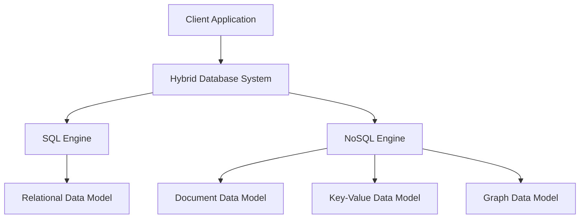

## 19.9 NoSQL and SQL Convergence

In the ever-evolving landscape of database technologies, the convergence of NoSQL and SQL databases represents a significant trend. This convergence is driven by the need for flexibility, scalability, and the ability to handle diverse data types and workloads. As organizations strive to manage vast amounts of data efficiently, hybrid systems that integrate both SQL and NoSQL features are becoming increasingly popular. This section explores the concept of NoSQL and SQL convergence, the benefits of hybrid systems, and how they empower developers to choose the best model for each use case.

### Understanding NoSQL and SQL

Before diving into the convergence, it's essential to understand the fundamental differences between NoSQL and SQL databases:

- **SQL Databases**: These are relational databases that use structured query language (SQL) for defining and manipulating data. They are known for their ACID (Atomicity, Consistency, Isolation, Durability) properties, which ensure reliable transactions. SQL databases are ideal for structured data and complex queries.

- **NoSQL Databases**: These databases are designed to handle unstructured or semi-structured data. They offer flexibility in data modeling and are optimized for horizontal scaling. NoSQL databases include various types such as document stores, key-value stores, column-family stores, and graph databases.

### The Need for Convergence

The convergence of NoSQL and SQL arises from the limitations and strengths of each approach. While SQL databases provide robust transaction support and complex querying capabilities, they can struggle with scalability and flexibility. Conversely, NoSQL databases excel in scalability and flexibility but may lack strong consistency and complex querying features.

**Hybrid Systems**: These systems aim to combine the best of both worlds, offering the flexibility of NoSQL with the robust querying and transaction capabilities of SQL. Hybrid systems allow developers to choose the appropriate model per use case, providing a more versatile and efficient data management solution.

### Key Features of Hybrid Systems

1. **Flexibility**: Hybrid systems support multiple data models, allowing developers to use the most suitable model for their specific needs. For example, a hybrid system might support document, key-value, and relational models simultaneously.

2. **Scalability**: By leveraging NoSQL's horizontal scaling capabilities, hybrid systems can handle large volumes of data and high-velocity workloads efficiently.

3. **Consistency and Transactions**: Hybrid systems often incorporate SQL's ACID properties, ensuring data consistency and reliable transactions even in distributed environments.

4. **Querying Capabilities**: With SQL-like querying features, hybrid systems enable complex queries across different data models, providing powerful data retrieval and analysis capabilities.

### Example Platforms

Several platforms exemplify the convergence of NoSQL and SQL, offering hybrid systems that integrate both technologies:

- **Microsoft Azure Cosmos DB**: This globally distributed database service supports multiple data models, including document, key-value, graph, and column-family. It offers SQL querying capabilities, allowing developers to use familiar SQL syntax across different data models.

- **Amazon DynamoDB**: While primarily a NoSQL database, DynamoDB offers features like transactions and secondary indexes, bridging the gap between NoSQL and SQL functionalities.

- **Google Cloud Spanner**: A distributed SQL database that combines the scalability of NoSQL with the consistency and transactional support of SQL, making it suitable for global applications.

### Code Example: Using SQL in a NoSQL Context

Let's explore a simple example of using SQL-like queries in a NoSQL database. Consider a document store where we want to query data using SQL syntax.

```sql
-- Example of querying a document store with SQL-like syntax
SELECT * FROM users
WHERE age > 30
AND city = 'New York';
```

In this example, the query retrieves all user documents where the age is greater than 30 and the city is New York. This SQL-like syntax provides a familiar interface for developers accustomed to relational databases.

### Visualizing Hybrid Systems

To better understand how hybrid systems integrate NoSQL and SQL features, let's visualize the architecture of a hybrid database system.



**Diagram Description**: This diagram illustrates a hybrid database system where a client application interacts with both SQL and NoSQL engines. The SQL engine manages relational data models, while the NoSQL engine handles document, key-value, and graph data models.

### Design Considerations

When implementing hybrid systems, consider the following design aspects:

- **Data Model Selection**: Choose the appropriate data model based on the use case. For example, use a document model for flexible schema requirements and a relational model for complex transactions.

- **Consistency Requirements**: Determine the level of consistency needed for your application. Hybrid systems can offer different consistency models, from eventual consistency to strong consistency.

- **Scalability Needs**: Assess the scalability requirements of your application. Hybrid systems can leverage NoSQL's horizontal scaling to handle large datasets and high throughput.

- **Query Complexity**: Evaluate the complexity of queries your application requires. Hybrid systems with SQL-like querying capabilities can simplify complex data retrieval and analysis.

### Differences and Similarities

While hybrid systems aim to bridge the gap between NoSQL and SQL, it's essential to understand their differences and similarities:

- **Data Models**: Hybrid systems support multiple data models, unlike traditional SQL databases that primarily focus on relational models.

- **Scalability**: Hybrid systems leverage NoSQL's horizontal scaling, offering better scalability than traditional SQL databases.

- **Consistency**: Hybrid systems can offer different consistency models, from eventual consistency to strong consistency, depending on the use case.

- **Querying**: Hybrid systems provide SQL-like querying capabilities, making it easier for developers to work with complex queries across different data models.

### Try It Yourself

To experiment with hybrid systems, try using a platform like Microsoft Azure Cosmos DB or Google Cloud Spanner. Create a sample database, insert data using different models, and perform queries using SQL-like syntax. Experiment with different consistency and scalability settings to understand how hybrid systems can benefit your applications.

### References and Links

- [Microsoft Azure Cosmos DB Documentation](https://docs.microsoft.com/en-us/azure/cosmos-db/)
- [Amazon DynamoDB Documentation](https://docs.aws.amazon.com/dynamodb/)
- [Google Cloud Spanner Documentation](https://cloud.google.com/spanner/docs)

### Knowledge Check

- Explain the key differences between SQL and NoSQL databases.
- Describe the benefits of hybrid systems in database management.
- Provide an example of a platform that supports both SQL and NoSQL features.
- Discuss the importance of data model selection in hybrid systems.

### Embrace the Journey

Remember, the convergence of NoSQL and SQL is just the beginning. As you explore hybrid systems, you'll discover new ways to manage data efficiently and effectively. Keep experimenting, stay curious, and enjoy the journey!

## Quiz Time!



### What is a key feature of hybrid database systems?

- [x] Flexibility in data modeling
- [ ] Only supports SQL queries
- [ ] Limited scalability
- [ ] Only supports NoSQL data models

> **Explanation:** Hybrid systems offer flexibility in data modeling, allowing the use of multiple data models.

### Which of the following is an example of a hybrid database platform?

- [x] Microsoft Azure Cosmos DB
- [ ] MySQL
- [ ] MongoDB
- [ ] Redis

> **Explanation:** Microsoft Azure Cosmos DB is a hybrid platform supporting multiple data models and SQL querying.

### What is a primary advantage of NoSQL databases over SQL databases?

- [x] Scalability
- [ ] Strong consistency
- [ ] Complex querying
- [ ] ACID transactions

> **Explanation:** NoSQL databases are known for their scalability, handling large volumes of data efficiently.

### How do hybrid systems handle consistency?

- [x] They offer different consistency models
- [ ] They only provide eventual consistency
- [ ] They only provide strong consistency
- [ ] They do not handle consistency

> **Explanation:** Hybrid systems can offer various consistency models, from eventual to strong consistency.

### What is a common use case for document data models in hybrid systems?

- [x] Flexible schema requirements
- [ ] Complex transactions
- [ ] High consistency needs
- [ ] Simple key-value storage

> **Explanation:** Document data models are suitable for applications with flexible schema requirements.

### Which feature is typically associated with SQL databases?

- [x] ACID transactions
- [ ] Horizontal scaling
- [ ] Flexible schema
- [ ] Eventual consistency

> **Explanation:** SQL databases are known for their ACID transaction support.

### What is a benefit of using SQL-like querying in hybrid systems?

- [x] Simplifies complex data retrieval
- [ ] Limits data model flexibility
- [ ] Reduces scalability
- [ ] Increases consistency issues

> **Explanation:** SQL-like querying in hybrid systems simplifies complex data retrieval and analysis.

### What is a challenge when implementing hybrid systems?

- [x] Data model selection
- [ ] Lack of scalability
- [ ] Limited querying capabilities
- [ ] Inconsistent data

> **Explanation:** Choosing the appropriate data model for each use case is a challenge in hybrid systems.

### Which of the following is NOT a type of NoSQL database?

- [x] Relational database
- [ ] Document database
- [ ] Key-value store
- [ ] Graph database

> **Explanation:** Relational databases are SQL databases, not NoSQL.

### True or False: Hybrid systems can only use NoSQL data models.

- [ ] True
- [x] False

> **Explanation:** Hybrid systems support both SQL and NoSQL data models, offering flexibility in data management.


