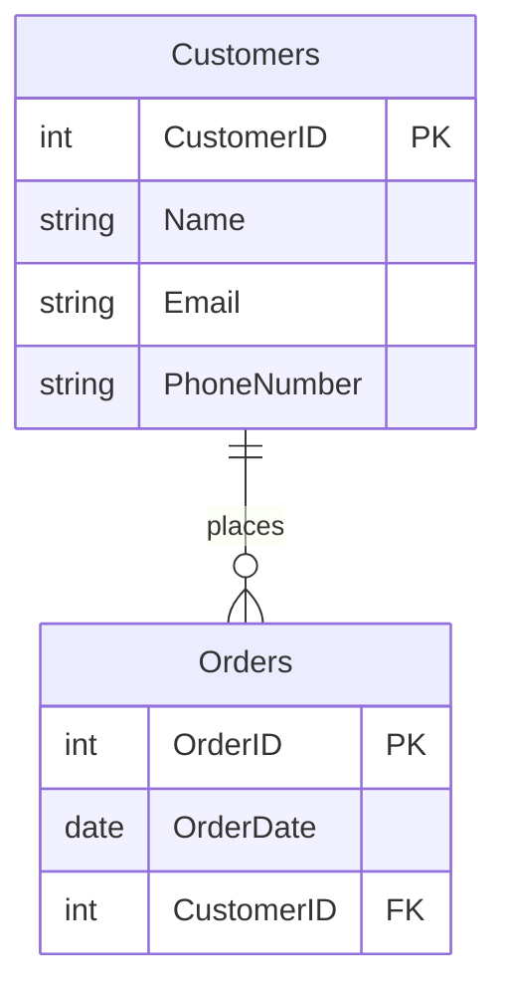

## 2.1 Fundamentals of Relational Databases

Relational databases form the backbone of modern data management systems, providing a structured and efficient way to store, retrieve, and manipulate data. In this section, we will delve into the core principles that define relational databases, including the organization of data into tables, the modeling of relationships between these tables, and the mathematical foundations that underpin these concepts. Understanding these fundamentals is crucial for mastering SQL design patterns and building robust database solutions.

### Tables and Relations

At the heart of a relational database is the concept of a table, which organizes data into rows and columns. Each table represents a specific entity or concept, such as customers, orders, or products. The columns define the attributes of the entity, while the rows contain the actual data entries.

#### Organizing Data into Tables

Tables are the primary structure used to store data in a relational database. Each table consists of:

- **Columns**: Define the data type and constraints for each attribute. For example, a "Customers" table might have columns for "CustomerID", "Name", "Email", and "PhoneNumber".
- **Rows**: Represent individual records or entries in the table. Each row contains data for each column, forming a complete record.

Here's an example of a simple "Customers" table:

```sql
CREATE TABLE Customers (
    CustomerID INT PRIMARY KEY,
    Name VARCHAR(100),
    Email VARCHAR(100),
    PhoneNumber VARCHAR(15)
);
```

In this example, the `CustomerID` column is defined as the primary key, ensuring that each customer has a unique identifier.

#### Relationship Modeling

Relational databases are named for their ability to model relationships between tables. These relationships are defined using keys:

- **Primary Key**: A unique identifier for each record in a table. It ensures that each row can be uniquely identified.
- **Foreign Key**: A column or set of columns in one table that references the primary key of another table. This establishes a relationship between the two tables.

Consider the following example, where we have a "Orders" table that relates to the "Customers" table:

```sql
CREATE TABLE Orders (
    OrderID INT PRIMARY KEY,
    OrderDate DATE,
    CustomerID INT,
    FOREIGN KEY (CustomerID) REFERENCES Customers(CustomerID)
);
```

In this example, the `CustomerID` in the "Orders" table is a foreign key that references the `CustomerID` in the "Customers" table, establishing a relationship between orders and customers.

#### Set Theory and Logic

The relational model is grounded in set theory and logic, providing a formal mathematical foundation for database operations. This foundation allows for powerful data manipulation and querying capabilities.

- **Set Theory**: Relational databases treat tables as sets of rows. Operations such as union, intersection, and difference can be performed on these sets, allowing for complex data retrieval and manipulation.
- **Predicate Logic**: SQL queries are based on predicate logic, enabling the specification of conditions and constraints to filter and manipulate data.

For example, consider a query to retrieve all orders placed by a specific customer:

```sql
SELECT * FROM Orders
WHERE CustomerID = 1;
```

This query uses predicate logic to filter the "Orders" table, returning only the rows where the `CustomerID` matches the specified value.

### Visualizing Relational Database Concepts

To better understand the structure and relationships within a relational database, let's visualize these concepts using a diagram.



This entity-relationship diagram illustrates the relationship between the "Customers" and "Orders" tables. The `CustomerID` serves as a primary key in the "Customers" table and a foreign key in the "Orders" table, linking the two entities.

### Key Participants in Relational Databases

Understanding the key participants in relational databases is essential for effective design and implementation:

- **Entities**: Represent real-world objects or concepts, such as customers, products, or orders. Each entity is modeled as a table.
- **Attributes**: Define the properties or characteristics of an entity. Attributes are represented as columns in a table.
- **Relationships**: Describe the associations between entities. Relationships are established using foreign keys.

### Applicability of Relational Databases

Relational databases are suitable for a wide range of applications, including:

- **Transactional Systems**: Such as e-commerce platforms, where data integrity and consistency are critical.
- **Analytical Applications**: Where complex queries and data analysis are required.
- **Enterprise Resource Planning (ERP) Systems**: Which integrate various business processes and data.

### Sample Code Snippet: Creating and Querying a Relational Database

Let's walk through a complete example of creating and querying a relational database.

```sql
-- Create the Customers table
CREATE TABLE Customers (
    CustomerID INT PRIMARY KEY,
    Name VARCHAR(100),
    Email VARCHAR(100),
    PhoneNumber VARCHAR(15)
);

-- Create the Orders table
CREATE TABLE Orders (
    OrderID INT PRIMARY KEY,
    OrderDate DATE,
    CustomerID INT,
    FOREIGN KEY (CustomerID) REFERENCES Customers(CustomerID)
);

-- Insert sample data into Customers
INSERT INTO Customers (CustomerID, Name, Email, PhoneNumber)
VALUES (1, 'John Doe', 'john.doe@example.com', '555-1234');

-- Insert sample data into Orders
INSERT INTO Orders (OrderID, OrderDate, CustomerID)
VALUES (101, '2024-11-01', 1);

-- Query to retrieve all orders for a specific customer
SELECT * FROM Orders
WHERE CustomerID = 1;
```

In this example, we create two tables, "Customers" and "Orders", insert sample data, and perform a query to retrieve orders for a specific customer.

### Design Considerations

When designing a relational database, consider the following:

- **Normalization**: Ensure that the database is normalized to reduce redundancy and improve data integrity.
- **Indexing**: Use indexes to improve query performance, especially for large datasets.
- **Constraints**: Define constraints to enforce data integrity and business rules.

### Differences and Similarities with Other Database Models

Relational databases are often compared to other database models, such as NoSQL databases. Key differences include:

- **Schema**: Relational databases have a fixed schema, while NoSQL databases often have a flexible schema.
- **Consistency**: Relational databases prioritize consistency, while some NoSQL databases prioritize availability and partition tolerance.
- **Query Language**: SQL is the standard query language for relational databases, while NoSQL databases may use different query languages or APIs.

### Try It Yourself

To deepen your understanding, try modifying the sample code to add a new table, such as "Products", and establish relationships with the existing tables. Experiment with different queries to retrieve and manipulate data.

### Knowledge Check

- What is the primary structure used to store data in a relational database?
- How do primary keys and foreign keys establish relationships between tables?
- What mathematical foundations underpin relational databases?

### Embrace the Journey

Remember, mastering relational databases is a journey. As you progress, you'll build more complex and efficient database solutions. Keep experimenting, stay curious, and enjoy the process!

## Quiz Time!



### What is the primary structure used to store data in a relational database?

- [x] Table
- [ ] Graph
- [ ] Document
- [ ] Key-Value Pair

> **Explanation:** Tables are the primary structure used to store data in a relational database, organizing data into rows and columns.

### How do primary keys and foreign keys establish relationships between tables?

- [x] By uniquely identifying records and linking tables
- [ ] By storing data in a hierarchical format
- [ ] By using JSON documents
- [ ] By creating indexes

> **Explanation:** Primary keys uniquely identify records in a table, while foreign keys link tables by referencing primary keys in other tables.

### What mathematical foundations underpin relational databases?

- [x] Set Theory and Predicate Logic
- [ ] Graph Theory and Linear Algebra
- [ ] Calculus and Probability
- [ ] Geometry and Trigonometry

> **Explanation:** Relational databases are grounded in set theory and predicate logic, providing a formal mathematical foundation for database operations.

### Which SQL command is used to create a new table?

- [x] CREATE TABLE
- [ ] INSERT INTO
- [ ] SELECT
- [ ] UPDATE

> **Explanation:** The `CREATE TABLE` command is used to create a new table in a relational database.

### What is the purpose of normalization in database design?

- [x] To reduce redundancy and improve data integrity
- [ ] To increase data redundancy
- [ ] To simplify query syntax
- [ ] To enhance data visualization

> **Explanation:** Normalization is the process of organizing a database to reduce redundancy and improve data integrity.

### Which of the following is a key participant in a relational database?

- [x] Entity
- [ ] Node
- [ ] Edge
- [ ] Document

> **Explanation:** Entities represent real-world objects or concepts in a relational database, modeled as tables.

### What is the role of indexing in a relational database?

- [x] To improve query performance
- [ ] To enforce data integrity
- [ ] To define relationships between tables
- [ ] To store data in a hierarchical format

> **Explanation:** Indexing is used to improve query performance by allowing faster data retrieval.

### Which SQL command is used to insert data into a table?

- [x] INSERT INTO
- [ ] CREATE TABLE
- [ ] SELECT
- [ ] DELETE

> **Explanation:** The `INSERT INTO` command is used to insert data into a table in a relational database.

### What is the difference between a primary key and a foreign key?

- [x] A primary key uniquely identifies records, while a foreign key links tables
- [ ] A primary key links tables, while a foreign key uniquely identifies records
- [ ] Both are used to create indexes
- [ ] Both are used to store JSON documents

> **Explanation:** A primary key uniquely identifies records in a table, while a foreign key links tables by referencing primary keys in other tables.

### True or False: Relational databases have a flexible schema.

- [ ] True
- [x] False

> **Explanation:** Relational databases have a fixed schema, which defines the structure of tables and relationships.



By understanding the fundamentals of relational databases, you lay the groundwork for mastering SQL design patterns and building efficient, scalable database solutions. Keep exploring and applying these concepts to enhance your database design skills.
