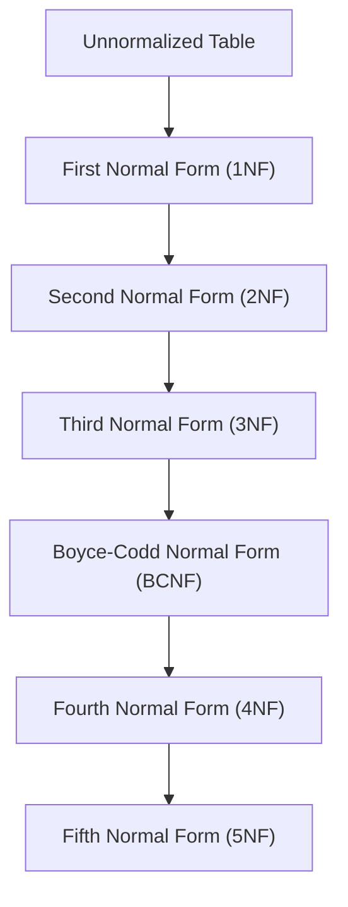

## 2.2 The Relational Model and Normalization

The relational model and normalization are cornerstones of relational database design, providing a structured framework for organizing data efficiently and ensuring its integrity. In this section, we will delve into the intricacies of the relational model, explore the normalization process, and discuss the trade-offs involved in balancing normalization with performance considerations.

### Understanding the Relational Model

The relational model, introduced by E.F. Codd in 1970, revolutionized how data is stored and accessed. It is based on the concept of organizing data into tables (relations) that are linked by keys. Each table consists of rows (tuples) and columns (attributes), where each row represents a unique record, and each column represents a data field.

#### Key Concepts of the Relational Model

- **Tables (Relations)**: The primary structure for storing data. Each table is a collection of rows and columns.
- **Rows (Tuples)**: Individual records within a table, each representing a single data item.
- **Columns (Attributes)**: Define the data fields within a table, each column has a specific data type.
- **Keys**: Unique identifiers for rows, including primary keys and foreign keys, which establish relationships between tables.

### The Importance of Normalization

Normalization is the process of organizing data in a database to reduce redundancy and improve data integrity. It involves decomposing tables into smaller, related tables and defining relationships between them. The primary goal is to ensure that each piece of data is stored only once, minimizing the risk of data anomalies.

#### Objectives of Normalization

1. **Eliminate Redundancy**: Reduce duplicate data by ensuring that each piece of information is stored in only one place.
2. **Ensure Data Integrity**: Maintain consistency and accuracy of data across the database.
3. **Facilitate Maintenance**: Simplify updates and modifications by organizing data logically.

### The Normalization Process

Normalization is achieved through a series of steps, each corresponding to a normal form. Each step builds upon the previous one, progressively refining the database structure.

#### First Normal Form (1NF)

**Objective**: Ensure that each table has a primary key and that all columns contain atomic values.

- **Atomic Values**: Each column should contain indivisible values. For example, a column should not contain a list of items.
- **Unique Rows**: Each row must be unique, identified by a primary key.

**Example**:

Consider a table storing customer orders:

| OrderID | CustomerName | Products            |
|---------|--------------|---------------------|
| 1       | Alice        | Apples, Bananas     |
| 2       | Bob          | Oranges, Grapes     |

To achieve 1NF, split the `Products` column into separate rows:

| OrderID | CustomerName | Product  |
|---------|--------------|----------|
| 1       | Alice        | Apples   |
| 1       | Alice        | Bananas  |
| 2       | Bob          | Oranges  |
| 2       | Bob          | Grapes   |

#### Second Normal Form (2NF)

**Objective**: Ensure that all non-key attributes are fully functionally dependent on the primary key.

- **Full Functional Dependency**: Non-key attributes should depend on the entire primary key, not just part of it.

**Example**:

Consider a table storing order details:

| OrderID | ProductID | ProductName | Quantity |
|---------|-----------|-------------|----------|
| 1       | 101       | Apples      | 10       |
| 1       | 102       | Bananas     | 5        |

To achieve 2NF, separate the `ProductName` into a different table:

**Order Table**:

| OrderID | ProductID | Quantity |
|---------|-----------|----------|
| 1       | 101       | 10       |
| 1       | 102       | 5        |

**Product Table**:

| ProductID | ProductName |
|-----------|-------------|
| 101       | Apples      |
| 102       | Bananas     |

#### Third Normal Form (3NF)

**Objective**: Ensure that all non-key attributes are not only fully functionally dependent on the primary key but also independent of each other.

- **Transitive Dependency**: Eliminate dependencies between non-key attributes.

**Example**:

Consider a table storing employee details:

| EmployeeID | DepartmentID | DepartmentName |
|------------|--------------|----------------|
| 1          | 10           | Sales          |
| 2          | 20           | Marketing      |

To achieve 3NF, separate the `DepartmentName` into a different table:

**Employee Table**:

| EmployeeID | DepartmentID |
|------------|--------------|
| 1          | 10           |
| 2          | 20           |

**Department Table**:

| DepartmentID | DepartmentName |
|--------------|----------------|
| 10           | Sales          |
| 20           | Marketing      |

#### Boyce-Codd Normal Form (BCNF)

**Objective**: A stronger version of 3NF, ensuring that every determinant is a candidate key.

- **Determinant**: An attribute on which some other attribute is fully functionally dependent.

**Example**:

Consider a table storing course schedules:

| CourseID | Instructor | Room |
|----------|------------|------|
| 101      | Dr. Smith  | 201  |
| 102      | Dr. Jones  | 202  |

If an instructor can only teach one course at a time, then `Instructor` should be a candidate key. To achieve BCNF, separate the `Room` into a different table:

**Course Table**:

| CourseID | Instructor |
|----------|------------|
| 101      | Dr. Smith  |
| 102      | Dr. Jones  |

**Room Table**:

| Instructor | Room |
|------------|------|
| Dr. Smith  | 201  |
| Dr. Jones  | 202  |

#### Fourth Normal Form (4NF)

**Objective**: Ensure that there are no multi-valued dependencies other than a candidate key.

- **Multi-Valued Dependency**: A situation where one attribute determines multiple independent attributes.

**Example**:

Consider a table storing student activities:

| StudentID | Sport   | Club    |
|-----------|---------|---------|
| 1         | Soccer  | Chess   |
| 1         | Tennis  | Drama   |

To achieve 4NF, separate `Sport` and `Club` into different tables:

**Student-Sport Table**:

| StudentID | Sport  |
|-----------|--------|
| 1         | Soccer |
| 1         | Tennis |

**Student-Club Table**:

| StudentID | Club  |
|-----------|-------|
| 1         | Chess |
| 1         | Drama |

#### Fifth Normal Form (5NF)

**Objective**: Ensure that every join dependency in the table is a consequence of the candidate keys.

- **Join Dependency**: A situation where a table can be reconstructed from multiple smaller tables.

**Example**:

Consider a table storing project assignments:

| ProjectID | EmployeeID | Role     |
|-----------|------------|----------|
| 1         | 101        | Developer|
| 1         | 102        | Tester   |

To achieve 5NF, separate `Role` into a different table:

**Project-Employee Table**:

| ProjectID | EmployeeID |
|-----------|------------|
| 1         | 101        |
| 1         | 102        |

**Employee-Role Table**:

| EmployeeID | Role     |
|------------|----------|
| 101        | Developer|
| 102        | Tester   |

### Trade-offs in Normalization

While normalization is essential for data integrity and reducing redundancy, it can also impact performance. Highly normalized databases may require complex joins, which can slow down query performance. Therefore, it's crucial to balance normalization with performance considerations.

#### Denormalization

Denormalization is the process of intentionally introducing redundancy into a database to improve performance. It involves combining tables or adding redundant data to reduce the need for complex joins.

**Example**:

In a highly normalized database, retrieving customer orders might require multiple joins. By denormalizing, you can store customer and order information in a single table, reducing the need for joins and improving query performance.

### Visualizing the Normalization Process

To better understand the normalization process, let's visualize the transformation of a table through different normal forms using a Mermaid.js diagram.

**Diagram Description**: This diagram illustrates the progression of a table through various normal forms, highlighting the increasing levels of data integrity and reduced redundancy.

### Try It Yourself

To solidify your understanding of normalization, try modifying the examples provided. Experiment with different table structures and see how normalization affects data integrity and redundancy.

### References and Further Reading

- [Normalization in Database Design](https://www.w3schools.com/sql/sql_normalization.asp) - W3Schools
- [Database Normalization Process](https://www.geeksforgeeks.org/database-normalization-process/) - GeeksforGeeks
- [Understanding the Relational Model](https://en.wikipedia.org/wiki/Relational_model) - Wikipedia

### Knowledge Check

Before moving on, let's summarize the key takeaways:

- The relational model organizes data into tables, rows, and columns.
- Normalization reduces redundancy and ensures data integrity.
- Each normal form builds upon the previous one, refining the database structure.
- Trade-offs exist between normalization and performance, leading to denormalization in some cases.

## Quiz Time!



### What is the primary goal of normalization in database design?

- [x] To eliminate data redundancy and ensure data integrity
- [ ] To increase data redundancy for faster access
- [ ] To create more tables for complex queries
- [ ] To simplify database design by reducing the number of tables

> **Explanation:** The primary goal of normalization is to eliminate data redundancy and ensure data integrity by organizing data into related tables.

### Which normal form ensures that all non-key attributes are fully functionally dependent on the primary key?

- [ ] First Normal Form (1NF)
- [x] Second Normal Form (2NF)
- [ ] Third Normal Form (3NF)
- [ ] Boyce-Codd Normal Form (BCNF)

> **Explanation:** Second Normal Form (2NF) ensures that all non-key attributes are fully functionally dependent on the primary key.

### What is a transitive dependency?

- [x] A dependency between non-key attributes
- [ ] A dependency between a primary key and a non-key attribute
- [ ] A dependency between two primary keys
- [ ] A dependency that occurs only in 1NF

> **Explanation:** A transitive dependency is a dependency between non-key attributes, which is eliminated in Third Normal Form (3NF).

### What is the purpose of denormalization?

- [x] To improve performance by reducing the need for complex joins
- [ ] To increase data redundancy for better data integrity
- [ ] To simplify database design by reducing the number of tables
- [ ] To ensure that every determinant is a candidate key

> **Explanation:** Denormalization is used to improve performance by reducing the need for complex joins, often at the cost of increased redundancy.

### Which normal form is a stronger version of Third Normal Form (3NF)?

- [ ] First Normal Form (1NF)
- [ ] Second Normal Form (2NF)
- [x] Boyce-Codd Normal Form (BCNF)
- [ ] Fourth Normal Form (4NF)

> **Explanation:** Boyce-Codd Normal Form (BCNF) is a stronger version of Third Normal Form (3NF), ensuring that every determinant is a candidate key.

### What is a multi-valued dependency?

- [x] A situation where one attribute determines multiple independent attributes
- [ ] A dependency between a primary key and a non-key attribute
- [ ] A dependency between two primary keys
- [ ] A dependency that occurs only in 2NF

> **Explanation:** A multi-valued dependency is a situation where one attribute determines multiple independent attributes, which is eliminated in Fourth Normal Form (4NF).

### What is the primary structure for storing data in the relational model?

- [x] Tables (Relations)
- [ ] Rows (Tuples)
- [ ] Columns (Attributes)
- [ ] Keys

> **Explanation:** Tables (Relations) are the primary structure for storing data in the relational model.

### What is the main trade-off involved in normalization?

- [x] Balancing data integrity with performance considerations
- [ ] Increasing data redundancy for faster access
- [ ] Simplifying database design by reducing the number of tables
- [ ] Ensuring that every determinant is a candidate key

> **Explanation:** The main trade-off in normalization is balancing data integrity with performance considerations, as highly normalized databases may require complex joins.

### Which normal form ensures that there are no multi-valued dependencies other than a candidate key?

- [ ] First Normal Form (1NF)
- [ ] Second Normal Form (2NF)
- [ ] Third Normal Form (3NF)
- [x] Fourth Normal Form (4NF)

> **Explanation:** Fourth Normal Form (4NF) ensures that there are no multi-valued dependencies other than a candidate key.

### True or False: Normalization always improves database performance.

- [ ] True
- [x] False

> **Explanation:** False. While normalization improves data integrity and reduces redundancy, it can also impact performance by requiring complex joins, leading to the need for denormalization in some cases.



Remember, mastering the relational model and normalization is just the beginning. As you progress, you'll build more efficient and scalable database solutions. Keep experimenting, stay curious, and enjoy the journey!
