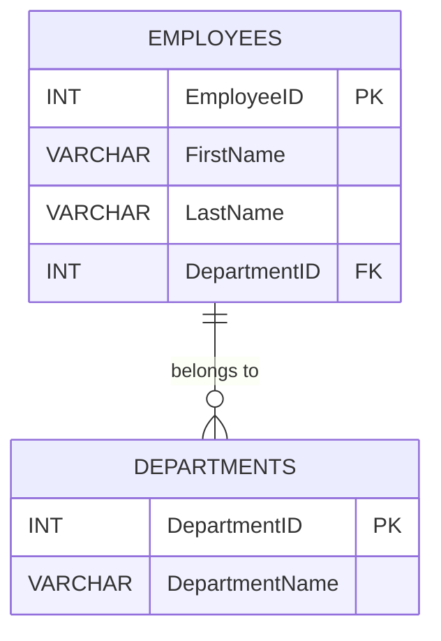

## 2.3 Data Integrity and Constraints

In the realm of relational databases, data integrity is paramount. It ensures that the data stored in a database is accurate, consistent, and reliable. Data integrity is maintained through a set of rules known as constraints. These constraints enforce the validity of the data and prevent the entry of incorrect or inconsistent data. In this section, we will delve into the various types of constraints available in SQL and how they contribute to maintaining data integrity.

### Understanding Data Integrity

Data integrity refers to the accuracy and consistency of data over its lifecycle. It is a critical aspect of database design and management, ensuring that the data remains reliable and valid. Data integrity can be categorized into three main types:

1. **Entity Integrity**: Ensures that each entity (or row) in a table is uniquely identifiable.
2. **Referential Integrity**: Ensures that relationships between tables remain consistent.
3. **Domain Integrity**: Ensures that data entries fall within a specific domain or set of values.

### Types of Constraints

Constraints are rules applied to table columns to enforce data integrity. Let's explore the different types of constraints in SQL:

#### Primary Keys

**Intent**: Uniquely identify each record in a table.

A primary key is a column or a set of columns that uniquely identifies each row in a table. It ensures entity integrity by preventing duplicate entries and null values in the primary key column(s).

**Key Participants**:
- **Table**: The table where the primary key is defined.
- **Column(s)**: The column(s) that make up the primary key.

**Sample Code Snippet**:

```sql
CREATE TABLE Employees (
    EmployeeID INT PRIMARY KEY,
    FirstName VARCHAR(50),
    LastName VARCHAR(50),
    Email VARCHAR(100)
);
```

In this example, `EmployeeID` is the primary key for the `Employees` table, ensuring that each employee has a unique identifier.

**Design Considerations**:
- Choose a primary key that is stable and does not change over time.
- Avoid using business logic as primary keys (e.g., Social Security Numbers).

#### Foreign Keys

**Intent**: Maintain referential integrity between tables.

A foreign key is a column or a set of columns in one table that refers to the primary key in another table. It ensures that the relationship between the two tables is valid and that the data remains consistent.

**Key Participants**:
- **Parent Table**: The table containing the primary key.
- **Child Table**: The table containing the foreign key.

**Sample Code Snippet**:

```sql
CREATE TABLE Departments (
    DepartmentID INT PRIMARY KEY,
    DepartmentName VARCHAR(100)
);

CREATE TABLE Employees (
    EmployeeID INT PRIMARY KEY,
    FirstName VARCHAR(50),
    LastName VARCHAR(50),
    DepartmentID INT,
    FOREIGN KEY (DepartmentID) REFERENCES Departments(DepartmentID)
);
```

Here, `DepartmentID` in the `Employees` table is a foreign key referencing the `DepartmentID` in the `Departments` table.

**Design Considerations**:
- Ensure that foreign keys are indexed for performance optimization.
- Use cascading actions (e.g., ON DELETE CASCADE) judiciously to maintain data integrity.

#### Unique Constraints

**Intent**: Enforce uniqueness on non-primary key columns.

A unique constraint ensures that all values in a column are distinct from one another. It is similar to a primary key but allows for one null value.

**Key Participants**:
- **Table**: The table where the unique constraint is defined.
- **Column(s)**: The column(s) that must have unique values.

**Sample Code Snippet**:

```sql
CREATE TABLE Users (
    UserID INT PRIMARY KEY,
    Username VARCHAR(50) UNIQUE,
    Email VARCHAR(100) UNIQUE
);
```

In this example, both `Username` and `Email` must be unique across the `Users` table.

**Design Considerations**:
- Use unique constraints to enforce business rules, such as unique usernames or email addresses.
- Be mindful of performance implications when applying unique constraints to large tables.

#### Check Constraints

**Intent**: Enforce domain integrity by limiting allowed values.

A check constraint ensures that the values in a column meet a specific condition. It is used to enforce domain integrity by restricting the range of values that can be entered into a column.

**Key Participants**:
- **Table**: The table where the check constraint is defined.
- **Column(s)**: The column(s) subject to the constraint.

**Sample Code Snippet**:

```sql
CREATE TABLE Products (
    ProductID INT PRIMARY KEY,
    ProductName VARCHAR(100),
    Price DECIMAL(10, 2),
    CHECK (Price > 0)
);
```

Here, the check constraint ensures that the `Price` of a product is always greater than zero.

**Design Considerations**:
- Use check constraints to enforce business rules, such as age restrictions or valid date ranges.
- Be aware of potential performance impacts when using complex expressions in check constraints.

#### Not Null Constraints

**Intent**: Ensure that a column cannot contain NULL values.

A not null constraint ensures that a column must always have a value. It is used to enforce domain integrity by preventing null values in a column.

**Key Participants**:
- **Table**: The table where the not null constraint is defined.
- **Column**: The column that must not contain null values.

**Sample Code Snippet**:

```sql
CREATE TABLE Orders (
    OrderID INT PRIMARY KEY,
    OrderDate DATE NOT NULL,
    CustomerID INT NOT NULL
);
```

In this example, both `OrderDate` and `CustomerID` must have values for each order.

**Design Considerations**:
- Use not null constraints to ensure critical data is always present.
- Consider default values for columns with not null constraints to simplify data entry.

### Visualizing Constraints

To better understand how constraints work together to maintain data integrity, let's visualize the relationships between tables and constraints using a Mermaid.js diagram.



**Diagram Description**: This diagram illustrates the relationship between the `EMPLOYEES` and `DEPARTMENTS` tables. The `EmployeeID` is the primary key in the `EMPLOYEES` table, and `DepartmentID` is a foreign key referencing the primary key in the `DEPARTMENTS` table.

### Try It Yourself

To solidify your understanding of constraints, try modifying the code examples provided. For instance, add a new column to the `Employees` table with a check constraint that ensures the employee's age is greater than 18. Experiment with adding and removing constraints to see how they affect data integrity.

### References and Links

For further reading on SQL constraints and data integrity, consider the following resources:

- [W3Schools SQL Constraints](https://www.w3schools.com/sql/sql_constraints.asp)
- [MDN Web Docs: SQL Constraints](https://developer.mozilla.org/en-US/docs/Web/SQL/Constraints)
- [Oracle Database SQL Language Reference](https://docs.oracle.com/en/database/oracle/oracle-database/19/sqlrf/index.html)

### Knowledge Check

Let's test your understanding of data integrity and constraints with some questions and exercises.

1. What is the primary purpose of a primary key in a table?
2. How does a foreign key maintain referential integrity between tables?
3. What is the difference between a unique constraint and a primary key?
4. Provide an example of a check constraint that limits values in a column.
5. Why is it important to use not null constraints in database design?

### Embrace the Journey

Remember, mastering data integrity and constraints is a crucial step in becoming an expert in SQL database design. As you continue to explore and experiment with these concepts, you'll gain a deeper understanding of how to build robust and reliable database systems. Keep learning, stay curious, and enjoy the journey!

## Quiz Time!



### What is the primary purpose of a primary key in a table?

- [x] To uniquely identify each record in the table
- [ ] To allow duplicate entries in the table
- [ ] To enforce referential integrity
- [ ] To store null values

> **Explanation:** A primary key uniquely identifies each record in a table, ensuring that no duplicate entries exist.

### How does a foreign key maintain referential integrity between tables?

- [x] By referencing the primary key in another table
- [ ] By allowing null values in the column
- [ ] By ensuring all values are unique
- [ ] By preventing data entry

> **Explanation:** A foreign key maintains referential integrity by referencing the primary key in another table, ensuring that relationships between tables remain consistent.

### What is the difference between a unique constraint and a primary key?

- [x] A unique constraint allows one null value, while a primary key does not
- [ ] A primary key allows duplicate values, while a unique constraint does not
- [ ] A unique constraint is used for foreign keys
- [ ] A primary key can have multiple null values

> **Explanation:** A unique constraint allows one null value, whereas a primary key does not allow any null values and must be unique.

### Provide an example of a check constraint that limits values in a column.

- [x] CHECK (Age > 18)
- [ ] UNIQUE (Email)
- [ ] FOREIGN KEY (DepartmentID)
- [ ] NOT NULL (FirstName)

> **Explanation:** A check constraint like `CHECK (Age > 18)` ensures that the values in the `Age` column are greater than 18.

### Why is it important to use not null constraints in database design?

- [x] To ensure that critical data is always present
- [ ] To allow null values in the column
- [ ] To enforce referential integrity
- [ ] To store duplicate values

> **Explanation:** Not null constraints ensure that critical data is always present in a column, preventing null values.

### Which constraint ensures that all values in a column are distinct from one another?

- [x] Unique constraint
- [ ] Primary key
- [ ] Foreign key
- [ ] Check constraint

> **Explanation:** A unique constraint ensures that all values in a column are distinct from one another.

### What is the role of a check constraint in SQL?

- [x] To enforce domain integrity by limiting allowed values
- [ ] To uniquely identify each record
- [ ] To maintain referential integrity
- [ ] To allow null values

> **Explanation:** A check constraint enforces domain integrity by limiting the allowed values in a column.

### Which constraint prevents null values in a column?

- [x] Not null constraint
- [ ] Unique constraint
- [ ] Foreign key
- [ ] Check constraint

> **Explanation:** A not null constraint prevents null values from being entered into a column.

### What is the relationship between a primary key and a foreign key?

- [x] A foreign key references a primary key in another table
- [ ] A primary key references a foreign key in another table
- [ ] Both are used to enforce domain integrity
- [ ] Both allow duplicate values

> **Explanation:** A foreign key references a primary key in another table, maintaining referential integrity between tables.

### True or False: A primary key can contain null values.

- [ ] True
- [x] False

> **Explanation:** False. A primary key cannot contain null values; it must uniquely identify each record in the table.




