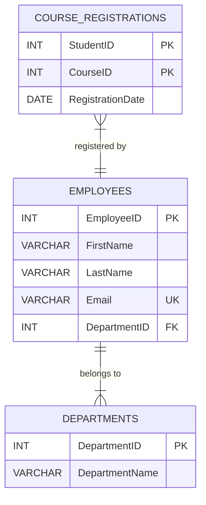

## 2.4 Keys: Primary, Foreign, Unique, and Composite

In the realm of relational database design, keys play a pivotal role in ensuring data integrity, establishing relationships, and optimizing query performance. As expert software engineers and architects, understanding the nuances of different types of keys—primary, foreign, unique, and composite—is essential for crafting robust and efficient database solutions. In this section, we will delve into each type of key, exploring their purposes, implementation strategies, and best practices.

### Primary Keys

**Primary Keys** are the cornerstone of any relational database. They uniquely identify each record within a table, ensuring that no two rows have the same primary key value. Selecting the best candidate key for uniqueness is crucial for maintaining data integrity and optimizing database operations.

#### Design Pattern Name: Primary Key

- **Category**: Data Integrity
- **Intent**: To uniquely identify each record in a table, ensuring data integrity and enabling efficient data retrieval.

#### Key Participants

- **Table**: The entity that contains the data.
- **Column(s)**: The attribute(s) chosen to serve as the primary key.

#### Applicability

- Use a primary key when you need to ensure that each record in a table is unique.
- Ideal for tables where data integrity and efficient retrieval are paramount.

#### Sample Code Snippet

```sql
CREATE TABLE Employees (
    EmployeeID INT PRIMARY KEY,
    FirstName VARCHAR(50),
    LastName VARCHAR(50),
    Email VARCHAR(100)
);
```

> **Explanation**: In this example, `EmployeeID` is designated as the primary key, ensuring that each employee record is uniquely identifiable.

#### Design Considerations

- **Choosing the Right Key**: Select a column or set of columns that are inherently unique. Avoid using columns that may change over time, such as email addresses.
- **Auto-Increment**: Consider using auto-incrementing integers for primary keys to simplify key management.

#### Differences and Similarities

- **Primary vs. Unique Keys**: While both ensure uniqueness, a table can have only one primary key but multiple unique keys.

### Foreign Keys

**Foreign Keys** are instrumental in defining relationships between tables and enforcing referential integrity. They link records in one table to records in another, ensuring that relationships are maintained and data consistency is preserved.

#### Design Pattern Name: Foreign Key

- **Category**: Referential Integrity
- **Intent**: To establish and enforce relationships between tables, ensuring data consistency across related tables.

#### Key Participants

- **Parent Table**: The table containing the primary key.
- **Child Table**: The table containing the foreign key that references the primary key of the parent table.

#### Applicability

- Use foreign keys to define relationships between tables and enforce referential integrity.
- Ideal for databases where maintaining data consistency across related tables is critical.

#### Sample Code Snippet

```sql
CREATE TABLE Departments (
    DepartmentID INT PRIMARY KEY,
    DepartmentName VARCHAR(100)
);

CREATE TABLE Employees (
    EmployeeID INT PRIMARY KEY,
    FirstName VARCHAR(50),
    LastName VARCHAR(50),
    DepartmentID INT,
    FOREIGN KEY (DepartmentID) REFERENCES Departments(DepartmentID)
);
```

> **Explanation**: Here, `DepartmentID` in the `Employees` table is a foreign key referencing the `DepartmentID` in the `Departments` table, establishing a relationship between employees and their respective departments.

#### Design Considerations

- **Cascading Actions**: Consider using cascading updates and deletes to automatically propagate changes across related tables.
- **Indexing**: Index foreign key columns to improve join performance.

#### Differences and Similarities

- **Foreign vs. Primary Keys**: Foreign keys reference primary keys in other tables, while primary keys uniquely identify records within their own table.

### Unique Keys

**Unique Keys** ensure that all values in a column are distinct, similar to primary keys, but with the flexibility of allowing multiple unique keys per table. They are essential for enforcing data integrity and preventing duplicate entries.

#### Design Pattern Name: Unique Key

- **Category**: Data Integrity
- **Intent**: To ensure that all values in a column or set of columns are unique, preventing duplicate entries.

#### Key Participants

- **Table**: The entity that contains the data.
- **Column(s)**: The attribute(s) chosen to enforce uniqueness.

#### Applicability

- Use unique keys to enforce data integrity and prevent duplicate entries in columns that are not primary keys.
- Ideal for columns that require uniqueness but are not suitable as primary keys.

#### Sample Code Snippet

```sql
CREATE TABLE Employees (
    EmployeeID INT PRIMARY KEY,
    FirstName VARCHAR(50),
    LastName VARCHAR(50),
    Email VARCHAR(100) UNIQUE
);
```

> **Explanation**: In this example, the `Email` column is defined as a unique key, ensuring that no two employees can have the same email address.

#### Design Considerations

- **Multiple Unique Keys**: A table can have multiple unique keys, each enforcing uniqueness on different columns.
- **Indexing**: Unique keys automatically create an index, improving query performance.

#### Differences and Similarities

- **Unique vs. Primary Keys**: Both enforce uniqueness, but a table can have only one primary key and multiple unique keys.

### Composite Keys

**Composite Keys** are used when a single column is insufficient to uniquely identify a record. By combining multiple columns, composite keys create a unique identifier for each record, ensuring data integrity in complex scenarios.

#### Design Pattern Name: Composite Key

- **Category**: Data Integrity
- **Intent**: To create a unique identifier for each record by combining multiple columns, ensuring data integrity in complex scenarios.

#### Key Participants

- **Table**: The entity that contains the data.
- **Columns**: The set of attributes combined to form the composite key.

#### Applicability

- Use composite keys when a single column is insufficient to uniquely identify a record.
- Ideal for tables with complex data structures requiring multiple attributes for uniqueness.

#### Sample Code Snippet

```sql
CREATE TABLE CourseRegistrations (
    StudentID INT,
    CourseID INT,
    RegistrationDate DATE,
    PRIMARY KEY (StudentID, CourseID)
);
```

> **Explanation**: In this example, `StudentID` and `CourseID` together form a composite primary key, uniquely identifying each course registration.

#### Design Considerations

- **Complexity**: Composite keys can increase complexity, so use them judiciously.
- **Indexing**: Ensure that composite keys are indexed to maintain query performance.

#### Differences and Similarities

- **Composite vs. Single-Column Keys**: Composite keys combine multiple columns, while single-column keys rely on a single attribute for uniqueness.

### Natural vs. Surrogate Keys

When designing databases, a critical decision is whether to use natural keys, which are derived from real-world data, or surrogate keys, which are system-generated.

#### Natural Keys

- **Definition**: Keys derived from real-world data, such as Social Security Numbers or email addresses.
- **Advantages**: Intuitive and meaningful, often reducing the need for additional joins.
- **Disadvantages**: Can change over time, leading to maintenance challenges.

#### Surrogate Keys

- **Definition**: System-generated keys, often integers, used to uniquely identify records.
- **Advantages**: Stable and immutable, simplifying key management.
- **Disadvantages**: Lack of inherent meaning, requiring additional joins for context.

#### Design Considerations

- **When to Use Natural Keys**: Use natural keys when the data is inherently unique and unlikely to change.
- **When to Use Surrogate Keys**: Use surrogate keys when stability and immutability are priorities.

### Visualizing Key Relationships

To better understand the relationships between primary, foreign, unique, and composite keys, let's visualize these concepts using a diagram.



> **Description**: This diagram illustrates the relationships between the `Employees`, `Departments`, and `CourseRegistrations` tables, highlighting the use of primary, foreign, unique, and composite keys.

### Try It Yourself

To deepen your understanding of SQL keys, try modifying the code examples provided:

- **Experiment with Primary Keys**: Change the primary key in the `Employees` table to a composite key using `FirstName` and `LastName`.
- **Explore Foreign Keys**: Add a foreign key to the `CourseRegistrations` table referencing a new `Courses` table.
- **Test Unique Constraints**: Add a unique constraint to the `DepartmentName` column in the `Departments` table.

### Knowledge Check

- **Question**: What are the advantages of using surrogate keys over natural keys?
- **Exercise**: Create a new table with a composite primary key and test inserting duplicate records.

### Embrace the Journey

Remember, mastering SQL keys is just the beginning of your journey in relational database design. As you progress, you'll encounter more complex scenarios that challenge your understanding and push you to innovate. Stay curious, keep experimenting, and enjoy the journey!

## Quiz Time!



### What is the primary purpose of a primary key in a database table?

- [x] To uniquely identify each record in the table
- [ ] To establish relationships between tables
- [ ] To enforce data integrity across multiple tables
- [ ] To allow duplicate entries in a column

> **Explanation:** A primary key uniquely identifies each record in a table, ensuring that no two rows have the same primary key value.

### Which of the following is true about foreign keys?

- [x] They establish relationships between tables
- [ ] They are used to uniquely identify records within a table
- [ ] They allow duplicate values in a column
- [ ] They cannot reference primary keys in other tables

> **Explanation:** Foreign keys establish relationships between tables by referencing primary keys in other tables, ensuring referential integrity.

### What is a unique key used for?

- [x] To ensure all values in a column are distinct
- [ ] To create a composite key
- [ ] To allow duplicate entries in a column
- [ ] To establish relationships between tables

> **Explanation:** A unique key ensures that all values in a column are distinct, preventing duplicate entries.

### When should you use a composite key?

- [x] When a single column is insufficient to uniquely identify a record
- [ ] When you want to allow duplicate entries in a column
- [ ] When you need to establish relationships between tables
- [ ] When you want to enforce referential integrity

> **Explanation:** Composite keys are used when a single column is insufficient to uniquely identify a record, combining multiple columns to create a unique identifier.

### What is a natural key?

- [x] A key derived from real-world data
- [ ] A system-generated key
- [ ] A key used to establish relationships between tables
- [ ] A key that allows duplicate entries

> **Explanation:** A natural key is derived from real-world data, such as Social Security Numbers or email addresses.

### What is a surrogate key?

- [x] A system-generated key used to uniquely identify records
- [ ] A key derived from real-world data
- [ ] A key used to establish relationships between tables
- [ ] A key that allows duplicate entries

> **Explanation:** A surrogate key is a system-generated key, often an integer, used to uniquely identify records.

### Which of the following is a disadvantage of using natural keys?

- [x] They can change over time, leading to maintenance challenges
- [ ] They are system-generated and lack inherent meaning
- [ ] They simplify key management
- [ ] They are stable and immutable

> **Explanation:** Natural keys can change over time, leading to maintenance challenges, whereas surrogate keys are stable and immutable.

### What is the main difference between primary and unique keys?

- [x] A table can have only one primary key but multiple unique keys
- [ ] Both ensure uniqueness, but unique keys allow duplicate entries
- [ ] Primary keys establish relationships between tables
- [ ] Unique keys are used to uniquely identify records within a table

> **Explanation:** A table can have only one primary key but multiple unique keys, both ensuring uniqueness but serving different purposes.

### How can foreign keys improve database performance?

- [x] By indexing foreign key columns to improve join performance
- [ ] By allowing duplicate values in a column
- [ ] By creating composite keys
- [ ] By preventing referential integrity

> **Explanation:** Indexing foreign key columns can improve join performance, enhancing overall database performance.

### True or False: Composite keys can only be used with two columns.

- [ ] True
- [x] False

> **Explanation:** Composite keys can be created using two or more columns, depending on the complexity of the data structure.


