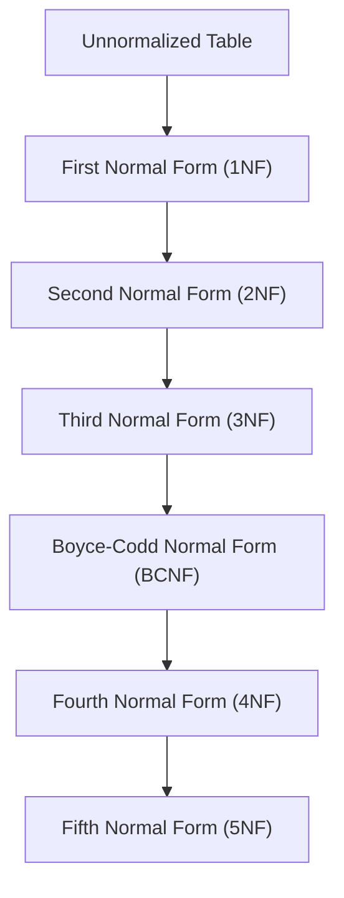

## 2.5 Normal Forms (1NF to 5NF)

In the realm of relational database design, normalization is a critical process that ensures data integrity and reduces redundancy. By organizing data into tables and defining relationships between them, we can create efficient and scalable database systems. This section delves into the concept of normal forms, from the First Normal Form (1NF) to the Fifth Normal Form (5NF), providing a comprehensive understanding of each stage of normalization.

### Introduction to Normal Forms

Normalization is a systematic approach to organizing data in a database. The primary goal is to reduce redundancy and improve data integrity. Each normal form builds upon the previous one, addressing specific types of anomalies and dependencies. Let's explore each normal form in detail.

### First Normal Form (1NF)

**Definition**: A table is in the First Normal Form (1NF) if all its attributes contain only atomic (indivisible) values, and each record is unique.

**Key Concepts**:
- **Atomicity**: Each column should contain indivisible values. For example, a column should not store multiple phone numbers in a single cell.
- **Uniqueness**: Each row must be unique, often achieved by defining a primary key.

**Example**:
Consider a table storing customer orders:

| OrderID | CustomerName | ItemsOrdered       |
|---------|--------------|--------------------|
| 1       | Alice        | Pen, Notebook      |
| 2       | Bob          | Pencil             |

This table violates 1NF because the `ItemsOrdered` column contains non-atomic values. To achieve 1NF, we need to split the items into separate rows:

| OrderID | CustomerName | ItemOrdered |
|---------|--------------|-------------|
| 1       | Alice        | Pen         |
| 1       | Alice        | Notebook    |
| 2       | Bob          | Pencil      |

**Try It Yourself**: Modify the table to include a unique identifier for each item ordered, ensuring atomicity and uniqueness.

### Second Normal Form (2NF)

**Definition**: A table is in the Second Normal Form (2NF) if it is in 1NF and all non-key attributes are fully functionally dependent on the primary key.

**Key Concepts**:
- **Partial Dependency**: Occurs when a non-key attribute is dependent on part of a composite key.
- **Full Functional Dependency**: Every non-key attribute must depend on the entire primary key.

**Example**:
Consider a table with a composite key:

| OrderID | ProductID | ProductName | Quantity |
|---------|-----------|-------------|----------|
| 1       | 101       | Pen         | 2        |
| 1       | 102       | Notebook    | 1        |

Here, `ProductName` is partially dependent on `ProductID`, not the entire composite key. To achieve 2NF, separate the table into two:

**Orders Table**:
| OrderID | ProductID | Quantity |
|---------|-----------|----------|
| 1       | 101       | 2        |
| 1       | 102       | 1        |

**Products Table**:
| ProductID | ProductName |
|-----------|-------------|
| 101       | Pen         |
| 102       | Notebook    |

**Try It Yourself**: Identify partial dependencies in your database and refactor the tables to achieve 2NF.

### Third Normal Form (3NF)

**Definition**: A table is in the Third Normal Form (3NF) if it is in 2NF and all its attributes are not only fully functionally dependent on the primary key but also non-transitively dependent.

**Key Concepts**:
- **Transitive Dependency**: Occurs when a non-key attribute depends on another non-key attribute.

**Example**:
Consider a table with transitive dependency:

| StudentID | StudentName | AdvisorID | AdvisorName |
|-----------|-------------|-----------|-------------|
| 1         | John        | 201       | Dr. Smith   |
| 2         | Jane        | 202       | Dr. Brown   |

Here, `AdvisorName` is transitively dependent on `AdvisorID`. To achieve 3NF, separate the table:

**Students Table**:
| StudentID | StudentName | AdvisorID |
|-----------|-------------|-----------|
| 1         | John        | 201       |
| 2         | Jane        | 202       |

**Advisors Table**:
| AdvisorID | AdvisorName |
|-----------|-------------|
| 201       | Dr. Smith   |
| 202       | Dr. Brown   |

**Try It Yourself**: Examine your tables for transitive dependencies and restructure them to achieve 3NF.

### Boyce-Codd Normal Form (BCNF)

**Definition**: A table is in Boyce-Codd Normal Form (BCNF) if it is in 3NF and every determinant is a candidate key.

**Key Concepts**:
- **Determinant**: An attribute on which some other attribute is fully functionally dependent.
- **Candidate Key**: A minimal set of attributes that can uniquely identify a tuple.

**Example**:
Consider a table with anomalies not addressed by 3NF:

| CourseID | Instructor | Department |
|----------|------------|------------|
| CS101    | Dr. Allen  | CS         |
| CS102    | Dr. Allen  | CS         |

Here, `Instructor` determines `Department`, but `Instructor` is not a candidate key. To achieve BCNF, separate the table:

**Courses Table**:
| CourseID | Instructor |
|----------|------------|
| CS101    | Dr. Allen  |
| CS102    | Dr. Allen  |

**Instructors Table**:
| Instructor | Department |
|------------|------------|
| Dr. Allen  | CS         |

**Try It Yourself**: Identify determinants in your tables and ensure they are candidate keys to achieve BCNF.

### Higher Normal Forms: Fourth and Fifth Normal Form (4NF and 5NF)

**Fourth Normal Form (4NF)**: A table is in 4NF if it is in BCNF and has no multi-valued dependencies.

**Key Concepts**:
- **Multi-Valued Dependency**: Occurs when one attribute in a table uniquely determines another attribute, independent of other attributes.

**Example**:
Consider a table with multi-valued dependencies:

| StudentID | Course   | Hobby     |
|-----------|----------|-----------|
| 1         | Math     | Chess     |
| 1         | Science  | Painting  |

To achieve 4NF, separate the multi-valued dependencies:

**StudentCourses Table**:
| StudentID | Course   |
|-----------|----------|
| 1         | Math     |
| 1         | Science  |

**StudentHobbies Table**:
| StudentID | Hobby    |
|-----------|----------|
| 1         | Chess    |
| 1         | Painting |

**Fifth Normal Form (5NF)**: A table is in 5NF if it is in 4NF and every join dependency in the table is implied by the candidate keys.

**Key Concepts**:
- **Join Dependency**: A constraint specifying that a table can be reconstructed by joining multiple tables.

**Example**:
Consider a complex table with join dependencies:

| ProjectID | EmployeeID | SkillID |
|-----------|------------|---------|
| P1        | E1         | S1      |
| P1        | E2         | S2      |

To achieve 5NF, decompose the table into smaller tables:

**Projects Table**:
| ProjectID | EmployeeID |
|-----------|------------|
| P1        | E1         |
| P1        | E2         |

**EmployeeSkills Table**:
| EmployeeID | SkillID |
|------------|---------|
| E1         | S1      |
| E2         | S2      |

**Try It Yourself**: Analyze your tables for multi-valued and join dependencies, and restructure them to achieve 4NF and 5NF.

### Visualizing Normal Forms

To better understand the progression of normal forms, let's visualize the dependencies and transformations using Mermaid.js diagrams.

**Diagram Explanation**: This flowchart illustrates the progression from an unnormalized table to the Fifth Normal Form, highlighting the dependencies addressed at each stage.

### Key Takeaways

- **1NF**: Ensure atomicity and uniqueness.
- **2NF**: Eliminate partial dependencies.
- **3NF**: Remove transitive dependencies.
- **BCNF**: Ensure every determinant is a candidate key.
- **4NF and 5NF**: Address multi-valued and join dependencies for complex databases.

### References and Further Reading

- [Database Normalization](https://en.wikipedia.org/wiki/Database_normalization) on Wikipedia
- [Normalization in DBMS](https://www.geeksforgeeks.org/normalization-in-dbms/) on GeeksforGeeks
- [SQL Normalization](https://www.w3schools.com/sql/sql_normalization.asp) on W3Schools

### Embrace the Journey

Remember, normalization is a journey towards creating efficient and reliable databases. As you progress through each normal form, you'll gain a deeper understanding of data dependencies and how to manage them effectively. Keep experimenting, stay curious, and enjoy the process of mastering SQL design patterns!

## Quiz Time!



### What is the primary goal of normalization in database design?

- [x] To reduce redundancy and improve data integrity
- [ ] To increase data redundancy
- [ ] To make databases more complex
- [ ] To eliminate the need for primary keys

> **Explanation:** Normalization aims to reduce redundancy and improve data integrity by organizing data into tables and defining relationships between them.

### Which normal form ensures that all attributes contain only atomic values?

- [x] First Normal Form (1NF)
- [ ] Second Normal Form (2NF)
- [ ] Third Normal Form (3NF)
- [ ] Boyce-Codd Normal Form (BCNF)

> **Explanation:** First Normal Form (1NF) ensures that all attributes contain only atomic values, meaning each column should have indivisible values.

### What is a partial dependency?

- [x] A non-key attribute dependent on part of a composite key
- [ ] A non-key attribute dependent on another non-key attribute
- [ ] A key attribute dependent on a non-key attribute
- [ ] A non-key attribute dependent on the entire primary key

> **Explanation:** A partial dependency occurs when a non-key attribute is dependent on part of a composite key, which is addressed in the Second Normal Form (2NF).

### Which normal form addresses transitive dependencies?

- [ ] First Normal Form (1NF)
- [ ] Second Normal Form (2NF)
- [x] Third Normal Form (3NF)
- [ ] Fourth Normal Form (4NF)

> **Explanation:** Third Normal Form (3NF) addresses transitive dependencies, ensuring that non-key attributes are not dependent on other non-key attributes.

### What is a determinant in the context of BCNF?

- [x] An attribute on which some other attribute is fully functionally dependent
- [ ] A non-key attribute dependent on another non-key attribute
- [ ] A key attribute dependent on a non-key attribute
- [ ] An attribute that is not a candidate key

> **Explanation:** In BCNF, a determinant is an attribute on which some other attribute is fully functionally dependent, and it must be a candidate key.

### Which normal form addresses multi-valued dependencies?

- [ ] Third Normal Form (3NF)
- [ ] Boyce-Codd Normal Form (BCNF)
- [x] Fourth Normal Form (4NF)
- [ ] Fifth Normal Form (5NF)

> **Explanation:** Fourth Normal Form (4NF) addresses multi-valued dependencies, ensuring that one attribute does not uniquely determine another attribute independently of other attributes.

### What is a join dependency?

- [x] A constraint specifying that a table can be reconstructed by joining multiple tables
- [ ] A dependency between two non-key attributes
- [ ] A dependency between a key and a non-key attribute
- [ ] A dependency that cannot be resolved by normalization

> **Explanation:** A join dependency is a constraint specifying that a table can be reconstructed by joining multiple tables, which is addressed in the Fifth Normal Form (5NF).

### Which normal form ensures that every join dependency is implied by the candidate keys?

- [ ] Third Normal Form (3NF)
- [ ] Fourth Normal Form (4NF)
- [x] Fifth Normal Form (5NF)
- [ ] Boyce-Codd Normal Form (BCNF)

> **Explanation:** Fifth Normal Form (5NF) ensures that every join dependency in the table is implied by the candidate keys, addressing complex join dependencies.

### True or False: BCNF is stricter than 3NF.

- [x] True
- [ ] False

> **Explanation:** True. BCNF is stricter than 3NF because it requires every determinant to be a candidate key, resolving anomalies not addressed in 3NF.

### True or False: Normalization always results in fewer tables.

- [ ] True
- [x] False

> **Explanation:** False. Normalization often results in more tables as data is decomposed to eliminate redundancy and dependencies.


