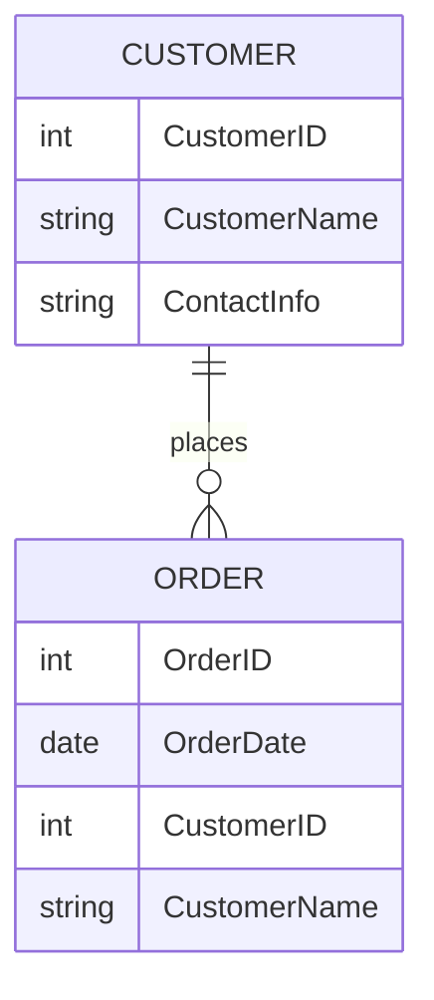

## 2.6 Denormalization Techniques

In the realm of relational database design, normalization is a fundamental principle that ensures data integrity and minimizes redundancy. However, there are scenarios where denormalization—intentionally introducing redundancy—can significantly enhance performance. In this section, we will delve into the concept of denormalization, explore common techniques, and discuss the trade-offs involved.

### Understanding Denormalization

Denormalization is the process of restructuring a normalized database to improve read performance by reducing the number of joins needed to retrieve data. While normalization focuses on eliminating redundancy to maintain data integrity, denormalization strategically reintroduces redundancy to optimize performance.

#### Key Concepts

- **Redundancy**: The intentional duplication of data to reduce the complexity of queries.
- **Performance Optimization**: Enhancing query speed by minimizing the need for complex joins.
- **Trade-offs**: Balancing the benefits of faster reads against potential data anomalies and increased maintenance.

### When to Consider Denormalization

Denormalization is not a one-size-fits-all solution. It is crucial to evaluate the specific needs of your application and database workload. Consider denormalization when:

- **Read Performance is Critical**: Applications with high read-to-write ratios can benefit from denormalization.
- **Complex Queries**: When queries involve multiple joins, denormalization can simplify data retrieval.
- **Pre-aggregated Data is Needed**: For reporting and analytics, storing summary data can improve performance.

### Common Denormalization Techniques

Let's explore some common denormalization techniques and how they can be applied effectively.

#### 1. Adding Redundant Columns

One of the simplest forms of denormalization is adding redundant columns to a table. This technique involves duplicating data from related tables to reduce the need for joins.

**Example:**

Consider a normalized database with `Orders` and `Customers` tables. To retrieve customer names along with order details, a join is required:

```sql
SELECT Orders.OrderID, Orders.OrderDate, Customers.CustomerName
FROM Orders
JOIN Customers ON Orders.CustomerID = Customers.CustomerID;
```

By adding a `CustomerName` column directly to the `Orders` table, we can eliminate the join:

```sql
SELECT OrderID, OrderDate, CustomerName
FROM Orders;
```

**Benefits:**

- **Faster Reads**: Reduces the need for joins, improving query performance.
- **Simplified Queries**: Queries become less complex and easier to maintain.

**Risks:**

- **Data Anomalies**: Changes in customer names require updates in multiple places.
- **Increased Storage**: Additional storage is needed for redundant data.

#### 2. Pre-aggregating Data

Pre-aggregating data involves storing summary information, such as totals or averages, to speed up analytical queries.

**Example:**

In a sales database, calculating total sales for each product can be resource-intensive. By pre-aggregating this data, we can store it in a separate table:

```sql
CREATE TABLE ProductSalesSummary (
    ProductID INT PRIMARY KEY,
    TotalSales DECIMAL(10, 2)
);

-- Update the summary table periodically
INSERT INTO ProductSalesSummary (ProductID, TotalSales)
SELECT ProductID, SUM(SaleAmount)
FROM Sales
GROUP BY ProductID;
```

**Benefits:**

- **Improved Query Performance**: Reduces the need for complex aggregations at runtime.
- **Efficient Reporting**: Facilitates fast generation of reports and dashboards.

**Risks:**

- **Data Staleness**: Summary data may become outdated if not updated regularly.
- **Complex Maintenance**: Requires additional logic to keep summary data in sync.

### Visualizing Denormalization

To better understand the impact of denormalization, let's visualize a scenario where denormalization is applied to a database schema.



**Diagram Description:**

- The `CUSTOMER` table contains customer details.
- The `ORDER` table includes a redundant `CustomerName` column to avoid joins with the `CUSTOMER` table.

### Design Considerations

When implementing denormalization, consider the following:

- **Data Consistency**: Ensure mechanisms are in place to maintain data consistency across redundant columns.
- **Update Frequency**: Evaluate how often data changes and the impact on maintenance.
- **Storage Costs**: Assess the trade-off between improved performance and increased storage requirements.

### Differences and Similarities with Normalization

Denormalization and normalization are complementary techniques. While normalization focuses on eliminating redundancy to ensure data integrity, denormalization strategically reintroduces redundancy to optimize performance. Understanding when to apply each technique is crucial for effective database design.

### Try It Yourself

Experiment with denormalization by modifying the following code example:

```sql
-- Original normalized query
SELECT Orders.OrderID, Orders.OrderDate, Customers.CustomerName
FROM Orders
JOIN Customers ON Orders.CustomerID = Customers.CustomerID;

-- Denormalized version
SELECT OrderID, OrderDate, CustomerName
FROM Orders;
```

**Challenge:** Add a redundant column to another table in your database and observe the impact on query performance.

### References and Further Reading

- [SQL Performance Tuning](https://www.sqlshack.com/sql-performance-tuning/)
- [Database Denormalization](https://www.geeksforgeeks.org/database-denormalization/)
- [Normalization vs. Denormalization](https://www.tutorialspoint.com/dbms/dbms_normalization.htm)

### Knowledge Check

- **Question:** What is the primary goal of denormalization?
- **Exercise:** Identify a table in your database that could benefit from denormalization and implement a redundant column.

### Embrace the Journey

Remember, denormalization is a powerful tool in your database design arsenal. By strategically introducing redundancy, you can achieve significant performance gains. Keep experimenting, stay curious, and enjoy the journey of mastering SQL design patterns!

## Quiz Time!



### What is the primary purpose of denormalization in database design?

- [x] To improve read performance by reducing the need for joins
- [ ] To eliminate data redundancy
- [ ] To ensure data integrity
- [ ] To simplify database schema design

> **Explanation:** Denormalization is primarily used to improve read performance by reducing the need for complex joins.

### Which of the following is a common denormalization technique?

- [x] Adding redundant columns
- [ ] Removing primary keys
- [ ] Normalizing data
- [ ] Using foreign keys

> **Explanation:** Adding redundant columns is a common denormalization technique to reduce the need for joins.

### What is a potential risk of denormalization?

- [x] Data anomalies
- [ ] Improved query performance
- [ ] Reduced storage requirements
- [ ] Simplified queries

> **Explanation:** Denormalization can lead to data anomalies due to redundant data.

### How can pre-aggregating data benefit a database?

- [x] By improving query performance
- [ ] By increasing data redundancy
- [ ] By reducing data integrity
- [ ] By complicating maintenance

> **Explanation:** Pre-aggregating data improves query performance by reducing the need for runtime aggregations.

### What should be considered when implementing denormalization?

- [x] Data consistency
- [x] Update frequency
- [ ] Eliminating redundancy
- [ ] Reducing storage costs

> **Explanation:** Data consistency and update frequency are important considerations when implementing denormalization.

### Which of the following is NOT a benefit of denormalization?

- [ ] Faster reads
- [ ] Simplified queries
- [x] Reduced storage requirements
- [ ] Improved query performance

> **Explanation:** Denormalization often increases storage requirements due to redundant data.

### What is a trade-off of denormalization?

- [x] Increased maintenance complexity
- [ ] Improved data integrity
- [ ] Simplified database schema
- [ ] Reduced query performance

> **Explanation:** Denormalization can increase maintenance complexity due to redundant data.

### In which scenario is denormalization most beneficial?

- [x] High read-to-write ratio
- [ ] High write-to-read ratio
- [ ] Low data redundancy
- [ ] Low query complexity

> **Explanation:** Denormalization is most beneficial in scenarios with a high read-to-write ratio.

### True or False: Denormalization always improves database performance.

- [ ] True
- [x] False

> **Explanation:** Denormalization does not always improve performance; it depends on the specific use case and workload.

### What is the relationship between normalization and denormalization?

- [x] Complementary techniques
- [ ] Opposing techniques
- [ ] Identical techniques
- [ ] Unrelated techniques

> **Explanation:** Normalization and denormalization are complementary techniques used to balance data integrity and performance.


