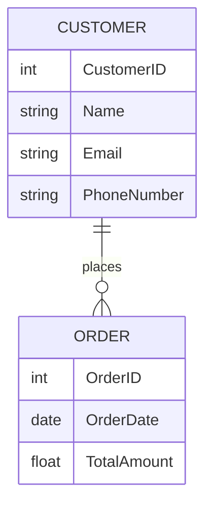
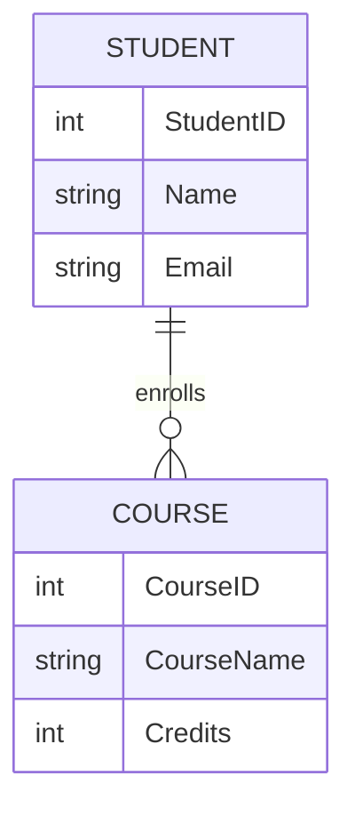
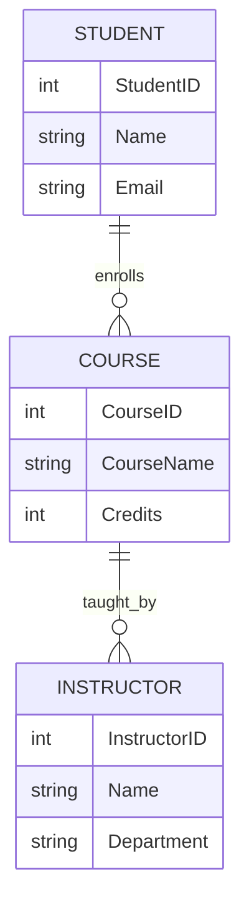

## 2.7 Entity-Relationship Modeling

Entity-Relationship (ER) Modeling is a foundational component of database design, providing a structured approach to visualize and organize data. This section delves into the conceptual design of databases, focusing on entities, attributes, and relationships. We will explore ER diagrams, cardinality, and optionality, equipping you with the knowledge to design robust and efficient databases.

### Conceptual Design: Visualizing Entities, Attributes, and Relationships

**Conceptual Design** is the initial step in database design, where we abstractly define the structure of the database. This involves identifying the entities, their attributes, and the relationships between them. The goal is to create a clear and comprehensive blueprint that guides the physical implementation of the database.

#### Entities

An **entity** represents a real-world object or concept within the database. Entities are typically nouns, such as "Customer," "Order," or "Product." Each entity is characterized by a set of attributes that describe its properties.

#### Attributes

**Attributes** are the data elements that define the characteristics of an entity. For example, a "Customer" entity might have attributes like "CustomerID," "Name," "Email," and "PhoneNumber." Attributes can be simple (atomic) or composite (composed of multiple sub-attributes).

#### Relationships

**Relationships** define how entities interact with each other. They are typically verbs, such as "buys," "owns," or "manages." Relationships can be one-to-one, one-to-many, or many-to-many, and they often have attributes of their own.

### ER Diagrams: Using Notation to Represent Database Structure

ER diagrams are graphical representations of entities, attributes, and relationships. They serve as a visual tool to communicate the database design to stakeholders and guide the development process.

#### Components of ER Diagrams

1. **Entities**: Represented by rectangles, entities are labeled with their names.
2. **Attributes**: Represented by ovals connected to their respective entities. Key attributes are underlined.
3. **Relationships**: Represented by diamonds, with lines connecting them to the involved entities.

#### Example ER Diagram

Below is a simple ER diagram illustrating a "Customer" and "Order" relationship:



**Diagram Description**: This ER diagram shows a one-to-many relationship between "Customer" and "Order," indicating that a customer can place multiple orders.

### Cardinality and Optionality: Defining the Nature of Relationships

**Cardinality** and **optionality** are crucial concepts in defining the nature of relationships between entities.

#### Cardinality

Cardinality specifies the number of instances of one entity that can or must be associated with each instance of another entity. The common types of cardinality are:

- **One-to-One (1:1)**: Each instance of an entity is associated with exactly one instance of another entity.
- **One-to-Many (1:N)**: An instance of one entity can be associated with multiple instances of another entity.
- **Many-to-Many (M:N)**: Instances of both entities can be associated with multiple instances of each other.

#### Optionality

Optionality indicates whether a relationship is mandatory or optional. It defines whether an entity must participate in a relationship.

- **Mandatory**: An entity must participate in the relationship.
- **Optional**: An entity may or may not participate in the relationship.

#### Example of Cardinality and Optionality

Consider a "Student" and "Course" relationship:



**Diagram Description**: This ER diagram shows a many-to-many relationship between "Student" and "Course," indicating that a student can enroll in multiple courses, and a course can have multiple students. The optionality is represented by the open circle, indicating that a student may not be enrolled in any course.

### Key Participants in ER Modeling

1. **Database Designers**: Responsible for creating the ER model and ensuring it accurately represents the data requirements.
2. **Stakeholders**: Provide input and feedback on the ER model to ensure it aligns with business needs.
3. **Developers**: Use the ER model as a blueprint for implementing the database.

### Applicability of ER Modeling

ER modeling is applicable in various scenarios, including:

- Designing new databases from scratch.
- Re-engineering existing databases to improve structure and efficiency.
- Communicating database design to non-technical stakeholders.

### Sample Code Snippet

Let's consider a SQL implementation of the "Customer" and "Order" relationship:

```sql
CREATE TABLE Customer (
    CustomerID INT PRIMARY KEY,
    Name VARCHAR(100),
    Email VARCHAR(100),
    PhoneNumber VARCHAR(15)
);

CREATE TABLE Order (
    OrderID INT PRIMARY KEY,
    OrderDate DATE,
    TotalAmount DECIMAL(10, 2),
    CustomerID INT,
    FOREIGN KEY (CustomerID) REFERENCES Customer(CustomerID)
);
```

**Code Explanation**: This SQL code creates two tables, "Customer" and "Order," with a foreign key relationship indicating that each order is placed by a customer.

### Design Considerations

- **Normalization**: Ensure the database is normalized to eliminate redundancy and improve data integrity.
- **Scalability**: Design the ER model to accommodate future growth and changes in data requirements.
- **Performance**: Consider indexing strategies to optimize query performance.

### Differences and Similarities

ER modeling is often confused with other data modeling techniques, such as:

- **UML Class Diagrams**: While similar, UML class diagrams are used in object-oriented design and include methods in addition to attributes.
- **Logical Data Models**: Focus on the structure of the data without considering physical storage details.

### Try It Yourself

Experiment with the ER diagram and SQL code provided. Try adding new entities, attributes, or relationships to see how they affect the overall design. Consider how changes in cardinality or optionality might impact the database structure.

### Visualizing ER Modeling

To further enhance understanding, let's visualize a more complex ER model involving "Student," "Course," and "Instructor":



**Diagram Description**: This ER diagram illustrates a many-to-many relationship between "Student" and "Course," and a one-to-many relationship between "Course" and "Instructor."

### Knowledge Check

- What are the key components of an ER diagram?
- How does cardinality affect the design of a database?
- Why is optionality important in defining relationships?

### Embrace the Journey

Remember, mastering ER modeling is a journey. As you progress, you'll develop more complex models and gain deeper insights into database design. Keep experimenting, stay curious, and enjoy the process!

### References and Links

- [ER Diagrams - W3Schools](https://www.w3schools.com/sql/sql_er.asp)
- [Entity-Relationship Model - Wikipedia](https://en.wikipedia.org/wiki/Entity%E2%80%93relationship_model)

## Quiz Time!



### What is an entity in ER modeling?

- [x] A real-world object or concept represented in the database
- [ ] A relationship between two tables
- [ ] A type of SQL query
- [ ] A database constraint

> **Explanation:** An entity represents a real-world object or concept within the database, such as "Customer" or "Order."

### What does cardinality define in a relationship?

- [x] The number of instances of one entity associated with another
- [ ] The attributes of an entity
- [ ] The primary key of a table
- [ ] The data type of a column

> **Explanation:** Cardinality specifies the number of instances of one entity that can or must be associated with each instance of another entity.

### Which symbol represents an entity in an ER diagram?

- [x] Rectangle
- [ ] Oval
- [ ] Diamond
- [ ] Circle

> **Explanation:** Entities are represented by rectangles in ER diagrams.

### What is the purpose of optionality in relationships?

- [x] To indicate whether participation in a relationship is mandatory or optional
- [ ] To define the attributes of an entity
- [ ] To specify the primary key of a table
- [ ] To determine the data type of a column

> **Explanation:** Optionality indicates whether an entity must participate in a relationship or if participation is optional.

### Which of the following is a one-to-many relationship?

- [x] A customer can place multiple orders
- [ ] A student can enroll in only one course
- [ ] An instructor can teach only one course
- [ ] A product can belong to only one category

> **Explanation:** A one-to-many relationship means one instance of an entity can be associated with multiple instances of another entity, such as a customer placing multiple orders.

### What is the role of attributes in ER modeling?

- [x] To define the characteristics of an entity
- [ ] To represent relationships between entities
- [ ] To specify the primary key of a table
- [ ] To determine the data type of a column

> **Explanation:** Attributes are data elements that define the characteristics of an entity, such as "Name" or "Email" for a "Customer."

### How are relationships represented in ER diagrams?

- [x] Diamonds
- [ ] Rectangles
- [ ] Ovals
- [ ] Circles

> **Explanation:** Relationships are represented by diamonds in ER diagrams.

### What is a composite attribute?

- [x] An attribute composed of multiple sub-attributes
- [ ] An attribute that serves as a primary key
- [ ] An attribute that is optional
- [ ] An attribute that is unique

> **Explanation:** A composite attribute is composed of multiple sub-attributes, such as "Address" being composed of "Street," "City," and "ZipCode."

### What does a foreign key represent in a database?

- [x] A reference to a primary key in another table
- [ ] A unique identifier for a table
- [ ] A mandatory attribute
- [ ] A composite attribute

> **Explanation:** A foreign key is a reference to a primary key in another table, establishing a relationship between the two tables.

### True or False: ER modeling is only used for designing new databases.

- [ ] True
- [x] False

> **Explanation:** ER modeling is used for designing new databases, re-engineering existing databases, and communicating database design to stakeholders.


