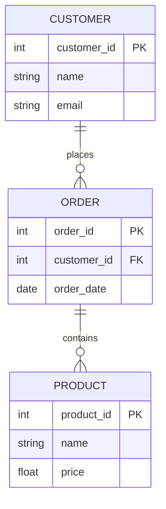
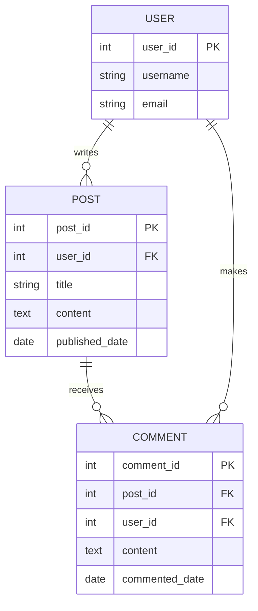

## 2.8 Data Modeling Best Practices

In the realm of SQL and relational databases, data modeling is a critical step that lays the foundation for efficient, scalable, and maintainable database systems. As expert software engineers and architects, understanding and applying best practices in data modeling is essential to ensure that your database solutions meet the needs of modern applications. In this section, we will delve into the key principles of data modeling best practices, focusing on clarity and simplicity, consistency, documentation, and iterative design.

### Clarity and Simplicity

**Clarity and simplicity** are paramount in data modeling. A clear and simple model is easier to understand, maintain, and extend. Here are some strategies to achieve clarity and simplicity in your data models:

1. **Use Descriptive Naming Conventions**: Choose clear and descriptive names for tables, columns, and other database objects. Avoid abbreviations and cryptic names that can confuse future developers or stakeholders.

2. **Normalize Data**: Apply normalization principles to eliminate redundancy and ensure data integrity. While normalization can sometimes lead to more complex queries, it simplifies data maintenance and reduces the risk of anomalies.

3. **Avoid Over-Engineering**: Resist the temptation to design overly complex models that anticipate every possible future requirement. Focus on current needs and design for flexibility and scalability.

4. **Simplify Relationships**: Use straightforward relationships between tables. For example, prefer one-to-many relationships over many-to-many relationships, which can complicate queries and data integrity.

5. **Visualize Models**: Use diagrams to represent your data models visually. Tools like Entity-Relationship Diagrams (ERDs) can help communicate the structure and relationships within your database.

#### Example: Simplifying a Data Model

Consider a simple e-commerce database with tables for `Customers`, `Orders`, and `Products`. A clear and simple model might look like this:



In this diagram, we see a straightforward representation of the relationships between customers, orders, and products. The use of primary keys (PK) and foreign keys (FK) is clearly indicated, enhancing clarity.

### Consistency

**Consistency** in data modeling ensures that your database is predictable and easy to work with. Here are some practices to maintain consistency:

1. **Standard Naming Conventions**: Establish and adhere to naming conventions for tables, columns, indexes, and other database objects. For example, use singular nouns for table names (`Customer` instead of `Customers`) and snake_case for column names (`order_date`).

2. **Consistent Data Types**: Use consistent data types across your database. For example, if you use `VARCHAR(255)` for email addresses in one table, use the same data type in other tables.

3. **Uniform Indexing Strategies**: Apply consistent indexing strategies to optimize query performance. Decide on a standard approach for indexing primary keys, foreign keys, and frequently queried columns.

4. **Consistent Use of Constraints**: Use constraints consistently to enforce data integrity. For example, apply `NOT NULL` constraints where appropriate and use foreign key constraints to maintain referential integrity.

5. **Version Control**: Use version control systems to track changes to your data models. This practice ensures that changes are documented and can be reviewed or reverted if necessary.

#### Example: Consistent Naming Conventions

Let's consider a database for a library system. Consistent naming conventions might look like this:

```sql
CREATE TABLE Book (
    book_id INT PRIMARY KEY,
    title VARCHAR(255) NOT NULL,
    author_id INT,
    published_date DATE
);

CREATE TABLE Author (
    author_id INT PRIMARY KEY,
    name VARCHAR(255) NOT NULL
);
```

In this example, we use singular nouns for table names (`Book`, `Author`) and snake_case for column names (`book_id`, `published_date`). This consistency makes the database easier to understand and work with.

### Documentation

**Documentation** is a crucial aspect of data modeling that is often overlooked. Proper documentation ensures that your data models are understandable and maintainable over time. Here are some best practices for documenting your data models:

1. **Document Design Decisions**: Record the rationale behind key design decisions, such as why certain tables or relationships were created. This documentation can be invaluable for future developers or stakeholders.

2. **Use Comments in SQL Code**: Include comments in your SQL code to explain complex queries, constraints, or other important aspects of your data model.

3. **Maintain an ERD**: Keep an up-to-date Entity-Relationship Diagram (ERD) that visually represents your data model. This diagram can serve as a quick reference for understanding the structure and relationships within your database.

4. **Create a Data Dictionary**: Develop a data dictionary that defines each table, column, and relationship in your database. Include information about data types, constraints, and any other relevant details.

5. **Versioned Documentation**: Use version control for your documentation to track changes and ensure that it remains current and accurate.

#### Example: Documenting a Data Model

Consider a database for a university system. Documentation might include:

- **ERD**: A diagram showing tables for `Students`, `Courses`, and `Enrollments`.
- **Data Dictionary**: A document describing each table and column, including data types and constraints.
- **Design Decisions**: Notes explaining why certain tables were created and how relationships were determined.

### Iterative Design

**Iterative design** is a process of refining and improving your data models based on feedback and testing. This approach allows you to adapt to changing requirements and improve the quality of your database over time. Here are some best practices for iterative design:

1. **Prototype and Test**: Create prototypes of your data models and test them with real data and queries. Use feedback from testing to refine and improve your models.

2. **Incorporate Feedback**: Gather feedback from stakeholders, developers, and users to identify areas for improvement. Use this feedback to guide your iterative design process.

3. **Continuous Improvement**: Treat your data models as living documents that can be improved over time. Regularly review and update your models to address new requirements or optimize performance.

4. **Agile Methodologies**: Apply agile methodologies to your data modeling process. Use sprints, iterations, and regular reviews to ensure that your models meet the needs of your project.

5. **Automated Testing**: Implement automated testing for your data models to ensure that changes do not introduce errors or degrade performance.

#### Example: Iterative Design in Action

Imagine a database for a social media platform. An iterative design process might involve:

- **Prototyping**: Creating an initial model with tables for `Users`, `Posts`, and `Comments`.
- **Testing**: Running queries and performance tests to identify bottlenecks or issues.
- **Feedback**: Gathering feedback from developers and users to identify areas for improvement.
- **Refinement**: Updating the model to address feedback and optimize performance.

### Try It Yourself

To reinforce these concepts, try modifying the following code example to practice applying data modeling best practices:

```sql
CREATE TABLE Employee (
    emp_id INT PRIMARY KEY,
    emp_name VARCHAR(255),
    dept_id INT,
    hire_date DATE
);

CREATE TABLE Department (
    dept_id INT PRIMARY KEY,
    dept_name VARCHAR(255)
);
```

**Suggestions for Experimentation:**

- **Rename Columns**: Use more descriptive names for columns, such as `employee_id` and `department_id`.
- **Add Constraints**: Add `NOT NULL` constraints to columns where appropriate.
- **Normalize Data**: Consider whether additional normalization is needed, such as creating a separate table for employee addresses.

### Visualizing Data Modeling Best Practices

To further illustrate these concepts, let's visualize a data model for a simple blog application using a Mermaid.js diagram:



This diagram shows the relationships between users, posts, and comments in a blog application. It highlights the use of primary keys (PK) and foreign keys (FK) to maintain data integrity.

### References and Links

For further reading on data modeling best practices, consider the following resources:

- [Database Design Basics](https://www.microsoft.com/en-us/microsoft-365/access/database-design-basics)
- [Normalization in Database Design](https://www.essentialsql.com/get-ready-to-learn-sql-database-normalization-explained-in-simple-english/)
- [Entity-Relationship Diagrams (ERDs)](https://www.lucidchart.com/pages/er-diagrams)

### Knowledge Check

To test your understanding of data modeling best practices, consider the following questions:

1. What are the benefits of using descriptive naming conventions in data modeling?
2. How does normalization contribute to data integrity?
3. Why is it important to maintain consistent data types across a database?
4. What role does documentation play in data modeling?
5. How can iterative design improve the quality of a data model?

### Embrace the Journey

Remember, mastering data modeling best practices is an ongoing journey. As you continue to refine your skills, you'll build more efficient and scalable database solutions. Keep experimenting, stay curious, and enjoy the process!

## Quiz Time!



### What is a key benefit of using descriptive naming conventions in data modeling?

- [x] Improves clarity and understanding
- [ ] Reduces database size
- [ ] Increases query speed
- [ ] Eliminates the need for documentation

> **Explanation:** Descriptive naming conventions improve clarity and understanding, making it easier for developers and stakeholders to work with the database.

### How does normalization contribute to data integrity?

- [x] By eliminating redundancy and ensuring consistency
- [ ] By increasing query complexity
- [ ] By reducing the number of tables
- [ ] By simplifying relationships

> **Explanation:** Normalization eliminates redundancy and ensures consistency, which contributes to data integrity.

### Why is it important to maintain consistent data types across a database?

- [x] To ensure predictability and ease of use
- [ ] To reduce storage requirements
- [ ] To increase performance
- [ ] To eliminate the need for indexing

> **Explanation:** Consistent data types ensure predictability and ease of use, making the database more manageable.

### What role does documentation play in data modeling?

- [x] It ensures models are understandable and maintainable
- [ ] It reduces the need for testing
- [ ] It increases database performance
- [ ] It eliminates the need for comments in code

> **Explanation:** Documentation ensures that data models are understandable and maintainable over time.

### How can iterative design improve the quality of a data model?

- [x] By incorporating feedback and refining models
- [ ] By reducing the number of tables
- [ ] By eliminating the need for constraints
- [ ] By simplifying queries

> **Explanation:** Iterative design improves the quality of a data model by incorporating feedback and refining models based on testing and stakeholder input.

### What is the purpose of using an ERD in data modeling?

- [x] To visually represent the structure and relationships within a database
- [ ] To increase database performance
- [ ] To reduce the number of tables
- [ ] To eliminate the need for documentation

> **Explanation:** An ERD visually represents the structure and relationships within a database, aiding in understanding and communication.

### Why should you use version control for your data models?

- [x] To track changes and ensure documentation remains current
- [ ] To increase query speed
- [ ] To reduce storage requirements
- [ ] To eliminate the need for testing

> **Explanation:** Version control tracks changes and ensures that documentation remains current and accurate.

### What is a benefit of using automated testing in data modeling?

- [x] It ensures changes do not introduce errors or degrade performance
- [ ] It increases database size
- [ ] It reduces the need for documentation
- [ ] It eliminates the need for constraints

> **Explanation:** Automated testing ensures that changes do not introduce errors or degrade performance, maintaining the quality of the data model.

### How can feedback from stakeholders improve a data model?

- [x] By identifying areas for improvement and guiding iterative design
- [ ] By reducing the number of tables
- [ ] By increasing query complexity
- [ ] By eliminating the need for documentation

> **Explanation:** Feedback from stakeholders identifies areas for improvement and guides the iterative design process.

### True or False: Over-engineering a data model can lead to unnecessary complexity and maintenance challenges.

- [x] True
- [ ] False

> **Explanation:** Over-engineering a data model can lead to unnecessary complexity and maintenance challenges, making it harder to manage and extend.


