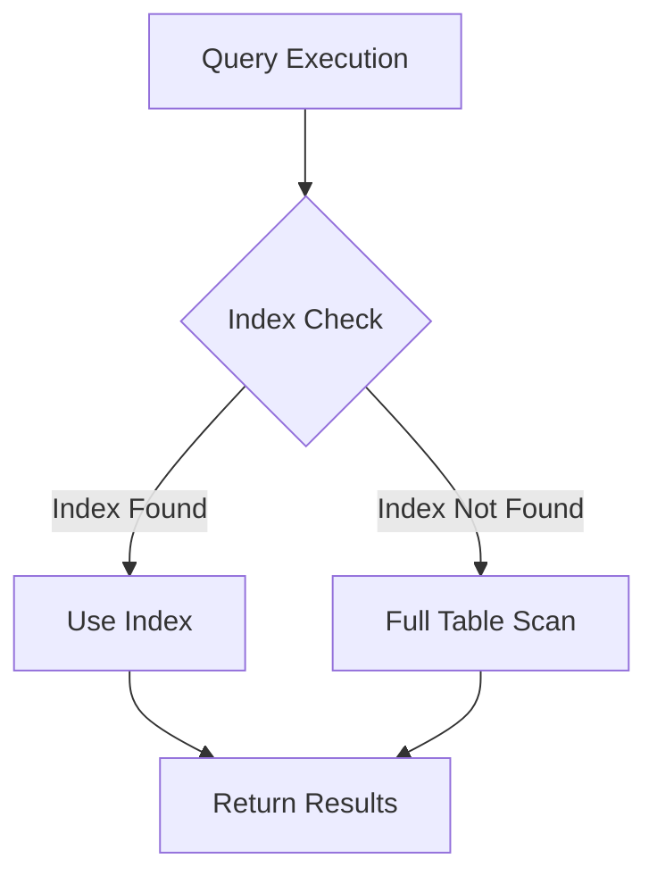

## 20.10 Frequently Asked Questions (FAQ)

In this section, we address some of the most common questions and concerns that expert software engineers and architects encounter when working with SQL design patterns. Whether you're troubleshooting a specific issue or seeking best practices for SQL development, this FAQ provides valuable insights and solutions.

### Common Concerns

#### What are SQL Design Patterns and Why Are They Important?

SQL design patterns are reusable solutions to common problems encountered in database design and query optimization. They help ensure that databases are efficient, scalable, and maintainable. By using design patterns, developers can avoid reinventing the wheel and instead rely on proven strategies to solve complex database challenges.

#### How Do I Choose the Right SQL Design Pattern for My Project?

Choosing the right SQL design pattern depends on the specific requirements and constraints of your project. Consider factors such as data volume, query complexity, and performance needs. For instance, if you need to handle hierarchical data, you might choose the Nested Set Model or Closure Table Pattern. Evaluate the trade-offs of each pattern and select the one that best aligns with your goals.

#### What Are the Best Practices for Writing Efficient SQL Queries?

To write efficient SQL queries, follow these best practices:
- **Use Indexes Wisely**: Indexes can significantly speed up query performance, but they also add overhead. Use them judiciously.
- **Avoid SELECT ***: Specify only the columns you need to reduce data retrieval time.
- **Optimize Joins**: Use appropriate join types and conditions to minimize data processing.
- **Leverage CTEs and Subqueries**: Use Common Table Expressions (CTEs) and subqueries to simplify complex queries.
- **Analyze Execution Plans**: Use query execution plans to identify bottlenecks and optimize performance.

#### How Can I Improve Database Security in SQL?

Improving database security involves several strategies:
- **Implement Role-Based Access Control (RBAC)**: Define roles and permissions to control access to sensitive data.
- **Use Encryption**: Encrypt data at rest and in transit to protect against unauthorized access.
- **Prevent SQL Injection**: Use parameterized queries and stored procedures to mitigate SQL injection risks.
- **Regularly Audit and Monitor**: Conduct security audits and monitor database activity for suspicious behavior.

#### What Are the Common SQL Anti-Patterns to Avoid?

Avoid these common SQL anti-patterns to ensure optimal database performance:
- **The God Table**: Avoid creating overly large tables with too many columns.
- **Implicit Columns (SELECT *)**: Always specify the columns you need.
- **Neglecting Indexes**: Failing to use indexes can lead to slow query performance.
- **Nested Transactions Misuse**: Avoid unnecessary nested transactions that can complicate error handling.

### Troubleshooting

#### How Do I Resolve Deadlocks in SQL?

Deadlocks occur when two or more transactions block each other, waiting for resources held by the other. To resolve deadlocks:
- **Identify the Cause**: Use database logs and monitoring tools to identify the transactions involved.
- **Implement Retry Logic**: Design your application to retry transactions that fail due to deadlocks.
- **Optimize Transaction Design**: Keep transactions short and minimize locking by accessing resources in a consistent order.

#### What Should I Do If My Queries Are Running Slowly?

If your queries are running slowly, consider the following steps:
- **Analyze Execution Plans**: Use execution plans to identify slow operations and optimize them.
- **Check Index Usage**: Ensure that appropriate indexes are being used and consider adding new ones if necessary.
- **Optimize Joins and Subqueries**: Review join conditions and subqueries for inefficiencies.
- **Consider Denormalization**: In some cases, denormalizing data can improve query performance.

#### How Can I Handle Large Volumes of Data Efficiently?

Handling large volumes of data efficiently requires careful planning:
- **Partition Data**: Use partitioning to divide large tables into smaller, more manageable pieces.
- **Use Batch Processing**: Process data in batches to reduce memory usage and improve performance.
- **Leverage In-Memory Tables**: Use in-memory tables for frequently accessed data to speed up retrieval.

#### How Do I Ensure Data Integrity in My Database?

Ensuring data integrity involves implementing constraints and validation mechanisms:
- **Use Constraints**: Define primary keys, foreign keys, unique constraints, and check constraints to enforce data integrity.
- **Implement Triggers**: Use triggers to enforce business rules and validate data changes.
- **Regularly Audit Data**: Conduct regular audits to identify and correct data integrity issues.

#### What Are the Best Practices for Database Backup and Recovery?

To ensure reliable database backup and recovery:
- **Regularly Schedule Backups**: Automate regular backups to prevent data loss.
- **Test Recovery Procedures**: Regularly test your recovery procedures to ensure they work as expected.
- **Use Incremental Backups**: Use incremental backups to reduce storage requirements and speed up recovery.

### Code Examples

#### Example: Optimizing a Slow Query

```sql
-- Original slow query
SELECT * FROM orders
WHERE customer_id = 123
AND order_date BETWEEN '2024-01-01' AND '2024-12-31';

-- Optimized query with index usage
CREATE INDEX idx_customer_order_date ON orders(customer_id, order_date);

SELECT order_id, order_date, total_amount FROM orders
WHERE customer_id = 123
AND order_date BETWEEN '2024-01-01' AND '2024-12-31';
```

> **Explanation:** The optimized query uses an index on `customer_id` and `order_date` to speed up data retrieval.

#### Example: Preventing SQL Injection

```sql
-- Vulnerable query
String query = "SELECT * FROM users WHERE username = '" + username + "'";

-- Secure query using parameterized statements
PreparedStatement pstmt = connection.prepareStatement("SELECT * FROM users WHERE username = ?");
pstmt.setString(1, username);
ResultSet rs = pstmt.executeQuery();
```

> **Explanation:** Using parameterized statements prevents SQL injection by separating SQL code from data input.

### Visualizing SQL Concepts

#### Visualizing Index Usage



> **Diagram Description:** This flowchart illustrates the decision-making process during query execution, showing how the presence of an index can lead to faster data retrieval.

### Knowledge Check

#### What is the Role of Normalization in Database Design?

Normalization is the process of organizing data to minimize redundancy and improve data integrity. It involves dividing a database into tables and defining relationships between them. Normalization helps ensure that data is stored efficiently and consistently.

#### How Do I Implement Role-Based Access Control (RBAC) in SQL?

To implement RBAC, define roles and assign permissions to each role. Use SQL commands to grant and revoke permissions based on roles. This approach simplifies access management and enhances security.

#### What Are the Benefits of Using Stored Procedures?

Stored procedures offer several benefits:
- **Performance**: They can improve performance by reducing network traffic and reusing execution plans.
- **Security**: They provide an additional layer of security by encapsulating SQL logic.
- **Maintainability**: They centralize business logic, making it easier to maintain and update.

### References and Links

- [SQL Design Patterns](https://www.sqlpatterns.com)
- [Database Optimization Techniques](https://www.databaseoptimization.com)
- [SQL Security Best Practices](https://www.sqlsecurity.com)

### Embrace the Journey

Remember, mastering SQL design patterns is a continuous journey. As you gain experience, you'll develop a deeper understanding of how to apply these patterns effectively. Keep experimenting, stay curious, and enjoy the process of building robust and efficient database solutions.

## Quiz Time!



### What is the primary purpose of SQL design patterns?

- [x] To provide reusable solutions to common database problems
- [ ] To create complex SQL queries
- [ ] To replace database administrators
- [ ] To eliminate the need for indexes

> **Explanation:** SQL design patterns offer reusable solutions to common database problems, improving efficiency and maintainability.

### Which SQL feature helps prevent SQL injection attacks?

- [ ] SELECT *
- [x] Parameterized queries
- [ ] Nested transactions
- [ ] Full table scans

> **Explanation:** Parameterized queries separate SQL code from data input, preventing SQL injection attacks.

### What is the benefit of using indexes in SQL?

- [x] They speed up data retrieval
- [ ] They increase data redundancy
- [ ] They eliminate the need for joins
- [ ] They simplify query syntax

> **Explanation:** Indexes speed up data retrieval by allowing the database to quickly locate rows based on indexed columns.

### How can you resolve deadlocks in SQL?

- [x] Implement retry logic
- [ ] Use SELECT *
- [ ] Increase transaction size
- [ ] Disable constraints

> **Explanation:** Implementing retry logic allows transactions to be retried if they fail due to deadlocks.

### What is a common SQL anti-pattern?

- [x] The God Table
- [ ] Using indexes
- [ ] Parameterized queries
- [ ] Normalization

> **Explanation:** The God Table is an anti-pattern where a table has too many columns, leading to inefficiencies.

### What is the role of normalization in database design?

- [x] To minimize redundancy and improve data integrity
- [ ] To increase data redundancy
- [ ] To simplify query syntax
- [ ] To eliminate the need for indexes

> **Explanation:** Normalization minimizes redundancy and improves data integrity by organizing data into related tables.

### How can you improve database security?

- [x] Implement Role-Based Access Control (RBAC)
- [ ] Use SELECT *
- [ ] Disable constraints
- [ ] Increase transaction size

> **Explanation:** Implementing RBAC enhances security by controlling access based on roles and permissions.

### What is the benefit of using stored procedures?

- [x] They improve performance and security
- [ ] They increase data redundancy
- [ ] They eliminate the need for indexes
- [ ] They simplify query syntax

> **Explanation:** Stored procedures improve performance by reducing network traffic and enhance security by encapsulating SQL logic.

### How can you handle large volumes of data efficiently?

- [x] Use partitioning and batch processing
- [ ] Use SELECT *
- [ ] Increase transaction size
- [ ] Disable constraints

> **Explanation:** Partitioning and batch processing help manage large volumes of data efficiently by dividing data into manageable pieces.

### True or False: Denormalization can sometimes improve query performance.

- [x] True
- [ ] False

> **Explanation:** Denormalization can improve query performance by reducing the need for complex joins, but it may increase data redundancy.


