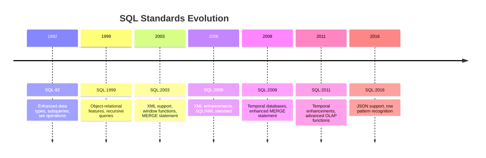

## 20.2 SQL Standards Reference (SQL-92 to SQL:2016)

In the ever-evolving landscape of database management, SQL (Structured Query Language) has been a cornerstone for relational database systems. Understanding the progression of SQL standards is crucial for expert software engineers and architects aiming to leverage the full potential of SQL in modern applications. This section provides a comprehensive overview of the evolution of SQL standards from SQL-92 to SQL:2016, highlighting key features and enhancements introduced in each revision. Additionally, we will compare the compliance levels among different RDBMS (Relational Database Management Systems) to help you make informed decisions in your database design and implementation.

### Evolution of SQL Standards

SQL standards have undergone significant changes since their inception, with each revision introducing new features, improving existing functionalities, and addressing the needs of modern data architectures. Let's explore each major SQL standard revision in detail:

#### SQL-92 (SQL2)

**Released**: 1992

**Key Features**:
- **Enhanced Data Types**: SQL-92 introduced new data types such as DATE, TIME, and TIMESTAMP, providing more robust support for date and time operations.
- **Subqueries**: Support for subqueries in the `FROM` clause, allowing more complex query structures.
- **Set Operations**: Introduction of set operations like `UNION`, `INTERSECT`, and `EXCEPT`.
- **String Operations**: Enhanced string manipulation capabilities with functions like `UPPER`, `LOWER`, `TRIM`, and `SUBSTRING`.
- **Constraints**: Improved support for constraints, including `CHECK` constraints for data validation.

**Example**:
```sql
-- Using a subquery in the FROM clause
SELECT department_name, AVG(salary) AS average_salary
FROM (
    SELECT department_id, salary
    FROM employees
) AS dept_salaries
GROUP BY department_name;
```

#### SQL:1999 (SQL3)

**Released**: 1999

**Key Features**:
- **Object-Relational Features**: Introduction of user-defined types (UDTs) and object-oriented features, allowing more complex data structures.
- **Recursive Queries**: Support for recursive queries using Common Table Expressions (CTEs).
- **Triggers and Procedures**: Enhanced procedural capabilities with triggers and stored procedures.
- **OLAP Functions**: Introduction of OLAP (Online Analytical Processing) functions for advanced data analysis.

**Example**:
```sql
-- Recursive CTE for hierarchical data retrieval
WITH RECURSIVE employee_hierarchy AS (
    SELECT employee_id, manager_id, 1 AS level
    FROM employees
    WHERE manager_id IS NULL
    UNION ALL
    SELECT e.employee_id, e.manager_id, eh.level + 1
    FROM employees e
    INNER JOIN employee_hierarchy eh ON e.manager_id = eh.employee_id
)
SELECT * FROM employee_hierarchy;
```

#### SQL:2003

**Released**: 2003

**Key Features**:
- **XML Support**: Integration of XML data handling capabilities, including XML data types and functions.
- **Window Functions**: Introduction of window functions for advanced analytical queries.
- **MERGE Statement**: The `MERGE` statement for conditional insert, update, or delete operations.

**Example**:
```sql
-- Using a window function to calculate running totals
SELECT employee_id, salary, SUM(salary) OVER (ORDER BY employee_id) AS running_total
FROM employees;
```

#### SQL:2006

**Released**: 2006

**Key Features**:
- **XML Enhancements**: Further enhancements to XML support, including XQuery integration for querying XML data.
- **SQL/XML**: Introduction of SQL/XML standard for seamless integration of SQL and XML.

**Example**:
```sql
-- Querying XML data using XQuery
SELECT xml_data.query('/employees/employee[name="John Doe"]') AS employee_info
FROM xml_table;
```

#### SQL:2008

**Released**: 2008

**Key Features**:
- **Temporal Databases**: Introduction of temporal database features for handling historical data.
- **Enhanced MERGE Statement**: Improvements to the `MERGE` statement for more complex conditional logic.

**Example**:
```sql
-- Using temporal features to query historical data
SELECT * FROM employees FOR SYSTEM_TIME AS OF '2023-01-01';
```

#### SQL:2011

**Released**: 2011

**Key Features**:
- **Temporal Enhancements**: Further enhancements to temporal features, including system-versioned tables.
- **Advanced OLAP Functions**: Introduction of new OLAP functions for complex analytical queries.

**Example**:
```sql
-- System-versioned temporal table query
SELECT * FROM employees
FOR SYSTEM_TIME BETWEEN '2023-01-01' AND '2023-12-31';
```

#### SQL:2016

**Released**: 2016

**Key Features**:
- **JSON Support**: Native support for JSON data types and functions, enabling seamless integration of JSON data.
- **Row Pattern Recognition**: Introduction of row pattern recognition for complex data analysis.
- **Polymorphic Table Functions**: Support for polymorphic table functions for more flexible query structures.

**Example**:
```sql
-- Querying JSON data
SELECT json_data->>'name' AS employee_name
FROM employees_json
WHERE json_data->>'department' = 'Sales';
```

### Standard Compliance: Comparison of RDBMS

Different RDBMS vendors implement SQL standards to varying degrees, often adding proprietary extensions to enhance functionality. Understanding the compliance levels of popular RDBMS can help you choose the right system for your needs.

| Feature/Standard | MySQL | PostgreSQL | Oracle | SQL Server |
|------------------|-------|------------|--------|------------|
| SQL-92           | Full  | Full       | Full   | Full       |
| SQL:1999         | Partial | Full     | Full   | Full       |
| SQL:2003         | Partial | Full     | Full   | Full       |
| SQL:2006         | Partial | Full     | Full   | Full       |
| SQL:2008         | Partial | Full     | Full   | Full       |
| SQL:2011         | Partial | Full     | Full   | Full       |
| SQL:2016         | Partial | Full     | Full   | Full       |

**Note**: Compliance levels may vary based on specific versions and editions of each RDBMS. Always refer to the official documentation for the most accurate information.

### Visualizing SQL Standards Evolution

To better understand the evolution of SQL standards, let's visualize the key features introduced in each revision using a timeline diagram.



### Try It Yourself

Experiment with the code examples provided in this section by modifying them to suit your own database schema and data. For instance, try creating a recursive CTE to explore hierarchical relationships in your data or use window functions to perform advanced analytics on your datasets.

### Knowledge Check

To reinforce your understanding of SQL standards and their evolution, consider the following questions:

- What are the key differences between SQL-92 and SQL:1999?
- How do window functions enhance analytical queries in SQL:2003?
- What are the benefits of system-versioned tables introduced in SQL:2011?
- How does SQL:2016's JSON support improve data handling in modern applications?

### Embrace the Journey

Remember, mastering SQL standards is a journey that involves continual learning and adaptation to new technologies. As you explore the capabilities of different SQL standards, you'll gain a deeper understanding of how to design efficient, scalable, and secure database solutions. Keep experimenting, stay curious, and enjoy the journey!

## Quiz Time!



### Which SQL standard introduced recursive queries using Common Table Expressions (CTEs)?

- [ ] SQL-92
- [x] SQL:1999
- [ ] SQL:2003
- [ ] SQL:2008

> **Explanation:** SQL:1999 introduced recursive queries using Common Table Expressions (CTEs), allowing for more complex query structures.

### What feature was introduced in SQL:2003 to handle XML data?

- [ ] JSON Support
- [ ] Temporal Databases
- [x] XML Support
- [ ] Row Pattern Recognition

> **Explanation:** SQL:2003 introduced XML support, enabling integration of XML data handling capabilities.

### Which SQL standard first introduced window functions?

- [ ] SQL-92
- [ ] SQL:1999
- [x] SQL:2003
- [ ] SQL:2008

> **Explanation:** SQL:2003 introduced window functions, which are used for advanced analytical queries.

### What is a key feature of SQL:2016?

- [ ] Object-Relational Features
- [ ] Temporal Enhancements
- [x] JSON Support
- [ ] Enhanced MERGE Statement

> **Explanation:** SQL:2016 introduced native support for JSON data types and functions, enabling seamless integration of JSON data.

### Which RDBMS is known for full compliance with SQL:2016?

- [ ] MySQL
- [x] PostgreSQL
- [ ] SQL Server
- [ ] Oracle

> **Explanation:** PostgreSQL is known for its full compliance with SQL:2016, offering robust support for the latest SQL features.

### What does the MERGE statement, introduced in SQL:2003, allow you to do?

- [x] Perform conditional insert, update, or delete operations
- [ ] Create recursive queries
- [ ] Handle JSON data
- [ ] Implement row pattern recognition

> **Explanation:** The MERGE statement allows for conditional insert, update, or delete operations, introduced in SQL:2003.

### Which SQL standard introduced system-versioned tables?

- [ ] SQL-92
- [ ] SQL:1999
- [ ] SQL:2003
- [x] SQL:2011

> **Explanation:** SQL:2011 introduced system-versioned tables, enhancing temporal database features.

### What is the primary purpose of row pattern recognition introduced in SQL:2016?

- [ ] Handle XML data
- [ ] Perform recursive queries
- [x] Conduct complex data analysis
- [ ] Manage temporal data

> **Explanation:** Row pattern recognition, introduced in SQL:2016, is used for conducting complex data analysis.

### Which SQL standard enhanced support for temporal databases?

- [ ] SQL-92
- [ ] SQL:1999
- [ ] SQL:2003
- [x] SQL:2008

> **Explanation:** SQL:2008 enhanced support for temporal databases, allowing for better handling of historical data.

### True or False: SQL:1999 introduced object-relational features and recursive queries.

- [x] True
- [ ] False

> **Explanation:** SQL:1999 introduced object-relational features and recursive queries, marking a significant evolution in SQL capabilities.


