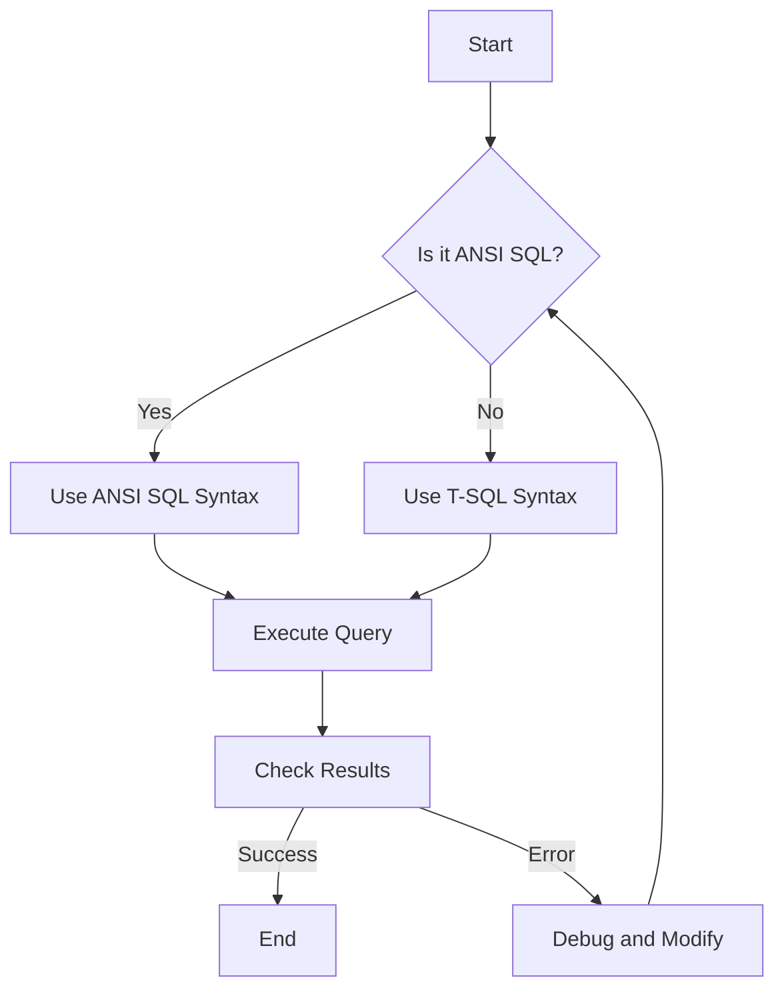

## 20.3.1 ANSI SQL vs. T-SQL (Microsoft SQL Server)

In the world of relational databases, SQL (Structured Query Language) serves as the cornerstone for data manipulation and definition. However, SQL is not a monolithic language; it comes in various dialects tailored to specific database management systems (DBMS). Two prominent dialects are ANSI SQL, the standardized version of SQL, and T-SQL (Transact-SQL), the proprietary extension used by Microsoft SQL Server. Understanding the differences between these dialects is crucial for database architects and developers who aim to build efficient, scalable, and portable database solutions.

### Syntax Differences

#### Basic Syntax

ANSI SQL is the standardized version of SQL, ensuring a level of consistency across different database systems. It includes basic commands for querying and manipulating data, such as `SELECT`, `INSERT`, `UPDATE`, and `DELETE`.

T-SQL, on the other hand, extends ANSI SQL with additional features and functions specific to Microsoft SQL Server. These extensions include procedural programming capabilities, error handling, and transaction control, which are not part of the ANSI SQL standard.

#### Functions and Operators

**ANSI SQL Functions:**

ANSI SQL provides a set of standard functions for data manipulation, such as:

- **String Functions**: `UPPER()`, `LOWER()`, `SUBSTRING()`
- **Numeric Functions**: `ROUND()`, `CEIL()`, `FLOOR()`
- **Date Functions**: `CURRENT_DATE`, `EXTRACT()`

**T-SQL Functions:**

T-SQL includes all ANSI SQL functions and adds its own set of functions:

- **String Functions**: `CHARINDEX()`, `PATINDEX()`
- **Numeric Functions**: `RAND()`, `SQUARE()`
- **Date Functions**: `GETDATE()`, `DATEPART()`

**Example:**

```sql
-- ANSI SQL Example
SELECT UPPER(first_name) FROM employees;

-- T-SQL Example
SELECT CHARINDEX('a', first_name) FROM employees;
```

#### Procedural Extensions

One of the most significant differences between ANSI SQL and T-SQL is the support for procedural programming. T-SQL provides constructs like `BEGIN...END`, `IF...ELSE`, and `WHILE` loops, allowing developers to write complex scripts and stored procedures.

**Example:**

```sql
-- T-SQL Procedural Example
DECLARE @counter INT = 0;
WHILE @counter < 10
BEGIN
    PRINT 'Counter is ' + CAST(@counter AS VARCHAR);
    SET @counter = @counter + 1;
END
```

### Unique Features of T-SQL

#### Table Variables

T-SQL introduces table variables, which are used to store temporary data within a script or stored procedure. Table variables are similar to temporary tables but are stored in memory, making them faster for small datasets.

**Example:**

```sql
DECLARE @TempTable TABLE (
    ID INT,
    Name VARCHAR(50)
);

INSERT INTO @TempTable (ID, Name) VALUES (1, 'John Doe');
SELECT * FROM @TempTable;
```

#### TRY...CATCH Blocks

Error handling in T-SQL is enhanced with `TRY...CATCH` blocks, allowing developers to gracefully handle exceptions and errors within their scripts.

**Example:**

```sql
BEGIN TRY
    -- Attempt to divide by zero
    SELECT 1 / 0;
END TRY
BEGIN CATCH
    PRINT 'An error occurred: ' + ERROR_MESSAGE();
END CATCH
```

### Migration Considerations

Migrating code from ANSI SQL to T-SQL or vice versa requires careful consideration of the differences in syntax and features. Here are some tips for a smooth transition:

1. **Identify Non-Standard Features**: Review your SQL code for any non-standard features or functions that are specific to T-SQL. Replace them with ANSI-compliant alternatives where possible.

2. **Review Procedural Code**: If your T-SQL code includes procedural logic, consider how this can be translated into ANSI SQL. In some cases, you may need to refactor the logic to fit within the constraints of ANSI SQL.

3. **Test Thoroughly**: After making changes, thoroughly test your SQL code to ensure it behaves as expected in the new environment. Pay special attention to edge cases and error handling.

4. **Use Compatibility Tools**: Utilize tools and scripts that can help identify and convert T-SQL specific features to ANSI SQL. These tools can automate parts of the migration process, reducing manual effort.

5. **Consult Documentation**: Refer to the official documentation for both ANSI SQL and T-SQL to understand the nuances of each dialect. This will help you make informed decisions during the migration process.

### Visualizing SQL Dialect Differences

To better understand the differences between ANSI SQL and T-SQL, let's visualize the process of migrating a simple query from one dialect to another.



**Diagram Description:** This flowchart illustrates the decision-making process when choosing between ANSI SQL and T-SQL syntax. It emphasizes the importance of understanding the dialect being used and testing the results to ensure correctness.

### Key Takeaways

- **Understand the Differences**: Recognize the key differences between ANSI SQL and T-SQL, including syntax variations and unique features.
- **Leverage T-SQL Features**: Utilize T-SQL's procedural extensions and error handling capabilities to write robust and efficient scripts.
- **Plan for Migration**: When migrating between SQL dialects, carefully review and test your code to ensure compatibility and correctness.
- **Stay Informed**: Keep up-to-date with the latest developments in SQL standards and dialects to make informed decisions in your database projects.

### Embrace the Journey

Remember, mastering SQL dialects is a journey. As you explore the differences between ANSI SQL and T-SQL, you'll gain valuable insights that will enhance your database development skills. Keep experimenting, stay curious, and enjoy the process of learning and growing as a software engineer.

## Quiz Time!



### What is a key difference between ANSI SQL and T-SQL?

- [x] T-SQL includes procedural programming extensions.
- [ ] ANSI SQL supports TRY...CATCH blocks.
- [ ] T-SQL is the standard SQL dialect.
- [ ] ANSI SQL is specific to Microsoft SQL Server.

> **Explanation:** T-SQL includes procedural programming extensions, such as `BEGIN...END`, `IF...ELSE`, and `WHILE` loops, which are not part of the ANSI SQL standard.

### Which of the following is a unique feature of T-SQL?

- [x] Table variables
- [ ] Subqueries
- [ ] JOIN operations
- [ ] Aggregate functions

> **Explanation:** Table variables are a unique feature of T-SQL, allowing temporary data storage within scripts or stored procedures.

### How does T-SQL handle error management?

- [x] Using TRY...CATCH blocks
- [ ] Using EXCEPTION blocks
- [ ] Using ERROR blocks
- [ ] Using CATCH...THROW blocks

> **Explanation:** T-SQL uses TRY...CATCH blocks for error management, allowing developers to handle exceptions gracefully.

### What should you consider when migrating from T-SQL to ANSI SQL?

- [x] Identify non-standard features
- [ ] Use T-SQL specific functions
- [ ] Ignore procedural logic
- [ ] Avoid testing the code

> **Explanation:** When migrating from T-SQL to ANSI SQL, it's important to identify non-standard features and replace them with ANSI-compliant alternatives.

### Which function is specific to T-SQL?

- [x] CHARINDEX()
- [ ] SUBSTRING()
- [ ] ROUND()
- [ ] EXTRACT()

> **Explanation:** CHARINDEX() is specific to T-SQL, used to find the position of a substring within a string.

### What is the purpose of table variables in T-SQL?

- [x] To store temporary data in memory
- [ ] To create permanent tables
- [ ] To define data types
- [ ] To manage transactions

> **Explanation:** Table variables in T-SQL are used to store temporary data in memory, making them faster for small datasets.

### Which of the following is a procedural extension in T-SQL?

- [x] WHILE loops
- [ ] SELECT statements
- [ ] JOIN operations
- [ ] GROUP BY clauses

> **Explanation:** WHILE loops are a procedural extension in T-SQL, allowing iterative operations within scripts.

### What is a common use case for TRY...CATCH blocks in T-SQL?

- [x] Handling division by zero errors
- [ ] Performing data aggregation
- [ ] Joining tables
- [ ] Sorting data

> **Explanation:** TRY...CATCH blocks in T-SQL are commonly used to handle division by zero errors and other exceptions.

### Which of the following is an ANSI SQL function?

- [x] UPPER()
- [ ] CHARINDEX()
- [ ] GETDATE()
- [ ] DATEPART()

> **Explanation:** UPPER() is an ANSI SQL function used to convert a string to uppercase.

### True or False: T-SQL is the standardized version of SQL.

- [ ] True
- [x] False

> **Explanation:** False. ANSI SQL is the standardized version of SQL, while T-SQL is a proprietary extension used by Microsoft SQL Server.


