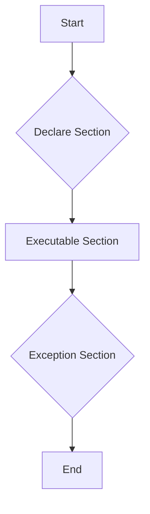

## 20.3.2 PL/SQL (Oracle)

PL/SQL (Procedural Language/Structured Query Language) is Oracle Corporation's procedural extension for SQL and the Oracle relational database. It combines the data manipulation power of SQL with the processing power of procedural languages. In this section, we will delve into the core constructs of PL/SQL, its advanced features, and optimization techniques to help you write efficient and robust database applications.

### Language Constructs

PL/SQL is a block-structured language, meaning that programs are divided into blocks. Each block can contain declarations, executable commands, and exception handlers. Let's explore the primary constructs of PL/SQL:

#### Procedures

Procedures are subprograms that perform a specific action. They can accept parameters and are stored in the database for reuse.

```sql
CREATE OR REPLACE PROCEDURE greet_user(p_name IN VARCHAR2) IS
BEGIN
    DBMS_OUTPUT.PUT_LINE('Hello, ' || p_name || '!');
END greet_user;
```

- **Explanation**: This procedure, `greet_user`, takes a single input parameter `p_name` and prints a greeting message.

#### Functions

Functions are similar to procedures but return a value. They are useful for computations and can be used in SQL statements.

```sql
CREATE OR REPLACE FUNCTION calculate_area(p_radius IN NUMBER) RETURN NUMBER IS
    v_area NUMBER;
BEGIN
    v_area := 3.14159 * p_radius * p_radius;
    RETURN v_area;
END calculate_area;
```

- **Explanation**: The `calculate_area` function calculates the area of a circle given its radius and returns the result.

#### Packages

Packages are collections of related procedures, functions, variables, and other package constructs. They help in organizing code and improving performance by loading all related objects into memory at once.

```sql
CREATE OR REPLACE PACKAGE math_operations AS
    FUNCTION add_numbers(p_num1 IN NUMBER, p_num2 IN NUMBER) RETURN NUMBER;
    FUNCTION subtract_numbers(p_num1 IN NUMBER, p_num2 IN NUMBER) RETURN NUMBER;
END math_operations;

CREATE OR REPLACE PACKAGE BODY math_operations AS
    FUNCTION add_numbers(p_num1 IN NUMBER, p_num2 IN NUMBER) RETURN NUMBER IS
    BEGIN
        RETURN p_num1 + p_num2;
    END add_numbers;

    FUNCTION subtract_numbers(p_num1 IN NUMBER, p_num2 IN NUMBER) RETURN NUMBER IS
    BEGIN
        RETURN p_num1 - p_num2;
    END subtract_numbers;
END math_operations;
```

- **Explanation**: The `math_operations` package contains two functions: `add_numbers` and `subtract_numbers`.

#### Triggers

Triggers are special procedures that automatically execute in response to certain events on a particular table or view.

```sql
CREATE OR REPLACE TRIGGER update_salary_trigger
AFTER UPDATE OF salary ON employees
FOR EACH ROW
BEGIN
    DBMS_OUTPUT.PUT_LINE('Salary updated for employee ID: ' || :NEW.employee_id);
END update_salary_trigger;
```

- **Explanation**: This trigger fires after an update on the `salary` column of the `employees` table, printing a message with the employee ID.

### Advanced Features

PL/SQL offers several advanced features that enhance its capabilities beyond standard SQL.

#### Bulk Operations

Bulk operations allow you to process multiple rows with a single command, improving performance by reducing context switches between SQL and PL/SQL engines.

```sql
DECLARE
    TYPE num_tab IS TABLE OF NUMBER;
    v_ids num_tab;
BEGIN
    SELECT employee_id BULK COLLECT INTO v_ids FROM employees WHERE department_id = 10;
    FORALL i IN v_ids.FIRST..v_ids.LAST
        UPDATE employees SET salary = salary * 1.1 WHERE employee_id = v_ids(i);
END;
```

- **Explanation**: This block collects employee IDs into a collection and updates their salaries in bulk.

#### Collection Types

PL/SQL supports various collection types, such as associative arrays, nested tables, and VARRAYs, which allow you to store and manipulate sets of data.

```sql
DECLARE
    TYPE string_list IS TABLE OF VARCHAR2(100);
    v_names string_list := string_list('Alice', 'Bob', 'Charlie');
BEGIN
    FOR i IN v_names.FIRST..v_names.LAST LOOP
        DBMS_OUTPUT.PUT_LINE(v_names(i));
    END LOOP;
END;
```

- **Explanation**: This example demonstrates a nested table of strings, iterating over each element to print names.

#### Exception Handling

PL/SQL provides robust exception handling capabilities to manage errors gracefully.

```sql
BEGIN
    -- Attempt to divide by zero
    DECLARE
        v_result NUMBER;
    BEGIN
        v_result := 10 / 0;
    EXCEPTION
        WHEN ZERO_DIVIDE THEN
            DBMS_OUTPUT.PUT_LINE('Error: Division by zero.');
    END;
END;
```

- **Explanation**: This block handles a division by zero error using an exception handler.

### Optimization Techniques

Writing efficient PL/SQL code is crucial for performance. Here are some best practices:

#### Use Bind Variables

Bind variables improve performance by reducing parsing overhead and enhancing security by preventing SQL injection.

```sql
DECLARE
    v_salary NUMBER;
BEGIN
    SELECT salary INTO v_salary FROM employees WHERE employee_id = :employee_id;
END;
```

- **Explanation**: Using `:employee_id` as a bind variable helps optimize the query execution.

#### Minimize Context Switches

Reduce the number of context switches between SQL and PL/SQL engines by using bulk operations and avoiding unnecessary SQL statements within loops.

#### Leverage PL/SQL Compiler Optimizations

Use the PL/SQL compiler's optimization features, such as `PLSQL_OPTIMIZE_LEVEL`, to enhance performance.

```sql
ALTER SESSION SET PLSQL_OPTIMIZE_LEVEL = 2;
```

- **Explanation**: This command sets the optimization level to 2, enabling more aggressive optimizations.

#### Profile and Analyze Code

Use Oracle's built-in tools like `DBMS_PROFILER` and `SQL Trace` to profile and analyze your PL/SQL code, identifying bottlenecks and optimizing them.

### Try It Yourself

Experiment with the provided code examples by modifying parameters, adding new procedures, or creating your own packages and triggers. This hands-on approach will deepen your understanding of PL/SQL's capabilities.

### Visualizing PL/SQL Execution Flow

To better understand how PL/SQL executes, let's visualize a simple flowchart of a PL/SQL block execution:



- **Description**: This flowchart illustrates the typical execution flow of a PL/SQL block, starting with declarations, followed by executable commands, and ending with exception handling.

### References and Links

- [Oracle PL/SQL Documentation](https://docs.oracle.com/en/database/oracle/oracle-database/19/plsql/index.html)
- [PL/SQL Language Reference](https://www.oracle.com/database/technologies/appdev/plsql.html)
- [Oracle Live SQL](https://livesql.oracle.com/) - Practice PL/SQL online.

### Knowledge Check

- What is the primary difference between a procedure and a function in PL/SQL?
- How can bulk operations improve PL/SQL performance?
- What are the benefits of using packages in PL/SQL?
- How does exception handling enhance the robustness of PL/SQL code?
- Why are bind variables important for query optimization?

### Embrace the Journey

Remember, mastering PL/SQL is a journey. As you explore its features and capabilities, you'll become adept at crafting efficient and powerful database applications. Keep experimenting, stay curious, and enjoy the process!

### Quiz Time!



### What is a key advantage of using PL/SQL packages?

- [x] They group related procedures and functions, improving organization and performance.
- [ ] They allow for dynamic SQL execution.
- [ ] They automatically optimize SQL queries.
- [ ] They enable cross-database compatibility.

> **Explanation:** Packages help organize related procedures and functions, and improve performance by loading all related objects into memory at once.

### How do bulk operations enhance PL/SQL performance?

- [x] By reducing context switches between SQL and PL/SQL engines.
- [ ] By increasing the number of SQL statements executed.
- [ ] By automatically indexing tables.
- [ ] By optimizing memory usage.

> **Explanation:** Bulk operations reduce context switches, which improves performance by minimizing the overhead of switching between SQL and PL/SQL engines.

### What is the purpose of exception handling in PL/SQL?

- [x] To manage errors gracefully and ensure program stability.
- [ ] To optimize SQL queries.
- [ ] To enhance data security.
- [ ] To improve execution speed.

> **Explanation:** Exception handling allows developers to manage errors gracefully, ensuring that the program can handle unexpected situations without crashing.

### Which PL/SQL construct is used to automatically execute code in response to database events?

- [x] Triggers
- [ ] Procedures
- [ ] Functions
- [ ] Packages

> **Explanation:** Triggers are special procedures that automatically execute in response to certain events on a particular table or view.

### What is the role of bind variables in PL/SQL?

- [x] To improve performance and prevent SQL injection.
- [ ] To dynamically create SQL queries.
- [ ] To manage database connections.
- [ ] To enhance data encryption.

> **Explanation:** Bind variables improve performance by reducing parsing overhead and enhance security by preventing SQL injection.

### Which PL/SQL feature allows you to store and manipulate sets of data?

- [x] Collection Types
- [ ] Triggers
- [ ] Packages
- [ ] Exception Handling

> **Explanation:** Collection types, such as associative arrays, nested tables, and VARRAYs, allow you to store and manipulate sets of data.

### What is the benefit of using the PL/SQL compiler's optimization features?

- [x] To enhance performance by enabling more aggressive optimizations.
- [ ] To simplify code syntax.
- [ ] To increase code readability.
- [ ] To automate error handling.

> **Explanation:** The PL/SQL compiler's optimization features, such as `PLSQL_OPTIMIZE_LEVEL`, enhance performance by enabling more aggressive optimizations.

### How can you profile and analyze PL/SQL code to identify bottlenecks?

- [x] By using Oracle's built-in tools like `DBMS_PROFILER` and `SQL Trace`.
- [ ] By manually reviewing code line by line.
- [ ] By using external third-party software.
- [ ] By increasing the optimization level.

> **Explanation:** Oracle provides built-in tools like `DBMS_PROFILER` and `SQL Trace` to profile and analyze PL/SQL code, helping identify bottlenecks.

### What is a common use case for PL/SQL functions?

- [x] Performing computations and returning values.
- [ ] Automatically executing code in response to database events.
- [ ] Organizing related procedures and functions.
- [ ] Managing database connections.

> **Explanation:** Functions are used for computations and can return values, making them useful in SQL statements.

### True or False: PL/SQL is only used for data manipulation.

- [ ] True
- [x] False

> **Explanation:** PL/SQL is not only used for data manipulation but also for procedural logic, exception handling, and more, making it a versatile language for database programming.


