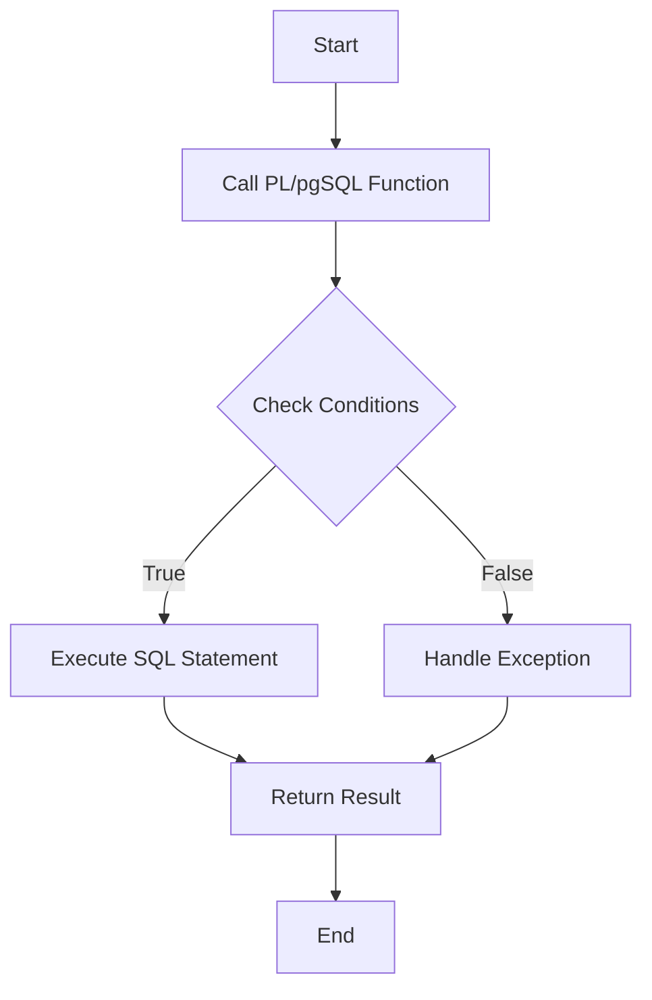

## 20.3.3 PL/pgSQL (PostgreSQL)

PL/pgSQL, or Procedural Language/PostgreSQL, is a powerful procedural language that extends SQL's capabilities within the PostgreSQL database management system. It allows developers to write complex logic directly in the database, leveraging control structures, loops, and other programming constructs to enhance performance and maintainability. In this section, we will explore the features, syntax, and best practices for using PL/pgSQL to implement efficient and scalable database solutions.

### Introduction to PL/pgSQL

PL/pgSQL is a procedural language designed to be used within PostgreSQL, enabling the creation of stored procedures, functions, and triggers. It combines the ease of SQL with the power of procedural programming, allowing developers to perform complex operations directly within the database.

#### Key Features of PL/pgSQL

- **Control Structures**: PL/pgSQL supports conditional statements (`IF`, `CASE`), loops (`LOOP`, `WHILE`, `FOR`), and exception handling (`EXCEPTION`).
- **Data Types**: It supports all PostgreSQL data types, including custom types and arrays.
- **Integration with SQL**: PL/pgSQL seamlessly integrates with SQL, allowing for dynamic query execution and manipulation.
- **Performance**: By executing logic within the database, PL/pgSQL can reduce network latency and improve performance for data-intensive operations.

### Getting Started with PL/pgSQL

To begin using PL/pgSQL, you must first ensure that it is enabled in your PostgreSQL database. By default, PL/pgSQL is installed and available for use. You can verify its availability by querying the `pg_language` system catalog:

```sql
SELECT * FROM pg_language WHERE lanname = 'plpgsql';
```

If PL/pgSQL is not available, you can create it using the following command:

```sql
CREATE EXTENSION plpgsql;
```

### Writing PL/pgSQL Functions

PL/pgSQL functions are the building blocks for implementing business logic within PostgreSQL. They can be used to encapsulate complex operations, enforce data integrity, and automate repetitive tasks.

#### Basic Function Syntax

A PL/pgSQL function is defined using the `CREATE FUNCTION` statement. Here is a basic example:

```sql
CREATE OR REPLACE FUNCTION add_numbers(a INTEGER, b INTEGER) RETURNS INTEGER AS $$
BEGIN
    RETURN a + b;
END;
$$ LANGUAGE plpgsql;
```

- **Parameters**: The function `add_numbers` takes two integer parameters, `a` and `b`.
- **Return Type**: The function returns an integer.
- **Body**: The function body is enclosed within `BEGIN` and `END` blocks.

#### Control Structures

PL/pgSQL supports various control structures to implement complex logic:

- **Conditional Statements**: Use `IF` and `CASE` to execute code based on conditions.

```sql
CREATE OR REPLACE FUNCTION check_even_odd(num INTEGER) RETURNS TEXT AS $$
BEGIN
    IF num % 2 = 0 THEN
        RETURN 'Even';
    ELSE
        RETURN 'Odd';
    END IF;
END;
$$ LANGUAGE plpgsql;
```

- **Loops**: Use `LOOP`, `WHILE`, and `FOR` to iterate over a block of code.

```sql
CREATE OR REPLACE FUNCTION sum_series(n INTEGER) RETURNS INTEGER AS $$
DECLARE
    total INTEGER := 0;
BEGIN
    FOR i IN 1..n LOOP
        total := total + i;
    END LOOP;
    RETURN total;
END;
$$ LANGUAGE plpgsql;
```

- **Exception Handling**: Use `EXCEPTION` blocks to handle errors gracefully.

```sql
CREATE OR REPLACE FUNCTION divide_numbers(a INTEGER, b INTEGER) RETURNS INTEGER AS $$
BEGIN
    RETURN a / b;
EXCEPTION
    WHEN division_by_zero THEN
        RETURN NULL;
END;
$$ LANGUAGE plpgsql;
```

### Advanced PL/pgSQL Features

PL/pgSQL offers advanced features that allow for more sophisticated database programming.

#### Dynamic SQL

Dynamic SQL enables the execution of SQL statements that are constructed at runtime. This is useful for scenarios where the exact SQL query is not known until execution time.

```sql
CREATE OR REPLACE FUNCTION execute_dynamic_query(query TEXT) RETURNS VOID AS $$
BEGIN
    EXECUTE query;
END;
$$ LANGUAGE plpgsql;
```

#### Cursors

Cursors allow for row-by-row processing of query results. They are useful for handling large datasets that cannot be processed all at once.

```sql
CREATE OR REPLACE FUNCTION process_large_dataset() RETURNS VOID AS $$
DECLARE
    cur CURSOR FOR SELECT id, data FROM large_table;
    record RECORD;
BEGIN
    OPEN cur;
    LOOP
        FETCH cur INTO record;
        EXIT WHEN NOT FOUND;
        -- Process each record
    END LOOP;
    CLOSE cur;
END;
$$ LANGUAGE plpgsql;
```

#### Triggers

Triggers are special procedures that are automatically executed in response to certain events on a table, such as `INSERT`, `UPDATE`, or `DELETE`.

```sql
CREATE OR REPLACE FUNCTION log_changes() RETURNS TRIGGER AS $$
BEGIN
    INSERT INTO change_log(table_name, operation, timestamp)
    VALUES (TG_TABLE_NAME, TG_OP, NOW());
    RETURN NEW;
END;
$$ LANGUAGE plpgsql;

CREATE TRIGGER after_update
AFTER UPDATE ON my_table
FOR EACH ROW EXECUTE FUNCTION log_changes();
```

### Best Practices for PL/pgSQL Development

- **Modular Design**: Break down complex logic into smaller, reusable functions.
- **Error Handling**: Implement robust error handling using `EXCEPTION` blocks.
- **Performance Optimization**: Use indexes and optimize queries to improve performance.
- **Security**: Use parameterized queries to prevent SQL injection attacks.

### Visualizing PL/pgSQL Workflow

To better understand how PL/pgSQL functions and triggers interact within a PostgreSQL database, let's visualize a typical workflow using a Mermaid.js flowchart.



**Figure 1**: This flowchart illustrates the typical execution flow of a PL/pgSQL function, including condition checking, SQL execution, and exception handling.

### Try It Yourself

Experiment with the provided code examples by modifying parameters, adding new logic, or creating additional functions. This hands-on approach will deepen your understanding of PL/pgSQL and its capabilities.

### References and Further Reading

- [PostgreSQL Official Documentation](https://www.postgresql.org/docs/)
- [PL/pgSQL - SQL Procedural Language](https://www.postgresql.org/docs/current/plpgsql.html)
- [PostgreSQL Wiki](https://wiki.postgresql.org/)

### Knowledge Check

To reinforce your understanding of PL/pgSQL, consider the following questions and exercises:

1. What are the benefits of using PL/pgSQL for implementing business logic within the database?
2. How can dynamic SQL be used to execute queries that are not known until runtime?
3. Create a PL/pgSQL function that calculates the factorial of a given number.
4. Implement a trigger that logs all deletions from a specific table.

### Embrace the Journey

Remember, mastering PL/pgSQL is a journey. As you continue to explore its features and capabilities, you'll become more adept at creating efficient and scalable database solutions. Keep experimenting, stay curious, and enjoy the process!

## Quiz Time!



### What is PL/pgSQL primarily used for in PostgreSQL?

- [x] Writing stored procedures and functions
- [ ] Creating database schemas
- [ ] Managing user permissions
- [ ] Designing user interfaces

> **Explanation:** PL/pgSQL is a procedural language used for writing stored procedures and functions in PostgreSQL.

### Which control structure is NOT supported by PL/pgSQL?

- [ ] IF
- [ ] CASE
- [x] SWITCH
- [ ] LOOP

> **Explanation:** PL/pgSQL supports `IF`, `CASE`, and `LOOP`, but not `SWITCH`.

### How can you handle exceptions in PL/pgSQL?

- [x] Using EXCEPTION blocks
- [ ] Using TRY-CATCH blocks
- [ ] Using ERROR blocks
- [ ] Using FINALLY blocks

> **Explanation:** PL/pgSQL uses `EXCEPTION` blocks to handle exceptions.

### What is the purpose of a cursor in PL/pgSQL?

- [ ] To store query results in a table
- [x] To process query results row-by-row
- [ ] To execute dynamic SQL
- [ ] To manage database connections

> **Explanation:** Cursors in PL/pgSQL are used to process query results row-by-row.

### Which of the following is a best practice for PL/pgSQL development?

- [x] Modular Design
- [ ] Hardcoding values
- [ ] Ignoring error handling
- [ ] Using global variables

> **Explanation:** Modular design is a best practice for PL/pgSQL development, promoting reusability and maintainability.

### What is a trigger in PL/pgSQL?

- [x] A procedure executed in response to table events
- [ ] A function that returns a value
- [ ] A type of index
- [ ] A database constraint

> **Explanation:** A trigger is a procedure that is automatically executed in response to certain events on a table.

### How can dynamic SQL be executed in PL/pgSQL?

- [x] Using the EXECUTE statement
- [ ] Using the RUN statement
- [ ] Using the PERFORM statement
- [ ] Using the CALL statement

> **Explanation:** Dynamic SQL in PL/pgSQL is executed using the `EXECUTE` statement.

### What is the default language for writing functions in PostgreSQL?

- [x] PL/pgSQL
- [ ] PL/SQL
- [ ] T-SQL
- [ ] JavaScript

> **Explanation:** PL/pgSQL is the default procedural language for writing functions in PostgreSQL.

### Which of the following is NOT a feature of PL/pgSQL?

- [ ] Control structures
- [ ] Exception handling
- [x] Graphical user interface
- [ ] Integration with SQL

> **Explanation:** PL/pgSQL does not provide a graphical user interface; it is a procedural language for SQL.

### True or False: PL/pgSQL can be used to create triggers in PostgreSQL.

- [x] True
- [ ] False

> **Explanation:** PL/pgSQL can be used to create triggers that are executed in response to table events.


