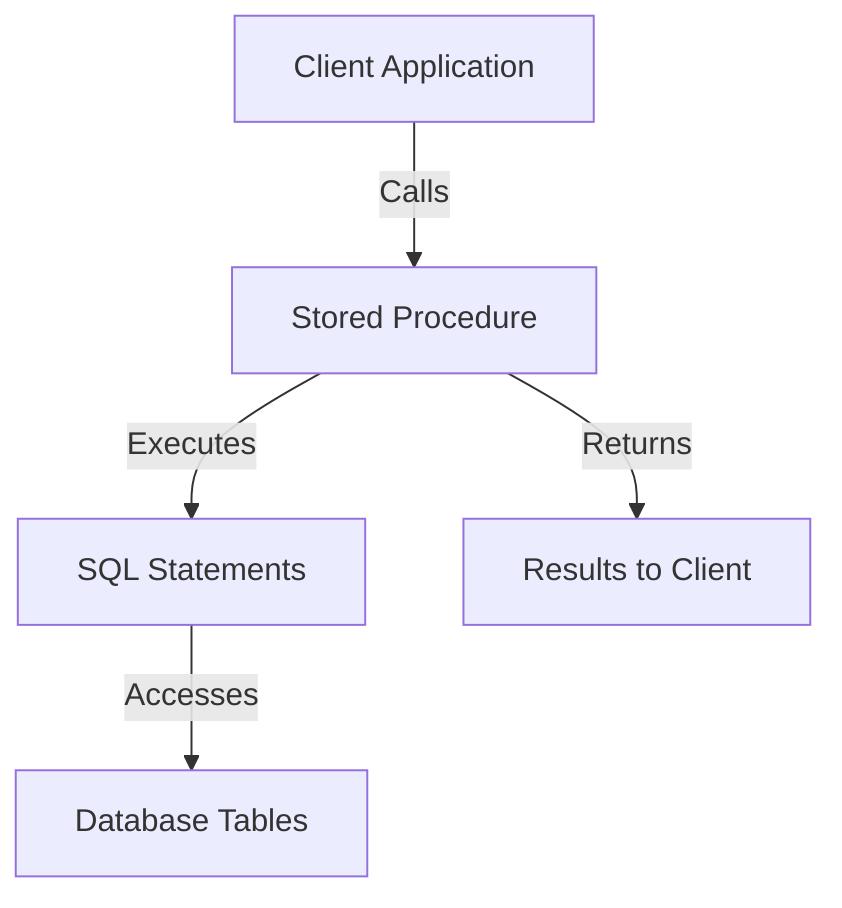

## 20.3.4 MySQL SQL Dialect

MySQL is one of the most popular open-source relational database management systems (RDBMS) in the world. It is known for its reliability, ease of use, and performance. However, like any SQL dialect, MySQL has its own set of characteristics, differences, and peculiarities. In this section, we will explore the MySQL SQL dialect in detail, focusing on its unique features, stored programs, limitations, and workarounds.

### Characteristics of MySQL SQL Dialect

MySQL's SQL dialect is characterized by its support for a wide range of data types, functions, and procedural extensions. Let's delve into these characteristics:

#### Data Types

MySQL supports a variety of data types, which can be broadly categorized into numeric, date and time, string, and spatial data types.

- **Numeric Data Types**: MySQL supports standard numeric types such as `INT`, `FLOAT`, `DOUBLE`, and `DECIMAL`. It also provides unsigned variants for integer types, which can be useful for storing non-negative numbers.

- **Date and Time Data Types**: MySQL offers several date and time data types, including `DATE`, `TIME`, `DATETIME`, `TIMESTAMP`, and `YEAR`. Each of these types serves different purposes, and choosing the right one can impact both storage and performance.

- **String Data Types**: MySQL provides a rich set of string data types, including `CHAR`, `VARCHAR`, `TEXT`, `BLOB`, and `ENUM`. The `VARCHAR` type is particularly useful for storing variable-length strings, while `TEXT` and `BLOB` are designed for larger text and binary data, respectively.

- **Spatial Data Types**: MySQL includes support for spatial data types such as `GEOMETRY`, `POINT`, `LINESTRING`, and `POLYGON`. These types are used for geographic data and are part of MySQL's spatial extensions.

#### Functions

MySQL offers a comprehensive set of built-in functions that can be used for various operations, including string manipulation, mathematical calculations, date and time processing, and more.

- **String Functions**: MySQL provides functions like `CONCAT()`, `SUBSTRING()`, `REPLACE()`, and `LENGTH()` for string manipulation. These functions are essential for processing and transforming string data.

- **Mathematical Functions**: Functions such as `ABS()`, `CEIL()`, `FLOOR()`, and `ROUND()` are available for mathematical operations. These functions help perform calculations and data transformations.

- **Date and Time Functions**: MySQL includes functions like `NOW()`, `CURDATE()`, `DATE_ADD()`, and `DATEDIFF()` for date and time operations. These functions are crucial for handling temporal data.

- **Aggregate Functions**: MySQL supports aggregate functions such as `COUNT()`, `SUM()`, `AVG()`, `MIN()`, and `MAX()`. These functions are used to perform calculations on sets of rows and return a single value.

#### Procedural Support

MySQL provides procedural extensions that allow developers to write stored programs, including stored procedures, functions, and triggers.

- **Stored Procedures**: Stored procedures are a set of SQL statements that can be executed as a single unit. They are useful for encapsulating business logic and improving performance by reducing network traffic.

- **Stored Functions**: Similar to stored procedures, stored functions return a single value and can be used in SQL expressions. They are ideal for encapsulating reusable logic.

- **Triggers**: Triggers are special types of stored programs that are automatically executed in response to certain events on a table, such as `INSERT`, `UPDATE`, or `DELETE`. They are useful for enforcing business rules and maintaining data integrity.

### Stored Programs in MySQL

Stored programs in MySQL are a powerful feature that allows developers to encapsulate business logic and automate repetitive tasks. Let's explore how to write stored procedures, functions, and triggers in MySQL.

#### Writing Stored Procedures

Stored procedures in MySQL are created using the `CREATE PROCEDURE` statement. They can accept input parameters, return output parameters, and include control flow statements such as loops and conditionals.

```sql
DELIMITER $$

CREATE PROCEDURE GetEmployeeDetails(IN emp_id INT)
BEGIN
    SELECT * FROM employees WHERE employee_id = emp_id;
END $$

DELIMITER ;
```

- **Explanation**: The above stored procedure, `GetEmployeeDetails`, accepts an input parameter `emp_id` and retrieves the details of the employee with the specified ID from the `employees` table.

#### Writing Stored Functions

Stored functions are similar to stored procedures but return a single value. They are created using the `CREATE FUNCTION` statement.

```sql
DELIMITER $$

CREATE FUNCTION CalculateBonus(salary DECIMAL(10, 2)) RETURNS DECIMAL(10, 2)
BEGIN
    DECLARE bonus DECIMAL(10, 2);
    SET bonus = salary * 0.10;
    RETURN bonus;
END $$

DELIMITER ;
```

- **Explanation**: The above stored function, `CalculateBonus`, calculates a 10% bonus based on the input salary and returns the bonus amount.

#### Writing Triggers

Triggers in MySQL are created using the `CREATE TRIGGER` statement. They are associated with a table and are executed automatically in response to specific events.

```sql
DELIMITER $$

CREATE TRIGGER BeforeInsertEmployee
BEFORE INSERT ON employees
FOR EACH ROW
BEGIN
    SET NEW.created_at = NOW();
END $$

DELIMITER ;
```

- **Explanation**: The above trigger, `BeforeInsertEmployee`, sets the `created_at` column to the current timestamp before a new row is inserted into the `employees` table.

### Limitations and Workarounds

While MySQL is a powerful RDBMS, it has some limitations compared to other SQL dialects. Here, we will discuss these limitations and provide workarounds.

#### Limitations

1. **Lack of Full SQL Standard Compliance**: MySQL does not fully comply with the SQL standard, which can lead to compatibility issues when migrating from other databases.

2. **Limited Support for Recursive Queries**: MySQL's support for recursive queries is limited compared to databases like PostgreSQL.

3. **No Built-in Support for Window Functions (Pre-MySQL 8.0)**: Prior to version 8.0, MySQL did not support window functions, which are useful for complex analytical queries.

4. **Limited JSON Support (Pre-MySQL 5.7)**: JSON support in MySQL was limited before version 5.7, making it challenging to work with JSON data.

#### Workarounds

1. **Using Common Table Expressions (CTEs)**: In MySQL 8.0 and later, use CTEs to overcome the lack of recursive query support.

```sql
WITH RECURSIVE cte AS (
    SELECT 1 AS n
    UNION ALL
    SELECT n + 1 FROM cte WHERE n < 10
)
SELECT * FROM cte;
```

- **Explanation**: The above query uses a recursive CTE to generate a sequence of numbers from 1 to 10.

2. **Emulating Window Functions**: In versions prior to MySQL 8.0, emulate window functions using subqueries and user-defined variables.

```sql
SELECT
    employee_id,
    salary,
    @rank := @rank + 1 AS rank
FROM
    employees, (SELECT @rank := 0) r
ORDER BY
    salary DESC;
```

- **Explanation**: The above query emulates a ranking function using user-defined variables to assign ranks based on salary.

3. **Using JSON Functions**: In MySQL 5.7 and later, use JSON functions to work with JSON data.

```sql
SELECT JSON_EXTRACT(json_column, '$.key') AS value FROM json_table;
```

- **Explanation**: The above query extracts the value associated with the key `key` from a JSON column.

### Try It Yourself

To deepen your understanding of MySQL's SQL dialect, try modifying the code examples provided. For instance, create a stored procedure that calculates the total salary of all employees in a department, or write a trigger that logs changes to a table.

### Visualizing MySQL's SQL Dialect

To better understand the MySQL SQL dialect, let's visualize the interaction between stored programs and the database.



- **Diagram Description**: This flowchart illustrates how a client application interacts with a stored procedure in MySQL. The stored procedure executes SQL statements, accesses database tables, and returns results to the client.

### References and Links

For further reading on MySQL's SQL dialect, consider the following resources:

- [MySQL Documentation](https://dev.mysql.com/doc/)
- [W3Schools MySQL Tutorial](https://www.w3schools.com/sql/sql_mysql.asp)
- [MDN Web Docs on SQL](https://developer.mozilla.org/en-US/docs/Web/SQL)

### Knowledge Check

To reinforce your understanding of MySQL's SQL dialect, consider the following questions:

1. What are the main categories of data types supported by MySQL?
2. How do stored procedures differ from stored functions in MySQL?
3. What are some limitations of MySQL compared to other SQL dialects?
4. How can you emulate window functions in MySQL versions prior to 8.0?
5. What is the purpose of a trigger in MySQL?

### Embrace the Journey

Remember, mastering MySQL's SQL dialect is a journey. As you explore its features and capabilities, you'll gain the skills needed to build efficient and scalable database solutions. Keep experimenting, stay curious, and enjoy the journey!

## Quiz Time!



### What are the main categories of data types supported by MySQL?

- [x] Numeric, Date and Time, String, Spatial
- [ ] Integer, Float, String, Boolean
- [ ] Text, Binary, Date, Time
- [ ] Char, Varchar, Blob, Enum

> **Explanation:** MySQL supports numeric, date and time, string, and spatial data types.

### How do stored procedures differ from stored functions in MySQL?

- [x] Stored procedures do not return a value, stored functions return a single value
- [ ] Stored procedures are faster than stored functions
- [ ] Stored functions can return multiple values
- [ ] Stored procedures are used only for data retrieval

> **Explanation:** Stored procedures do not return a value, while stored functions return a single value.

### What is a limitation of MySQL compared to other SQL dialects?

- [x] Limited support for recursive queries
- [ ] Lack of support for basic SQL operations
- [ ] Inability to handle large datasets
- [ ] No support for transactions

> **Explanation:** MySQL has limited support for recursive queries compared to other SQL dialects.

### How can you emulate window functions in MySQL versions prior to 8.0?

- [x] Using subqueries and user-defined variables
- [ ] Using stored procedures
- [ ] Using triggers
- [ ] Using JSON functions

> **Explanation:** In MySQL versions prior to 8.0, window functions can be emulated using subqueries and user-defined variables.

### What is the purpose of a trigger in MySQL?

- [x] Automatically execute in response to certain events on a table
- [ ] Manually execute SQL statements
- [ ] Store large amounts of data
- [ ] Optimize query performance

> **Explanation:** Triggers automatically execute in response to certain events on a table, such as `INSERT`, `UPDATE`, or `DELETE`.

### Which MySQL version introduced support for window functions?

- [x] MySQL 8.0
- [ ] MySQL 5.7
- [ ] MySQL 5.6
- [ ] MySQL 7.0

> **Explanation:** MySQL 8.0 introduced support for window functions.

### What is a common use case for stored procedures in MySQL?

- [x] Encapsulating business logic
- [ ] Storing large text data
- [ ] Performing data backups
- [ ] Managing user permissions

> **Explanation:** Stored procedures are commonly used to encapsulate business logic and improve performance by reducing network traffic.

### How can you work with JSON data in MySQL 5.7 and later?

- [x] Using JSON functions
- [ ] Using stored procedures
- [ ] Using triggers
- [ ] Using window functions

> **Explanation:** In MySQL 5.7 and later, JSON functions can be used to work with JSON data.

### What is a workaround for the lack of recursive query support in MySQL?

- [x] Using Common Table Expressions (CTEs)
- [ ] Using stored procedures
- [ ] Using triggers
- [ ] Using JSON functions

> **Explanation:** Common Table Expressions (CTEs) can be used as a workaround for the lack of recursive query support in MySQL.

### True or False: MySQL fully complies with the SQL standard.

- [ ] True
- [x] False

> **Explanation:** MySQL does not fully comply with the SQL standard, which can lead to compatibility issues when migrating from other databases.


