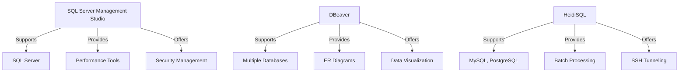

## 20.4 Tools and IDEs for SQL Development

In the realm of SQL development, selecting the right tools and Integrated Development Environments (IDEs) is crucial for enhancing productivity, ensuring code quality, and managing databases efficiently. This section provides an in-depth exploration of the most popular SQL development tools, their features, and how to choose the best one for your needs.

### Database Management Tools

Database management tools are essential for developers and database administrators to interact with databases, execute queries, and manage database objects. Let's delve into some of the most widely used tools in the industry.

#### SQL Server Management Studio (SSMS)

**Overview**: SQL Server Management Studio (SSMS) is a comprehensive management tool for Microsoft SQL Server. It provides a rich graphical interface for database management and development.

**Key Features**:
- **Query Editor**: Offers a powerful editor with syntax highlighting, code completion, and error detection.
- **Object Explorer**: Allows users to navigate through database objects such as tables, views, and stored procedures.
- **Performance Tools**: Includes tools like Database Engine Tuning Advisor and Activity Monitor for performance analysis.
- **Security Management**: Facilitates the management of users, roles, and permissions.
- **Integration with Azure**: Supports Azure SQL Database and Azure SQL Data Warehouse.

**Sample Code Snippet**:
```sql
-- Example of a simple SELECT query in SSMS
SELECT FirstName, LastName
FROM Employees
WHERE Department = 'Sales';
```

**Design Considerations**: SSMS is ideal for developers working with Microsoft SQL Server due to its seamless integration and extensive feature set tailored for SQL Server environments.

#### DBeaver

**Overview**: DBeaver is a universal database management tool that supports a wide range of databases, including MySQL, PostgreSQL, Oracle, and more. It is known for its versatility and user-friendly interface.

**Key Features**:
- **Cross-Platform Support**: Available on Windows, macOS, and Linux.
- **ER Diagrams**: Provides tools for creating and managing Entity-Relationship diagrams.
- **Data Visualization**: Offers data visualization tools for better insight into data.
- **SQL Editor**: Features a robust SQL editor with auto-completion and syntax highlighting.
- **Plugin Architecture**: Supports plugins for additional functionality.

**Sample Code Snippet**:
```sql
-- Example of a JOIN query in DBeaver
SELECT Orders.OrderID, Customers.CustomerName
FROM Orders
JOIN Customers ON Orders.CustomerID = Customers.CustomerID;
```

**Design Considerations**: DBeaver is suitable for developers who work with multiple database systems and require a flexible tool that can handle various database types.

#### HeidiSQL

**Overview**: HeidiSQL is a lightweight and open-source SQL client for Windows, primarily used for managing MySQL, MariaDB, and PostgreSQL databases.

**Key Features**:
- **User-Friendly Interface**: Simple and intuitive interface for easy database management.
- **Batch Processing**: Supports batch processing of SQL scripts.
- **Data Export/Import**: Facilitates data export and import in various formats.
- **Session Management**: Allows managing multiple sessions simultaneously.
- **SSH Tunneling**: Supports secure connections via SSH tunneling.

**Sample Code Snippet**:
```sql
-- Example of an INSERT query in HeidiSQL
INSERT INTO Products (ProductName, Price)
VALUES ('New Product', 19.99);
```

**Design Considerations**: HeidiSQL is perfect for developers looking for a straightforward and efficient tool for managing MySQL and PostgreSQL databases without the overhead of more complex solutions.

### Features Comparison

When selecting a SQL development tool, it's important to consider the features that align with your project requirements. Here's a comparison of the key features offered by SSMS, DBeaver, and HeidiSQL.

| Feature                  | SQL Server Management Studio | DBeaver               | HeidiSQL             |
|--------------------------|------------------------------|-----------------------|----------------------|
| **Supported Databases**  | SQL Server, Azure SQL        | Multiple (MySQL, PostgreSQL, Oracle, etc.) | MySQL, MariaDB, PostgreSQL |
| **Cross-Platform**       | No                           | Yes                   | No                   |
| **ER Diagrams**          | Yes                          | Yes                   | No                   |
| **Performance Tools**    | Yes                          | Limited               | No                   |
| **Data Visualization**   | Limited                      | Yes                   | No                   |
| **Security Management**  | Yes                          | Limited               | No                   |
| **Plugin Support**       | No                           | Yes                   | No                   |

### Recommendations

Selecting the right SQL development tool depends on various factors, including the database systems you work with, your development environment, and personal preferences. Here are some recommendations to guide your choice:

- **For Microsoft SQL Server Users**: SQL Server Management Studio is the go-to tool due to its comprehensive feature set and integration with SQL Server.
- **For Multi-Database Environments**: DBeaver is an excellent choice for developers who need to manage multiple types of databases with a single tool.
- **For Simplicity and Speed**: HeidiSQL is ideal for developers who require a lightweight and fast tool for managing MySQL and PostgreSQL databases.

### Try It Yourself

To get hands-on experience with these tools, try the following exercises:

1. **Install and Configure**: Download and install SSMS, DBeaver, or HeidiSQL. Configure a connection to your database and explore the interface.
2. **Execute Queries**: Write and execute basic SQL queries to retrieve and manipulate data.
3. **Create ER Diagrams**: Use DBeaver to create an ER diagram for a sample database.
4. **Analyze Performance**: Use SSMS's performance tools to analyze and optimize a query.

### Visualizing SQL Tool Features

To better understand the capabilities of these tools, let's visualize their feature sets using a comparison chart.



### References and Links

For further reading and exploration, consider the following resources:

- [SQL Server Management Studio Documentation](https://docs.microsoft.com/en-us/sql/ssms/sql-server-management-studio-ssms)
- [DBeaver Official Website](https://dbeaver.io/)
- [HeidiSQL Official Website](https://www.heidisql.com/)

### Knowledge Check

To reinforce your understanding of SQL development tools, consider the following questions:

- What are the key differences between SSMS and DBeaver?
- How does HeidiSQL's feature set compare to DBeaver's?
- Which tool would you choose for managing a PostgreSQL database and why?

### Embrace the Journey

Remember, selecting the right SQL development tool is just the beginning. As you become more familiar with these tools, you'll discover new ways to enhance your productivity and streamline your database management tasks. Keep experimenting, stay curious, and enjoy the journey!

## Quiz Time!



### Which tool is specifically designed for Microsoft SQL Server?

- [x] SQL Server Management Studio
- [ ] DBeaver
- [ ] HeidiSQL
- [ ] MySQL Workbench

> **Explanation:** SQL Server Management Studio is specifically designed for managing Microsoft SQL Server databases.

### What feature does DBeaver offer that is not available in HeidiSQL?

- [x] ER Diagrams
- [ ] Batch Processing
- [ ] SSH Tunneling
- [ ] Data Export/Import

> **Explanation:** DBeaver offers ER Diagrams, which is not a feature available in HeidiSQL.

### Which tool supports multiple database types, including Oracle and PostgreSQL?

- [ ] SQL Server Management Studio
- [x] DBeaver
- [ ] HeidiSQL
- [ ] SQLite Studio

> **Explanation:** DBeaver supports a wide range of database types, including Oracle and PostgreSQL.

### What is a key advantage of using HeidiSQL?

- [x] Lightweight and fast
- [ ] Extensive performance tools
- [ ] Cross-platform support
- [ ] Plugin architecture

> **Explanation:** HeidiSQL is known for being lightweight and fast, making it ideal for quick database management tasks.

### Which tool provides performance analysis tools like the Database Engine Tuning Advisor?

- [x] SQL Server Management Studio
- [ ] DBeaver
- [ ] HeidiSQL
- [ ] Navicat

> **Explanation:** SQL Server Management Studio includes performance analysis tools such as the Database Engine Tuning Advisor.

### What is a common feature of both DBeaver and SQL Server Management Studio?

- [x] SQL Editor with syntax highlighting
- [ ] SSH Tunneling
- [ ] Cross-platform support
- [ ] Batch Processing

> **Explanation:** Both DBeaver and SQL Server Management Studio offer SQL Editors with syntax highlighting.

### Which tool is best suited for developers working with MySQL databases?

- [ ] SQL Server Management Studio
- [ ] DBeaver
- [x] HeidiSQL
- [ ] Oracle SQL Developer

> **Explanation:** HeidiSQL is particularly well-suited for developers working with MySQL databases.

### What feature does SQL Server Management Studio offer that is specifically beneficial for security management?

- [x] User and role management
- [ ] ER Diagrams
- [ ] Data Visualization
- [ ] SSH Tunneling

> **Explanation:** SQL Server Management Studio provides comprehensive user and role management features for security.

### Which tool is known for its plugin architecture, allowing for extended functionality?

- [ ] SQL Server Management Studio
- [x] DBeaver
- [ ] HeidiSQL
- [ ] SQLyog

> **Explanation:** DBeaver is known for its plugin architecture, which allows users to extend its functionality.

### True or False: HeidiSQL supports cross-platform operation.

- [ ] True
- [x] False

> **Explanation:** HeidiSQL is a Windows-only application and does not support cross-platform operation.


