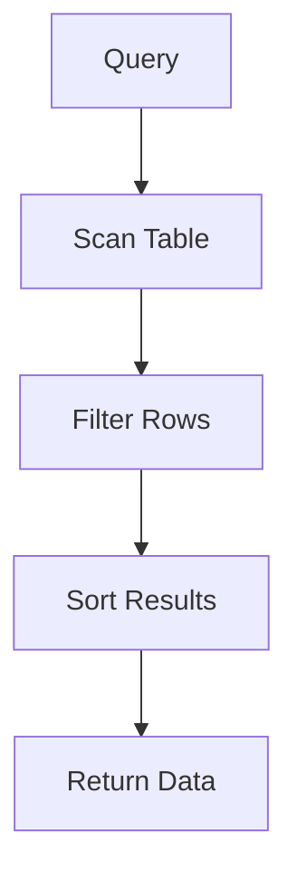

## 20.5 Sample Databases and Practice Exercises

In this section, we delve into the practical application of SQL design patterns through sample databases and practice exercises. By engaging with these resources, expert software engineers and architects can refine their skills and gain deeper insights into efficient database design and query optimization.

### Access to Sample Databases

To begin your journey, we provide access to several well-known sample databases that serve as excellent platforms for practicing SQL design patterns. These databases are widely used in the industry and academia for learning and testing SQL skills.

#### AdventureWorks

The AdventureWorks database is a comprehensive sample database provided by Microsoft. It simulates a manufacturing company's operations, including sales, purchasing, production, and human resources. This database is ideal for exploring complex queries and understanding enterprise-level database design.

- **Download Link**: [AdventureWorks Sample Database](https://github.com/Microsoft/sql-server-samples/releases/tag/adventureworks)
- **Key Features**:
  - Comprehensive schema with multiple tables and relationships.
  - Realistic data for sales, purchasing, and production.
  - Suitable for practicing advanced SQL queries and data modeling.

#### Northwind

The Northwind database is a classic sample database that represents a fictional company selling specialty foods. It is simpler than AdventureWorks and is often used for introductory SQL exercises.

- **Download Link**: [Northwind Sample Database](https://github.com/jpwhite3/northwind-SQLite3)
- **Key Features**:
  - Focuses on orders, customers, and suppliers.
  - Simple schema, making it ideal for beginners.
  - Useful for practicing basic SQL operations and joins.

#### Chinook

The Chinook database is designed to represent a digital media store, similar to iTunes. It includes tables for artists, albums, media tracks, invoices, and customers.

- **Download Link**: [Chinook Sample Database](https://github.com/lerocha/chinook-database)
- **Key Features**:
  - Focus on media sales and customer data.
  - Includes complex relationships and data types.
  - Great for practicing queries involving multiple joins and subqueries.

### Exercise Sets

To complement these databases, we provide a series of practice exercises that range from beginner to advanced levels. These exercises are designed to challenge your understanding of SQL design patterns and enhance your problem-solving skills.

#### Beginner Exercises

1. **Basic Select Queries**: Write queries to retrieve data from single tables. Focus on using `SELECT`, `FROM`, `WHERE`, and `ORDER BY` clauses.
   
   ```sql
   -- Retrieve all products from the Products table
   SELECT * FROM Products;
   ```

2. **Simple Joins**: Practice joining two tables to retrieve related data. Use `INNER JOIN` to combine data from the Orders and Customers tables.
   
   ```sql
   -- Retrieve order details along with customer names
   SELECT Orders.OrderID, Customers.CustomerName
   FROM Orders
   INNER JOIN Customers ON Orders.CustomerID = Customers.CustomerID;
   ```

3. **Aggregate Functions**: Use functions like `SUM`, `AVG`, and `COUNT` to perform calculations on data sets.
   
   ```sql
   -- Calculate the total sales amount
   SELECT SUM(TotalAmount) AS TotalSales FROM Sales;
   ```

#### Intermediate Exercises

1. **Complex Joins**: Write queries involving multiple joins and explore `LEFT JOIN`, `RIGHT JOIN`, and `FULL OUTER JOIN`.
   
   ```sql
   -- Retrieve all employees and their respective managers
   SELECT e.EmployeeName, m.ManagerName
   FROM Employees e
   LEFT JOIN Managers m ON e.ManagerID = m.ManagerID;
   ```

2. **Subqueries**: Use subqueries to perform operations like filtering and aggregation within a query.
   
   ```sql
   -- Find customers who have placed more than five orders
   SELECT CustomerName
   FROM Customers
   WHERE CustomerID IN (
       SELECT CustomerID
       FROM Orders
       GROUP BY CustomerID
       HAVING COUNT(OrderID) > 5
   );
   ```

3. **Window Functions**: Implement window functions to perform calculations across a set of table rows related to the current row.
   
   ```sql
   -- Calculate the running total of sales for each product
   SELECT ProductID, SaleDate, 
          SUM(SaleAmount) OVER (PARTITION BY ProductID ORDER BY SaleDate) AS RunningTotal
   FROM Sales;
   ```

#### Advanced Exercises

1. **Recursive Queries**: Use Common Table Expressions (CTEs) to write recursive queries for hierarchical data.
   
   ```sql
   -- Retrieve the hierarchy of employees
   WITH EmployeeHierarchy AS (
       SELECT EmployeeID, ManagerID, EmployeeName
       FROM Employees
       WHERE ManagerID IS NULL
       UNION ALL
       SELECT e.EmployeeID, e.ManagerID, e.EmployeeName
       FROM Employees e
       INNER JOIN EmployeeHierarchy eh ON e.ManagerID = eh.EmployeeID
   )
   SELECT * FROM EmployeeHierarchy;
   ```

2. **Performance Optimization**: Analyze query execution plans and optimize queries for performance.
   
   ```sql
   -- Optimize a query to retrieve top 10 selling products
   SELECT TOP 10 ProductID, SUM(SaleAmount) AS TotalSales
   FROM Sales
   GROUP BY ProductID
   ORDER BY TotalSales DESC;
   ```

3. **Security and Access Control**: Implement row-level security and explore role-based access control.
   
   ```sql
   -- Create a role and grant permissions
   CREATE ROLE SalesRole;
   GRANT SELECT ON Sales TO SalesRole;
   ```

### Solution Guides

For each exercise set, we provide detailed solution guides that include explanations and answers for self-assessment. These guides help you understand the reasoning behind each solution and reinforce your learning.

#### Beginner Solutions

- **Basic Select Queries**: Understand the structure of a `SELECT` statement and how to filter data using `WHERE` clauses.
- **Simple Joins**: Learn how to combine data from multiple tables using join operations.
- **Aggregate Functions**: Explore how to perform calculations on data sets using SQL aggregate functions.

#### Intermediate Solutions

- **Complex Joins**: Master the use of different types of joins to retrieve comprehensive data sets.
- **Subqueries**: Gain insights into using subqueries for complex filtering and aggregation.
- **Window Functions**: Discover how window functions can be used to perform advanced calculations.

#### Advanced Solutions

- **Recursive Queries**: Learn how to use CTEs for recursive operations and hierarchical data retrieval.
- **Performance Optimization**: Understand how to analyze and optimize query execution plans for better performance.
- **Security and Access Control**: Explore techniques for implementing security measures in SQL databases.

### Visualizing SQL Concepts

To aid understanding, we incorporate diagrams and visualizations using Hugo-compatible Mermaid.js diagrams. These diagrams illustrate complex SQL concepts, such as query execution plans and hierarchical data structures.

#### Example: Visualizing a Query Execution Plan



*Caption: This diagram illustrates the flow of a query execution plan, showing the steps from scanning the table to returning the final data.*

### Try It Yourself

We encourage you to experiment with the sample databases and practice exercises. Modify the code examples to explore different scenarios and deepen your understanding of SQL design patterns.

- **Experiment with Joins**: Try using different types of joins to see how they affect the results.
- **Modify Subqueries**: Change the conditions in subqueries to explore different data retrieval strategies.
- **Optimize Queries**: Test different optimization techniques and analyze their impact on query performance.

### References and Links

- [AdventureWorks Sample Database](https://github.com/Microsoft/sql-server-samples/releases/tag/adventureworks)
- [Northwind Sample Database](https://github.com/jpwhite3/northwind-SQLite3)
- [Chinook Sample Database](https://github.com/lerocha/chinook-database)
- [SQL Tutorial on W3Schools](https://www.w3schools.com/sql/)
- [SQL Documentation on MDN Web Docs](https://developer.mozilla.org/en-US/docs/Web/SQL)

### Knowledge Check

To reinforce your learning, we pose questions and challenges throughout the text. Engage with these prompts to test your understanding and apply what you've learned.

- **What is the purpose of using window functions in SQL?**
- **How can you optimize a query for better performance?**
- **What are the benefits of using recursive queries for hierarchical data?**

### Embrace the Journey

Remember, mastering SQL design patterns is a journey. As you progress, you'll build more complex and efficient database solutions. Keep experimenting, stay curious, and enjoy the process of learning and discovery.

### Quiz Time!



### What is the primary purpose of the AdventureWorks database?

- [x] To simulate a manufacturing company's operations
- [ ] To represent a digital media store
- [ ] To focus on orders and customers
- [ ] To demonstrate basic SQL queries

> **Explanation:** The AdventureWorks database is designed to simulate a manufacturing company's operations, including sales, purchasing, and production.

### Which sample database is ideal for beginners?

- [ ] AdventureWorks
- [x] Northwind
- [ ] Chinook
- [ ] None of the above

> **Explanation:** The Northwind database is simpler and often used for introductory SQL exercises, making it ideal for beginners.

### What SQL clause is used to filter data in a query?

- [ ] SELECT
- [x] WHERE
- [ ] JOIN
- [ ] ORDER BY

> **Explanation:** The `WHERE` clause is used to filter data in a SQL query.

### Which type of join retrieves all records from the left table and the matched records from the right table?

- [ ] INNER JOIN
- [x] LEFT JOIN
- [ ] RIGHT JOIN
- [ ] FULL OUTER JOIN

> **Explanation:** A `LEFT JOIN` retrieves all records from the left table and the matched records from the right table.

### What is a Common Table Expression (CTE) used for?

- [x] To define a temporary result set
- [ ] To permanently store data
- [ ] To create indexes
- [ ] To enforce constraints

> **Explanation:** A Common Table Expression (CTE) is used to define a temporary result set that can be referenced within a `SELECT`, `INSERT`, `UPDATE`, or `DELETE` statement.

### Which function calculates the running total of sales for each product?

- [ ] SUM()
- [ ] AVG()
- [x] SUM() OVER()
- [ ] COUNT()

> **Explanation:** The `SUM() OVER()` function is used to calculate the running total of sales for each product.

### What is the purpose of a query execution plan?

- [x] To show the steps involved in executing a query
- [ ] To store query results
- [ ] To create a new table
- [ ] To delete data

> **Explanation:** A query execution plan shows the steps involved in executing a query, helping to analyze and optimize performance.

### Which sample database focuses on media sales and customer data?

- [ ] AdventureWorks
- [ ] Northwind
- [x] Chinook
- [ ] None of the above

> **Explanation:** The Chinook database focuses on media sales and customer data, representing a digital media store.

### What is the benefit of using window functions in SQL?

- [x] To perform calculations across a set of table rows related to the current row
- [ ] To create new tables
- [ ] To enforce data integrity
- [ ] To define indexes

> **Explanation:** Window functions allow you to perform calculations across a set of table rows related to the current row, enabling advanced data analysis.

### True or False: Recursive queries are used for hierarchical data retrieval.

- [x] True
- [ ] False

> **Explanation:** Recursive queries are indeed used for hierarchical data retrieval, allowing you to traverse and manipulate hierarchical data structures.


