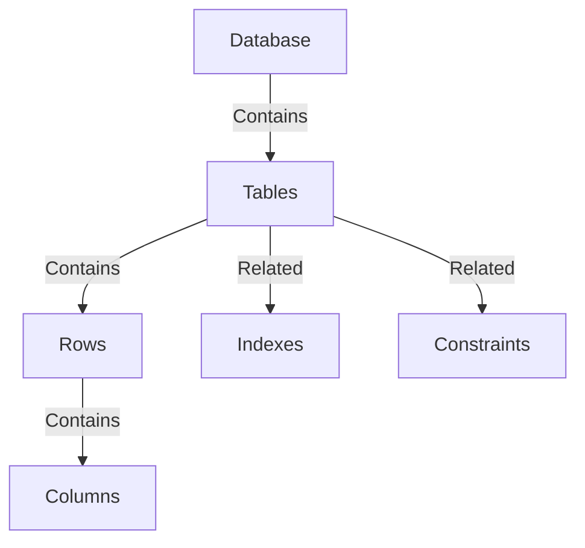

## 20.6 Comprehensive Bibliography and Further Reading on SQL Design Patterns

In the ever-evolving landscape of database management and software architecture, staying informed about the latest advancements and foundational knowledge is crucial for expert software engineers and architects. This section provides a curated list of resources, including authoritative books, influential research papers, and valuable online resources, to deepen your understanding of SQL design patterns and related topics.

### Books

Books are an invaluable resource for gaining in-depth knowledge and understanding complex concepts. Here is a selection of authoritative texts that cover various aspects of SQL and database design:

1. **"SQL Performance Explained" by Markus Winand**
   - **Description**: This book provides a comprehensive guide to understanding and optimizing SQL performance. It covers indexing strategies, query optimization, and the intricacies of SQL execution plans.
   - **Why Read**: Gain insights into performance tuning and learn how to write efficient SQL queries.

2. **"Database Design for Mere Mortals" by Michael J. Hernandez**
   - **Description**: A classic text on database design principles, this book simplifies complex concepts and provides a step-by-step approach to designing relational databases.
   - **Why Read**: Ideal for understanding the fundamentals of database design and normalization.

3. **"SQL Antipatterns: Avoiding the Pitfalls of Database Programming" by Bill Karwin**
   - **Description**: This book explores common SQL antipatterns and provides solutions to avoid them. It covers design, query, and application-level antipatterns.
   - **Why Read**: Learn how to identify and rectify common mistakes in SQL development.

4. **"Pro SQL Server Internals" by Dmitri Korotkevitch**
   - **Description**: A deep dive into the internals of SQL Server, this book covers architecture, indexing, query processing, and performance tuning.
   - **Why Read**: Essential for those working with SQL Server and interested in understanding its internal mechanisms.

5. **"Designing Data-Intensive Applications" by Martin Kleppmann**
   - **Description**: While not exclusively about SQL, this book covers the principles of building scalable and reliable data systems, including SQL databases.
   - **Why Read**: Understand the broader context of data management and integration with modern applications.

6. **"The Data Warehouse Toolkit: The Definitive Guide to Dimensional Modeling" by Ralph Kimball and Margy Ross**
   - **Description**: A comprehensive guide to dimensional modeling, this book is essential for anyone involved in data warehousing and analytics.
   - **Why Read**: Learn best practices for designing data warehouses using SQL.

7. **"SQL and Relational Theory: How to Write Accurate SQL Code" by C.J. Date**
   - **Description**: This book emphasizes the theoretical foundations of SQL and relational databases, providing a deeper understanding of how to write precise SQL code.
   - **Why Read**: Strengthen your theoretical knowledge and improve your SQL coding skills.

### Research Papers

Research papers offer insights into cutting-edge developments and theoretical advancements in the field of database systems. Here are some influential publications:

1. **"A Relational Model of Data for Large Shared Data Banks" by E.F. Codd**
   - **Summary**: This seminal paper introduced the relational model, laying the foundation for modern relational databases.
   - **Impact**: Revolutionized the way data is stored, retrieved, and manipulated.

2. **"The Case for Shared Nothing" by Michael Stonebraker**
   - **Summary**: This paper discusses the architecture of shared-nothing databases, which are designed to scale horizontally.
   - **Impact**: Influenced the design of distributed database systems and cloud-based architectures.

3. **"MapReduce: Simplified Data Processing on Large Clusters" by Jeffrey Dean and Sanjay Ghemawat**
   - **Summary**: Although focused on a non-SQL paradigm, this paper introduced MapReduce, a framework for processing large datasets.
   - **Impact**: Inspired the development of SQL-compatible big data processing frameworks.

4. **"The Five-Minute Rule for Trading Memory for Disk Accesses and the 10 Byte Rule for Trading Memory for CPU Time" by Jim Gray and Gianfranco R. Putzolu**
   - **Summary**: This paper presents rules of thumb for optimizing database performance by balancing memory and disk usage.
   - **Impact**: Provided practical guidelines for database performance tuning.

5. **"OLAP and OLTP: Are They Really Different?" by Surajit Chaudhuri and Umeshwar Dayal**
   - **Summary**: This paper explores the differences and similarities between OLAP (Online Analytical Processing) and OLTP (Online Transaction Processing) systems.
   - **Impact**: Clarified the distinct requirements and optimizations for analytical and transactional workloads.

### Online Resources

The internet is a treasure trove of tutorials, courses, and articles that can help you stay updated with the latest trends and techniques in SQL and database design. Here are some recommended online resources:

1. **[SQLZoo](https://sqlzoo.net/)**
   - **Description**: An interactive platform offering SQL tutorials and exercises for various SQL dialects.
   - **Why Visit**: Practice SQL queries and learn through hands-on exercises.

2. **[Mode Analytics SQL Tutorial](https://mode.com/sql-tutorial/)**
   - **Description**: A comprehensive SQL tutorial covering basic to advanced topics, with interactive examples.
   - **Why Visit**: Enhance your SQL skills with practical examples and exercises.

3. **[W3Schools SQL Tutorial](https://www.w3schools.com/sql/)**
   - **Description**: A beginner-friendly tutorial that covers SQL syntax, commands, and functions.
   - **Why Visit**: A great starting point for those new to SQL.

4. **[LeetCode SQL Problems](https://leetcode.com/problemset/database/)**
   - **Description**: A collection of SQL problems designed to test and improve your query-writing skills.
   - **Why Visit**: Challenge yourself with real-world SQL problems.

5. **[Stack Overflow](https://stackoverflow.com/questions/tagged/sql)**
   - **Description**: A community-driven Q&A platform where you can ask questions and find answers related to SQL.
   - **Why Visit**: Get help from the community and learn from others' experiences.

6. **[Coursera SQL Courses](https://www.coursera.org/courses?query=sql)**
   - **Description**: A variety of SQL courses offered by top universities and institutions.
   - **Why Visit**: Learn from experts and earn certifications.

7. **[Khan Academy SQL Course](https://www.khanacademy.org/computing/computer-programming/sql)**
   - **Description**: A free course covering SQL basics, with interactive exercises and projects.
   - **Why Visit**: Learn SQL at your own pace with engaging content.

8. **[Microsoft Learn: SQL Server](https://learn.microsoft.com/en-us/sql/?view=sql-server-ver15)**
   - **Description**: Official documentation and learning paths for SQL Server.
   - **Why Visit**: Access comprehensive resources for learning SQL Server.

9. **[PostgreSQL Documentation](https://www.postgresql.org/docs/)**
   - **Description**: The official documentation for PostgreSQL, covering installation, configuration, and advanced features.
   - **Why Visit**: A must-read for PostgreSQL users and developers.

10. **[Oracle SQL Developer](https://www.oracle.com/database/technologies/appdev/sqldeveloper-landing.html)**
    - **Description**: A powerful tool for database development and management, with extensive documentation and tutorials.
    - **Why Visit**: Enhance your productivity with Oracle databases.

### Try It Yourself

To truly master SQL design patterns, it's essential to apply what you've learned through practice and experimentation. Here are some suggestions to get you started:

- **Experiment with Different SQL Dialects**: Try writing queries in different SQL dialects, such as MySQL, PostgreSQL, and SQL Server, to understand their nuances and differences.
- **Optimize Queries**: Take a complex query and try to optimize it by using indexing, rewriting subqueries, or applying other performance-enhancing techniques.
- **Design a Database Schema**: Create a database schema for a hypothetical application, applying normalization principles and design patterns.
- **Implement a Data Warehouse**: Design and implement a simple data warehouse using dimensional modeling techniques.
- **Explore Advanced SQL Features**: Experiment with advanced SQL features like window functions, CTEs, and recursive queries.

### Visualizing SQL Concepts

To aid your understanding of SQL design patterns, consider using visual tools and diagrams. Here are some examples of how you can visualize SQL concepts:

*Diagram: Visualizing the Structure of a Relational Database*

- **Description**: This diagram illustrates the hierarchical structure of a relational database, showing the relationships between databases, tables, rows, columns, indexes, and constraints.

### Knowledge Check

To reinforce your learning, consider these questions and challenges:

- **What are the key differences between OLAP and OLTP systems?**
- **How can you optimize a query that involves multiple joins and subqueries?**
- **What are the advantages and disadvantages of using a shared-nothing architecture?**
- **How does the relational model differ from other data models, such as the hierarchical or network model?**

### Embrace the Journey

Remember, mastering SQL design patterns is a journey, not a destination. As you continue to learn and grow, keep experimenting, stay curious, and enjoy the process. The resources provided in this section are just the beginning. As you delve deeper into the world of SQL and database design, you'll discover new techniques, tools, and insights that will enhance your skills and broaden your understanding.

## Quiz Time!



### What is the primary focus of "SQL Performance Explained" by Markus Winand?

- [x] Optimizing SQL performance
- [ ] Designing data warehouses
- [ ] Understanding NoSQL databases
- [ ] Implementing machine learning

> **Explanation:** "SQL Performance Explained" focuses on optimizing SQL performance, including indexing strategies and query optimization.

### Which book is considered a classic text on database design principles?

- [ ] "SQL Performance Explained"
- [x] "Database Design for Mere Mortals"
- [ ] "SQL Antipatterns"
- [ ] "Pro SQL Server Internals"

> **Explanation:** "Database Design for Mere Mortals" by Michael J. Hernandez is a classic text on database design principles.

### What is the main topic of the paper "A Relational Model of Data for Large Shared Data Banks"?

- [x] The relational model
- [ ] NoSQL databases
- [ ] Data warehousing
- [ ] Cloud computing

> **Explanation:** The paper "A Relational Model of Data for Large Shared Data Banks" by E.F. Codd introduced the relational model.

### Which online resource offers interactive SQL tutorials and exercises?

- [ ] W3Schools
- [x] SQLZoo
- [ ] Stack Overflow
- [ ] Coursera

> **Explanation:** SQLZoo offers interactive SQL tutorials and exercises for various SQL dialects.

### What is the main advantage of a shared-nothing architecture?

- [x] Horizontal scalability
- [ ] Simplified data modeling
- [ ] Enhanced security
- [ ] Reduced latency

> **Explanation:** A shared-nothing architecture is designed to scale horizontally, allowing for efficient distribution of data and processing.

### Which book explores common SQL antipatterns and provides solutions to avoid them?

- [ ] "SQL Performance Explained"
- [ ] "Database Design for Mere Mortals"
- [x] "SQL Antipatterns"
- [ ] "Pro SQL Server Internals"

> **Explanation:** "SQL Antipatterns" by Bill Karwin explores common SQL antipatterns and provides solutions to avoid them.

### What is the focus of the paper "MapReduce: Simplified Data Processing on Large Clusters"?

- [ ] SQL optimization
- [ ] Data warehousing
- [x] Big data processing
- [ ] Cloud security

> **Explanation:** The paper "MapReduce: Simplified Data Processing on Large Clusters" introduced a framework for processing large datasets, influencing SQL-compatible big data processing frameworks.

### Which online resource provides official documentation and learning paths for SQL Server?

- [ ] PostgreSQL Documentation
- [ ] Oracle SQL Developer
- [x] Microsoft Learn
- [ ] LeetCode

> **Explanation:** Microsoft Learn provides official documentation and learning paths for SQL Server.

### What is the primary focus of "The Data Warehouse Toolkit" by Ralph Kimball and Margy Ross?

- [ ] SQL performance
- [x] Dimensional modeling
- [ ] NoSQL databases
- [ ] Cloud computing

> **Explanation:** "The Data Warehouse Toolkit" focuses on dimensional modeling, essential for data warehousing and analytics.

### True or False: "Designing Data-Intensive Applications" by Martin Kleppmann is exclusively about SQL.

- [ ] True
- [x] False

> **Explanation:** "Designing Data-Intensive Applications" covers principles of building scalable and reliable data systems, including SQL databases, but is not exclusively about SQL.


