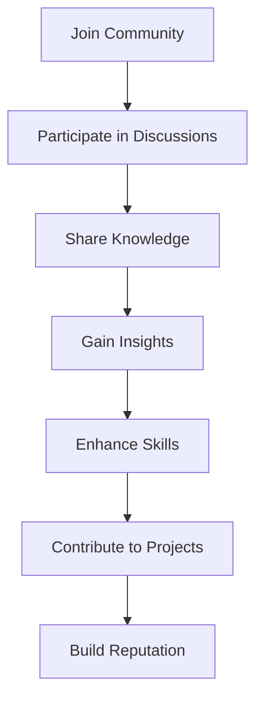

## 20.7 Online Resources and Communities

In the ever-evolving landscape of SQL database development, staying connected with the right resources and communities is crucial for continuous learning and professional growth. This section provides a comprehensive guide to the best online resources and communities where expert software engineers and architects can deepen their understanding of SQL design patterns, share knowledge, and collaborate with peers.

### Forums and Q&A Sites

Forums and Q&A sites are invaluable for developers seeking quick answers to specific SQL-related questions or engaging in discussions about complex design patterns. Here are some of the most popular platforms:

#### Stack Overflow

Stack Overflow is a go-to platform for developers worldwide. It offers a vast repository of questions and answers on SQL and database design patterns. Users can search for specific topics or ask new questions to receive insights from experienced developers.

- **How to Use**: Search for existing questions using keywords related to your SQL issue. If you can't find an answer, post a new question with detailed information about your problem.
- **Community Engagement**: Participate by answering questions, voting on helpful answers, and following tags related to SQL design patterns.

#### DBA Stack Exchange

DBA Stack Exchange is a specialized Q&A site for database administrators and developers. It focuses on database management, optimization, and design patterns.

- **How to Use**: Similar to Stack Overflow, search for relevant topics or post new questions. Engage with the community by providing answers and sharing your expertise.
- **Community Engagement**: Follow tags related to SQL design patterns and participate in discussions to stay updated on best practices.

#### Reddit - r/SQL

Reddit's r/SQL community is a vibrant space for SQL enthusiasts to share knowledge, discuss trends, and seek advice on SQL-related topics.

- **How to Use**: Join the subreddit and participate in discussions by commenting on posts or sharing your own insights.
- **Community Engagement**: Engage with other members by upvoting helpful content and contributing to discussions on SQL design patterns.

### Professional Networks

Professional networks provide opportunities for developers to connect with peers, share experiences, and access exclusive resources. Here are some platforms to consider:

#### LinkedIn Groups

LinkedIn offers various groups dedicated to SQL and database professionals. These groups are excellent for networking, sharing articles, and discussing industry trends.

- **How to Use**: Join relevant groups by searching for keywords like "SQL Design Patterns" or "Database Architecture." Participate in discussions and share your expertise with the community.
- **Community Engagement**: Connect with other professionals, participate in group discussions, and share valuable resources related to SQL design patterns.

#### Professional Associations

Joining professional associations can provide access to exclusive resources, conferences, and networking opportunities. Consider organizations like the Data Management Association (DAMA) or the International Association of Software Architects (IASA).

- **How to Use**: Become a member of relevant associations to access resources, attend events, and connect with other professionals in the field.
- **Community Engagement**: Participate in webinars, workshops, and conferences to stay updated on the latest trends and best practices in SQL design patterns.

### Community Contributions

Contributing to open-source projects and engaging in community discussions can enhance your skills and reputation as an SQL expert. Here are some ways to get involved:

#### Open-Source Projects

Participating in open-source projects allows developers to collaborate on real-world applications and contribute to the SQL community.

- **How to Use**: Explore platforms like GitHub to find open-source projects related to SQL design patterns. Contribute by submitting pull requests, reporting issues, or improving documentation.
- **Community Engagement**: Collaborate with other contributors, participate in project discussions, and share your knowledge with the community.

#### Online Courses and Tutorials

Online courses and tutorials provide structured learning opportunities for developers looking to master SQL design patterns. Platforms like Coursera, Udemy, and Pluralsight offer courses taught by industry experts.

- **How to Use**: Enroll in courses that cover SQL design patterns and related topics. Complete assignments and participate in course forums to engage with instructors and peers.
- **Community Engagement**: Share your learning experiences with the community and recommend valuable courses to others.

#### Blogs and Articles

Reading and writing blogs or articles can help developers stay informed about the latest trends and best practices in SQL design patterns.

- **How to Use**: Follow blogs and publications that focus on SQL and database design. Consider writing your own articles to share your insights and experiences with the community.
- **Community Engagement**: Comment on articles, share them with your network, and engage in discussions with other readers.

### Code Examples and Visualizations

To illustrate the concepts discussed in this section, let's explore some code examples and visualizations that demonstrate how to engage with online resources and communities effectively.

#### Code Example: Searching for SQL Design Patterns on Stack Overflow

```sql
-- Example query to search for SQL design patterns on Stack Overflow
SELECT * FROM stackoverflow_questions
WHERE tags LIKE '%SQL Design Patterns%'
ORDER BY votes DESC;
```

> **Explanation:** This query simulates searching for questions tagged with "SQL Design Patterns" on Stack Overflow, ordered by the number of votes.

#### Visualization: Engaging with Online Communities



> **Description:** This flowchart illustrates the process of engaging with online communities, from joining a community to building a reputation as an SQL expert.

### References and Links

To further explore the resources and communities mentioned in this section, consider visiting the following links:

- [Stack Overflow](https://stackoverflow.com/)
- [DBA Stack Exchange](https://dba.stackexchange.com/)
- [Reddit - r/SQL](https://www.reddit.com/r/SQL/)
- [LinkedIn](https://www.linkedin.com/)
- [GitHub](https://github.com/)
- [Coursera](https://www.coursera.org/)
- [Udemy](https://www.udemy.com/)
- [Pluralsight](https://www.pluralsight.com/)

### Knowledge Check

To reinforce your understanding of online resources and communities, consider the following questions:

1. What are the benefits of participating in online forums and Q&A sites for SQL developers?
2. How can professional networks like LinkedIn enhance your SQL expertise?
3. What are some ways to contribute to open-source projects related to SQL design patterns?
4. How can online courses and tutorials help you master SQL design patterns?
5. What role do blogs and articles play in staying informed about SQL trends and best practices?

### Embrace the Journey

Remember, engaging with online resources and communities is just the beginning of your journey to mastering SQL design patterns. Stay curious, keep experimenting, and enjoy the process of learning and growing as an SQL expert. By actively participating in these communities, you'll not only enhance your skills but also contribute to the collective knowledge of the SQL community.

## Quiz Time!



### What is the primary purpose of Stack Overflow for SQL developers?

- [x] To find answers to specific SQL-related questions
- [ ] To host SQL databases
- [ ] To provide SQL certification
- [ ] To sell SQL software

> **Explanation:** Stack Overflow is a platform where developers can ask and answer questions related to SQL and other programming topics.

### Which platform is specifically designed for database administrators and developers?

- [ ] Stack Overflow
- [x] DBA Stack Exchange
- [ ] Reddit
- [ ] LinkedIn

> **Explanation:** DBA Stack Exchange is a Q&A site focused on database management and design patterns.

### How can LinkedIn groups benefit SQL professionals?

- [x] By providing networking opportunities and industry insights
- [ ] By offering free SQL courses
- [ ] By hosting SQL databases
- [ ] By selling SQL software

> **Explanation:** LinkedIn groups allow professionals to connect, share experiences, and discuss industry trends.

### What is a key benefit of contributing to open-source projects?

- [x] Collaborating on real-world applications
- [ ] Receiving SQL certification
- [ ] Hosting SQL databases
- [ ] Selling SQL software

> **Explanation:** Contributing to open-source projects allows developers to work on real-world applications and collaborate with others.

### Which platform offers structured learning opportunities for SQL design patterns?

- [x] Coursera
- [ ] Stack Overflow
- [ ] Reddit
- [ ] LinkedIn

> **Explanation:** Coursera provides online courses that cover SQL design patterns and related topics.

### What is the purpose of reading and writing blogs about SQL?

- [x] To stay informed about trends and best practices
- [ ] To host SQL databases
- [ ] To sell SQL software
- [ ] To receive SQL certification

> **Explanation:** Blogs and articles help developers stay updated on the latest trends and best practices in SQL.

### How can participating in online communities enhance your SQL skills?

- [x] By engaging in discussions and sharing knowledge
- [ ] By hosting SQL databases
- [ ] By selling SQL software
- [ ] By receiving SQL certification

> **Explanation:** Engaging in online communities allows developers to learn from others and share their expertise.

### What is a benefit of attending professional association events?

- [x] Access to exclusive resources and networking opportunities
- [ ] Free SQL certification
- [ ] Hosting SQL databases
- [ ] Selling SQL software

> **Explanation:** Professional associations provide access to resources, events, and networking opportunities for members.

### What is a common way to contribute to open-source SQL projects?

- [x] Submitting pull requests and reporting issues
- [ ] Hosting SQL databases
- [ ] Selling SQL software
- [ ] Receiving SQL certification

> **Explanation:** Developers can contribute to open-source projects by submitting code changes and reporting issues.

### True or False: Engaging with online communities is essential for continuous learning in SQL.

- [x] True
- [ ] False

> **Explanation:** Engaging with online communities helps developers stay updated and continuously learn about SQL design patterns.


