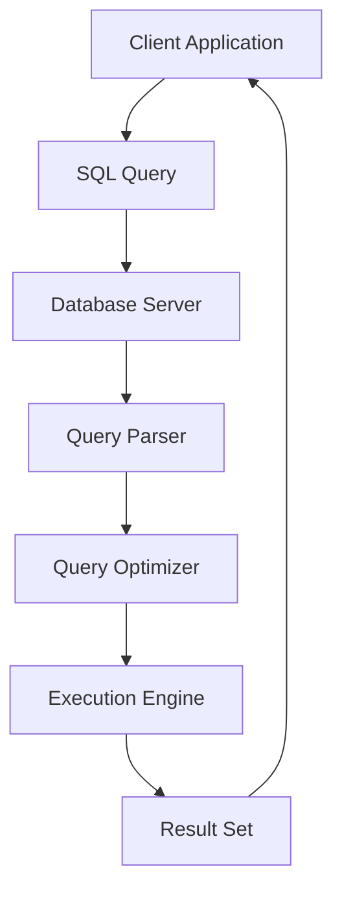

## 20.9 Cheat Sheets and Quick Reference Guides

In the fast-paced world of software engineering, having quick access to essential information can significantly enhance productivity and efficiency. This section provides comprehensive cheat sheets and quick reference guides for SQL design patterns, syntax, and optimization tips, tailored specifically for expert software engineers and architects. Whether you're designing complex database systems or optimizing queries for performance, these guides will serve as invaluable resources.

### SQL Syntax Cheat Sheet

#### Basic SQL Commands

- **SELECT**: Retrieve data from a database.
  ```sql
  SELECT column1, column2 FROM table_name WHERE condition;
  ```

- **INSERT**: Add new records to a table.
  ```sql
  INSERT INTO table_name (column1, column2) VALUES (value1, value2);
  ```

- **UPDATE**: Modify existing records.
  ```sql
  UPDATE table_name SET column1 = value1 WHERE condition;
  ```

- **DELETE**: Remove records from a table.
  ```sql
  DELETE FROM table_name WHERE condition;
  ```

- **CREATE TABLE**: Define a new table.
  ```sql
  CREATE TABLE table_name (
    column1 datatype,
    column2 datatype,
    PRIMARY KEY (column1)
  );
  ```

- **ALTER TABLE**: Modify an existing table structure.
  ```sql
  ALTER TABLE table_name ADD column_name datatype;
  ```

- **DROP TABLE**: Delete a table and its data.
  ```sql
  DROP TABLE table_name;
  ```

#### Advanced SQL Features

- **JOIN**: Combine rows from two or more tables.
  ```sql
  SELECT columns FROM table1
  INNER JOIN table2 ON table1.column = table2.column;
  ```

- **GROUP BY**: Aggregate data across multiple records.
  ```sql
  SELECT column, COUNT(*) FROM table_name GROUP BY column;
  ```

- **ORDER BY**: Sort the result set.
  ```sql
  SELECT column1, column2 FROM table_name ORDER BY column1 DESC;
  ```

- **HAVING**: Filter records after aggregation.
  ```sql
  SELECT column, COUNT(*) FROM table_name GROUP BY column HAVING COUNT(*) > 1;
  ```

- **Subqueries**: Nested queries for complex data retrieval.
  ```sql
  SELECT column FROM table_name WHERE column IN (SELECT column FROM another_table);
  ```

- **Common Table Expressions (CTEs)**: Simplify complex queries.
  ```sql
  WITH cte_name AS (
    SELECT column FROM table_name WHERE condition
  )
  SELECT * FROM cte_name;
  ```

- **Window Functions**: Perform calculations across a set of table rows.
  ```sql
  SELECT column, ROW_NUMBER() OVER (PARTITION BY column ORDER BY column) FROM table_name;
  ```

### Design Patterns Cheat Sheet

#### Data Modeling Patterns

- **One-to-One Relationship**: Use foreign keys to link tables.
  ```sql
  CREATE TABLE table1 (
    id INT PRIMARY KEY,
    column1 VARCHAR(255)
  );

  CREATE TABLE table2 (
    id INT PRIMARY KEY,
    table1_id INT,
    FOREIGN KEY (table1_id) REFERENCES table1(id)
  );
  ```

- **One-to-Many Relationship**: Use foreign keys to establish a parent-child relationship.
  ```sql
  CREATE TABLE parent (
    id INT PRIMARY KEY,
    column1 VARCHAR(255)
  );

  CREATE TABLE child (
    id INT PRIMARY KEY,
    parent_id INT,
    FOREIGN KEY (parent_id) REFERENCES parent(id)
  );
  ```

- **Many-to-Many Relationship**: Use a junction table to manage relationships.
  ```sql
  CREATE TABLE table1 (
    id INT PRIMARY KEY,
    column1 VARCHAR(255)
  );

  CREATE TABLE table2 (
    id INT PRIMARY KEY,
    column2 VARCHAR(255)
  );

  CREATE TABLE junction_table (
    table1_id INT,
    table2_id INT,
    PRIMARY KEY (table1_id, table2_id),
    FOREIGN KEY (table1_id) REFERENCES table1(id),
    FOREIGN KEY (table2_id) REFERENCES table2(id)
  );
  ```

#### Query Design Patterns

- **Pagination**: Efficiently retrieve subsets of data.
  ```sql
  SELECT column FROM table_name ORDER BY column LIMIT 10 OFFSET 20;
  ```

- **Recursive Queries**: Handle hierarchical data.
  ```sql
  WITH RECURSIVE cte_name AS (
    SELECT column FROM table_name WHERE condition
    UNION ALL
    SELECT column FROM table_name JOIN cte_name ON condition
  )
  SELECT * FROM cte_name;
  ```

- **Dynamic Query Building**: Construct queries programmatically.
  ```sql
  EXECUTE IMMEDIATE 'SELECT column FROM ' || table_name || ' WHERE condition';
  ```

### Optimization Tips Cheat Sheet

#### Indexing Strategies

- **Create Indexes**: Improve query performance.
  ```sql
  CREATE INDEX index_name ON table_name (column);
  ```

- **Use Covering Indexes**: Include all columns needed by a query.
  ```sql
  CREATE INDEX covering_index ON table_name (column1, column2);
  ```

- **Analyze Execution Plans**: Understand query performance.
  ```sql
  EXPLAIN SELECT column FROM table_name WHERE condition;
  ```

#### Query Optimization Techniques

- **Avoid SELECT ***: Specify only necessary columns.
  ```sql
  SELECT column1, column2 FROM table_name;
  ```

- **Use WHERE Clauses**: Filter data early in the query.
  ```sql
  SELECT column FROM table_name WHERE condition;
  ```

- **Leverage Joins Efficiently**: Minimize the number of joins.
  ```sql
  SELECT column FROM table1 INNER JOIN table2 ON condition;
  ```

- **Optimize Subqueries**: Use joins or CTEs when possible.
  ```sql
  WITH cte_name AS (
    SELECT column FROM table_name WHERE condition
  )
  SELECT * FROM cte_name;
  ```

- **Cache Results**: Use materialized views for frequently accessed data.
  ```sql
  CREATE MATERIALIZED VIEW view_name AS SELECT column FROM table_name;
  ```

### Visualizing SQL Concepts

#### Diagram: SQL Query Execution Flow



*Description*: This diagram illustrates the flow of an SQL query from the client application to the database server and back, highlighting key components like the query parser, optimizer, and execution engine.

### Try It Yourself

Encourage experimentation by modifying the code examples provided. For instance, try changing the conditions in the `WHERE` clause or experimenting with different types of joins. This hands-on approach will deepen your understanding of SQL design patterns and optimization techniques.

### References and Links

For further reading and deeper dives into SQL concepts, consider visiting the following resources:

- [SQL Tutorial - W3Schools](https://www.w3schools.com/sql/)
- [SQL Reference - MDN Web Docs](https://developer.mozilla.org/en-US/docs/Web/SQL)
- [SQL Optimization Techniques - Oracle](https://www.oracle.com/database/technologies/appdev/sql.html)

### Knowledge Check

To reinforce your learning, consider the following questions and challenges:

- What are the benefits of using indexes in SQL queries?
- How can you optimize a query that uses multiple subqueries?
- Describe the difference between INNER JOIN and OUTER JOIN.
- What is the purpose of a Common Table Expression (CTE)?

### Embrace the Journey

Remember, mastering SQL design patterns is a journey. As you progress, you'll build more efficient and scalable database solutions. Keep experimenting, stay curious, and enjoy the journey!

### Quiz Time!



### What is the primary purpose of an index in SQL?

- [x] To improve query performance by reducing data retrieval time
- [ ] To store additional data in the database
- [ ] To enforce data integrity constraints
- [ ] To manage user permissions

> **Explanation:** Indexes are used to improve query performance by allowing the database to quickly locate and retrieve data without scanning the entire table.

### Which SQL clause is used to filter records after aggregation?

- [ ] WHERE
- [x] HAVING
- [ ] GROUP BY
- [ ] ORDER BY

> **Explanation:** The HAVING clause is used to filter records after aggregation, whereas the WHERE clause filters records before aggregation.

### What is a Common Table Expression (CTE) used for?

- [x] Simplifying complex queries by breaking them into simpler parts
- [ ] Creating temporary tables that persist after the query execution
- [ ] Defining permanent views in the database
- [ ] Storing user-defined functions

> **Explanation:** CTEs are used to simplify complex queries by allowing you to define temporary result sets that can be referenced within the main query.

### Which of the following is a benefit of using a covering index?

- [x] It includes all columns needed by a query, reducing the need to access the table
- [ ] It automatically updates itself when the table data changes
- [ ] It enforces unique constraints on the indexed columns
- [ ] It allows for faster data insertion operations

> **Explanation:** A covering index includes all columns needed by a query, which can reduce the need to access the table and improve query performance.

### What is the difference between INNER JOIN and OUTER JOIN?

- [x] INNER JOIN returns only matching rows, while OUTER JOIN returns matching and non-matching rows
- [ ] INNER JOIN returns all rows, while OUTER JOIN returns only matching rows
- [ ] INNER JOIN is faster than OUTER JOIN
- [ ] INNER JOIN is used for hierarchical data, while OUTER JOIN is not

> **Explanation:** INNER JOIN returns only the rows that have matching values in both tables, while OUTER JOIN returns all matching rows and includes non-matching rows from one or both tables.

### How can you optimize a query that uses multiple subqueries?

- [x] Use joins or Common Table Expressions (CTEs) instead
- [ ] Increase the database server's memory
- [ ] Use SELECT * to retrieve all columns
- [ ] Add more indexes to the database

> **Explanation:** Using joins or CTEs can often optimize queries with multiple subqueries by reducing complexity and improving performance.

### What is the purpose of the EXPLAIN command in SQL?

- [x] To analyze and display the execution plan of a query
- [ ] To execute a query without returning results
- [ ] To create a backup of the database
- [ ] To enforce data integrity constraints

> **Explanation:** The EXPLAIN command is used to analyze and display the execution plan of a query, helping you understand how the database will execute it.

### Which SQL feature allows you to perform calculations across a set of table rows?

- [ ] GROUP BY
- [x] Window Functions
- [ ] Subqueries
- [ ] Indexes

> **Explanation:** Window functions allow you to perform calculations across a set of table rows related to the current row, providing more flexibility than GROUP BY.

### What is the benefit of using materialized views?

- [x] They store query results, reducing the need to recompute them
- [ ] They automatically update themselves in real-time
- [ ] They enforce data integrity constraints
- [ ] They allow for faster data insertion operations

> **Explanation:** Materialized views store query results, which can reduce the need to recompute them and improve performance for frequently accessed data.

### True or False: A subquery can be used in the SELECT clause of a query.

- [x] True
- [ ] False

> **Explanation:** Subqueries can be used in the SELECT clause to compute values that are returned as part of the result set.



By using these cheat sheets and quick reference guides, you'll be well-equipped to tackle complex SQL challenges with confidence and efficiency. Keep these resources handy as you continue to master SQL design patterns and optimize your database solutions.
