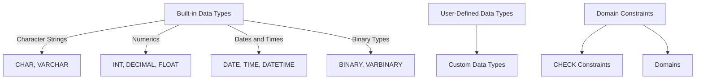

## 3.1 SQL Data Types and Domain Modeling

In the realm of SQL and relational databases, understanding data types and domain modeling is crucial for designing efficient, scalable, and robust database systems. This section delves into the intricacies of SQL data types, the art of choosing the right type for your data, and the power of domain modeling to enforce data integrity and business rules.

### Built-in Data Types

SQL provides a rich set of built-in data types that cater to various data storage needs. These data types can be broadly categorized into character strings, numerics, dates, and binary types. Let's explore each category in detail:

#### Character Strings

Character strings are used to store text data. They can be further divided into fixed-length and variable-length strings:

- **CHAR(n)**: A fixed-length string that pads the remaining space with spaces if the input is shorter than `n` characters.
- **VARCHAR(n)**: A variable-length string that stores only the input characters, up to a maximum of `n`.

```sql
-- Example of using CHAR and VARCHAR
CREATE TABLE Employees (
    EmployeeID INT PRIMARY KEY,
    FirstName CHAR(50),
    LastName VARCHAR(50)
);
```

**Choosing Between CHAR and VARCHAR**: Use `CHAR` for fixed-length data, such as country codes, where all entries have the same length. Opt for `VARCHAR` when the length of the data varies, such as names or addresses.

#### Numerics

Numeric data types are used to store numbers, which can be integers or floating-point numbers:

- **INT**: A standard integer type.
- **DECIMAL(p, s)**: A fixed-point number with precision `p` and scale `s`.
- **FLOAT**: A floating-point number for approximate values.

```sql
-- Example of using numeric data types
CREATE TABLE Products (
    ProductID INT PRIMARY KEY,
    ProductName VARCHAR(100),
    Price DECIMAL(10, 2),
    StockQuantity INT
);
```

**Choosing Numeric Types**: Use `INT` for whole numbers without fractions. For precise calculations, such as financial data, use `DECIMAL`. Use `FLOAT` for scientific calculations where precision is less critical.

#### Dates and Times

Date and time data types are essential for storing temporal data:

- **DATE**: Stores a date without time.
- **TIME**: Stores a time without date.
- **DATETIME**: Stores both date and time.

```sql
-- Example of using date and time data types
CREATE TABLE Orders (
    OrderID INT PRIMARY KEY,
    OrderDate DATETIME,
    DeliveryDate DATE
);
```

**Choosing Date and Time Types**: Use `DATE` for storing only the date, `TIME` for storing only the time, and `DATETIME` when both date and time are required.

#### Binary Types

Binary data types store binary data, such as images or files:

- **BINARY(n)**: A fixed-length binary string.
- **VARBINARY(n)**: A variable-length binary string.

```sql
-- Example of using binary data types
CREATE TABLE Files (
    FileID INT PRIMARY KEY,
    FileName VARCHAR(255),
    FileData VARBINARY(MAX)
);
```

**Choosing Binary Types**: Use `BINARY` for fixed-length binary data and `VARBINARY` for variable-length binary data.

### Choosing Data Types: Balancing Storage Efficiency with Precision

Choosing the right data type is a balancing act between storage efficiency and precision. Here are some guidelines to help you make informed decisions:

1. **Understand the Data**: Analyze the data you need to store. Consider its nature, range, and precision requirements.

2. **Optimize for Storage**: Choose data types that minimize storage space without sacrificing precision. For example, use `TINYINT` instead of `INT` for small integer values.

3. **Consider Performance**: Smaller data types can improve performance by reducing I/O operations and memory usage.

4. **Plan for Future Growth**: Anticipate future data growth and choose data types that can accommodate it without requiring schema changes.

5. **Avoid Over-Precision**: Avoid using overly precise data types, such as `FLOAT`, when `DECIMAL` would suffice.

### User-Defined Data Types

User-defined data types (UDTs) allow you to create custom data types tailored to your specific needs. They provide a way to encapsulate domain-specific logic and constraints within the database schema.

#### Creating User-Defined Data Types

To create a user-defined data type, use the `CREATE TYPE` statement. Here's an example:

```sql
-- Example of creating a user-defined data type
CREATE TYPE PhoneNumber AS VARCHAR(15);

-- Using the user-defined data type in a table
CREATE TABLE Contacts (
    ContactID INT PRIMARY KEY,
    Name VARCHAR(100),
    Phone PhoneNumber
);
```

**Benefits of User-Defined Data Types**:

- **Consistency**: Ensure consistent data representation across tables.
- **Reusability**: Reuse the same data type in multiple tables.
- **Maintainability**: Simplify schema changes by modifying the UDT definition.

### Domain Constraints: Defining Valid Values for a Data Type

Domain constraints define the set of valid values for a data type, ensuring data integrity and enforcing business rules. They can be implemented using `CHECK` constraints or by creating domains.

#### Using CHECK Constraints

`CHECK` constraints allow you to specify conditions that must be met for data to be inserted or updated in a table.

```sql
-- Example of using a CHECK constraint
CREATE TABLE Employees (
    EmployeeID INT PRIMARY KEY,
    Age INT CHECK (Age >= 18 AND Age <= 65)
);
```

#### Creating Domains

Domains are named data types with constraints. They provide a way to encapsulate domain-specific logic and constraints.

```sql
-- Example of creating a domain
CREATE DOMAIN PositiveInteger AS INT CHECK (VALUE > 0);

-- Using the domain in a table
CREATE TABLE Inventory (
    ItemID INT PRIMARY KEY,
    Quantity PositiveInteger
);
```

**Benefits of Domains**:

- **Encapsulation**: Encapsulate domain-specific logic within the database schema.
- **Reusability**: Reuse domain definitions across multiple tables.
- **Maintainability**: Simplify schema changes by modifying the domain definition.

### Visualizing SQL Data Types and Domain Modeling

To better understand the relationships between data types, user-defined types, and domain constraints, let's visualize these concepts using a diagram.



**Diagram Explanation**: This diagram illustrates the hierarchy of SQL data types, user-defined types, and domain constraints. Built-in data types form the foundation, while user-defined types and domain constraints provide customization and validation.

### Try It Yourself

To reinforce your understanding of SQL data types and domain modeling, try modifying the examples provided in this section:

1. **Experiment with Data Types**: Create a table with various data types and insert sample data. Observe how different data types affect storage and retrieval.

2. **Create a User-Defined Type**: Define a custom data type for a specific use case, such as an email address, and use it in a table.

3. **Implement Domain Constraints**: Create a domain with constraints and use it in a table. Test the constraints by inserting valid and invalid data.

### References and Links

- [W3Schools SQL Data Types](https://www.w3schools.com/sql/sql_datatypes.asp)
- [MDN Web Docs: SQL Data Types](https://developer.mozilla.org/en-US/docs/Web/SQL/SQL_data_types)
- [PostgreSQL Documentation: Data Types](https://www.postgresql.org/docs/current/datatype.html)

### Knowledge Check

- What are the key differences between `CHAR` and `VARCHAR`?
- How do user-defined data types enhance database design?
- What are the benefits of using domain constraints?

### Embrace the Journey

Remember, mastering SQL data types and domain modeling is a journey. As you progress, you'll gain deeper insights into designing efficient and robust databases. Keep experimenting, stay curious, and enjoy the journey!

## Quiz Time!



### What is the primary advantage of using VARCHAR over CHAR?

- [x] It saves storage space for variable-length strings.
- [ ] It is faster for fixed-length strings.
- [ ] It automatically converts data types.
- [ ] It supports binary data.

> **Explanation:** VARCHAR saves storage space by only storing the input characters, unlike CHAR which pads the remaining space with spaces.

### Which data type is best suited for storing precise financial data?

- [ ] FLOAT
- [x] DECIMAL
- [ ] INT
- [ ] VARCHAR

> **Explanation:** DECIMAL is best suited for precise financial data as it allows for fixed-point arithmetic, ensuring accuracy.

### How can you enforce a constraint that a column must only contain positive integers?

- [ ] Use a VARCHAR data type.
- [x] Use a CHECK constraint.
- [ ] Use a FLOAT data type.
- [ ] Use a CHAR data type.

> **Explanation:** A CHECK constraint can enforce conditions such as ensuring a column only contains positive integers.

### What is a user-defined data type?

- [x] A custom data type created by the user.
- [ ] A built-in SQL data type.
- [ ] A data type for binary data.
- [ ] A data type for storing dates.

> **Explanation:** A user-defined data type is a custom data type created by the user to encapsulate domain-specific logic.

### What is the purpose of a domain in SQL?

- [ ] To store binary data.
- [x] To define a named data type with constraints.
- [ ] To execute SQL queries.
- [ ] To manage database transactions.

> **Explanation:** A domain in SQL defines a named data type with constraints, encapsulating domain-specific logic.

### Which SQL data type is used to store both date and time?

- [ ] DATE
- [ ] TIME
- [x] DATETIME
- [ ] VARCHAR

> **Explanation:** DATETIME is used to store both date and time in a single column.

### What is the benefit of using a user-defined data type?

- [x] Ensures consistent data representation across tables.
- [ ] Increases storage space.
- [ ] Automatically indexes the data.
- [ ] Converts data types automatically.

> **Explanation:** User-defined data types ensure consistent data representation across tables, enhancing maintainability.

### How can you create a domain in SQL?

- [ ] Use the CREATE TABLE statement.
- [x] Use the CREATE DOMAIN statement.
- [ ] Use the CREATE VIEW statement.
- [ ] Use the CREATE INDEX statement.

> **Explanation:** The CREATE DOMAIN statement is used to create a domain in SQL.

### What is the difference between BINARY and VARBINARY?

- [x] BINARY is fixed-length, VARBINARY is variable-length.
- [ ] BINARY is for text data, VARBINARY is for numeric data.
- [ ] BINARY is faster than VARBINARY.
- [ ] BINARY supports more data types than VARBINARY.

> **Explanation:** BINARY is a fixed-length binary string, while VARBINARY is a variable-length binary string.

### True or False: Domains can be reused across multiple tables.

- [x] True
- [ ] False

> **Explanation:** Domains can be reused across multiple tables, promoting consistency and maintainability.


