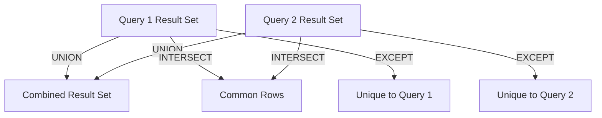

## 3.10 Set Operators: UNION, INTERSECT, EXCEPT

In the realm of SQL, set operators are powerful tools that allow us to perform operations on multiple result sets, much like set operations in mathematics. They enable us to combine, intersect, and differentiate data sets, providing a versatile approach to data manipulation. In this section, we will delve into the intricacies of three primary set operators: **UNION**, **INTERSECT**, and **EXCEPT**. We will explore their syntax, use cases, and best practices, along with practical examples to solidify your understanding.

### Understanding Set Operators

Set operators in SQL are used to combine the results of two or more queries into a single result set. The key operators include:

- **UNION**: Combines the results of two queries, removing duplicates by default.
- **INTERSECT**: Returns only the rows that are common to both queries.
- **EXCEPT**: Returns rows from the first query that are not present in the second query.

#### Compatibility Requirements

Before diving into each operator, it's important to understand the compatibility requirements for using set operators:

1. **Matching Column Count**: The queries combined by set operators must have the same number of columns in their result sets.
2. **Compatible Data Types**: The corresponding columns in the queries must have compatible data types. For example, you cannot combine a column of type `VARCHAR` with a column of type `INTEGER`.

### UNION Operator

The **UNION** operator is used to combine the results of two or more queries into a single result set. By default, it removes duplicate rows from the result set.

#### UNION ALL vs. UNION DISTINCT

- **UNION ALL**: Combines the results of two queries and includes all duplicates.
- **UNION DISTINCT**: Removes duplicates from the combined result set. This is the default behavior of the UNION operator.

#### Syntax

```sql
SELECT column1, column2, ...
FROM table1
UNION [ALL | DISTINCT]
SELECT column1, column2, ...
FROM table2;
```

#### Example: UNION ALL

Let's consider two tables, `employees_us` and `employees_uk`, which store employee data for US and UK offices, respectively.

```sql
-- Combine employee data from both US and UK offices, including duplicates
SELECT employee_id, first_name, last_name
FROM employees_us
UNION ALL
SELECT employee_id, first_name, last_name
FROM employees_uk;
```

In this example, `UNION ALL` combines the data from both tables, including any duplicate rows.

#### Example: UNION DISTINCT

```sql
-- Combine employee data from both US and UK offices, removing duplicates
SELECT employee_id, first_name, last_name
FROM employees_us
UNION
SELECT employee_id, first_name, last_name
FROM employees_uk;
```

Here, `UNION` (equivalent to `UNION DISTINCT`) removes duplicate rows from the combined result set.

### INTERSECT Operator

The **INTERSECT** operator returns only the rows that are common to both queries. It is useful for finding overlapping data between two result sets.

#### Syntax

```sql
SELECT column1, column2, ...
FROM table1
INTERSECT
SELECT column1, column2, ...
FROM table2;
```

#### Example: INTERSECT

Suppose we have two tables, `project_a` and `project_b`, each containing a list of employee IDs working on different projects.

```sql
-- Find employees working on both Project A and Project B
SELECT employee_id
FROM project_a
INTERSECT
SELECT employee_id
FROM project_b;
```

This query returns the employee IDs that are present in both `project_a` and `project_b`.

### EXCEPT Operator

The **EXCEPT** operator returns rows from the first query that are not present in the second query. It is useful for identifying unique data in one result set compared to another.

#### Syntax

```sql
SELECT column1, column2, ...
FROM table1
EXCEPT
SELECT column1, column2, ...
FROM table2;
```

#### Example: EXCEPT

Consider two tables, `all_employees` and `terminated_employees`, where `all_employees` contains all current employees and `terminated_employees` contains employees who have left the company.

```sql
-- Find employees who are currently active (not terminated)
SELECT employee_id, first_name, last_name
FROM all_employees
EXCEPT
SELECT employee_id, first_name, last_name
FROM terminated_employees;
```

This query returns the employees who are still active and not present in the `terminated_employees` table.

### Visualizing Set Operations

To better understand how these set operators work, let's visualize the operations using a Venn diagram.



- **UNION**: Combines both result sets into one, removing duplicates.
- **INTERSECT**: Returns only the overlapping area (common rows).
- **EXCEPT**: Returns the part of the first set that does not overlap with the second.

### Best Practices for Using Set Operators

1. **Ensure Column Compatibility**: Always verify that the columns in the queries have compatible data types and the same number of columns.
2. **Use UNION ALL When Duplicates Are Acceptable**: If duplicates are acceptable and performance is a concern, prefer `UNION ALL` over `UNION` to avoid the overhead of duplicate removal.
3. **Optimize Queries for Performance**: Set operations can be resource-intensive. Ensure that the underlying queries are optimized for performance.
4. **Consider Indexing**: Proper indexing can significantly improve the performance of set operations, especially when dealing with large data sets.
5. **Use EXCEPT for Data Validation**: Use the `EXCEPT` operator to validate data by identifying discrepancies between expected and actual data sets.

### Try It Yourself

Experiment with the following modifications to the code examples:

- Modify the `UNION` example to include additional columns and observe how it affects the result set.
- Change the `INTERSECT` example to use different tables and see how the common rows change.
- Use the `EXCEPT` operator with different conditions to explore its behavior with various data sets.

### References and Further Reading

- [SQL UNION Operator - W3Schools](https://www.w3schools.com/sql/sql_union.asp)
- [SQL INTERSECT Operator - W3Schools](https://www.w3schools.com/sql/sql_intersect.asp)
- [SQL EXCEPT Operator - W3Schools](https://www.w3schools.com/sql/sql_except.asp)

### Knowledge Check

- What are the primary differences between `UNION` and `UNION ALL`?
- How does the `INTERSECT` operator differ from the `EXCEPT` operator?
- What are the compatibility requirements for using set operators in SQL?

### Embrace the Journey

Remember, mastering set operators is just one step in your SQL journey. As you continue to explore and experiment, you'll uncover even more powerful ways to manipulate and analyze data. Keep pushing the boundaries, stay curious, and enjoy the process of learning and growing as a SQL expert!

## Quiz Time!



### What is the primary difference between UNION and UNION ALL?

- [x] UNION removes duplicates, UNION ALL includes duplicates.
- [ ] UNION includes duplicates, UNION ALL removes duplicates.
- [ ] UNION is faster than UNION ALL.
- [ ] UNION ALL is used for intersecting data.

> **Explanation:** UNION removes duplicates from the result set, while UNION ALL includes all duplicates.

### Which operator returns only the common rows between two queries?

- [ ] UNION
- [x] INTERSECT
- [ ] EXCEPT
- [ ] JOIN

> **Explanation:** INTERSECT returns only the rows that are common to both queries.

### What does the EXCEPT operator do?

- [x] Returns rows from the first query not present in the second.
- [ ] Combines results of two queries, removing duplicates.
- [ ] Returns common rows between two queries.
- [ ] Combines results of two queries, including duplicates.

> **Explanation:** EXCEPT returns rows from the first query that are not present in the second query.

### What must be true about the columns in queries using set operators?

- [x] They must have the same number of columns and compatible data types.
- [ ] They must have different data types.
- [ ] They must have the same column names.
- [ ] They must be indexed.

> **Explanation:** Queries using set operators must have the same number of columns with compatible data types.

### Which set operator would you use to find discrepancies between two data sets?

- [ ] UNION
- [ ] INTERSECT
- [x] EXCEPT
- [ ] JOIN

> **Explanation:** EXCEPT is used to find rows in the first data set that are not present in the second, highlighting discrepancies.

### How can you improve the performance of set operations?

- [x] By optimizing underlying queries and using proper indexing.
- [ ] By using more columns in the queries.
- [ ] By avoiding the use of set operators.
- [ ] By using UNION instead of UNION ALL.

> **Explanation:** Optimizing queries and using proper indexing can significantly improve the performance of set operations.

### What is the default behavior of the UNION operator?

- [x] It removes duplicates from the result set.
- [ ] It includes all duplicates in the result set.
- [ ] It returns only the common rows.
- [ ] It returns rows from the first query not in the second.

> **Explanation:** The default behavior of UNION is to remove duplicates from the result set.

### Which operator would you use to combine results from two queries, including duplicates?

- [ ] UNION
- [x] UNION ALL
- [ ] INTERSECT
- [ ] EXCEPT

> **Explanation:** UNION ALL combines results from two queries and includes all duplicates.

### Can set operators be used with queries having different numbers of columns?

- [ ] Yes, as long as the data types are compatible.
- [x] No, they must have the same number of columns.
- [ ] Yes, if the column names are the same.
- [ ] No, unless they are indexed.

> **Explanation:** Set operators require queries to have the same number of columns with compatible data types.

### True or False: INTERSECT can be used to find unique rows in a single query.

- [ ] True
- [x] False

> **Explanation:** INTERSECT is used to find common rows between two queries, not unique rows in a single query.


