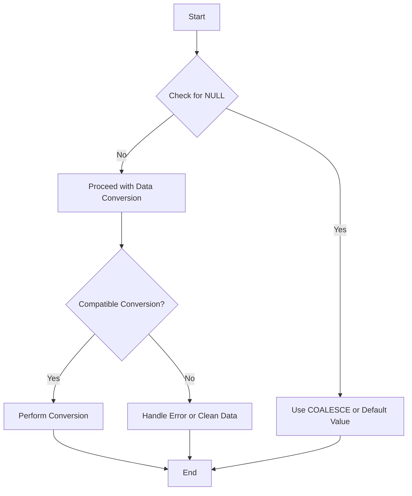

## 3.11 Handling Nulls and Data Conversion

In the realm of SQL, handling NULLs and performing data conversions are fundamental skills that every expert software engineer and architect must master. These concepts are crucial for ensuring data integrity, optimizing query performance, and building scalable database solutions. In this section, we will delve into the intricacies of NULL handling and data conversion, providing you with the knowledge and tools necessary to excel in SQL development.

### Understanding NULL

In SQL, NULL represents the absence of a value. It is important to note that NULL is not equivalent to zero, an empty string, or any other default value. Instead, it signifies that the data is unknown or missing. Understanding how to work with NULLs is essential for accurate data retrieval and manipulation.

#### Functions for Handling NULLs

SQL provides several functions to handle NULL values effectively. Let's explore some of the most commonly used functions:

- **IS NULL / IS NOT NULL**: These operators are used to check whether a value is NULL or not.

  ```sql
  SELECT * FROM employees WHERE manager_id IS NULL;
  ```

  In this example, we retrieve all employees who do not have a manager assigned.

- **COALESCE()**: This function returns the first non-NULL value from a list of expressions.

  ```sql
  SELECT employee_id, COALESCE(phone_number, 'N/A') AS contact_number FROM employees;
  ```

  Here, we ensure that if an employee's phone number is NULL, the result will display 'N/A' instead.

- **NULLIF()**: This function compares two expressions and returns NULL if they are equal; otherwise, it returns the first expression.

  ```sql
  SELECT product_id, NULLIF(sale_price, 0) AS adjusted_price FROM products;
  ```

  This example returns NULL for products with a sale price of zero, indicating that the price is not applicable.

### Data Conversion

Data conversion is the process of changing data from one type to another. It is a critical aspect of SQL development, especially when dealing with heterogeneous data sources or performing complex calculations.

#### CAST() and CONVERT()

SQL provides two primary functions for data conversion: `CAST()` and `CONVERT()`. Both functions allow you to change the data type of an expression, but they have some differences in syntax and usage.

- **CAST()**: This function is part of the SQL standard and is widely supported across different database systems.

  ```sql
  SELECT CAST(salary AS DECIMAL(10, 2)) AS formatted_salary FROM employees;
  ```

  In this example, we convert the `salary` column to a decimal format with two decimal places.

- **CONVERT()**: This function is specific to certain database systems, such as SQL Server, and offers additional options for data conversion.

  ```sql
  SELECT CONVERT(VARCHAR(10), hire_date, 101) AS formatted_date FROM employees;
  ```

  Here, we convert the `hire_date` column to a string format using a specific date style.

#### Dealing with Incompatible Conversions

When performing data conversions, it is crucial to handle potential errors and ensure data integrity. Incompatible conversions can lead to runtime errors or data loss. Here are some strategies to deal with such scenarios:

- **Error Handling**: Use try-catch blocks or equivalent mechanisms to catch conversion errors and handle them gracefully.

  ```sql
  BEGIN TRY
      SELECT CAST('abc' AS INT) AS result;
  END TRY
  BEGIN CATCH
      PRINT 'Conversion error occurred';
  END CATCH
  ```

  In this example, we attempt to convert a string to an integer, which will result in an error. The catch block handles the error by printing a message.

- **Data Cleansing**: Before performing conversions, clean the data to ensure compatibility. This may involve removing invalid characters, trimming whitespace, or normalizing data formats.

  ```sql
  UPDATE customers SET phone_number = TRIM(phone_number) WHERE phone_number IS NOT NULL;
  ```

  This query removes leading and trailing whitespace from phone numbers, ensuring consistent formatting.

### Visualizing NULL Handling and Data Conversion

To better understand the flow of NULL handling and data conversion in SQL, let's visualize the process using a flowchart.



**Figure 1: Flowchart for Handling NULLs and Data Conversion**

This flowchart illustrates the decision-making process when handling NULLs and performing data conversions. It emphasizes the importance of checking for NULL values, using default values when necessary, and ensuring compatibility before conversion.

### Try It Yourself

To solidify your understanding of NULL handling and data conversion, try experimenting with the following SQL queries:

1. Modify the `COALESCE()` example to include multiple fallback values.
2. Experiment with different date styles in the `CONVERT()` function.
3. Create a query that uses `NULLIF()` to handle division by zero errors.

### References and Links

For further reading on NULL handling and data conversion in SQL, consider exploring the following resources:

- [SQL NULL Functions - W3Schools](https://www.w3schools.com/sql/sql_null_values.asp)
- [CAST and CONVERT (Transact-SQL) - Microsoft Docs](https://docs.microsoft.com/en-us/sql/t-sql/functions/cast-and-convert-transact-sql)
- [Data Cleansing Techniques - MDN Web Docs](https://developer.mozilla.org/en-US/docs/Web/JavaScript/Guide/Regular_Expressions)

### Knowledge Check

Before we conclude, let's pose a few questions to reinforce your understanding:

- What is the difference between `COALESCE()` and `NULLIF()`?
- How can you handle conversion errors in SQL?
- Why is it important to clean data before performing conversions?

### Embrace the Journey

Remember, mastering NULL handling and data conversion is just one step in your journey to becoming an expert SQL developer. As you progress, you'll encounter more complex scenarios and develop innovative solutions. Keep experimenting, stay curious, and enjoy the journey!

## Quiz Time!



### What does the COALESCE() function do in SQL?

- [x] Returns the first non-NULL value from a list of expressions
- [ ] Compares two expressions and returns NULL if they are equal
- [ ] Converts data from one type to another
- [ ] Checks if a value is NULL

> **Explanation:** The COALESCE() function returns the first non-NULL value from a list of expressions.

### Which function is part of the SQL standard for data conversion?

- [x] CAST()
- [ ] CONVERT()
- [ ] COALESCE()
- [ ] NULLIF()

> **Explanation:** CAST() is part of the SQL standard for data conversion, whereas CONVERT() is specific to certain database systems.

### How can you check if a column value is NULL in SQL?

- [x] IS NULL
- [ ] IS NOT NULL
- [ ] COALESCE()
- [ ] NULLIF()

> **Explanation:** The IS NULL operator is used to check if a column value is NULL in SQL.

### What is the purpose of the NULLIF() function?

- [x] Compares two expressions and returns NULL if they are equal
- [ ] Returns the first non-NULL value from a list of expressions
- [ ] Converts data from one type to another
- [ ] Checks if a value is NULL

> **Explanation:** The NULLIF() function compares two expressions and returns NULL if they are equal.

### Which function is specific to certain database systems like SQL Server?

- [x] CONVERT()
- [ ] CAST()
- [ ] COALESCE()
- [ ] NULLIF()

> **Explanation:** The CONVERT() function is specific to certain database systems like SQL Server.

### What should you do before performing data conversions to ensure compatibility?

- [x] Clean the data
- [ ] Use COALESCE()
- [ ] Use NULLIF()
- [ ] Check for NULL values

> **Explanation:** Cleaning the data before performing conversions ensures compatibility and prevents errors.

### How can you handle conversion errors in SQL?

- [x] Use try-catch blocks or equivalent mechanisms
- [ ] Use COALESCE()
- [ ] Use NULLIF()
- [ ] Use IS NULL

> **Explanation:** Using try-catch blocks or equivalent mechanisms allows you to handle conversion errors gracefully.

### What does the IS NOT NULL operator do?

- [x] Checks if a value is not NULL
- [ ] Returns the first non-NULL value from a list of expressions
- [ ] Compares two expressions and returns NULL if they are equal
- [ ] Converts data from one type to another

> **Explanation:** The IS NOT NULL operator checks if a value is not NULL.

### Why is NULL not equivalent to zero or an empty string in SQL?

- [x] NULL represents the absence of a value
- [ ] NULL is a default value
- [ ] NULL is equivalent to zero
- [ ] NULL is equivalent to an empty string

> **Explanation:** NULL represents the absence of a value, not a default value like zero or an empty string.

### True or False: The CAST() function can be used to convert data types in SQL.

- [x] True
- [ ] False

> **Explanation:** True. The CAST() function is used to convert data types in SQL.



By mastering the handling of NULLs and data conversion, you are well on your way to becoming an expert in SQL development. Keep exploring, practicing, and applying these concepts to build robust and efficient database solutions.
