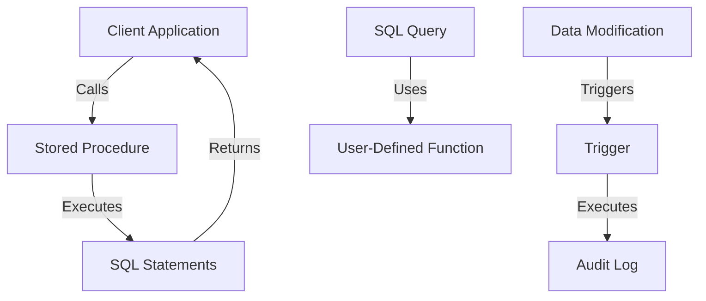

## 3.12 Stored Procedures, Functions, and Triggers

In the realm of SQL, stored procedures, functions, and triggers are pivotal components that allow developers to encapsulate logic, manage data efficiently, and enforce rules within a database system. Understanding these elements is crucial for building robust, scalable, and maintainable database applications. Let's delve into each of these components, exploring their purposes, types, and best practices.

### Stored Procedures

**Purpose**: Stored procedures are precompiled collections of SQL statements and optional control-of-flow statements, stored under a name and processed as a unit. They are designed to encapsulate logic for reuse, improve performance by reducing network traffic, and enhance security by controlling access to data.

#### Key Features of Stored Procedures

- **Encapsulation**: Store complex business logic in a single location.
- **Reusability**: Execute the same logic across different applications.
- **Performance**: Reduce client-server round trips and leverage execution plan caching.
- **Security**: Restrict direct access to data and provide controlled interfaces.

#### Parameters in Stored Procedures

Stored procedures can accept parameters, which can be categorized into:

- **Input Parameters**: Pass values to the procedure.
- **Output Parameters**: Return values from the procedure.
- **Optional Parameters**: Provide default values if not supplied.

#### Sample Code Snippet

```sql
CREATE PROCEDURE GetEmployeeDetails
    @EmployeeID INT,
    @EmployeeName NVARCHAR(100) OUTPUT
AS
BEGIN
    SELECT @EmployeeName = Name
    FROM Employees
    WHERE ID = @EmployeeID;
END;
```

In this example, `GetEmployeeDetails` is a stored procedure that takes an employee ID as input and returns the employee's name as output.

#### Best Practices for Stored Procedures

- **Limit Complexity**: Avoid excessive logic that can hinder performance.
- **Use Transactions**: Ensure data integrity by wrapping critical operations in transactions.
- **Error Handling**: Implement robust error handling to manage exceptions gracefully.
- **Security**: Use parameterized queries to prevent SQL injection attacks.

### User-Defined Functions

User-defined functions (UDFs) allow you to encapsulate logic that can be reused across queries. They come in two main types: scalar functions and table-valued functions.

#### Scalar Functions

**Purpose**: Return a single value based on the input parameters.

#### Sample Code Snippet

```sql
CREATE FUNCTION CalculateDiscount
    (@Price DECIMAL(10, 2), @DiscountRate DECIMAL(5, 2))
RETURNS DECIMAL(10, 2)
AS
BEGIN
    RETURN @Price * (1 - @DiscountRate / 100);
END;
```

This scalar function calculates a discount based on the price and discount rate.

#### Table-Valued Functions

**Purpose**: Return a table data set, which can be used like a regular table in queries.

#### Sample Code Snippet

```sql
CREATE FUNCTION GetActiveEmployees()
RETURNS TABLE
AS
RETURN
(
    SELECT ID, Name, Position
    FROM Employees
    WHERE Status = 'Active'
);
```

This table-valued function returns a list of active employees.

#### Best Practices for User-Defined Functions

- **Avoid Side Effects**: Functions should not modify database state.
- **Optimize Performance**: Be cautious of performance impacts, especially with scalar functions in large queries.
- **Use Inline Table-Valued Functions**: Prefer inline table-valued functions over multi-statement ones for better performance.

### Triggers

Triggers are special types of stored procedures that automatically execute in response to certain events on a table or view. They are used to enforce rules, audit changes, and maintain data integrity.

#### Types of Triggers

- **BEFORE Triggers**: Execute before an insert, update, or delete operation.
- **AFTER Triggers**: Execute after an insert, update, or delete operation.
- **INSTEAD OF Triggers**: Execute in place of an insert, update, or delete operation.

#### Use Cases for Triggers

- **Enforcing Business Rules**: Automatically enforce complex business rules.
- **Auditing Changes**: Track changes to data for auditing purposes.
- **Maintaining Data Integrity**: Ensure data consistency across related tables.

#### Sample Code Snippet

```sql
CREATE TRIGGER trgAfterInsert
ON Employees
AFTER INSERT
AS
BEGIN
    DECLARE @EmpID INT;
    SELECT @EmpID = ID FROM INSERTED;
    INSERT INTO AuditLog (EmployeeID, Action, ActionDate)
    VALUES (@EmpID, 'INSERT', GETDATE());
END;
```

This trigger logs every new employee insertion into an audit table.

#### Best Practices for Triggers

- **Minimize Logic**: Keep trigger logic simple to avoid performance bottlenecks.
- **Avoid Recursive Triggers**: Prevent triggers from calling themselves recursively.
- **Use for Auditing**: Leverage triggers for auditing and logging changes.

### Visualizing Stored Procedures, Functions, and Triggers

To better understand how stored procedures, functions, and triggers interact within a database, let's visualize their relationships using a Mermaid.js diagram.



**Diagram Description**: This diagram illustrates the interaction between client applications, stored procedures, user-defined functions, and triggers. Stored procedures are called by client applications to execute SQL statements. SQL queries can utilize user-defined functions for reusable logic. Data modifications trigger triggers, which can perform actions like logging.

### Try It Yourself

Experiment with the code examples provided. Try modifying the stored procedure to include additional logic, or create a new trigger to audit updates. Consider how these changes impact performance and maintainability.

### References and Links

- [SQL Server Stored Procedures](https://docs.microsoft.com/en-us/sql/relational-databases/stored-procedures/stored-procedures-database-engine)
- [User-Defined Functions in SQL Server](https://docs.microsoft.com/en-us/sql/relational-databases/user-defined-functions/user-defined-functions)
- [Triggers in SQL Server](https://docs.microsoft.com/en-us/sql/relational-databases/triggers/triggers-database-engine)

### Knowledge Check

- What are the main differences between stored procedures and functions?
- How can triggers be used to enforce business rules?
- What are the best practices for optimizing stored procedures?

### Embrace the Journey

Remember, mastering SQL stored procedures, functions, and triggers is a journey. As you progress, you'll build more complex and efficient database applications. Keep experimenting, stay curious, and enjoy the journey!

## Quiz Time!



### What is the primary purpose of stored procedures in SQL?

- [x] Encapsulating logic for reuse
- [ ] Storing raw data
- [ ] Creating indexes
- [ ] Managing user permissions

> **Explanation:** Stored procedures encapsulate logic for reuse, improving performance and security.

### Which type of user-defined function returns a single value?

- [x] Scalar Function
- [ ] Table-Valued Function
- [ ] Aggregate Function
- [ ] Window Function

> **Explanation:** Scalar functions return a single value based on input parameters.

### What is a key benefit of using triggers in SQL?

- [x] Enforcing business rules automatically
- [ ] Increasing query speed
- [ ] Reducing database size
- [ ] Simplifying user interfaces

> **Explanation:** Triggers enforce business rules automatically by executing in response to specific events.

### What type of trigger executes before a data modification?

- [x] BEFORE Trigger
- [ ] AFTER Trigger
- [ ] INSTEAD OF Trigger
- [ ] DURING Trigger

> **Explanation:** BEFORE triggers execute before a data modification operation.

### Which parameter type in stored procedures is used to return values?

- [x] Output Parameter
- [ ] Input Parameter
- [ ] Optional Parameter
- [ ] Default Parameter

> **Explanation:** Output parameters are used to return values from stored procedures.

### What is a best practice for stored procedures to ensure data integrity?

- [x] Use Transactions
- [ ] Avoid Parameters
- [ ] Use SELECT *
- [ ] Disable Indexes

> **Explanation:** Using transactions ensures data integrity by grouping operations into a single unit of work.

### How can user-defined functions impact performance?

- [x] Scalar functions can slow down large queries
- [ ] They always improve performance
- [ ] They have no impact on performance
- [ ] They reduce database size

> **Explanation:** Scalar functions can slow down large queries due to their execution for each row.

### What is a common use case for AFTER triggers?

- [x] Auditing changes
- [ ] Preventing data entry
- [ ] Creating indexes
- [ ] Managing user roles

> **Explanation:** AFTER triggers are commonly used for auditing changes by executing after data modifications.

### Which of the following is NOT a type of trigger?

- [x] DURING Trigger
- [ ] BEFORE Trigger
- [ ] AFTER Trigger
- [ ] INSTEAD OF Trigger

> **Explanation:** DURING triggers do not exist; the types are BEFORE, AFTER, and INSTEAD OF.

### True or False: Triggers can modify the database state.

- [x] True
- [ ] False

> **Explanation:** Triggers can modify the database state by executing SQL statements in response to events.


