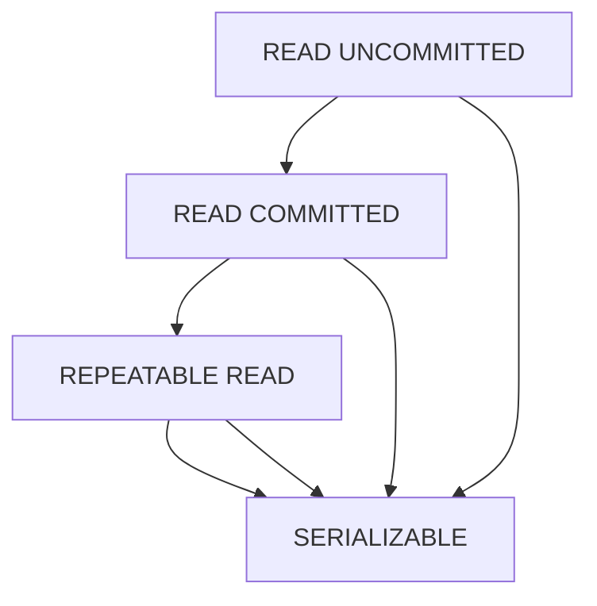

## 3.13 Cursors and Transaction Handling

In the realm of SQL, understanding cursors and transaction handling is crucial for building robust and efficient database applications. This section delves into the purpose and usage of cursors, explores transaction management principles, and provides strategies for handling concurrency and preventing deadlocks.

### Understanding Cursors

#### Purpose of Cursors

Cursors in SQL are database objects used to retrieve, manipulate, and navigate through a result set row by row. They are particularly useful when you need to perform operations on each row individually, such as calculations or updates that cannot be easily achieved with set-based operations.

- **Row-by-Row Processing**: Cursors allow you to process each row in a result set individually, which is essential for complex logic that cannot be expressed in a single SQL statement.
- **Iterative Operations**: They are ideal for operations that require iteration over a dataset, such as generating reports or performing batch updates.

#### Alternatives to Cursors

While cursors provide a straightforward way to handle row-by-row processing, they can be inefficient for large datasets. Set-based operations are often preferred for their performance benefits.

- **Set-Based Operations**: SQL is inherently designed for set-based operations, which process entire datasets in a single statement. This approach is generally more efficient than using cursors.
- **Window Functions**: These functions allow you to perform calculations across a set of table rows related to the current row, offering a powerful alternative to cursors for certain tasks.

#### Cursor Types

SQL supports various types of cursors, each with distinct characteristics:

- **Static Cursors**: These provide a snapshot of the result set, which does not reflect changes made to the data after the cursor is opened.
- **Dynamic Cursors**: These reflect all changes in the result set as you scroll through it, offering a real-time view of the data.
- **Forward-Only Cursors**: These allow you to fetch rows in a forward direction only, which can be more efficient than other types.
- **Keyset-Driven Cursors**: These use a set of keys to identify the rows in the result set, allowing for some changes to be visible.

#### Sample Code Snippet: Using a Cursor

```sql
-- Declare a cursor for iterating over a result set
DECLARE @EmployeeID INT;
DECLARE EmployeeCursor CURSOR FOR
SELECT EmployeeID FROM Employees WHERE Department = 'Sales';

-- Open the cursor
OPEN EmployeeCursor;

-- Fetch the first row
FETCH NEXT FROM EmployeeCursor INTO @EmployeeID;

-- Loop through the result set
WHILE @@FETCH_STATUS = 0
BEGIN
    -- Perform operations on each row
    PRINT 'Processing Employee ID: ' + CAST(@EmployeeID AS VARCHAR);

    -- Fetch the next row
    FETCH NEXT FROM EmployeeCursor INTO @EmployeeID;
END

-- Close and deallocate the cursor
CLOSE EmployeeCursor;
DEALLOCATE EmployeeCursor;
```

### Transaction Handling

#### Atomicity in Transactions

Transactions in SQL ensure that a series of operations are executed as a single unit. If any operation within the transaction fails, the entire transaction is rolled back, maintaining data integrity.

- **BEGIN TRANSACTION**: Marks the start of a transaction.
- **COMMIT**: Saves all changes made during the transaction.
- **ROLLBACK**: Undoes all changes made during the transaction if an error occurs.

#### Isolation Levels

Isolation levels define the degree to which the operations in one transaction are isolated from those in other transactions. They play a crucial role in managing concurrency and ensuring data consistency.

- **READ UNCOMMITTED**: Allows dirty reads, where changes made by other transactions can be read before they are committed.
- **READ COMMITTED**: Prevents dirty reads by ensuring that only committed data is read.
- **REPEATABLE READ**: Ensures that if a row is read twice in the same transaction, it will not change.
- **SERIALIZABLE**: The strictest level, ensuring complete isolation from other transactions.

#### Deadlocks and Locking

Deadlocks occur when two or more transactions are waiting for each other to release locks, resulting in a standstill. Understanding and preventing deadlocks is essential for maintaining database performance.

- **Locking Mechanisms**: SQL databases use locks to manage concurrent access to data. Understanding how locks work can help prevent deadlocks.
- **Deadlock Prevention**: Techniques such as acquiring locks in a consistent order and using timeouts can help prevent deadlocks.

#### Sample Code Snippet: Transaction Handling

```sql
-- Begin a transaction
BEGIN TRANSACTION;

-- Try to update a record
BEGIN TRY
    UPDATE Accounts SET Balance = Balance - 100 WHERE AccountID = 1;
    UPDATE Accounts SET Balance = Balance + 100 WHERE AccountID = 2;

    -- Commit the transaction if successful
    COMMIT;
END TRY
BEGIN CATCH
    -- Rollback the transaction if an error occurs
    ROLLBACK;
    PRINT 'Transaction failed: ' + ERROR_MESSAGE();
END CATCH;
```

### Visualizing Transaction Isolation Levels



**Description**: This diagram illustrates the hierarchy of transaction isolation levels, from the least strict (READ UNCOMMITTED) to the most strict (SERIALIZABLE).

### Best Practices for Cursors and Transaction Handling

- **Minimize Cursor Usage**: Use set-based operations whenever possible to improve performance.
- **Choose the Right Isolation Level**: Balance the need for data consistency with performance requirements.
- **Prevent Deadlocks**: Use consistent locking orders and consider using lock timeouts.
- **Handle Transactions Gracefully**: Ensure that transactions are committed or rolled back appropriately to maintain data integrity.

### Try It Yourself

Experiment with the provided code snippets by modifying the cursor query or transaction logic. Try using different isolation levels and observe how they affect concurrency and data consistency.

### References and Links

- [SQL Server Cursors](https://docs.microsoft.com/en-us/sql/t-sql/language-elements/cursors-transact-sql)
- [Transaction Management in SQL](https://www.w3schools.com/sql/sql_transactions.asp)
- [Understanding Isolation Levels](https://www.sqlshack.com/sql-server-transaction-isolation-levels/)

### Knowledge Check

- Explain the purpose of cursors in SQL.
- Describe the differences between static and dynamic cursors.
- What are the four transaction isolation levels in SQL?
- How can deadlocks be prevented in SQL databases?

### Embrace the Journey

Remember, mastering cursors and transaction handling is a journey. As you continue to explore these concepts, you'll gain deeper insights into building efficient and reliable database applications. Keep experimenting, stay curious, and enjoy the process!

## Quiz Time!



### What is the primary purpose of using cursors in SQL?

- [x] To process result sets row by row
- [ ] To perform set-based operations
- [ ] To manage transaction isolation levels
- [ ] To prevent deadlocks

> **Explanation:** Cursors are used to process result sets row by row, allowing for operations on individual rows.

### Which cursor type provides a snapshot of the result set that does not reflect changes made after the cursor is opened?

- [x] Static Cursor
- [ ] Dynamic Cursor
- [ ] Forward-Only Cursor
- [ ] Keyset-Driven Cursor

> **Explanation:** Static cursors provide a snapshot of the result set and do not reflect changes made after the cursor is opened.

### What is the strictest transaction isolation level in SQL?

- [x] SERIALIZABLE
- [ ] READ UNCOMMITTED
- [ ] READ COMMITTED
- [ ] REPEATABLE READ

> **Explanation:** SERIALIZABLE is the strictest isolation level, ensuring complete isolation from other transactions.

### How can deadlocks be prevented in SQL databases?

- [x] By acquiring locks in a consistent order
- [ ] By using cursors
- [ ] By increasing transaction isolation levels
- [ ] By using dynamic SQL

> **Explanation:** Acquiring locks in a consistent order can help prevent deadlocks.

### What command is used to start a transaction in SQL?

- [x] BEGIN TRANSACTION
- [ ] START TRANSACTION
- [ ] INITIATE TRANSACTION
- [ ] OPEN TRANSACTION

> **Explanation:** BEGIN TRANSACTION is used to start a transaction in SQL.

### Which isolation level allows dirty reads?

- [x] READ UNCOMMITTED
- [ ] READ COMMITTED
- [ ] REPEATABLE READ
- [ ] SERIALIZABLE

> **Explanation:** READ UNCOMMITTED allows dirty reads, where changes made by other transactions can be read before they are committed.

### What is the purpose of the COMMIT command in SQL?

- [x] To save all changes made during a transaction
- [ ] To undo all changes made during a transaction
- [ ] To start a new transaction
- [ ] To set the transaction isolation level

> **Explanation:** COMMIT is used to save all changes made during a transaction.

### Which cursor type allows fetching rows in a forward direction only?

- [x] Forward-Only Cursor
- [ ] Static Cursor
- [ ] Dynamic Cursor
- [ ] Keyset-Driven Cursor

> **Explanation:** Forward-Only Cursors allow fetching rows in a forward direction only, which can be more efficient.

### What is a common alternative to using cursors for row-by-row processing?

- [x] Set-Based Operations
- [ ] Dynamic SQL
- [ ] Nested Transactions
- [ ] Isolation Levels

> **Explanation:** Set-based operations are a common alternative to using cursors for row-by-row processing, offering better performance.

### True or False: Deadlocks can occur when two transactions are waiting for each other to release locks.

- [x] True
- [ ] False

> **Explanation:** Deadlocks occur when two or more transactions are waiting for each other to release locks, resulting in a standstill.


