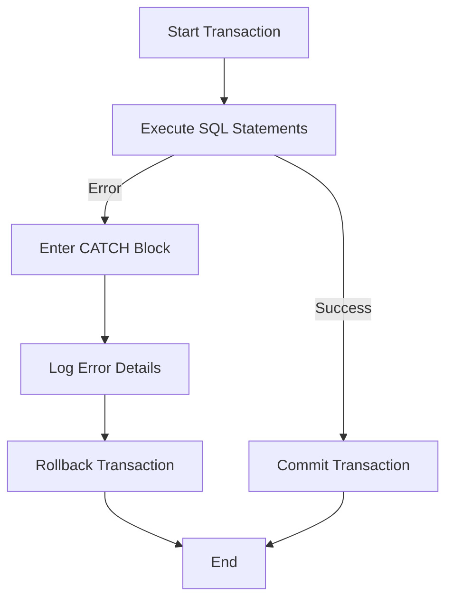

## 3.14 Error Handling and Exception Management

In the realm of SQL database development, error handling and exception management are crucial for maintaining data integrity, ensuring system reliability, and providing a seamless user experience. This section delves into the structured mechanisms available in SQL for handling errors, generating custom error messages, logging errors for diagnostics, and managing transaction rollbacks to maintain data consistency.

### Introduction to Error Handling in SQL

Error handling in SQL involves anticipating potential issues that may arise during database operations and implementing strategies to manage these errors effectively. This ensures that the database system can recover gracefully from unexpected conditions, minimizing the impact on users and maintaining data integrity.

### TRY...CATCH Blocks: Structured Error Handling

The `TRY...CATCH` construct in SQL provides a structured way to handle exceptions. It allows developers to define a block of code to be executed if an error occurs, enabling the graceful handling of exceptions without terminating the entire transaction.

#### Syntax and Usage

The `TRY...CATCH` construct is similar to exception handling mechanisms in other programming languages. Here's the basic syntax:

```sql
BEGIN TRY
    -- SQL statements that may cause an error
    SELECT * FROM NonExistentTable;
END TRY
BEGIN CATCH
    -- Error handling logic
    PRINT 'An error occurred.';
    PRINT ERROR_MESSAGE();
END CATCH;
```

- **BEGIN TRY**: Encapsulates the SQL statements that may cause an error.
- **BEGIN CATCH**: Contains the logic to handle the error if one occurs.

#### Key Functions in CATCH Block

Within the `CATCH` block, several functions are available to retrieve error information:

- **ERROR_NUMBER()**: Returns the error number.
- **ERROR_SEVERITY()**: Returns the severity level of the error.
- **ERROR_STATE()**: Returns the state number of the error.
- **ERROR_PROCEDURE()**: Returns the name of the stored procedure or trigger where the error occurred.
- **ERROR_LINE()**: Returns the line number at which the error occurred.
- **ERROR_MESSAGE()**: Returns the complete text of the error message.

#### Example: Handling a Division by Zero Error

```sql
BEGIN TRY
    DECLARE @Result INT;
    SET @Result = 10 / 0; -- This will cause a division by zero error
END TRY
BEGIN CATCH
    PRINT 'Error Number: ' + CAST(ERROR_NUMBER() AS VARCHAR);
    PRINT 'Error Message: ' + ERROR_MESSAGE();
END CATCH;
```

### RAISERROR and THROW: Generating Custom Error Messages

SQL provides mechanisms to generate custom error messages using `RAISERROR` and `THROW`. These are useful for signaling application-specific errors or for debugging purposes.

#### RAISERROR

The `RAISERROR` statement allows you to generate an error message with a specific severity and state.

```sql
RAISERROR ('Custom error message', 16, 1);
```

- **Message**: The error message to be displayed.
- **Severity**: The severity level of the error (0-25).
- **State**: A user-defined integer (0-255) that indicates the state or location of the error.

#### THROW

Introduced in SQL Server 2012, `THROW` provides a simpler syntax for raising exceptions and is recommended for new applications.

```sql
THROW 50000, 'Custom error message', 1;
```

- **Error Number**: A user-defined error number greater than 50000.
- **Message**: The error message.
- **State**: A user-defined integer indicating the state.

#### Example: Using RAISERROR and THROW

```sql
BEGIN TRY
    -- Simulate an error
    RAISERROR ('Simulated error', 16, 1);
END TRY
BEGIN CATCH
    PRINT 'Caught an error using RAISERROR.';
    THROW; -- Re-throw the caught error
END CATCH;
```

### Logging Errors: Storing Error Details for Diagnostics

Logging errors is essential for diagnosing issues and understanding the context in which they occur. SQL allows you to log error details into a dedicated table for later analysis.

#### Creating an Error Log Table

```sql
CREATE TABLE ErrorLog (
    ErrorLogID INT IDENTITY(1,1) PRIMARY KEY,
    ErrorNumber INT,
    ErrorSeverity INT,
    ErrorState INT,
    ErrorProcedure NVARCHAR(128),
    ErrorLine INT,
    ErrorMessage NVARCHAR(4000),
    ErrorDateTime DATETIME DEFAULT GETDATE()
);
```

#### Logging Errors in the CATCH Block

```sql
BEGIN TRY
    -- Code that may cause an error
    EXEC NonExistentProcedure;
END TRY
BEGIN CATCH
    INSERT INTO ErrorLog (ErrorNumber, ErrorSeverity, ErrorState, ErrorProcedure, ErrorLine, ErrorMessage)
    VALUES (ERROR_NUMBER(), ERROR_SEVERITY(), ERROR_STATE(), ERROR_PROCEDURE(), ERROR_LINE(), ERROR_MESSAGE());
END CATCH;
```

### Transaction Rollbacks: Ensuring Data Integrity Upon Failure

Transactions are fundamental to maintaining data integrity. When an error occurs, rolling back a transaction ensures that the database remains in a consistent state.

#### Using TRY...CATCH with Transactions

```sql
BEGIN TRY
    BEGIN TRANSACTION;
    -- SQL operations
    UPDATE Accounts SET Balance = Balance - 100 WHERE AccountID = 1;
    UPDATE Accounts SET Balance = Balance + 100 WHERE AccountID = 2;
    COMMIT TRANSACTION;
END TRY
BEGIN CATCH
    ROLLBACK TRANSACTION;
    PRINT 'Transaction rolled back due to an error.';
END CATCH;
```

### Visualizing Error Handling Flow

To better understand the flow of error handling in SQL, let's visualize the process using a flowchart.



**Caption**: This flowchart illustrates the process of handling errors in SQL using TRY...CATCH blocks, including logging errors and managing transactions.

### Best Practices for Error Handling in SQL

- **Use TRY...CATCH for Structured Error Handling**: Always encapsulate potentially error-prone code within `TRY...CATCH` blocks.
- **Log Errors for Diagnostics**: Maintain an error log table to capture error details for future analysis.
- **Use RAISERROR and THROW for Custom Errors**: Generate meaningful error messages to aid in debugging and user communication.
- **Ensure Transaction Consistency**: Use transactions to maintain data integrity and roll back changes in case of errors.
- **Test Error Handling Logic**: Regularly test your error handling logic to ensure it behaves as expected under various conditions.

### Try It Yourself

Experiment with the provided code examples by modifying the SQL statements to trigger different types of errors. Observe how the error handling mechanisms respond and log the errors. Try creating custom error messages using `RAISERROR` and `THROW` to see how they appear in the error log.

### References and Further Reading

- [Microsoft Docs: TRY...CATCH (Transact-SQL)](https://docs.microsoft.com/en-us/sql/t-sql/language-elements/try-catch-transact-sql)
- [Microsoft Docs: RAISERROR (Transact-SQL)](https://docs.microsoft.com/en-us/sql/t-sql/language-elements/raiserror-transact-sql)
- [Microsoft Docs: THROW (Transact-SQL)](https://docs.microsoft.com/en-us/sql/t-sql/language-elements/throw-transact-sql)

### Knowledge Check

- What is the purpose of the `TRY...CATCH` construct in SQL?
- How can you generate a custom error message in SQL?
- Why is it important to log errors in a database system?
- What is the role of transactions in error handling?

### Embrace the Journey

Remember, mastering error handling and exception management in SQL is a journey. As you continue to explore and experiment with these concepts, you'll develop a deeper understanding of how to build robust and reliable database systems. Keep experimenting, stay curious, and enjoy the journey!

## Quiz Time!



### What is the main purpose of the TRY...CATCH construct in SQL?

- [x] To handle exceptions and prevent transaction termination
- [ ] To optimize query performance
- [ ] To create indexes
- [ ] To define data types

> **Explanation:** The TRY...CATCH construct is used to handle exceptions and prevent the termination of transactions when errors occur.

### Which function retrieves the complete text of an error message in a CATCH block?

- [ ] ERROR_NUMBER()
- [ ] ERROR_SEVERITY()
- [ ] ERROR_STATE()
- [x] ERROR_MESSAGE()

> **Explanation:** ERROR_MESSAGE() retrieves the complete text of the error message in a CATCH block.

### What is the recommended statement for raising exceptions in new SQL applications?

- [ ] RAISERROR
- [x] THROW
- [ ] PRINT
- [ ] EXEC

> **Explanation:** THROW is the recommended statement for raising exceptions in new SQL applications due to its simpler syntax.

### How can you ensure data integrity when an error occurs during a transaction?

- [ ] By using PRINT statements
- [x] By rolling back the transaction
- [ ] By creating indexes
- [ ] By using SELECT statements

> **Explanation:** Rolling back the transaction ensures data integrity when an error occurs during a transaction.

### What is the severity level range for RAISERROR?

- [ ] 0-10
- [x] 0-25
- [ ] 10-20
- [ ] 20-30

> **Explanation:** The severity level range for RAISERROR is 0-25.

### Which statement is used to log error details into a table?

- [ ] SELECT
- [ ] UPDATE
- [x] INSERT
- [ ] DELETE

> **Explanation:** INSERT is used to log error details into a table.

### What is the role of the ERROR_PROCEDURE() function?

- [ ] To return the error number
- [x] To return the name of the stored procedure where the error occurred
- [ ] To return the error severity
- [ ] To return the error state

> **Explanation:** ERROR_PROCEDURE() returns the name of the stored procedure or trigger where the error occurred.

### Which of the following is NOT a function available in the CATCH block?

- [ ] ERROR_NUMBER()
- [ ] ERROR_LINE()
- [ ] ERROR_MESSAGE()
- [x] ERROR_INDEX()

> **Explanation:** ERROR_INDEX() is not a valid function in the CATCH block.

### What is the purpose of logging errors in a database system?

- [x] To diagnose issues and understand the context of errors
- [ ] To improve query performance
- [ ] To create indexes
- [ ] To define data types

> **Explanation:** Logging errors helps diagnose issues and understand the context in which errors occur.

### True or False: The THROW statement can be used to re-throw a caught error in a CATCH block.

- [x] True
- [ ] False

> **Explanation:** The THROW statement can be used to re-throw a caught error in a CATCH block.


