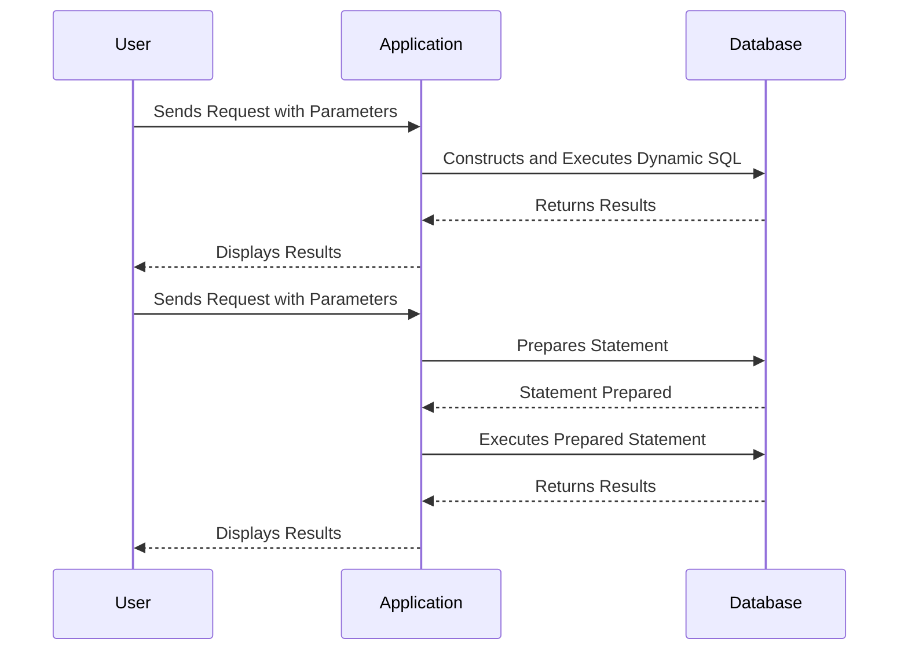

## 3.15 Dynamic SQL and Prepared Statements

In the realm of SQL development, understanding the nuances of Dynamic SQL and Prepared Statements is crucial for building robust, efficient, and secure database applications. This section delves into these concepts, providing expert insights into their execution, use cases, advantages, and security considerations.

### Dynamic SQL

Dynamic SQL refers to SQL statements that are constructed and executed at runtime. This flexibility allows developers to create more adaptable and responsive applications. However, it also introduces certain complexities and security risks that must be managed carefully.

#### Execution

Dynamic SQL can be executed using methods such as `EXEC()` or `sp_executesql`. These methods allow for the execution of SQL strings that are constructed dynamically within your application.

- **`EXEC()`**: This method is straightforward and allows for the execution of a SQL string. However, it does not support parameterization, which can lead to security vulnerabilities such as SQL injection.

  ```sql
  DECLARE @sqlCommand NVARCHAR(1000)
  SET @sqlCommand = 'SELECT * FROM Employees WHERE DepartmentId = 5'
  EXEC(@sqlCommand)
  ```

- **`sp_executesql`**: This method is more secure and flexible as it supports parameterized queries, reducing the risk of SQL injection.

  ```sql
  DECLARE @sqlCommand NVARCHAR(1000)
  DECLARE @DepartmentId INT
  SET @DepartmentId = 5
  SET @sqlCommand = 'SELECT * FROM Employees WHERE DepartmentId = @DeptId'
  EXEC sp_executesql @sqlCommand, N'@DeptId INT', @DeptId = @DepartmentId
  ```

#### Use Cases

Dynamic SQL is particularly useful in scenarios where SQL statements need to be constructed based on variable inputs or conditions. Common use cases include:

- **Dynamic Filtering**: When the filter criteria for a query are not known until runtime.
- **Dynamic Table or Column Names**: When the table or column names are determined at runtime.
- **Complex Search Queries**: When building complex search functionalities that require flexible query construction.

#### Security Considerations

Dynamic SQL, if not handled properly, can be vulnerable to SQL injection attacks. To mitigate these risks:

- **Sanitize Inputs**: Always validate and sanitize user inputs before using them in dynamic SQL statements.
- **Use Parameterization**: Prefer `sp_executesql` over `EXEC()` to leverage parameterized queries.
- **Limit Permissions**: Ensure that the database user executing dynamic SQL has the minimum necessary permissions.

### Prepared Statements

Prepared Statements are a powerful feature in SQL that allow for the pre-compilation of SQL queries, which can then be executed multiple times with different parameters. This approach offers significant performance and security benefits.

#### Advantages

- **Improved Performance**: Prepared Statements allow for query plan reuse, which can significantly improve performance, especially for queries that are executed frequently with different parameters.
- **Security**: By separating SQL code from data, Prepared Statements help prevent SQL injection attacks.

#### Parameterization

Parameterization is a key feature of Prepared Statements that enhances both performance and security. By using placeholders for parameters, SQL engines can optimize query execution and prevent malicious data from altering SQL logic.

```sql
-- Example of a Prepared Statement in SQL
PREPARE stmt FROM 'SELECT * FROM Employees WHERE DepartmentId = ?'
EXECUTE stmt USING @DepartmentId
DEALLOCATE PREPARE stmt
```

#### Security Considerations

- **Prevent SQL Injection**: By using parameterized queries, Prepared Statements ensure that user inputs are treated as data rather than executable code.
- **Access Control**: Ensure that the database user executing Prepared Statements has appropriate permissions.

### Visualizing Dynamic SQL and Prepared Statements

To better understand the flow and execution of Dynamic SQL and Prepared Statements, let's visualize the process using a sequence diagram.



### Design Considerations

When deciding between Dynamic SQL and Prepared Statements, consider the following:

- **Complexity**: Dynamic SQL offers flexibility but can be complex to manage and secure.
- **Performance**: Prepared Statements are generally more efficient for repeated query execution.
- **Security**: Prepared Statements provide better protection against SQL injection.

### Differences and Similarities

While both Dynamic SQL and Prepared Statements allow for dynamic query execution, they differ in their approach and use cases:

- **Dynamic SQL**: Offers more flexibility but requires careful handling to avoid security risks.
- **Prepared Statements**: Provide better performance and security through parameterization.

### Try It Yourself

Experiment with the provided code examples by modifying the queries to include different conditions or parameters. Observe how the execution and results change with different inputs.

### References and Links

For further reading, consider exploring the following resources:

- [SQL Injection Prevention Cheat Sheet](https://cheatsheetseries.owasp.org/cheatsheets/SQL_Injection_Prevention_Cheat_Sheet.html) by OWASP
- [Dynamic SQL in SQL Server](https://docs.microsoft.com/en-us/sql/relational-databases/scripting/sql-server-dynamic-sql?view=sql-server-ver15) by Microsoft Docs
- [Prepared Statements in MySQL](https://dev.mysql.com/doc/refman/8.0/en/sql-prepared-statements.html) by MySQL Documentation

### Knowledge Check

- What are the primary differences between Dynamic SQL and Prepared Statements?
- How can parameterization improve the security of SQL queries?
- What are some common use cases for Dynamic SQL?

### Embrace the Journey

Remember, mastering Dynamic SQL and Prepared Statements is a journey. As you continue to explore these concepts, you'll gain deeper insights into building efficient and secure database applications. Keep experimenting, stay curious, and enjoy the journey!

## Quiz Time!



### What is a primary advantage of using Prepared Statements?

- [x] Improved performance through query plan reuse
- [ ] Flexibility in constructing SQL queries at runtime
- [ ] Ability to execute SQL strings directly
- [ ] Simplified syntax for complex queries

> **Explanation:** Prepared Statements allow for query plan reuse, which improves performance, especially for frequently executed queries.

### Which method is more secure for executing Dynamic SQL?

- [ ] EXEC()
- [x] sp_executesql
- [ ] SELECT
- [ ] INSERT

> **Explanation:** `sp_executesql` supports parameterized queries, reducing the risk of SQL injection compared to `EXEC()`.

### What is a common use case for Dynamic SQL?

- [x] Dynamic filtering based on user input
- [ ] Executing static queries
- [ ] Pre-compiling SQL queries
- [ ] Simplifying query syntax

> **Explanation:** Dynamic SQL is often used for dynamic filtering when the filter criteria are not known until runtime.

### How does parameterization enhance security in SQL?

- [x] By treating user inputs as data rather than executable code
- [ ] By allowing direct execution of SQL strings
- [ ] By simplifying query syntax
- [ ] By improving query performance

> **Explanation:** Parameterization ensures that user inputs are treated as data, preventing them from altering SQL logic and reducing the risk of SQL injection.

### What is a disadvantage of using Dynamic SQL?

- [x] Increased complexity and potential security risks
- [ ] Improved performance
- [ ] Simplified query construction
- [ ] Enhanced security

> **Explanation:** Dynamic SQL can be complex to manage and secure, increasing the risk of SQL injection if not handled properly.

### Which of the following is a method to execute Dynamic SQL?

- [ ] SELECT
- [x] EXEC()
- [ ] INSERT
- [ ] DELETE

> **Explanation:** `EXEC()` is a method used to execute Dynamic SQL strings.

### What is a benefit of using `sp_executesql` over `EXEC()`?

- [x] Supports parameterized queries
- [ ] Simplifies query syntax
- [ ] Allows direct execution of SQL strings
- [ ] Improves query readability

> **Explanation:** `sp_executesql` supports parameterized queries, which enhances security by reducing the risk of SQL injection.

### What should be done to mitigate SQL injection risks in Dynamic SQL?

- [x] Sanitize inputs and use parameterization
- [ ] Use EXEC() for all queries
- [ ] Avoid using SQL altogether
- [ ] Use complex query syntax

> **Explanation:** Sanitizing inputs and using parameterization are key strategies to mitigate SQL injection risks in Dynamic SQL.

### Which of the following is a feature of Prepared Statements?

- [x] Parameterization
- [ ] Dynamic query construction
- [ ] Direct SQL string execution
- [ ] Simplified syntax

> **Explanation:** Prepared Statements feature parameterization, which separates SQL code from data inputs.

### True or False: Dynamic SQL is always more secure than Prepared Statements.

- [ ] True
- [x] False

> **Explanation:** Prepared Statements are generally more secure than Dynamic SQL due to their support for parameterized queries, which help prevent SQL injection.


