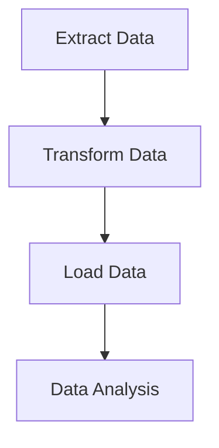

## 3.16 SQL Scripting and Automation

In the realm of database management, SQL scripting and automation play pivotal roles in enhancing efficiency, consistency, and reliability. As expert software engineers and architects, mastering these techniques is crucial for optimizing workflows and ensuring seamless integration with modern application architectures. In this section, we will delve into the intricacies of SQL scripting and automation, exploring batch scripts, automation tools, ETL processes, and the integration of SQL scripts into CI/CD pipelines.

### Understanding SQL Scripting

SQL scripting involves writing a series of SQL commands that can be executed as a single unit. This approach is particularly useful for performing repetitive tasks, managing complex operations, and ensuring consistency across database environments. Let's explore the key components of SQL scripting:

#### Batch Scripts

Batch scripts are collections of SQL statements that are executed together. They are essential for automating routine tasks, such as data backups, updates, and maintenance operations. By grouping commands into a single script, you can reduce manual intervention and minimize the risk of errors.

**Example of a Batch Script:**

```sql
-- Batch script to update product prices and log changes
BEGIN TRANSACTION;

-- Update product prices
UPDATE Products
SET Price = Price * 1.10
WHERE Category = 'Electronics';

-- Log the update
INSERT INTO PriceChangeLog (ProductID, OldPrice, NewPrice, ChangeDate)
SELECT ProductID, Price / 1.10, Price, GETDATE()
FROM Products
WHERE Category = 'Electronics';

COMMIT TRANSACTION;
```

In this example, we execute a batch script that updates product prices for a specific category and logs the changes. The use of transactions ensures data integrity by allowing us to roll back changes in case of errors.

### Automation Tools

Automation tools are indispensable for scheduling and executing SQL scripts without manual intervention. They enable you to automate routine tasks, such as data backups, report generation, and system monitoring. Let's explore some popular automation tools:

#### SQL Server Agent

SQL Server Agent is a powerful tool for scheduling and executing SQL scripts in Microsoft SQL Server. It allows you to create jobs that can be triggered based on specific events or schedules.

**Creating a Job in SQL Server Agent:**

1. **Open SQL Server Management Studio (SSMS).**
2. **Navigate to SQL Server Agent > Jobs.**
3. **Right-click and select "New Job".**
4. **Define the job properties, including name, description, and owner.**
5. **Add steps to the job, specifying the SQL scripts to execute.**
6. **Set the schedule for the job, such as daily, weekly, or monthly.**
7. **Save and enable the job.**

#### Cron Jobs

For Linux-based systems, cron jobs are widely used to schedule SQL scripts. Cron is a time-based job scheduler that allows you to automate tasks at specified intervals.

**Example of a Cron Job:**

```bash
0 0 * * * /usr/bin/mysql -u username -p password -e "source /path/to/script.sql"
```

In this example, we use a cron job to execute a SQL script daily at midnight. The script is executed using the `mysql` command-line tool, with the necessary credentials provided.

### ETL Processes

ETL (Extract, Transform, Load) processes are critical for automating data integration tasks. They involve extracting data from various sources, transforming it into a suitable format, and loading it into a target database. Let's explore the components of ETL processes:

#### Extract

The extraction phase involves retrieving data from various sources, such as databases, files, or APIs. This data is then prepared for transformation.

#### Transform

During the transformation phase, data is cleaned, aggregated, and formatted to meet the requirements of the target database. This step may involve data validation, enrichment, and normalization.

#### Load

The final phase involves loading the transformed data into the target database. This step ensures that the data is available for analysis and reporting.

**Example of an ETL Process:**

```sql
-- Extract data from source table
SELECT CustomerID, OrderDate, TotalAmount
INTO #TempOrders
FROM SourceDB.dbo.Orders
WHERE OrderDate >= '2024-01-01';

-- Transform data by calculating total sales per customer
SELECT CustomerID, SUM(TotalAmount) AS TotalSales
INTO #TempSales
FROM #TempOrders
GROUP BY CustomerID;

-- Load transformed data into target table
INSERT INTO TargetDB.dbo.CustomerSales (CustomerID, TotalSales)
SELECT CustomerID, TotalSales
FROM #TempSales;
```

In this example, we extract data from a source table, transform it by calculating total sales per customer, and load the results into a target table.

### Continuous Integration and SQL

Continuous Integration (CI) is a development practice that involves integrating code changes into a shared repository frequently. Incorporating SQL scripts into CI/CD pipelines ensures that database changes are tested and deployed consistently.

#### Integrating SQL Scripts into CI/CD Pipelines

1. **Version Control:** Store SQL scripts in a version control system, such as Git, to track changes and collaborate with team members.
2. **Automated Testing:** Use automated testing frameworks to validate SQL scripts and ensure they meet quality standards.
3. **Deployment Automation:** Use CI/CD tools, such as Jenkins or GitLab CI, to automate the deployment of SQL scripts to various environments.

**Example of a CI/CD Pipeline with SQL Scripts:**

```yaml
stages:
  - test
  - deploy

test:
  stage: test
  script:
    - echo "Running SQL script tests..."
    - /usr/bin/sqlcmd -S servername -U username -P password -i test_script.sql

deploy:
  stage: deploy
  script:
    - echo "Deploying SQL scripts..."
    - /usr/bin/sqlcmd -S servername -U username -P password -i deploy_script.sql
  only:
    - main
```

In this example, we define a GitLab CI/CD pipeline with stages for testing and deploying SQL scripts. The `sqlcmd` tool is used to execute the scripts on the specified server.

### Visualizing SQL Automation Processes

To better understand the flow of SQL automation processes, let's visualize a typical ETL workflow using Mermaid.js:



**Diagram Description:** This diagram illustrates the flow of an ETL process, starting with data extraction, followed by transformation, loading into the target database, and finally, data analysis.

### Best Practices for SQL Scripting and Automation

1. **Modularize Scripts:** Break down complex scripts into smaller, reusable modules to enhance maintainability.
2. **Use Transactions:** Ensure data integrity by wrapping critical operations in transactions.
3. **Implement Error Handling:** Include error handling mechanisms to gracefully manage failures and exceptions.
4. **Document Scripts:** Provide clear documentation for each script, including purpose, inputs, outputs, and dependencies.
5. **Monitor and Log:** Implement logging and monitoring to track script execution and identify issues.

### Try It Yourself

To reinforce your understanding of SQL scripting and automation, try modifying the provided examples:

- **Batch Script:** Add a condition to update prices only for products with a stock level above a certain threshold.
- **Cron Job:** Schedule a script to run every Monday at 8 AM.
- **ETL Process:** Include a step to filter out orders with a total amount below a specified value.

### References and Further Reading

- [SQL Server Agent Documentation](https://docs.microsoft.com/en-us/sql/ssms/sql-server-agent)
- [Cron Job Basics](https://www.geeksforgeeks.org/cron-command-in-unix-linux-with-examples/)
- [ETL Best Practices](https://www.dataversity.net/etl-best-practices/)

### Knowledge Check

1. **What is the primary purpose of batch scripts in SQL?**
2. **How can SQL Server Agent be used to automate tasks?**
3. **Describe the three phases of an ETL process.**
4. **What are the benefits of integrating SQL scripts into CI/CD pipelines?**

### Embrace the Journey

Remember, mastering SQL scripting and automation is a continuous journey. As you progress, you'll discover new techniques and tools to enhance your database management skills. Keep experimenting, stay curious, and enjoy the journey!

## Quiz Time!



### What is the primary purpose of batch scripts in SQL?

- [x] To execute multiple SQL commands as a single unit
- [ ] To create complex database schemas
- [ ] To manage user permissions
- [ ] To optimize query performance

> **Explanation:** Batch scripts are used to execute multiple SQL commands as a single unit, automating repetitive tasks and ensuring consistency.

### Which tool is commonly used for scheduling SQL scripts on Linux-based systems?

- [ ] SQL Server Agent
- [x] Cron
- [ ] Jenkins
- [ ] GitLab CI

> **Explanation:** Cron is a time-based job scheduler used on Linux-based systems to automate the execution of scripts at specified intervals.

### What are the three phases of an ETL process?

- [x] Extract, Transform, Load
- [ ] Execute, Test, Launch
- [ ] Evaluate, Transfer, Log
- [ ] Edit, Translate, Link

> **Explanation:** ETL stands for Extract, Transform, Load, which are the three phases of the process for integrating data from various sources.

### How can SQL scripts be integrated into CI/CD pipelines?

- [x] By using version control, automated testing, and deployment automation
- [ ] By manually executing scripts in production
- [ ] By storing scripts in a shared drive
- [ ] By using a spreadsheet to track changes

> **Explanation:** SQL scripts can be integrated into CI/CD pipelines by using version control systems, automated testing frameworks, and deployment automation tools.

### What is a key benefit of using transactions in SQL scripts?

- [x] Ensuring data integrity
- [ ] Improving query speed
- [ ] Reducing disk space usage
- [ ] Enhancing user interface design

> **Explanation:** Transactions ensure data integrity by allowing operations to be rolled back in case of errors, maintaining a consistent database state.

### Which of the following is NOT a best practice for SQL scripting?

- [ ] Modularize scripts
- [ ] Use transactions
- [ ] Implement error handling
- [x] Hardcode sensitive information

> **Explanation:** Hardcoding sensitive information is not a best practice as it poses security risks. Instead, use secure methods to handle sensitive data.

### What is the role of SQL Server Agent?

- [x] To schedule and execute SQL scripts in SQL Server
- [ ] To manage database schemas
- [ ] To optimize query performance
- [ ] To provide user authentication

> **Explanation:** SQL Server Agent is used to schedule and execute SQL scripts in SQL Server, automating routine tasks.

### What does the 'Transform' phase in ETL involve?

- [x] Cleaning, aggregating, and formatting data
- [ ] Loading data into the target database
- [ ] Extracting data from sources
- [ ] Analyzing data for insights

> **Explanation:** The 'Transform' phase involves cleaning, aggregating, and formatting data to meet the requirements of the target database.

### How can you ensure SQL script execution is monitored?

- [x] Implement logging and monitoring
- [ ] Execute scripts manually
- [ ] Use spreadsheets to track execution
- [ ] Disable error handling

> **Explanation:** Implementing logging and monitoring allows you to track SQL script execution and identify any issues that arise.

### True or False: ETL processes can only be used for data migration.

- [ ] True
- [x] False

> **Explanation:** ETL processes are not limited to data migration; they are also used for data integration, transformation, and loading into target databases for analysis and reporting.


