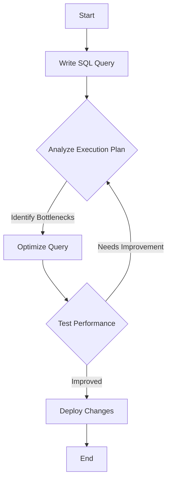

## 3.17 Best Practices for Writing Efficient SQL Code

In the realm of SQL development, writing efficient code is paramount for ensuring that database systems perform optimally and remain maintainable over time. As expert developers and architects, we must focus on clarity, commenting, modularity, and optimization. This section delves into these best practices, providing insights and techniques to enhance your SQL coding skills.

### Clarity: Writing Readable and Maintainable Code

Clarity in SQL code is crucial for both current understanding and future maintenance. Clear code is easier to debug, optimize, and extend. Let's explore how to achieve clarity in your SQL scripts.

#### Use Descriptive Naming Conventions

**Explain**: Use meaningful names for tables, columns, and other database objects. This practice helps convey the purpose and content of the data, making it easier for others to understand your code.

**Example**:

```sql
-- Poor naming
SELECT * FROM t1 WHERE c1 = 'active';

-- Descriptive naming
SELECT * FROM customers WHERE status = 'active';
```

#### Maintain Consistent Formatting

**Explain**: Consistent formatting improves readability. Use indentation, line breaks, and spacing to structure your SQL code logically.

**Example**:

```sql
-- Poor formatting
SELECT id,name,email FROM users WHERE status='active' AND created_at > '2023-01-01';

-- Consistent formatting
SELECT id, name, email
FROM users
WHERE status = 'active'
  AND created_at > '2023-01-01';
```

#### Avoid Complex Nested Queries

**Explain**: Break down complex queries into simpler parts using Common Table Expressions (CTEs) or views. This approach enhances readability and maintainability.

**Example**:

```sql
-- Complex nested query
SELECT * FROM (
  SELECT id, name FROM users WHERE status = 'active'
) AS active_users
WHERE name LIKE 'A%';

-- Using CTE for clarity
WITH active_users AS (
  SELECT id, name
  FROM users
  WHERE status = 'active'
)
SELECT *
FROM active_users
WHERE name LIKE 'A%';
```

### Commenting: Documenting Non-Obvious Logic

Comments are essential for explaining the purpose and logic of SQL code, especially when dealing with complex queries or business rules.

#### Provide Context and Intent

**Explain**: Use comments to explain why certain decisions were made, not just what the code does. This practice helps future developers understand the rationale behind your code.

**Example**:

```sql
-- Retrieve active customers who signed up in the last year
SELECT id, name, email
FROM customers
WHERE status = 'active'
  AND signup_date > DATE_SUB(CURDATE(), INTERVAL 1 YEAR);
```

#### Document Complex Logic

**Explain**: For complex queries, provide detailed comments to describe the logic and flow. This documentation aids in debugging and future modifications.

**Example**:

```sql
-- Calculate the total sales for each product category
-- Step 1: Sum sales by product
WITH product_sales AS (
  SELECT product_id, SUM(amount) AS total_sales
  FROM sales
  GROUP BY product_id
)
-- Step 2: Join with product categories
SELECT c.category_name, SUM(ps.total_sales) AS category_sales
FROM product_sales ps
JOIN products p ON ps.product_id = p.id
JOIN categories c ON p.category_id = c.id
GROUP BY c.category_name;
```

### Modularity: Breaking Complex Queries into Manageable Parts

Modularity involves dividing SQL code into smaller, reusable components. This practice enhances maintainability and allows for easier testing and optimization.

#### Use Views for Reusability

**Explain**: Create views for frequently used queries. Views encapsulate complex logic and provide a simplified interface for data access.

**Example**:

```sql
-- Create a view for active customers
CREATE VIEW active_customers AS
SELECT id, name, email
FROM customers
WHERE status = 'active';

-- Use the view in queries
SELECT * FROM active_customers WHERE signup_date > '2023-01-01';
```

#### Leverage Stored Procedures and Functions

**Explain**: Encapsulate repetitive logic in stored procedures or functions. This approach promotes code reuse and simplifies maintenance.

**Example**:

```sql
-- Create a stored procedure to update customer status
CREATE PROCEDURE UpdateCustomerStatus(IN customer_id INT, IN new_status VARCHAR(20))
BEGIN
  UPDATE customers
  SET status = new_status
  WHERE id = customer_id;
END;

-- Call the stored procedure
CALL UpdateCustomerStatus(123, 'inactive');
```

### Optimization: Regularly Reviewing and Tuning Queries

Optimization is a continuous process that involves analyzing and improving SQL code to enhance performance.

#### Analyze Query Execution Plans

**Explain**: Use execution plans to understand how the database engine processes queries. Identify bottlenecks and optimize accordingly.

**Example**:

```sql
-- Analyze the execution plan for a query
EXPLAIN SELECT * FROM orders WHERE customer_id = 123;
```

#### Indexing Strategies

**Explain**: Proper indexing can significantly improve query performance. Identify columns that are frequently used in WHERE clauses, JOINs, and ORDER BY clauses for indexing.

**Example**:

```sql
-- Create an index on the customer_id column
CREATE INDEX idx_customer_id ON orders(customer_id);
```

#### Avoid Unnecessary Columns and Rows

**Explain**: Select only the columns you need and filter rows as early as possible in your queries to reduce data processing overhead.

**Example**:

```sql
-- Inefficient query
SELECT * FROM orders WHERE order_date > '2023-01-01';

-- Efficient query
SELECT order_id, order_date, total_amount
FROM orders
WHERE order_date > '2023-01-01';
```

### Try It Yourself

Encourage experimentation by modifying the provided code examples. For instance, try creating a view for inactive customers or optimizing a query by adding an index to a different column.

### Visualizing SQL Optimization

To better understand the impact of indexing and query optimization, let's visualize the process using a flowchart.



**Description**: This flowchart illustrates the iterative process of SQL query optimization, starting from writing the query to deploying the optimized version.

### References and Links

- [SQL Optimization Techniques](https://www.sqlshack.com/sql-query-optimization-techniques/)
- [Understanding Execution Plans](https://docs.microsoft.com/en-us/sql/relational-databases/performance/display-an-actual-execution-plan)
- [Indexing Best Practices](https://use-the-index-luke.com/)

### Knowledge Check

1. **What is the benefit of using descriptive naming conventions in SQL code?**
   - It enhances code readability and understanding.

2. **Why should complex queries be broken down into simpler parts?**
   - To improve readability and maintainability.

3. **What is the purpose of analyzing query execution plans?**
   - To identify bottlenecks and optimize query performance.

### Embrace the Journey

Remember, writing efficient SQL code is an ongoing journey. As you continue to refine your skills, you'll discover new techniques and strategies to enhance performance and maintainability. Keep experimenting, stay curious, and enjoy the process!

## Quiz Time!



### What is the primary benefit of using descriptive naming conventions in SQL?

- [x] Enhances code readability and understanding
- [ ] Reduces query execution time
- [ ] Increases database storage efficiency
- [ ] Simplifies database schema design

> **Explanation:** Descriptive naming conventions make SQL code more readable and easier to understand, which is crucial for maintainability.

### Why is it important to maintain consistent formatting in SQL code?

- [x] Improves readability
- [ ] Reduces execution time
- [ ] Increases storage efficiency
- [ ] Simplifies indexing

> **Explanation:** Consistent formatting enhances the readability of SQL code, making it easier to follow and maintain.

### What is a key advantage of using Common Table Expressions (CTEs)?

- [x] Simplifies complex queries
- [ ] Reduces database size
- [ ] Increases query execution speed
- [ ] Enhances security

> **Explanation:** CTEs help break down complex queries into simpler, more manageable parts, improving readability and maintainability.

### How can comments improve SQL code?

- [x] By explaining the purpose and logic of the code
- [ ] By reducing execution time
- [ ] By increasing storage efficiency
- [ ] By simplifying indexing

> **Explanation:** Comments provide context and explain the logic behind SQL code, aiding in understanding and future maintenance.

### What is the purpose of using views in SQL?

- [x] To encapsulate complex logic and provide a simplified interface
- [ ] To increase query execution speed
- [ ] To reduce database size
- [ ] To enhance security

> **Explanation:** Views encapsulate complex logic, making it easier to reuse and maintain SQL code.

### How can indexing improve query performance?

- [x] By speeding up data retrieval
- [ ] By reducing database size
- [ ] By simplifying query syntax
- [ ] By enhancing security

> **Explanation:** Indexing speeds up data retrieval by allowing the database engine to find rows more quickly.

### What is the benefit of avoiding unnecessary columns in a SELECT statement?

- [x] Reduces data processing overhead
- [ ] Increases query execution speed
- [ ] Simplifies query syntax
- [ ] Enhances security

> **Explanation:** Selecting only necessary columns reduces the amount of data processed, improving query performance.

### Why should you analyze query execution plans?

- [x] To identify bottlenecks and optimize performance
- [ ] To increase database size
- [ ] To simplify query syntax
- [ ] To enhance security

> **Explanation:** Analyzing execution plans helps identify performance bottlenecks, allowing for targeted optimizations.

### What is the role of stored procedures in SQL?

- [x] To encapsulate repetitive logic for reuse
- [ ] To increase query execution speed
- [ ] To reduce database size
- [ ] To enhance security

> **Explanation:** Stored procedures encapsulate logic, promoting code reuse and simplifying maintenance.

### True or False: Breaking down complex queries into simpler parts can improve maintainability.

- [x] True
- [ ] False

> **Explanation:** Breaking down complex queries into simpler parts enhances readability and maintainability.


