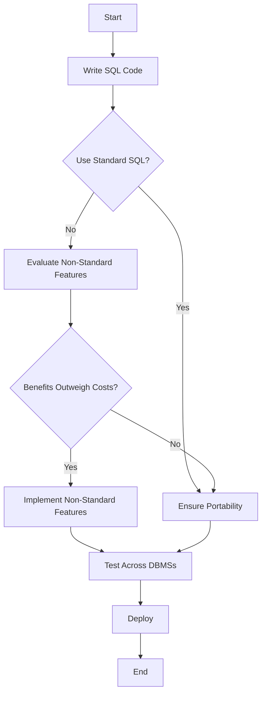

## 3.18 Embracing SQL Standards and Cross-DBMS Compatibility

In the ever-evolving landscape of database management, embracing SQL standards and ensuring cross-DBMS compatibility is crucial for expert software engineers and architects. This section delves into the intricacies of SQL standards, the challenges posed by dialect differences, and strategies for writing portable SQL code that can seamlessly operate across various database systems. By understanding these concepts, you can build robust, scalable, and maintainable database solutions that stand the test of time.

### Understanding SQL Standards: ANSI/ISO Compliance

SQL, or Structured Query Language, is a standardized language used to manage and manipulate relational databases. The American National Standards Institute (ANSI) and the International Organization for Standardization (ISO) have established SQL standards to ensure consistency and interoperability across different database management systems (DBMS).

#### Key SQL Standards

1. **SQL-86 (SQL-1)**: The first SQL standard, laying the foundation for subsequent versions.
2. **SQL-89 (SQL-1.1)**: Introduced minor enhancements and clarifications.
3. **SQL-92 (SQL-2)**: A significant update that added new features like outer joins and set operations.
4. **SQL:1999 (SQL-3)**: Introduced object-oriented features, triggers, and recursive queries.
5. **SQL:2003**: Added XML support, window functions, and more.
6. **SQL:2006**: Focused on XML-related enhancements.
7. **SQL:2008**: Introduced new data types and enhancements to existing features.
8. **SQL:2011**: Added temporal database features.
9. **SQL:2016**: Introduced JSON support and other enhancements.

Understanding these standards is essential for writing SQL code that is compliant and portable across different systems. However, not all DBMSs fully implement these standards, leading to dialect differences.

### Dialect Differences: Identifying Vendor-Specific Extensions

While SQL standards provide a common framework, each DBMS vendor often introduces proprietary extensions to enhance functionality and performance. These extensions, known as SQL dialects, can lead to compatibility issues when migrating or integrating databases across different platforms.

#### Common SQL Dialects

1. **T-SQL (Transact-SQL)**: Used by Microsoft SQL Server, it includes extensions for procedural programming, error handling, and transaction control.
2. **PL/SQL (Procedural Language/SQL)**: Oracle's extension that adds procedural constructs and error handling.
3. **PL/pgSQL**: PostgreSQL's procedural language, similar to PL/SQL, with additional features for complex computations.
4. **MySQL SQL Dialect**: Includes unique features like the `LIMIT` clause for pagination and specific data types.

#### Challenges of Dialect Differences

- **Syntax Variations**: Different syntax for common operations, such as string concatenation or date functions.
- **Feature Discrepancies**: Some features may be available in one DBMS but not in another, such as certain types of indexes or data types.
- **Performance Optimizations**: Vendor-specific optimizations that may not translate well across different systems.

### Portability: Writing Code That Works Across Multiple Database Systems

To achieve cross-DBMS compatibility, it's crucial to write portable SQL code that adheres to standards while minimizing reliance on vendor-specific features. Here are some strategies to enhance portability:

#### Best Practices for SQL Portability

1. **Stick to Standard SQL**: Use ANSI/ISO-compliant SQL whenever possible to ensure compatibility across different systems.
2. **Abstract Database Access**: Use data access layers or ORM (Object-Relational Mapping) tools to abstract database interactions.
3. **Avoid Proprietary Features**: Limit the use of vendor-specific extensions unless absolutely necessary.
4. **Use Views and Stored Procedures**: Encapsulate complex logic in views or stored procedures to isolate changes.
5. **Test Across Multiple DBMSs**: Regularly test your SQL code on different database systems to identify compatibility issues early.

#### Example: Writing Portable SQL Code

```sql
-- ANSI SQL for retrieving employee names and salaries
SELECT employee_name, salary
FROM employees
WHERE salary > 50000
ORDER BY employee_name;
```

This query uses standard SQL syntax that should work across most DBMSs without modification.

### Feature Evaluation: Balancing Standard SQL with Beneficial Non-Standard Features

While adhering to SQL standards is essential for portability, there are scenarios where leveraging non-standard features can provide significant benefits, such as improved performance or enhanced functionality. The key is to balance the use of standard and non-standard features based on the specific requirements of your application.

#### Evaluating Non-Standard Features

1. **Performance Gains**: Some vendor-specific features can optimize performance, such as specialized indexing or partitioning techniques.
2. **Enhanced Functionality**: Features like full-text search or geospatial data types may be available only in certain DBMSs.
3. **Ease of Development**: Proprietary extensions can simplify complex operations, reducing development time.

#### Decision-Making Framework

- **Assess Requirements**: Determine the critical features and performance requirements of your application.
- **Evaluate Trade-offs**: Consider the trade-offs between portability and the benefits of non-standard features.
- **Plan for Migration**: If using non-standard features, plan for potential migration challenges in the future.

### Visualizing SQL Standards and Cross-DBMS Compatibility

To better understand the relationship between SQL standards and cross-DBMS compatibility, let's visualize the process using a flowchart.



**Diagram Description**: This flowchart illustrates the decision-making process for writing SQL code that balances standard compliance with the use of non-standard features. The goal is to ensure portability while leveraging beneficial extensions when necessary.

### Knowledge Check

To reinforce your understanding of SQL standards and cross-DBMS compatibility, consider the following questions:

1. What are the key differences between ANSI SQL and vendor-specific dialects?
2. How can you ensure SQL code is portable across different DBMSs?
3. What are the potential trade-offs when using non-standard SQL features?

### Embrace the Journey

Remember, mastering SQL standards and cross-DBMS compatibility is a journey. As you progress, you'll gain the skills to build more flexible and adaptable database solutions. Keep experimenting, stay curious, and enjoy the journey!

### References and Links

- [ANSI SQL Standards](https://www.iso.org/standard/63555.html)
- [T-SQL Documentation](https://docs.microsoft.com/en-us/sql/t-sql)
- [PL/SQL Documentation](https://docs.oracle.com/en/database/oracle/oracle-database/19/lnpls/index.html)
- [PostgreSQL Documentation](https://www.postgresql.org/docs/)
- [MySQL Documentation](https://dev.mysql.com/doc/)

## Quiz Time!



### Which organization is responsible for establishing SQL standards?

- [x] ANSI/ISO
- [ ] W3C
- [ ] IEEE
- [ ] IETF

> **Explanation:** The American National Standards Institute (ANSI) and the International Organization for Standardization (ISO) are responsible for establishing SQL standards.

### What is a common challenge when dealing with SQL dialects?

- [x] Syntax variations
- [ ] Lack of data types
- [ ] Inability to perform joins
- [ ] Absence of indexing

> **Explanation:** Syntax variations are a common challenge when dealing with SQL dialects, as different DBMSs may have different syntax for similar operations.

### How can you enhance SQL code portability?

- [x] Stick to standard SQL
- [ ] Use only vendor-specific features
- [ ] Avoid using views
- [ ] Rely on proprietary data types

> **Explanation:** Sticking to standard SQL enhances code portability across different database systems.

### What is a benefit of using non-standard SQL features?

- [x] Performance gains
- [ ] Increased portability
- [ ] Simplified syntax
- [ ] Reduced storage requirements

> **Explanation:** Non-standard SQL features can provide performance gains, although they may reduce portability.

### Which SQL standard introduced window functions?

- [x] SQL:2003
- [ ] SQL-92
- [ ] SQL:1999
- [ ] SQL:2016

> **Explanation:** SQL:2003 introduced window functions, which allow for complex calculations across sets of rows.

### What is a key consideration when using non-standard SQL features?

- [x] Plan for migration challenges
- [ ] Ensure immediate deployment
- [ ] Avoid testing
- [ ] Use them exclusively

> **Explanation:** When using non-standard SQL features, it's important to plan for potential migration challenges in the future.

### What is the purpose of using views in SQL?

- [x] Encapsulate complex logic
- [ ] Increase query execution time
- [ ] Reduce data integrity
- [ ] Eliminate the need for indexes

> **Explanation:** Views are used to encapsulate complex logic, making it easier to manage and maintain SQL code.

### How can you test SQL code for cross-DBMS compatibility?

- [x] Test across multiple DBMSs
- [ ] Use only one DBMS
- [ ] Avoid testing
- [ ] Rely on proprietary features

> **Explanation:** Testing SQL code across multiple DBMSs helps identify compatibility issues early.

### What is a potential drawback of using vendor-specific SQL features?

- [x] Reduced portability
- [ ] Increased portability
- [ ] Simplified syntax
- [ ] Enhanced data integrity

> **Explanation:** Vendor-specific SQL features can reduce portability, making it harder to migrate or integrate databases across different platforms.

### True or False: SQL standards ensure complete compatibility across all DBMSs.

- [ ] True
- [x] False

> **Explanation:** While SQL standards provide a common framework, complete compatibility across all DBMSs is not guaranteed due to vendor-specific extensions and dialects.


