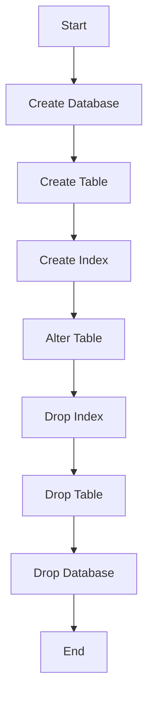

## 3.2 DDL (Data Definition Language) Commands

Data Definition Language (DDL) commands are fundamental to SQL and play a crucial role in defining and managing the structure of database systems. As expert software engineers and architects, understanding and mastering DDL commands is essential for creating robust, scalable, and efficient database architectures. This section delves into the core DDL commands—`CREATE`, `ALTER`, and `DROP`—and provides best practices for their use.

### Creating Structures: Using `CREATE` Statements

The `CREATE` statement is the cornerstone of DDL commands, allowing you to define new database objects such as databases, tables, indexes, views, and more. Let's explore the syntax and usage of `CREATE` statements for different database objects.

#### Creating Databases

To create a new database, use the `CREATE DATABASE` statement. This command initializes a new database with the specified name.

```sql
-- Create a new database named 'SalesDB'
CREATE DATABASE SalesDB;
```

#### Creating Tables

Tables are the primary structures for storing data in a database. The `CREATE TABLE` statement defines a new table with specified columns and data types.

```sql
-- Create a table named 'Customers' with columns for customer details
CREATE TABLE Customers (
    CustomerID INT PRIMARY KEY,
    FirstName VARCHAR(50),
    LastName VARCHAR(50),
    Email VARCHAR(100),
    PhoneNumber VARCHAR(15)
);
```

#### Creating Indexes

Indexes improve query performance by allowing faster data retrieval. Use the `CREATE INDEX` statement to define an index on one or more columns.

```sql
-- Create an index on the 'Email' column of the 'Customers' table
CREATE INDEX idx_email ON Customers (Email);
```

#### Creating Views

Views are virtual tables that provide a specific representation of data from one or more tables. The `CREATE VIEW` statement defines a new view.

```sql
-- Create a view to display customer names and emails
CREATE VIEW CustomerContact AS
SELECT FirstName, LastName, Email
FROM Customers;
```

### Altering Structures: Modifying Existing Database Objects

The `ALTER` statement allows you to modify existing database objects, such as adding or dropping columns, changing data types, or renaming objects.

#### Altering Tables

To modify a table structure, use the `ALTER TABLE` statement. This command can add, modify, or drop columns and constraints.

```sql
-- Add a new column 'DateOfBirth' to the 'Customers' table
ALTER TABLE Customers
ADD DateOfBirth DATE;

-- Modify the data type of the 'PhoneNumber' column
ALTER TABLE Customers
ALTER COLUMN PhoneNumber VARCHAR(20);

-- Drop the 'DateOfBirth' column from the 'Customers' table
ALTER TABLE Customers
DROP COLUMN DateOfBirth;
```

#### Altering Indexes

While SQL standards do not provide a direct `ALTER INDEX` command, some DBMSs allow you to rebuild or modify indexes using specific syntax.

```sql
-- Rebuild an index (syntax may vary by DBMS)
ALTER INDEX idx_email REBUILD;
```

### Dropping Structures: Removing Objects with `DROP`

The `DROP` statement is used to delete database objects permanently. Use this command with caution, as it removes the object and all associated data.

#### Dropping Databases

To remove a database and all its contents, use the `DROP DATABASE` statement.

```sql
-- Drop the 'SalesDB' database
DROP DATABASE SalesDB;
```

#### Dropping Tables

The `DROP TABLE` statement deletes a table and all its data.

```sql
-- Drop the 'Customers' table
DROP TABLE Customers;
```

#### Dropping Indexes

To remove an index, use the `DROP INDEX` statement.

```sql
-- Drop the index on the 'Email' column
DROP INDEX idx_email;
```

### Best Practices for Using DDL Commands

When working with DDL commands, it's important to follow best practices to ensure data integrity, maintainability, and performance.

#### Version Control

Implement version control for database schemas to track changes and facilitate collaboration among team members. Tools like Liquibase or Flyway can help manage database migrations.

#### Impact Analysis

Before making structural changes, perform impact analysis to understand how changes will affect existing applications and queries. This helps prevent unintended disruptions.

#### Backup and Recovery

Always back up your database before executing DDL commands, especially when dropping objects. This ensures you can recover data if necessary.

#### Testing Changes

Test changes in a development or staging environment before applying them to production. This helps identify potential issues and ensures smooth deployment.

#### Documentation

Document all structural changes to maintain a clear history of modifications and facilitate future maintenance.

### Visualizing DDL Command Workflow

To better understand the workflow of DDL commands, let's visualize the process using a flowchart.



**Figure 1: Workflow of DDL Commands**

### Try It Yourself

Experiment with the following exercises to reinforce your understanding of DDL commands:

1. **Create a New Table**: Define a table named `Orders` with columns for order details such as `OrderID`, `CustomerID`, `OrderDate`, and `TotalAmount`.

2. **Alter a Table**: Add a new column `ShippingAddress` to the `Orders` table and modify the `TotalAmount` column to allow for decimal values.

3. **Drop an Index**: Create an index on the `OrderDate` column of the `Orders` table, then drop it.

### Knowledge Check

- What is the purpose of the `CREATE` statement in SQL?
- How can you modify an existing table structure?
- What precautions should you take before using the `DROP` statement?

### Embrace the Journey

Remember, mastering DDL commands is just one step in your journey to becoming an expert in SQL database design. Keep experimenting, stay curious, and enjoy the process of building efficient and scalable database solutions.

## Quiz Time!



### What is the primary purpose of the `CREATE` statement in SQL?

- [x] To define new database objects
- [ ] To modify existing database objects
- [ ] To delete database objects
- [ ] To query data from tables

> **Explanation:** The `CREATE` statement is used to define new database objects such as databases, tables, indexes, and views.

### Which command is used to modify the structure of an existing table?

- [ ] CREATE TABLE
- [x] ALTER TABLE
- [ ] DROP TABLE
- [ ] SELECT

> **Explanation:** The `ALTER TABLE` command is used to modify the structure of an existing table, such as adding or dropping columns.

### What should you do before executing a `DROP` statement?

- [ ] Nothing, just execute it
- [x] Perform a backup of the database
- [ ] Create a new table
- [ ] Modify the table structure

> **Explanation:** Before executing a `DROP` statement, it's important to perform a backup of the database to ensure data can be recovered if necessary.

### Which statement is used to remove an index from a table?

- [ ] CREATE INDEX
- [ ] ALTER INDEX
- [x] DROP INDEX
- [ ] SELECT INDEX

> **Explanation:** The `DROP INDEX` statement is used to remove an index from a table.

### What is a best practice when making structural changes to a database?

- [x] Perform impact analysis
- [ ] Execute changes directly in production
- [ ] Avoid using version control
- [ ] Ignore testing changes

> **Explanation:** Performing impact analysis is a best practice to understand how changes will affect existing applications and queries.

### Which tool can help manage database migrations?

- [ ] Git
- [x] Liquibase
- [ ] Docker
- [ ] Jenkins

> **Explanation:** Liquibase is a tool that can help manage database migrations and track schema changes.

### What is the purpose of creating an index on a table?

- [x] To improve query performance
- [ ] To store additional data
- [ ] To modify table structure
- [ ] To delete data from the table

> **Explanation:** Creating an index on a table improves query performance by allowing faster data retrieval.

### Which command is used to define a virtual table in SQL?

- [ ] CREATE TABLE
- [ ] CREATE INDEX
- [x] CREATE VIEW
- [ ] CREATE DATABASE

> **Explanation:** The `CREATE VIEW` command is used to define a virtual table that provides a specific representation of data from one or more tables.

### What is the first step in the DDL command workflow?

- [x] Create Database
- [ ] Create Table
- [ ] Alter Table
- [ ] Drop Index

> **Explanation:** The first step in the DDL command workflow is to create a database using the `CREATE DATABASE` statement.

### True or False: The `ALTER INDEX` command is part of the SQL standard.

- [ ] True
- [x] False

> **Explanation:** The `ALTER INDEX` command is not part of the SQL standard, but some DBMSs provide specific syntax for rebuilding or modifying indexes.



By mastering DDL commands, you lay a strong foundation for effective database management and design. Keep exploring and refining your skills to excel in the ever-evolving world of SQL database development.
